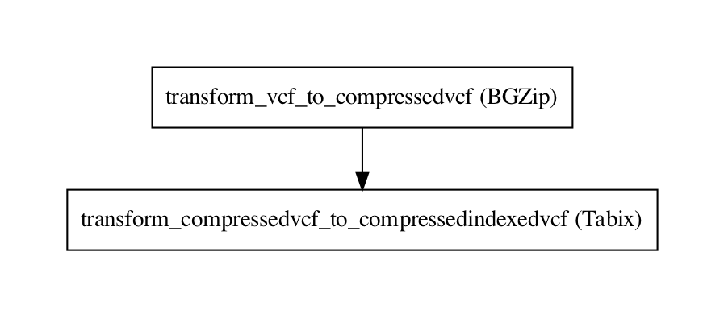

# The conversion problem

> This guide applies to Janis v0.11.x.

Converting between bioinformatics types, and preparing data for a pipeline is a non trivial task. For example, some 
tools work more efficiently if the VCFs are compressed and indexed, but how do you do that - especially in a portable way.

In this article, I want to broadly discuss some advanced patterns of Janis and how we were able to address this problem.

## Data types

Janis is type-aware, with a number of prebuilt bioinformatics types. These bioinformatics file types annotate a 
primary file extension (such as `.fasta`), and also allow secondary file extensions (such as `.fa`). 

These types are important in Janis, as it allows us to provide some additional checking of connections, for example,
checking that you're providing a SAM, BAM or CRAM to `samtools index`, rather than a VCF or any random file. 

## Transformations

Janis supports a mechanism to simply teach Janis to convert to a file format, for example:

```
| Input 	|     Ouptut 	|           Tool 	| Code |
|-------	|------------	|----------------	|----- |
| Bam   	| IndexedBam 	| `samtools index` 	| `JanisTransformation(Bam, BamBai, SamToolsIndex_1_9, relevant_tool_input="bam")` |
| VCF   	| VcfGz      	| `bgzip`          	| `JanisTransformation(Vcf, CompressedVcf, BGZip_1_9)` |
| VcfGz 	| VcfTabix   	| `tabix`          	| `JanisTransformation(CompressedVcf, VcfTabix, Tabix_1_9)` |
```

Internally, this builds up a graph of transformations. The annotated tool in a `JanisTransformation` could also be a 
code tool or even a workflow.  

We can then query the `JanisTransformationGraph` to ask us to return a list of transformations to convert
one format to another.  We use a simple bread-first search to determine a path (if one exists) between 
our requested types. If a path exists, we return a list of JanisTransformations in order to transform A into B.  

### Building a transformation pipeline

As Janis allows us to programmatically construct workflows, we can use a fairly simple function to convert these
list of transformations into a fully portable, executable workflow. Here's our full method of converting a 
list of JanisTransformations into a fully runnable Janis workflow.

```python
def convert_transformations_to_workflow(transformations: List[JanisTransformation]) -> Workflow:

    initial_tr: JanisTransformation = transformations[0]
    final_tr: JanisTransformation = transformations[-1]

    w = WorkflowBuilder(
        f"Convert_{initial_tr.type1.name().title()}To{final_tr.type2.name().title()}"
    )

    prev_input = w.input(f"inp_{initial_tr.type1.name().lower()}", initial_tr.type1)

    for transform in transformations:
        stpid = f"transform_{transform.type1.name().lower()}_to_{transform.type2.name().lower()}"
        stp_inputs = {
            **(transform.tool.connections or {}),
            transform.relevant_tool_input: prev_input,
        }

        prev_input = w.step(stpid, transform.tool(**stp_inputs))[
            transform.relevant_tool_output
        ]

    w.output("out", final_tr.type2, source=prev_input)

    return w
```

### Example

```python

transformations = JanisTransformationGraph.find_connection(Vcf, VcfTabix)
# transformations:
#   1. JanisTransformation(Vcf, CompressedVcf, BGZip_1_9())
#   2. JanisTransformation(CompressedVcf, VcfTabix, Tabix_1_9())

wf = JanisTransformationGraph.convert_transformations_to_workflow(transformations)
```

Our workflow `wf` is a fully fledged Janis workflow. We could directly run it using the Janis assistant, use it in 
a workflow, translate it to CWL / WDL or even generate a workflow diagram.  

```wdl
version development

import "tools/bgzip_1_9.wdl" as B
import "tools/tabix_1_9.wdl" as T

workflow convert_vcf_to_compressedindexedvcf {
  input {
    File inp_vcf
  }
  call B.bgzip as transform_vcf_to_compressedvcf {
    input:
      file=inp_vcf
  }
  call T.tabix as transform_compressedvcf_to_compressedindexedvcf {
    input:
      inp=transform_vcf_to_compressedvcf.out
  }
  output {
    File out = transform_compressedvcf_to_compressedindexedvcf.out
    File out_tbi = transform_compressedvcf_to_compressedindexedvcf.out_tbi
  }
}
```



## Wrapping up

We allow users to defined transformations in their repositories, and inform Janis of this through the entrypoint:

```
janis.datatype_transformations
```

This allows Janis to pull these transformations, and use these if required in our new `janis prepare` mode coming in v0.11.x.