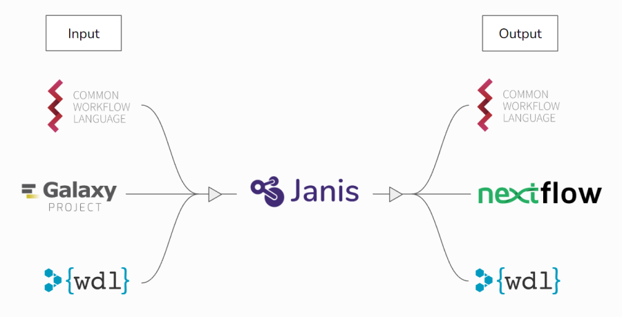

Welcome to Janis!
********************************

.. image:: https://img.shields.io/github/stars/PMCC-BioinformaticsCore/janis.svg?style=social
    :target: https://github.com/PMCC-BioinformaticsCore/janis
    :alt: GitHub stars

.. image:: https://travis-ci.org/PMCC-BioinformaticsCore/janis.svg?branch=master&style=flat
    :target: https://travis-ci.org/PMCC-BioinformaticsCore/janis
    :alt: Travis Build Status

.. image:: https://readthedocs.org/projects/janis/badge/?version=latest
    :target: https://janis.readthedocs.io/en/latest/?badge=latest)
    :alt: Documentation

.. image:: https://badge.fury.io/py/janis-pipelines.svg
    :target: https://pypi.org/project/janis-pipelines/
    :alt: Pypi module

.. image:: https://codecov.io/gh/PMCC-BioinformaticsCore/janis/branch/master/graph/badge.svg
    :target: https://codecov.io/gh/PMCC-BioinformaticsCore/janis
    :alt: Code Coverage

.. image:: https://badges.gitter.im/janis-pipelines.png
    :target: https://gitter.im/janis-pipelines/community
    :alt: Gitter chat

.. note::
	This project is *work-in-progress* and is provided as-is without warranty of any kind. There may be breaking changes
	committed to this repository without notice.

| Janis is a productivity tool which can translate bioinformatics tools and workflows between specifications. 
| It can read-in from CWL, WDL, and Galaxy, and can write-out to CWL, WDL, and Nextflow.

It was developed as part of the Portable Pipelines Project, a collaboration between:

- `Melbourne Bioinformatics (University of Melbourne) <https://www.melbournebioinformatics.org.au/>`_
- `Peter MacCallum Cancer Centre <https://www.petermac.org/>`_ 
- `Walter and Eliza Hall Institute of Medical Research (WEHI) <https://www.wehi.edu.au/>`_.

Janis has two major functionalities:

- **Translation** between workflow languages, and
- **Modelling** tools and workflows using a Python API.

Janis requires a Python installation > 3.10, and can be installed through PIP
`project page <https://pypi.org/project/janis-pipelines/>`__ by running:

.. code-block:: bash

   pip install janis-pipelines

|

--- Translation ---
===================

Overview
--------

Janis can read-in from CWL, WDL, and Galaxy, and can write-out to CWL, WDL, and Nextflow.

To facilitate translation, Janis includes an internal API to model tools and workflows in a way that encompasses the design features of each supported language. 
When performing a translation, Janis will **ingest** the source files into the internal API, then will **translate** out to the target language. 

Janis produces translations as close to the original as possible, but in some situations it may be necessary to make manual adjustments before the output is runnable. This is due to language-specific features of supported languages, and their inclusion of freeform Javascript (CWL), Java / Groovy (Nextflow), and Python / Cheetah (Galaxy). 

Quickstart
----------

To try out Janis on a sample tool and workflow, follow the steps below.

Install Janis

.. code-block:: bash

   python -m venv venv
   source venv/bin/activate
   pip install janis-pipelines

Obtain Sample Files

.. code-block:: bash

   git clone https://github.com/GraceAHall/sample_translation_files

Sample Tool Translation: CWL to Nextflow

.. code-block:: bash

   janis translate --from cwl --to nextflow sample_translation_files/cwl_tool/samtools_flagstat.cwl

Sample Workflow Translation: CWL to Nextflow

.. code-block:: bash

   janis translate --from cwl --to nextflow sample_translation_files/cwl_workflow/align_sort_markdup.cwl

Tutorials
--------

Janis currently has full tutorials for translations of CWL -> Nextflow, and Galaxy -> Nextflow.

CWL to Nextflow

- `Tool: Samtools Flagstat <tutorials/translation/cwl_to_nextflow/tutorial1.html>`_
- `Tool: GATK HaplotypeCaller <tutorials/translation/cwl_to_nextflow/tutorial3.html>`_
- `Workflow: Align Sort Markdup <tutorials/translation/cwl_to_nextflow/tutorial2.html>`_

Galaxy to Nextflow

- `Tool: Samtools Flagstat <tutorials/translation/galaxy_to_nextflow/tutorial4.html>`_
- `Workflow: RNAseq Reads to Counts <tutorials/translation/galaxy_to_nextflow/tutorial5.html>`_

|

--- Python API ---
==================

Overview
--------

The internal API used by Janis can be directly used to model bioinformatics tools and workflows using Python. To date, dozens of bioinformatics pipelines are written purely using the Janis API. 

To execute these pipelines researchers use Janis' translate ability to produce CWL / WDL which is then run on the target platform used by their institution. 

These pipelines are available in the `janis-pipelines` repository.

Example Workflow
-----------------

.. code-block:: bash

   # write the workflow to `helloworld.py`
   cat <<EOT >> helloworld.py
   import janis as j
   from janis_unix.tools import Echo

   w = j.WorkflowBuilder("hello_world")

   w.input("input_to_print", j.String)
   w.step("echo", Echo(inp=w.input_to_print))
   w.output("echo_out", source=w.echo.out)
   EOT

   # Translate workflow to WDL
   janis translate helloworld.py wdl

   # Run the workflow
   janis run -o helloworld-tutorial helloworld.py --input_to_print "Hello, World!"

   # See your output
   cat helloworld-tutorial/echo_out
   # Hello, World!

Tutorials 
---------

- `Tutorial 0 - Introduction to Janis <tutorials/api/tutorial0.html>`_
- `Tutorial 1 - Building a workflow <tutorials/api/tutorial1.html>`_
- `Tutorial 2 - Wrapping a new tool <tutorials/api/tutorial2.html>`_

Workshops
-----------

In addition, there are fully self-guided workshops that more broadly go through the functionality of Janis:

- `Workshop 1 <https://github.com/PMCC-BioinformaticsCore/janis-workshops/tree/master/workshop1>`_
- `Workshop 2 <https://github.com/PMCC-BioinformaticsCore/janis-workshops/tree/master/workshop2>`_

Examples
---------

Sometimes it's easier to learn by examples, here are a few hand picked examples:

- `Samtools View <https://github.com/PMCC-BioinformaticsCore/janis-bioinformatics/blob/master/janis_bioinformatics/tools/samtools/view/base.py>`_ (`Docs <https://janis.readthedocs.io/en/latest/tools/bioinformatics/samtools/samtoolsview.html>`__)

- `WGS Germline pipeline (GATK Only) <https://github.com/PMCC-BioinformaticsCore/janis-pipelines/blob/master/janis_pipelines/wgs_germline_gatk/wgsgermlinegatk.py>`_ (`Docs <https://janis.readthedocs.io/en/latest/pipelines/wgsgermlinegatk.html>`__)

Toolbox
-------

There are two toolboxes currently available on Janis:

- `Unix <https://github.com/PMCC-BioinformaticsCore/janis-unix>`__(`list of tools <https://janis.readthedocs.io/en/latest/tools/bioinformatics/index.html>`__)
- `Bioinformatics <https://github.com/PMCC-BioinformaticsCore/janis-bioinformatics>`__(`list of tools <https://janis.readthedocs.io/en/latest/tools/unix/index.html>`__)

|

--- Additional ---
==================

References
----------

Through conference or talks, this project has been referenced by the following titles:

- Walter and Eliza Hall Institute Talk (WEHI) 2019: *Portable Pipelines Project: Developing reproducible bioinformatics pipelines with standardised workflow languages*
- Bioinformatics Open Source Conference (BOSC) 2019: *Janis: an open source tool to machine generate type-safe CWL and WDL workflows*
- Victorian Cancer Bioinformatics Symposium (VCBS) 2019: *Developing portable variant calling pipelines with Janis*
- GIW / ABACBS 2019: *Janis: A Python framework for Portable Pipelines*
- Australian BioCommons, December 2019: *Portable pipelines: build once and run everywhere with Janis*

Support
-------

To get help with Janis, please ask a question on `Gitter <https://gitter.im/janis-pipelines/community>`__ or 
`raise an issue <https://github.com/PMCC-BioinformaticsCore/janis/issues>`__ on GitHub.

If you find an issue with the tool definitions, please see the relevant issue page:

* `Pipeline-bioinformatics <https://github.com/PMCC-BioinformaticsCore/janis-bioinformatics/issues>`__

This project is work-in-progress and is still in developments. Although we welcome contributions,
due to the immature state of this project we recommend raising issues through the
`Github issues page <https://github.com/PMCC-BioinformaticsCore/janis/issues>`__ for Pipeline related issues.

Information about the project structure and more on contributing can be found within the documentation.

|

.. toctree::
   :maxdepth: 1
   :hidden:

   self
   about
   quickstart
   userguide

.. toctree::
   :hidden:
   :maxdepth: 1
   :caption: Tutorials: Translation

   CWL to Nextflow <tutorials/translation/cwl_to_nextflow/main.rst>
   Galaxy to Nextflow <tutorials/translation/galaxy_to_nextflow/main.rst>

.. toctree::
   :hidden:
   :maxdepth: 1
   :caption: Tutorials: API

   Introduction to Janis <tutorials/api/tutorial0>
   Building a Workflow <tutorials/api/tutorial1>
   Wrapping a new tool <tutorials/api/tutorial2>
   Naming and organising outputs <tutorials/api/tutorial3>
   tutorials/api/toolbox
   tutorials/api/running
   tutorials/api/container

.. toctree::
   :hidden:
   :maxdepth: 1
   :caption: Shed / Toolbox

   pipelines/index
   tools/index
   datatypes/index
   templates/index
   references/listoperators
   references/shed

.. toctree::
   :hidden:
   :maxdepth: 1
   :caption: API documentation

   references/index
   references/workflow
   references/commandtool
   references/tools/pythontool
   references/prepare
   references/expressions
   references/scattering
   references/secondaryfiles
   references/unittest

.. toctree::
   :hidden:
   :maxdepth: 0
   :caption: Guides

   references/configuration
   references/resources
   references/callcaching
   references/cwl
   references/wdl
   tutorials/collectingoutputs
   tutorials/hpcconfiguration
   references/engines
   references/updating
   references/faq
   references/errors
   casestudy/parsingcwl

.. toctree::
   :hidden:
   :maxdepth: 1
   :caption: Development

   development/index
   development/contributing
   development/testing
   development/releasing

Indices and tables
===================

* :ref:`genindex`
* :ref:`search`
* :ref:`modindex`
