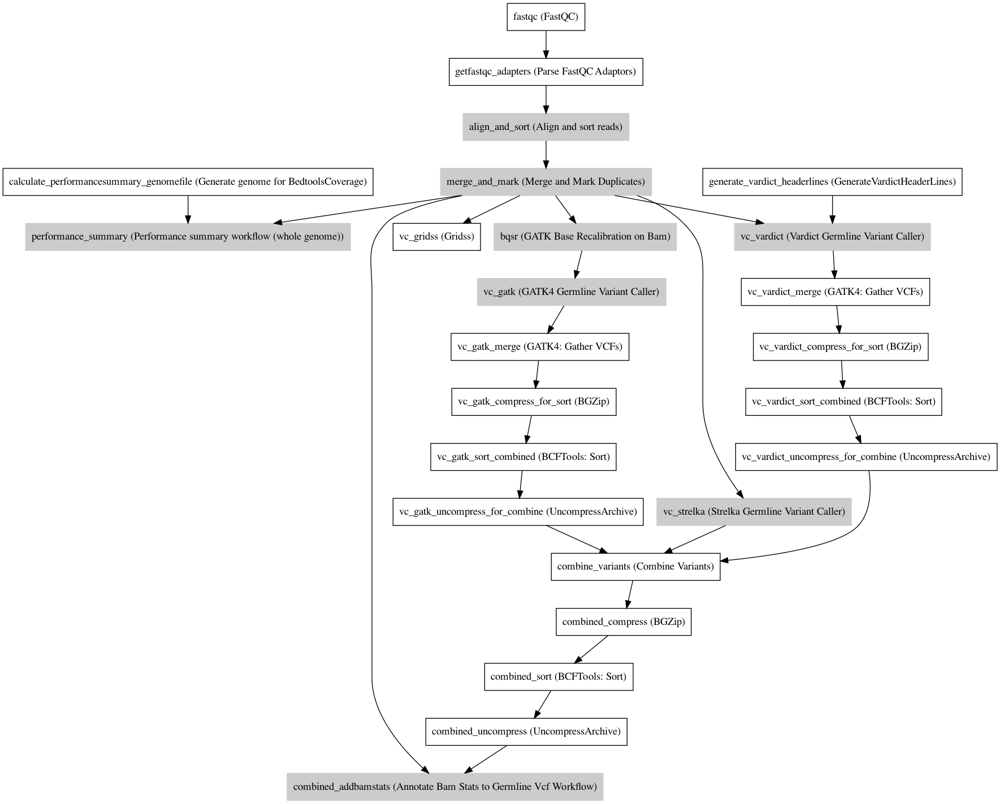

:orphan:

WGS Germline (Multi callers)
======================================================

``WGSGermlineMultiCallers`` · *A variant-calling WGS pipeline using GATK, VarDict and Strelka2 · 3 contributors · 1 version*

This is a genomics pipeline to align sequencing data (Fastq pairs) into BAMs and call variants using:

This workflow is a reference pipeline using the Janis Python framework (pipelines assistant).

- Takes raw sequence data in the FASTQ format;
- Align to the reference genome using BWA MEM;
- Marks duplicates using Picard;
- Call the appropriate variant callers (GRIDSS / GATK / Strelka / VarDict);
- Merges the variants from GATK / Strelka / VarDict.
- Outputs the final variants in the VCF format.

**Resources**

This pipeline has been tested using the HG38 reference set, available on Google Cloud Storage through:

- https://console.cloud.google.com/storage/browser/genomics-public-data/references/hg38/v0/

This pipeline expects the assembly references to be as they appear in that storage     (".fai", ".amb", ".ann", ".bwt", ".pac", ".sa", "^.dict").
The known sites (snps_dbsnp, snps_1000gp, known_indels, mills_indels) should be gzipped and tabix indexed.

Quickstart
-----------

1. `Install Janis </tutorials/tutorial0.html>`_

2. Ensure Janis is configured to work with Docker or Singularity.

3. Ensure all reference files are available:

.. note:: 

   More information about these inputs are available `below <#additional-configuration-inputs>`_.

=================  ================  =====================================================================================================  ==========================================================================================================================================================================================================================================
Name               Type              Source                                                                                                 Description
=================  ================  =====================================================================================================  ==========================================================================================================================================================================================================================================
reference          FastaWithIndexes  * hg38: gs://genomics-public-data/references/hg38/v0/Homo_sapiens_assembly38.fasta                     The reference genome from which to align the reads. This requires a number indexes (can be generated     with the 'IndexFasta' pipeline This pipeline has been tested using the HG38 reference set.

                                                                                                                                                This pipeline expects the assembly references to be as they appear in the GCP example. For example:
                                                                                                                                                    - HG38: https://console.cloud.google.com/storage/browser/genomics-public-data/references/hg38/v0/

                                                                                                                                                - (".fai", ".amb", ".ann", ".bwt", ".pac", ".sa", "^.dict").
snps_dbsnp         Gzipped<VCF>      * hg38: gs://genomics-public-data/references/hg38/v0/Homo_sapiens_assembly38.dbsnp138.vcf              From the GATK resource bundle, passed to BaseRecalibrator as ``known_sites``
snps_1000gp        Gzipped<VCF>      * hg38: gs://genomics-public-data/references/hg38/v0/1000G_phase1.snps.high_confidence.hg38.vcf.gz     From the GATK resource bundle, passed to BaseRecalibrator as ``known_sites``. Accessible from the HG38 genomics-public-data google cloud bucket: https://console.cloud.google.com/storage/browser/genomics-public-data/references/hg38/v0/
known_indels       Gzipped<VCF>      * hg38: gs://genomics-public-data/references/hg38/v0/Homo_sapiens_assembly38.known_indels.vcf.gz       From the GATK resource bundle, passed to BaseRecalibrator as ``known_sites``
mills_indels       Gzipped<VCF>      * hg38: gs://genomics-public-data/references/hg38/v0/Mills_and_1000G_gold_standard.indels.hg38.vcf.gz  From the GATK resource bundle, passed to BaseRecalibrator as ``known_sites``
gridss_blacklist   bed               * hg19: https://www.encodeproject.org/files/ENCFF001TDO/@@download/ENCFF001TDO.bed.gz                  BED file containing regions to ignore. For more information, visit: https://github.com/PapenfussLab/gridss#blacklist
                                     * GRCh38: https://www.encodeproject.org/files/ENCFF356LFX/@@download/ENCFF356LFX.bed.gz
gatk_intervals     Array<bed>        None                                                                                                   List of intervals over which to split the GATK variant calling
vardict_intervals  Array<bed>        None                                                                                                   List of intervals over which to split the VarDict variant calling
strelka_intervals  Gzipped<bed>      None                                                                                                   An interval for which to restrict the analysis to.
cutadapt_adapters  File              https://raw.githubusercontent.com/csf-ngs/fastqc/master/Contaminants/contaminant_list.txt              Specifies a containment list for cutadapt, which contains a list of sequences to determine valid
                                                                                                                                                            overrepresented sequences from the FastQC report to trim with Cuatadapt. The file must contain sets
                                                                                                                                                            of named adapters in the form: ``name[tab]sequence``. Lines prefixed with a hash will be ignored.
=================  ================  =====================================================================================================  ==========================================================================================================================================================================================================================================

4. Generate user and static input files for WGSGermlineMultiCallers:

.. code-block:: bash

   # user inputs
   janis inputs --user WGSGermlineMultiCallers > inputs.yaml

   # static inputs
   janis inputs --static WGSGermlineMultiCallers > static.yaml

**inputs.yaml**

.. code-block:: yaml

       fastqs:
       - - sample1_R1.fastq.gz
         - sample1_R2.fastq.gz
       - - sample1_R1-TOPUP.fastq.gz
         - sample1_R2-TOPUP.fastq.gz
       sample_name: NA12878

**static.yaml**

.. code-block:: yaml

       cutadapt_adapters: contaminant_list.txt
       gatk_intervals: BRCA1.bed
       gridss_blacklist: gridss_blacklist.bed
       known_indels: Homo_sapiens_assembly38.known_indels.vcf.gz
       mills_indels: Mills_and_1000G_gold_standard.indels.hg38.vcf.gz
       reference: Homo_sapiens_assembly38.fasta
       snps_1000gp: 1000G_phase1.snps.high_confidence.hg38.vcf.gz
       snps_dbsnp: Homo_sapiens_assembly38.dbsnp138.vcf.gz
       strelka_intervals: BRCA1.bed.gz
       vardict_intervals: BRCA1.bed

5. Run WGSGermlineMultiCallers with:

.. code-block:: bash

   janis run [...run options] \
       --inputs inputs.yaml \
       --inputs static.yaml \
       WGSGermlineMultiCallers

Outputs
-----------

==========================  =================  =======================================================
name                        type               documentation
==========================  =================  =======================================================
out_fastqc_reports          Array<Array<Zip>>  A zip file of the FastQC quality report.
out_bam                     IndexedBam         Aligned and indexed bam.
out_performance_summary     csv                A text file of performance summary of bam
out_gridss_assembly         BAM                Assembly returned by GRIDSS
out_variants_gridss         VCF                Variants from the GRIDSS variant caller
out_variants_gatk           Gzipped<VCF>       Merged variants from the GATK caller
out_variants_gatk_split     Array<VCF>         Unmerged variants from the GATK caller (by interval)
out_variants_strelka        VCF                Variants from the Strelka variant caller
out_variants_vardict        Gzipped<VCF>       Merged variants from the VarDict caller
out_variants_vardict_split  Array<VCF>         Unmerged variants from the VarDict caller (by interval)
out_variants                VCF                Combined variants from all 3 callers
==========================  =================  =======================================================

Workflow
--------

Information
------------

:ID: ``WGSGermlineMultiCallers``
:Versions: 1.4.0
:Authors: Michael Franklin, Richard Lupat, Jiaan Yu
:Citations: 
:Created: None
:Updated: None

Embedded Tools
~~~~~~~~~~~~~~~~~

===========================================  ================================================
FastQC                                       ``fastqc/v0.11.8``
Parse FastQC Adaptors                        ``ParseFastqcAdaptors/v0.1.0``
Align and sort reads                         ``BwaAligner/1.0.0``
Merge and Mark Duplicates                    ``mergeAndMarkBams/4.1.3``
Generate genome for BedtoolsCoverage         ``GenerateGenomeFileForBedtoolsCoverage/v0.1.0``
Performance summary workflow (whole genome)  ``PerformanceSummaryGenome/v0.1.0``
Gridss                                       ``gridss/v2.6.2``
GATK Base Recalibration on Bam               ``GATKBaseRecalBQSRWorkflow/4.1.3``
GATK4 Germline Variant Caller                ``GATK4_GermlineVariantCaller/4.1.3.0``
GATK4: Gather VCFs                           ``Gatk4GatherVcfs/4.1.3.0``
BGZip                                        ``bgzip/1.2.1``
BCFTools: Sort                               ``bcftoolssort/v1.9``
UncompressArchive                            ``UncompressArchive/v1.0.0``
Strelka Germline Variant Caller              ``strelkaGermlineVariantCaller/v0.1.1``
GenerateVardictHeaderLines                   ``GenerateVardictHeaderLines/v0.1.0``
Vardict Germline Variant Caller              ``vardictGermlineVariantCaller/v0.1.1``
Combine Variants                             ``combinevariants/0.0.8``
Annotate Bam Stats to Germline Vcf Workflow  ``AddBamStatsGermline/v0.1.0``
===========================================  ================================================

Additional configuration (inputs)
---------------------------------

================================  =======================  ==========================================================================================================================================================================================================================================
name                              type                     documentation
================================  =======================  ==========================================================================================================================================================================================================================================
sample_name                       String                   Sample name from which to generate the readGroupHeaderLine for BwaMem
fastqs                            Array<FastqGzPair>       An array of FastqGz pairs. These are aligned separately and merged to create higher depth coverages from multiple sets of reads
reference                         FastaWithIndexes         The reference genome from which to align the reads. This requires a number indexes (can be generated     with the 'IndexFasta' pipeline This pipeline has been tested using the HG38 reference set.

                                                               This pipeline expects the assembly references to be as they appear in the GCP example. For example:
                                                                   - HG38: https://console.cloud.google.com/storage/browser/genomics-public-data/references/hg38/v0/

                                                               - (".fai", ".amb", ".ann", ".bwt", ".pac", ".sa", "^.dict").
snps_dbsnp                        Gzipped<VCF>             From the GATK resource bundle, passed to BaseRecalibrator as ``known_sites``
snps_1000gp                       Gzipped<VCF>             From the GATK resource bundle, passed to BaseRecalibrator as ``known_sites``. Accessible from the HG38 genomics-public-data google cloud bucket: https://console.cloud.google.com/storage/browser/genomics-public-data/references/hg38/v0/
known_indels                      Gzipped<VCF>             From the GATK resource bundle, passed to BaseRecalibrator as ``known_sites``
mills_indels                      Gzipped<VCF>             From the GATK resource bundle, passed to BaseRecalibrator as ``known_sites``
gridss_blacklist                  bed                      BED file containing regions to ignore. For more information, visit: https://github.com/PapenfussLab/gridss#blacklist
gatk_intervals                    Array<bed>               List of intervals over which to split the GATK variant calling
vardict_intervals                 Array<bed>               List of intervals over which to split the VarDict variant calling
strelka_intervals                 Gzipped<bed>             An interval for which to restrict the analysis to.
cutadapt_adapters                 File                     Specifies a containment list for cutadapt, which contains a list of sequences to determine valid
                                                                           overrepresented sequences from the FastQC report to trim with Cuatadapt. The file must contain sets
                                                                           of named adapters in the form: ``name[tab]sequence``. Lines prefixed with a hash will be ignored.
align_and_sort_sortsam_tmpDir     Optional<String>         Undocumented option
vc_vardict_allele_freq_threshold  Optional<Float>
combine_variants_type             Optional<String>         germline | somatic
combine_variants_columns          Optional<Array<String>>  Columns to keep, seperated by space output vcf (unsorted)
================================  =======================  ==========================================================================================================================================================================================================================================

Workflow Description Language
------------------------------

.. code-block:: text

   version development

   import "tools/fastqc_v0_11_8.wdl" as F
   import "tools/ParseFastqcAdaptors_v0_1_0.wdl" as P
   import "tools/BwaAligner_1_0_0.wdl" as B
   import "tools/mergeAndMarkBams_4_1_3.wdl" as M
   import "tools/GenerateGenomeFileForBedtoolsCoverage_v0_1_0.wdl" as G
   import "tools/PerformanceSummaryGenome_v0_1_0.wdl" as P2
   import "tools/gridss_v2_6_2.wdl" as G2
   import "tools/GATKBaseRecalBQSRWorkflow_4_1_3.wdl" as G3
   import "tools/GATK4_GermlineVariantCaller_4_1_3_0.wdl" as G4
   import "tools/Gatk4GatherVcfs_4_1_3_0.wdl" as G5
   import "tools/bgzip_1_2_1.wdl" as B2
   import "tools/bcftoolssort_v1_9.wdl" as B3
   import "tools/UncompressArchive_v1_0_0.wdl" as U
   import "tools/strelkaGermlineVariantCaller_v0_1_1.wdl" as S
   import "tools/GenerateVardictHeaderLines_v0_1_0.wdl" as G6
   import "tools/vardictGermlineVariantCaller_v0_1_1.wdl" as V
   import "tools/combinevariants_0_0_8.wdl" as C
   import "tools/AddBamStatsGermline_v0_1_0.wdl" as A

   workflow WGSGermlineMultiCallers {
     input {
       String sample_name
       Array[Array[File]] fastqs
       File reference
       File reference_fai
       File reference_amb
       File reference_ann
       File reference_bwt
       File reference_pac
       File reference_sa
       File reference_dict
       File snps_dbsnp
       File snps_dbsnp_tbi
       File snps_1000gp
       File snps_1000gp_tbi
       File known_indels
       File known_indels_tbi
       File mills_indels
       File mills_indels_tbi
       File gridss_blacklist
       Array[File] gatk_intervals
       Array[File] vardict_intervals
       File strelka_intervals
       File strelka_intervals_tbi
       File cutadapt_adapters
       String? align_and_sort_sortsam_tmpDir = "./tmp"
       Float? vc_vardict_allele_freq_threshold = 0.05
       String? combine_variants_type = "germline"
       Array[String]? combine_variants_columns = ["AC", "AN", "AF", "AD", "DP", "GT"]
     }
     scatter (f in fastqs) {
        call F.fastqc as fastqc {
         input:
           reads=f
       }
     }
     scatter (f in fastqc.datafile) {
        call P.ParseFastqcAdaptors as getfastqc_adapters {
         input:
           fastqc_datafiles=f,
           cutadapt_adaptors_lookup=cutadapt_adapters
       }
     }
     scatter (Q in zip(fastqs, zip(getfastqc_adapters.adaptor_sequences, getfastqc_adapters.adaptor_sequences))) {
        call B.BwaAligner as align_and_sort {
         input:
           sample_name=sample_name,
           reference=reference,
           reference_fai=reference_fai,
           reference_amb=reference_amb,
           reference_ann=reference_ann,
           reference_bwt=reference_bwt,
           reference_pac=reference_pac,
           reference_sa=reference_sa,
           reference_dict=reference_dict,
           fastq=Q.left,
           cutadapt_adapter=Q.right.right,
           cutadapt_removeMiddle3Adapter=Q.right.right,
           sortsam_tmpDir=select_first([align_and_sort_sortsam_tmpDir, "./tmp"])
       }
     }
     call M.mergeAndMarkBams as merge_and_mark {
       input:
         bams=align_and_sort.out,
         bams_bai=align_and_sort.out_bai,
         sampleName=sample_name
     }
     call G.GenerateGenomeFileForBedtoolsCoverage as calculate_performancesummary_genomefile {
       input:
         reference=reference,
         reference_dict=reference_dict
     }
     call P2.PerformanceSummaryGenome as performance_summary {
       input:
         bam=merge_and_mark.out,
         bam_bai=merge_and_mark.out_bai,
         sample_name=sample_name,
         genome_file=calculate_performancesummary_genomefile.out
     }
     call G2.gridss as vc_gridss {
       input:
         bams=[merge_and_mark.out],
         bams_bai=[merge_and_mark.out_bai],
         reference=reference,
         reference_fai=reference_fai,
         reference_amb=reference_amb,
         reference_ann=reference_ann,
         reference_bwt=reference_bwt,
         reference_pac=reference_pac,
         reference_sa=reference_sa,
         reference_dict=reference_dict,
         blacklist=gridss_blacklist
     }
     scatter (g in gatk_intervals) {
        call G3.GATKBaseRecalBQSRWorkflow as bqsr {
         input:
           bam=merge_and_mark.out,
           bam_bai=merge_and_mark.out_bai,
           intervals=g,
           reference=reference,
           reference_fai=reference_fai,
           reference_amb=reference_amb,
           reference_ann=reference_ann,
           reference_bwt=reference_bwt,
           reference_pac=reference_pac,
           reference_sa=reference_sa,
           reference_dict=reference_dict,
           snps_dbsnp=snps_dbsnp,
           snps_dbsnp_tbi=snps_dbsnp_tbi,
           snps_1000gp=snps_1000gp,
           snps_1000gp_tbi=snps_1000gp_tbi,
           known_indels=known_indels,
           known_indels_tbi=known_indels_tbi,
           mills_indels=mills_indels,
           mills_indels_tbi=mills_indels_tbi
       }
     }
     scatter (Q in zip(gatk_intervals, transpose([bqsr.out, bqsr.out_bai]))) {
        call G4.GATK4_GermlineVariantCaller as vc_gatk {
         input:
           bam=Q.right[0],
           bam_bai=Q.right[1],
           intervals=Q.left,
           reference=reference,
           reference_fai=reference_fai,
           reference_amb=reference_amb,
           reference_ann=reference_ann,
           reference_bwt=reference_bwt,
           reference_pac=reference_pac,
           reference_sa=reference_sa,
           reference_dict=reference_dict,
           snps_dbsnp=snps_dbsnp,
           snps_dbsnp_tbi=snps_dbsnp_tbi
       }
     }
     call G5.Gatk4GatherVcfs as vc_gatk_merge {
       input:
         vcfs=vc_gatk.out
     }
     call B2.bgzip as vc_gatk_compress_for_sort {
       input:
         file=vc_gatk_merge.out
     }
     call B3.bcftoolssort as vc_gatk_sort_combined {
       input:
         vcf=vc_gatk_compress_for_sort.out
     }
     call U.UncompressArchive as vc_gatk_uncompress_for_combine {
       input:
         file=vc_gatk_sort_combined.out
     }
     call S.strelkaGermlineVariantCaller as vc_strelka {
       input:
         bam=merge_and_mark.out,
         bam_bai=merge_and_mark.out_bai,
         reference=reference,
         reference_fai=reference_fai,
         reference_amb=reference_amb,
         reference_ann=reference_ann,
         reference_bwt=reference_bwt,
         reference_pac=reference_pac,
         reference_sa=reference_sa,
         reference_dict=reference_dict,
         intervals=strelka_intervals,
         intervals_tbi=strelka_intervals_tbi
     }
     call G6.GenerateVardictHeaderLines as generate_vardict_headerlines {
       input:
         reference=reference,
         reference_dict=reference_dict
     }
     scatter (v in vardict_intervals) {
        call V.vardictGermlineVariantCaller as vc_vardict {
         input:
           bam=merge_and_mark.out,
           bam_bai=merge_and_mark.out_bai,
           intervals=v,
           sample_name=sample_name,
           allele_freq_threshold=select_first([vc_vardict_allele_freq_threshold, 0.05]),
           header_lines=generate_vardict_headerlines.out,
           reference=reference,
           reference_fai=reference_fai,
           reference_amb=reference_amb,
           reference_ann=reference_ann,
           reference_bwt=reference_bwt,
           reference_pac=reference_pac,
           reference_sa=reference_sa,
           reference_dict=reference_dict
       }
     }
     call G5.Gatk4GatherVcfs as vc_vardict_merge {
       input:
         vcfs=vc_vardict.out
     }
     call B2.bgzip as vc_vardict_compress_for_sort {
       input:
         file=vc_vardict_merge.out
     }
     call B3.bcftoolssort as vc_vardict_sort_combined {
       input:
         vcf=vc_vardict_compress_for_sort.out
     }
     call U.UncompressArchive as vc_vardict_uncompress_for_combine {
       input:
         file=vc_vardict_sort_combined.out
     }
     call C.combinevariants as combine_variants {
       input:
         vcfs=[vc_gatk_uncompress_for_combine.out, vc_strelka.out, vc_vardict_uncompress_for_combine.out],
         type=select_first([combine_variants_type, "germline"]),
         columns=select_first([combine_variants_columns, ["AC", "AN", "AF", "AD", "DP", "GT"]])
     }
     call B2.bgzip as combined_compress {
       input:
         file=combine_variants.out
     }
     call B3.bcftoolssort as combined_sort {
       input:
         vcf=combined_compress.out
     }
     call U.UncompressArchive as combined_uncompress {
       input:
         file=combined_sort.out
     }
     call A.AddBamStatsGermline as combined_addbamstats {
       input:
         bam=merge_and_mark.out,
         bam_bai=merge_and_mark.out_bai,
         vcf=combined_uncompress.out,
         reference=reference,
         reference_fai=reference_fai,
         reference_amb=reference_amb,
         reference_ann=reference_ann,
         reference_bwt=reference_bwt,
         reference_pac=reference_pac,
         reference_sa=reference_sa,
         reference_dict=reference_dict
     }
     output {
       Array[Array[File]] out_fastqc_reports = fastqc.out
       File out_bam = merge_and_mark.out
       File out_bam_bai = merge_and_mark.out_bai
       File out_performance_summary = performance_summary.performanceSummaryOut
       File out_gridss_assembly = vc_gridss.assembly
       File out_variants_gridss = vc_gridss.out
       File out_variants_gatk = vc_gatk_sort_combined.out
       Array[File] out_variants_gatk_split = vc_gatk.out
       File out_variants_strelka = vc_strelka.out
       File out_variants_vardict = vc_vardict_sort_combined.out
       Array[File] out_variants_vardict_split = vc_vardict.out
       File out_variants = combined_addbamstats.out
     }
   }

Common Workflow Language
-------------------------

.. code-block:: text

   #!/usr/bin/env cwl-runner
   class: Workflow
   cwlVersion: v1.2
   label: WGS Germline (Multi callers)
   doc: |
     This is a genomics pipeline to align sequencing data (Fastq pairs) into BAMs and call variants using:

     This workflow is a reference pipeline using the Janis Python framework (pipelines assistant).

     - Takes raw sequence data in the FASTQ format;
     - Align to the reference genome using BWA MEM;
     - Marks duplicates using Picard;
     - Call the appropriate variant callers (GRIDSS / GATK / Strelka / VarDict);
     - Merges the variants from GATK / Strelka / VarDict.
     - Outputs the final variants in the VCF format.

     **Resources**

     This pipeline has been tested using the HG38 reference set, available on Google Cloud Storage through:

     - https://console.cloud.google.com/storage/browser/genomics-public-data/references/hg38/v0/

     This pipeline expects the assembly references to be as they appear in that storage     (".fai", ".amb", ".ann", ".bwt", ".pac", ".sa", "^.dict").
     The known sites (snps_dbsnp, snps_1000gp, known_indels, mills_indels) should be gzipped and tabix indexed.

   requirements:
   - class: InlineJavascriptRequirement
   - class: StepInputExpressionRequirement
   - class: ScatterFeatureRequirement
   - class: SubworkflowFeatureRequirement
   - class: MultipleInputFeatureRequirement

   inputs:
   - id: sample_name
     doc: Sample name from which to generate the readGroupHeaderLine for BwaMem
     type: string
   - id: fastqs
     doc: |-
       An array of FastqGz pairs. These are aligned separately and merged to create higher depth coverages from multiple sets of reads
     type:
       type: array
       items:
         type: array
         items: File
   - id: reference
     doc: |2-
           The reference genome from which to align the reads. This requires a number indexes (can be generated     with the 'IndexFasta' pipeline This pipeline has been tested using the HG38 reference set.

           This pipeline expects the assembly references to be as they appear in the GCP example. For example:
               - HG38: https://console.cloud.google.com/storage/browser/genomics-public-data/references/hg38/v0/

           - (".fai", ".amb", ".ann", ".bwt", ".pac", ".sa", "^.dict").
     type: File
     secondaryFiles:
     - pattern: .fai
     - pattern: .amb
     - pattern: .ann
     - pattern: .bwt
     - pattern: .pac
     - pattern: .sa
     - pattern: ^.dict
   - id: snps_dbsnp
     doc: From the GATK resource bundle, passed to BaseRecalibrator as ``known_sites``
     type: File
     secondaryFiles:
     - pattern: .tbi
   - id: snps_1000gp
     doc: |-
       From the GATK resource bundle, passed to BaseRecalibrator as ``known_sites``. Accessible from the HG38 genomics-public-data google cloud bucket: https://console.cloud.google.com/storage/browser/genomics-public-data/references/hg38/v0/ 
     type: File
     secondaryFiles:
     - pattern: .tbi
   - id: known_indels
     doc: From the GATK resource bundle, passed to BaseRecalibrator as ``known_sites``
     type: File
     secondaryFiles:
     - pattern: .tbi
   - id: mills_indels
     doc: From the GATK resource bundle, passed to BaseRecalibrator as ``known_sites``
     type: File
     secondaryFiles:
     - pattern: .tbi
   - id: gridss_blacklist
     doc: |-
       BED file containing regions to ignore. For more information, visit: https://github.com/PapenfussLab/gridss#blacklist
     type: File
   - id: gatk_intervals
     doc: List of intervals over which to split the GATK variant calling
     type:
       type: array
       items: File
   - id: vardict_intervals
     doc: List of intervals over which to split the VarDict variant calling
     type:
       type: array
       items: File
   - id: strelka_intervals
     doc: An interval for which to restrict the analysis to.
     type: File
     secondaryFiles:
     - pattern: .tbi
   - id: cutadapt_adapters
     doc: |2-
                       Specifies a containment list for cutadapt, which contains a list of sequences to determine valid
                       overrepresented sequences from the FastQC report to trim with Cuatadapt. The file must contain sets
                       of named adapters in the form: ``name[tab]sequence``. Lines prefixed with a hash will be ignored.
     type: File
   - id: align_and_sort_sortsam_tmpDir
     doc: Undocumented option
     type: string
     default: ./tmp
   - id: vc_vardict_allele_freq_threshold
     type: float
     default: 0.05
   - id: combine_variants_type
     doc: germline | somatic
     type: string
     default: germline
   - id: combine_variants_columns
     doc: Columns to keep, seperated by space output vcf (unsorted)
     type:
       type: array
       items: string
     default:
     - AC
     - AN
     - AF
     - AD
     - DP
     - GT

   outputs:
   - id: out_fastqc_reports
     doc: A zip file of the FastQC quality report.
     type:
       type: array
       items:
         type: array
         items: File
     outputSource: fastqc/out
   - id: out_bam
     doc: Aligned and indexed bam.
     type: File
     secondaryFiles:
     - pattern: .bai
     outputSource: merge_and_mark/out
   - id: out_performance_summary
     doc: A text file of performance summary of bam
     type: File
     outputSource: performance_summary/performanceSummaryOut
   - id: out_gridss_assembly
     doc: Assembly returned by GRIDSS
     type: File
     outputSource: vc_gridss/assembly
   - id: out_variants_gridss
     doc: Variants from the GRIDSS variant caller
     type: File
     outputSource: vc_gridss/out
   - id: out_variants_gatk
     doc: Merged variants from the GATK caller
     type: File
     outputSource: vc_gatk_sort_combined/out
   - id: out_variants_gatk_split
     doc: Unmerged variants from the GATK caller (by interval)
     type:
       type: array
       items: File
     outputSource: vc_gatk/out
   - id: out_variants_strelka
     doc: Variants from the Strelka variant caller
     type: File
     outputSource: vc_strelka/out
   - id: out_variants_vardict
     doc: Merged variants from the VarDict caller
     type: File
     outputSource: vc_vardict_sort_combined/out
   - id: out_variants_vardict_split
     doc: Unmerged variants from the VarDict caller (by interval)
     type:
       type: array
       items: File
     outputSource: vc_vardict/out
   - id: out_variants
     doc: Combined variants from all 3 callers
     type: File
     outputSource: combined_addbamstats/out

   steps:
   - id: fastqc
     label: FastQC
     in:
     - id: reads
       source: fastqs
     scatter:
     - reads
     run: tools/fastqc_v0_11_8.cwl
     out:
     - id: out
     - id: datafile
   - id: getfastqc_adapters
     label: Parse FastQC Adaptors
     in:
     - id: fastqc_datafiles
       source: fastqc/datafile
     - id: cutadapt_adaptors_lookup
       source: cutadapt_adapters
     scatter:
     - fastqc_datafiles
     run: tools/ParseFastqcAdaptors_v0_1_0.cwl
     out:
     - id: adaptor_sequences
   - id: align_and_sort
     label: Align and sort reads
     in:
     - id: sample_name
       source: sample_name
     - id: reference
       source: reference
     - id: fastq
       source: fastqs
     - id: cutadapt_adapter
       source: getfastqc_adapters/adaptor_sequences
     - id: cutadapt_removeMiddle3Adapter
       source: getfastqc_adapters/adaptor_sequences
     - id: sortsam_tmpDir
       source: align_and_sort_sortsam_tmpDir
     scatter:
     - fastq
     - cutadapt_adapter
     - cutadapt_removeMiddle3Adapter
     scatterMethod: dotproduct
     run: tools/BwaAligner_1_0_0.cwl
     out:
     - id: out
   - id: merge_and_mark
     label: Merge and Mark Duplicates
     in:
     - id: bams
       source: align_and_sort/out
     - id: sampleName
       source: sample_name
     run: tools/mergeAndMarkBams_4_1_3.cwl
     out:
     - id: out
   - id: calculate_performancesummary_genomefile
     label: Generate genome for BedtoolsCoverage
     in:
     - id: reference
       source: reference
     run: tools/GenerateGenomeFileForBedtoolsCoverage_v0_1_0.cwl
     out:
     - id: out
   - id: performance_summary
     label: Performance summary workflow (whole genome)
     in:
     - id: bam
       source: merge_and_mark/out
     - id: sample_name
       source: sample_name
     - id: genome_file
       source: calculate_performancesummary_genomefile/out
     run: tools/PerformanceSummaryGenome_v0_1_0.cwl
     out:
     - id: performanceSummaryOut
   - id: vc_gridss
     label: Gridss
     in:
     - id: bams
       source:
       - merge_and_mark/out
       linkMerge: merge_nested
     - id: reference
       source: reference
     - id: blacklist
       source: gridss_blacklist
     run: tools/gridss_v2_6_2.cwl
     out:
     - id: out
     - id: assembly
   - id: bqsr
     label: GATK Base Recalibration on Bam
     in:
     - id: bam
       source: merge_and_mark/out
     - id: intervals
       source: gatk_intervals
     - id: reference
       source: reference
     - id: snps_dbsnp
       source: snps_dbsnp
     - id: snps_1000gp
       source: snps_1000gp
     - id: known_indels
       source: known_indels
     - id: mills_indels
       source: mills_indels
     scatter:
     - intervals
     run: tools/GATKBaseRecalBQSRWorkflow_4_1_3.cwl
     out:
     - id: out
   - id: vc_gatk
     label: GATK4 Germline Variant Caller
     in:
     - id: bam
       source: bqsr/out
     - id: intervals
       source: gatk_intervals
     - id: reference
       source: reference
     - id: snps_dbsnp
       source: snps_dbsnp
     scatter:
     - intervals
     - bam
     scatterMethod: dotproduct
     run: tools/GATK4_GermlineVariantCaller_4_1_3_0.cwl
     out:
     - id: variants
     - id: out_bam
     - id: out
   - id: vc_gatk_merge
     label: 'GATK4: Gather VCFs'
     in:
     - id: vcfs
       source: vc_gatk/out
     run: tools/Gatk4GatherVcfs_4_1_3_0.cwl
     out:
     - id: out
   - id: vc_gatk_compress_for_sort
     label: BGZip
     in:
     - id: file
       source: vc_gatk_merge/out
     run: tools/bgzip_1_2_1.cwl
     out:
     - id: out
   - id: vc_gatk_sort_combined
     label: 'BCFTools: Sort'
     in:
     - id: vcf
       source: vc_gatk_compress_for_sort/out
     run: tools/bcftoolssort_v1_9.cwl
     out:
     - id: out
   - id: vc_gatk_uncompress_for_combine
     label: UncompressArchive
     in:
     - id: file
       source: vc_gatk_sort_combined/out
     run: tools/UncompressArchive_v1_0_0.cwl
     out:
     - id: out
   - id: vc_strelka
     label: Strelka Germline Variant Caller
     in:
     - id: bam
       source: merge_and_mark/out
     - id: reference
       source: reference
     - id: intervals
       source: strelka_intervals
     run: tools/strelkaGermlineVariantCaller_v0_1_1.cwl
     out:
     - id: sv
     - id: variants
     - id: out
   - id: generate_vardict_headerlines
     label: GenerateVardictHeaderLines
     in:
     - id: reference
       source: reference
     run: tools/GenerateVardictHeaderLines_v0_1_0.cwl
     out:
     - id: out
   - id: vc_vardict
     label: Vardict Germline Variant Caller
     in:
     - id: bam
       source: merge_and_mark/out
     - id: intervals
       source: vardict_intervals
     - id: sample_name
       source: sample_name
     - id: allele_freq_threshold
       source: vc_vardict_allele_freq_threshold
     - id: header_lines
       source: generate_vardict_headerlines/out
     - id: reference
       source: reference
     scatter:
     - intervals
     run: tools/vardictGermlineVariantCaller_v0_1_1.cwl
     out:
     - id: variants
     - id: out
   - id: vc_vardict_merge
     label: 'GATK4: Gather VCFs'
     in:
     - id: vcfs
       source: vc_vardict/out
     run: tools/Gatk4GatherVcfs_4_1_3_0.cwl
     out:
     - id: out
   - id: vc_vardict_compress_for_sort
     label: BGZip
     in:
     - id: file
       source: vc_vardict_merge/out
     run: tools/bgzip_1_2_1.cwl
     out:
     - id: out
   - id: vc_vardict_sort_combined
     label: 'BCFTools: Sort'
     in:
     - id: vcf
       source: vc_vardict_compress_for_sort/out
     run: tools/bcftoolssort_v1_9.cwl
     out:
     - id: out
   - id: vc_vardict_uncompress_for_combine
     label: UncompressArchive
     in:
     - id: file
       source: vc_vardict_sort_combined/out
     run: tools/UncompressArchive_v1_0_0.cwl
     out:
     - id: out
   - id: combine_variants
     label: Combine Variants
     in:
     - id: vcfs
       source:
       - vc_gatk_uncompress_for_combine/out
       - vc_strelka/out
       - vc_vardict_uncompress_for_combine/out
     - id: type
       source: combine_variants_type
     - id: columns
       source: combine_variants_columns
     run: tools/combinevariants_0_0_8.cwl
     out:
     - id: out
   - id: combined_compress
     label: BGZip
     in:
     - id: file
       source: combine_variants/out
     run: tools/bgzip_1_2_1.cwl
     out:
     - id: out
   - id: combined_sort
     label: 'BCFTools: Sort'
     in:
     - id: vcf
       source: combined_compress/out
     run: tools/bcftoolssort_v1_9.cwl
     out:
     - id: out
   - id: combined_uncompress
     label: UncompressArchive
     in:
     - id: file
       source: combined_sort/out
     run: tools/UncompressArchive_v1_0_0.cwl
     out:
     - id: out
   - id: combined_addbamstats
     label: Annotate Bam Stats to Germline Vcf Workflow
     in:
     - id: bam
       source: merge_and_mark/out
     - id: vcf
       source: combined_uncompress/out
     - id: reference
       source: reference
     run: tools/AddBamStatsGermline_v0_1_0.cwl
     out:
     - id: out
   id: WGSGermlineMultiCallers

