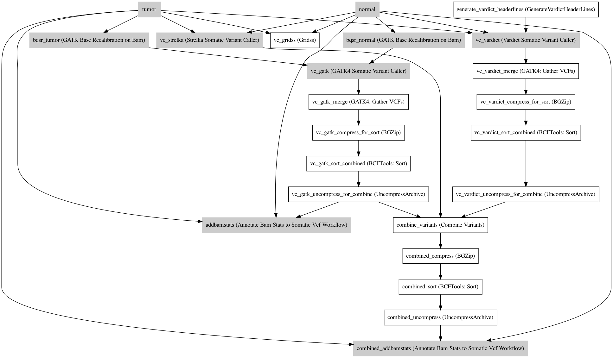

:orphan:

WGS Somatic (Multi callers)
====================================================

``WGSSomaticMultiCallers`` · *A somatic tumor-normal variant-calling WGS pipeline using GATK, VarDict and Strelka2 · 3 contributors · 1 version*

This is a genomics pipeline to align sequencing data (Fastq pairs) into BAMs:

- Takes raw sequence data in the FASTQ format;
- align to the reference genome using BWA MEM;
- Marks duplicates using Picard;
- Call the appropriate somatic variant callers (GATK / Strelka / VarDict);
- Outputs the final variants in the VCF format.

**Resources**

This pipeline has been tested using the HG38 reference set, available on Google Cloud Storage through:

- https://console.cloud.google.com/storage/browser/genomics-public-data/references/hg38/v0/

This pipeline expects the assembly references to be as they appear in that storage     (".fai", ".amb", ".ann", ".bwt", ".pac", ".sa", "^.dict").
The known sites (snps_dbsnp, snps_1000gp, known_indels, mills_indels) should be gzipped and tabix indexed.

Quickstart
-----------

1. `Install Janis </tutorials/tutorial0.html>`_

2. Ensure Janis is configured to work with Docker or Singularity.

3. Ensure all reference files are available:

.. note:: 

   More information about these inputs are available `below <#additional-configuration-inputs>`_.

=================  ======================  =====================================================================================================  =======================================================================================================================================================================================================================================================================================================================================================================================================================
Name               Type                    Source                                                                                                 Description
=================  ======================  =====================================================================================================  =======================================================================================================================================================================================================================================================================================================================================================================================================================
reference          FastaWithIndexes        * hg38: gs://genomics-public-data/references/hg38/v0/Homo_sapiens_assembly38.fasta                     The reference genome from which to align the reads. This requires a number indexes (can be generated     with the 'IndexFasta' pipeline This pipeline has been tested using the HG38 reference set.

                                                                                                                                                      This pipeline expects the assembly references to be as they appear in the GCP example. For example:
                                                                                                                                                          - HG38: https://console.cloud.google.com/storage/browser/genomics-public-data/references/hg38/v0/

                                                                                                                                                      - (".fai", ".amb", ".ann", ".bwt", ".pac", ".sa", "^.dict").
snps_dbsnp         Gzipped<VCF>            * hg38: gs://genomics-public-data/references/hg38/v0/Homo_sapiens_assembly38.dbsnp138.vcf              From the GATK resource bundle, passed to BaseRecalibrator as ``known_sites``
snps_1000gp        Gzipped<VCF>            * hg38: gs://genomics-public-data/references/hg38/v0/1000G_phase1.snps.high_confidence.hg38.vcf.gz     From the GATK resource bundle, passed to BaseRecalibrator as ``known_sites``. Accessible from the HG38 genomics-public-data google cloud bucket: https://console.cloud.google.com/storage/browser/genomics-public-data/references/hg38/v0/
known_indels       Gzipped<VCF>            * hg38: gs://genomics-public-data/references/hg38/v0/Homo_sapiens_assembly38.known_indels.vcf.gz       From the GATK resource bundle, passed to BaseRecalibrator as ``known_sites``
mills_indels       Gzipped<VCF>            * hg38: gs://genomics-public-data/references/hg38/v0/Mills_and_1000G_gold_standard.indels.hg38.vcf.gz  From the GATK resource bundle, passed to BaseRecalibrator as ``known_sites``
gatk_intervals     Array<bed>              None                                                                                                   List of intervals over which to split the GATK variant calling
gridss_blacklist   bed                     * hg19: https://www.encodeproject.org/files/ENCFF001TDO/@@download/ENCFF001TDO.bed.gz                  BED file containing regions to ignore. For more information, visit: https://github.com/PapenfussLab/gridss#blacklist
                                           * GRCh38: https://www.encodeproject.org/files/ENCFF356LFX/@@download/ENCFF356LFX.bed.gz
vardict_intervals  Array<bed>              None                                                                                                   List of intervals over which to split the VarDict variant calling
strelka_intervals  Gzipped<bed>            None                                                                                                   An interval for which to restrict the analysis to.
gnomad             Gzipped<VCF>            * hg38: https://storage.cloud.google.com/gatk-best-practices/somatic-hg38/af-only-gnomad.hg38.vcf.gz   The genome Aggregation Database (gnomAD). This VCF must be compressed and tabix indexed. This is specific for your genome (eg: hg38 / br37) and can usually be found with your reference. For example for HG38, the Broad institute provide the following af-only-gnomad compressed and tabix indexed VCF: https://console.cloud.google.com/storage/browser/gatk-best-practices/somatic-hg38;tab=objects?prefix=af-only
                                           * b37: https://storage.cloud.google.com/gatk-best-practices/somatic-b37/af-only-gnomad.raw.sites.vcf
panel_of_normals   Optional<Gzipped<VCF>>  * b37: gs://gatk-best-practices/somatic-b37/Mutect2-WGS-panel-b37.vcf                                  VCF file of sites observed in normal.
                                           * b37-exome: gs://gatk-best-practices/somatic-b37/Mutect2-exome-panel.vcf
cutadapt_adapters  File                    https://raw.githubusercontent.com/csf-ngs/fastqc/master/Contaminants/contaminant_list.txt              Specifies a containment list for cutadapt, which contains a list of sequences to determine valid
                                                                                                                                                                  overrepresented sequences from the FastQC report to trim with Cuatadapt. The file must contain sets
                                                                                                                                                                  of named adapters in the form: ``name[tab]sequence``. Lines prefixed with a hash will be ignored.
=================  ======================  =====================================================================================================  =======================================================================================================================================================================================================================================================================================================================================================================================================================

4. Generate user and static input files for WGSSomaticMultiCallers:

.. code-block:: bash

   # user inputs
   janis inputs --user WGSSomaticMultiCallers > inputs.yaml

   # static inputs
   janis inputs --static WGSSomaticMultiCallers > static.yaml

**inputs.yaml**

.. code-block:: yaml

       normal_inputs: '["normal_R1.fastq.gz", "normal_R2.fastq.gz"]'
       normal_name: NA24385_normal
       tumor_inputs: '["tumor_R1.fastq.gz", "tumor_R2.fastq.gz"]'
       tumor_name: NA24385_tumor

**static.yaml**

.. code-block:: yaml

       cutadapt_adapters: contaminant_list.txt
       gatk_intervals: BRCA1.bed
       gnomad: af-only-gnomad.hg38.vcf.gz
       gridss_blacklist: gridss_blacklist.bed
       known_indels: Homo_sapiens_assembly38.known_indels.vcf.gz
       mills_indels: Mills_and_1000G_gold_standard.indels.hg38.vcf.gz
       reference: Homo_sapiens_assembly38.fasta
       snps_1000gp: 1000G_phase1.snps.high_confidence.hg38.vcf.gz
       snps_dbsnp: Homo_sapiens_assembly38.dbsnp138.vcf.gz
       strelka_intervals: BRCA1.bed.gz
       vardict_intervals: BRCA1.bed

5. Run WGSSomaticMultiCallers with:

.. code-block:: bash

   janis run [...run options] \
       --inputs inputs.yaml \
       --inputs static.yaml \
       WGSSomaticMultiCallers

Outputs
-----------

==============================  =================  ========================================================
name                            type               documentation
==============================  =================  ========================================================
out_normal_fastqc_reports       Array<Array<Zip>>
out_tumor_fastqc_reports        Array<Array<Zip>>
out_normal_performance_summary  csv                A text file of performance summary of NORMAL bam
out_tumor_performance_summary   csv                A text file of performance summary of TUMOR bam
out_normal_bam                  IndexedBam
out_tumor_bam                   IndexedBam
out_gridss_assembly             BAM                Assembly returned by GRIDSS
out_variants_gridss             VCF                Variants from the GRIDSS variant caller
out_variants_gatk               Gzipped<VCF>       Merged variants from the GATK caller
out_variants_split              Array<VCF>         Unmerged variants from the GATK caller (by interval)
out_variants_vardict_split      Array<VCF>         Unmerged variants from the VarDict caller (by interval)
out_variants_vardict            Gzipped<VCF>       Merged variants from the VarDict caller
out_variants_strelka            VCF                Variants from the Strelka variant caller
out_variants                    VCF                Combined variants from GATK, VarDict and Strelka callers
==============================  =================  ========================================================

Workflow
--------

Information
------------

:ID: ``WGSSomaticMultiCallers``
:Versions: 1.4.0
:Authors: Michael Franklin, Richard Lupat, Jiaan Yu
:Citations: 
:Created: 2018-12-24
:Updated: 2020-08-19

Embedded Tools
~~~~~~~~~~~~~~~~~

==========================================  ======================================
                                            ``somatic_subpipeline/None``
Gridss                                      ``gridss/v2.6.2``
GATK Base Recalibration on Bam              ``GATKBaseRecalBQSRWorkflow/4.1.3``
GATK4 Somatic Variant Caller                ``GATK4_SomaticVariantCaller/4.1.3.0``
GATK4: Gather VCFs                          ``Gatk4GatherVcfs/4.1.3.0``
BGZip                                       ``bgzip/1.2.1``
BCFTools: Sort                              ``bcftoolssort/v1.9``
UncompressArchive                           ``UncompressArchive/v1.0.0``
Annotate Bam Stats to Somatic Vcf Workflow  ``AddBamStatsSomatic/v0.1.0``
GenerateVardictHeaderLines                  ``GenerateVardictHeaderLines/v0.1.0``
Vardict Somatic Variant Caller              ``vardictSomaticVariantCaller/v0.1.0``
Strelka Somatic Variant Caller              ``strelkaSomaticVariantCaller/v0.1.1``
Combine Variants                            ``combinevariants/0.0.8``
==========================================  ======================================

Additional configuration (inputs)
---------------------------------

========================  =======================  =======================================================================================================================================================================================================================================================================================================================================================================================================================
name                      type                     documentation
========================  =======================  =======================================================================================================================================================================================================================================================================================================================================================================================================================
normal_inputs             Array<FastqGzPair>       An array of NORMAL FastqGz pairs. These are aligned separately and merged to create higher depth coverages from multiple sets of reads
tumor_inputs              Array<FastqGzPair>       An array of TUMOR FastqGz pairs. These are aligned separately and merged to create higher depth coverages from multiple sets of reads
normal_name               String                   Sample name for the NORMAL sample from which to generate the readGroupHeaderLine for BwaMem
tumor_name                String                   Sample name for the TUMOR sample from which to generate the readGroupHeaderLine for BwaMem
reference                 FastaWithIndexes         The reference genome from which to align the reads. This requires a number indexes (can be generated     with the 'IndexFasta' pipeline This pipeline has been tested using the HG38 reference set.

                                                       This pipeline expects the assembly references to be as they appear in the GCP example. For example:
                                                           - HG38: https://console.cloud.google.com/storage/browser/genomics-public-data/references/hg38/v0/

                                                       - (".fai", ".amb", ".ann", ".bwt", ".pac", ".sa", "^.dict").
snps_dbsnp                Gzipped<VCF>             From the GATK resource bundle, passed to BaseRecalibrator as ``known_sites``
snps_1000gp               Gzipped<VCF>             From the GATK resource bundle, passed to BaseRecalibrator as ``known_sites``. Accessible from the HG38 genomics-public-data google cloud bucket: https://console.cloud.google.com/storage/browser/genomics-public-data/references/hg38/v0/
known_indels              Gzipped<VCF>             From the GATK resource bundle, passed to BaseRecalibrator as ``known_sites``
mills_indels              Gzipped<VCF>             From the GATK resource bundle, passed to BaseRecalibrator as ``known_sites``
gatk_intervals            Array<bed>               List of intervals over which to split the GATK variant calling
gridss_blacklist          bed                      BED file containing regions to ignore. For more information, visit: https://github.com/PapenfussLab/gridss#blacklist
vardict_intervals         Array<bed>               List of intervals over which to split the VarDict variant calling
strelka_intervals         Gzipped<bed>             An interval for which to restrict the analysis to.
gnomad                    Gzipped<VCF>             The genome Aggregation Database (gnomAD). This VCF must be compressed and tabix indexed. This is specific for your genome (eg: hg38 / br37) and can usually be found with your reference. For example for HG38, the Broad institute provide the following af-only-gnomad compressed and tabix indexed VCF: https://console.cloud.google.com/storage/browser/gatk-best-practices/somatic-hg38;tab=objects?prefix=af-only
cutadapt_adapters         File                     Specifies a containment list for cutadapt, which contains a list of sequences to determine valid
                                                                   overrepresented sequences from the FastQC report to trim with Cuatadapt. The file must contain sets
                                                                   of named adapters in the form: ``name[tab]sequence``. Lines prefixed with a hash will be ignored.
panel_of_normals          Optional<Gzipped<VCF>>   VCF file of sites observed in normal.
allele_freq_threshold     Optional<Float>          The threshold for VarDict's allele frequency, default: 0.05 or 5%
combine_variants_type     Optional<String>         germline | somatic
combine_variants_columns  Optional<Array<String>>  Columns to keep, seperated by space output vcf (unsorted)
========================  =======================  =======================================================================================================================================================================================================================================================================================================================================================================================================================

Workflow Description Language
------------------------------

.. code-block:: text

   version development

   import "tools/somatic_subpipeline.wdl" as S
   import "tools/gridss_v2_6_2.wdl" as G
   import "tools/GATKBaseRecalBQSRWorkflow_4_1_3.wdl" as G2
   import "tools/GATK4_SomaticVariantCaller_4_1_3_0.wdl" as G3
   import "tools/Gatk4GatherVcfs_4_1_3_0.wdl" as G4
   import "tools/bgzip_1_2_1.wdl" as B
   import "tools/bcftoolssort_v1_9.wdl" as B2
   import "tools/UncompressArchive_v1_0_0.wdl" as U
   import "tools/AddBamStatsSomatic_v0_1_0.wdl" as A
   import "tools/GenerateVardictHeaderLines_v0_1_0.wdl" as G5
   import "tools/vardictSomaticVariantCaller_v0_1_0.wdl" as V
   import "tools/strelkaSomaticVariantCaller_v0_1_1.wdl" as S2
   import "tools/combinevariants_0_0_8.wdl" as C

   workflow WGSSomaticMultiCallers {
     input {
       Array[Array[File]] normal_inputs
       Array[Array[File]] tumor_inputs
       String normal_name
       String tumor_name
       File reference
       File reference_fai
       File reference_amb
       File reference_ann
       File reference_bwt
       File reference_pac
       File reference_sa
       File reference_dict
       File snps_dbsnp
       File snps_dbsnp_tbi
       File snps_1000gp
       File snps_1000gp_tbi
       File known_indels
       File known_indels_tbi
       File mills_indels
       File mills_indels_tbi
       Array[File] gatk_intervals
       File gridss_blacklist
       Array[File] vardict_intervals
       File strelka_intervals
       File strelka_intervals_tbi
       File gnomad
       File gnomad_tbi
       File? panel_of_normals
       File? panel_of_normals_tbi
       File cutadapt_adapters
       Float? allele_freq_threshold = 0.05
       String? combine_variants_type = "somatic"
       Array[String]? combine_variants_columns = ["AD", "DP", "GT"]
     }
     call S.somatic_subpipeline as tumor {
       input:
         reads=tumor_inputs,
         sample_name=tumor_name,
         reference=reference,
         reference_fai=reference_fai,
         reference_amb=reference_amb,
         reference_ann=reference_ann,
         reference_bwt=reference_bwt,
         reference_pac=reference_pac,
         reference_sa=reference_sa,
         reference_dict=reference_dict,
         cutadapt_adapters=cutadapt_adapters,
         gatk_intervals=gatk_intervals,
         snps_dbsnp=snps_dbsnp,
         snps_dbsnp_tbi=snps_dbsnp_tbi,
         snps_1000gp=snps_1000gp,
         snps_1000gp_tbi=snps_1000gp_tbi,
         known_indels=known_indels,
         known_indels_tbi=known_indels_tbi,
         mills_indels=mills_indels,
         mills_indels_tbi=mills_indels_tbi
     }
     call S.somatic_subpipeline as normal {
       input:
         reads=normal_inputs,
         sample_name=normal_name,
         reference=reference,
         reference_fai=reference_fai,
         reference_amb=reference_amb,
         reference_ann=reference_ann,
         reference_bwt=reference_bwt,
         reference_pac=reference_pac,
         reference_sa=reference_sa,
         reference_dict=reference_dict,
         cutadapt_adapters=cutadapt_adapters,
         gatk_intervals=gatk_intervals,
         snps_dbsnp=snps_dbsnp,
         snps_dbsnp_tbi=snps_dbsnp_tbi,
         snps_1000gp=snps_1000gp,
         snps_1000gp_tbi=snps_1000gp_tbi,
         known_indels=known_indels,
         known_indels_tbi=known_indels_tbi,
         mills_indels=mills_indels,
         mills_indels_tbi=mills_indels_tbi
     }
     call G.gridss as vc_gridss {
       input:
         bams=[normal.out_bam, tumor.out_bam],
         bams_bai=[normal.out_bam_bai, tumor.out_bam_bai],
         reference=reference,
         reference_fai=reference_fai,
         reference_amb=reference_amb,
         reference_ann=reference_ann,
         reference_bwt=reference_bwt,
         reference_pac=reference_pac,
         reference_sa=reference_sa,
         reference_dict=reference_dict,
         blacklist=gridss_blacklist
     }
     scatter (g in gatk_intervals) {
        call G2.GATKBaseRecalBQSRWorkflow as bqsr_normal {
         input:
           bam=normal.out_bam,
           bam_bai=normal.out_bam_bai,
           intervals=g,
           reference=reference,
           reference_fai=reference_fai,
           reference_amb=reference_amb,
           reference_ann=reference_ann,
           reference_bwt=reference_bwt,
           reference_pac=reference_pac,
           reference_sa=reference_sa,
           reference_dict=reference_dict,
           snps_dbsnp=snps_dbsnp,
           snps_dbsnp_tbi=snps_dbsnp_tbi,
           snps_1000gp=snps_1000gp,
           snps_1000gp_tbi=snps_1000gp_tbi,
           known_indels=known_indels,
           known_indels_tbi=known_indels_tbi,
           mills_indels=mills_indels,
           mills_indels_tbi=mills_indels_tbi
       }
     }
     scatter (g in gatk_intervals) {
        call G2.GATKBaseRecalBQSRWorkflow as bqsr_tumor {
         input:
           bam=tumor.out_bam,
           bam_bai=tumor.out_bam_bai,
           intervals=g,
           reference=reference,
           reference_fai=reference_fai,
           reference_amb=reference_amb,
           reference_ann=reference_ann,
           reference_bwt=reference_bwt,
           reference_pac=reference_pac,
           reference_sa=reference_sa,
           reference_dict=reference_dict,
           snps_dbsnp=snps_dbsnp,
           snps_dbsnp_tbi=snps_dbsnp_tbi,
           snps_1000gp=snps_1000gp,
           snps_1000gp_tbi=snps_1000gp_tbi,
           known_indels=known_indels,
           known_indels_tbi=known_indels_tbi,
           mills_indels=mills_indels,
           mills_indels_tbi=mills_indels_tbi
       }
     }
     scatter (Q in zip(gatk_intervals, zip(transpose([bqsr_normal.out, bqsr_normal.out_bai]), transpose([bqsr_tumor.out, bqsr_tumor.out_bai])))) {
        call G3.GATK4_SomaticVariantCaller as vc_gatk {
         input:
           normal_bam=Q.right.left[0],
           normal_bam_bai=Q.right.left[1],
           tumor_bam=Q.right.right[0],
           tumor_bam_bai=Q.right.right[1],
           normal_name=normal_name,
           intervals=Q.left,
           reference=reference,
           reference_fai=reference_fai,
           reference_amb=reference_amb,
           reference_ann=reference_ann,
           reference_bwt=reference_bwt,
           reference_pac=reference_pac,
           reference_sa=reference_sa,
           reference_dict=reference_dict,
           gnomad=gnomad,
           gnomad_tbi=gnomad_tbi,
           panel_of_normals=panel_of_normals,
           panel_of_normals_tbi=panel_of_normals_tbi
       }
     }
     call G4.Gatk4GatherVcfs as vc_gatk_merge {
       input:
         vcfs=vc_gatk.out
     }
     call B.bgzip as vc_gatk_compress_for_sort {
       input:
         file=vc_gatk_merge.out
     }
     call B2.bcftoolssort as vc_gatk_sort_combined {
       input:
         vcf=vc_gatk_compress_for_sort.out
     }
     call U.UncompressArchive as vc_gatk_uncompress_for_combine {
       input:
         file=vc_gatk_sort_combined.out
     }
     call A.AddBamStatsSomatic as addbamstats {
       input:
         normal_id=normal_name,
         tumor_id=tumor_name,
         normal_bam=normal.out_bam,
         normal_bam_bai=normal.out_bam_bai,
         tumor_bam=tumor.out_bam,
         tumor_bam_bai=tumor.out_bam_bai,
         reference=reference,
         reference_fai=reference_fai,
         reference_amb=reference_amb,
         reference_ann=reference_ann,
         reference_bwt=reference_bwt,
         reference_pac=reference_pac,
         reference_sa=reference_sa,
         reference_dict=reference_dict,
         vcf=vc_gatk_uncompress_for_combine.out
     }
     call G5.GenerateVardictHeaderLines as generate_vardict_headerlines {
       input:
         reference=reference,
         reference_dict=reference_dict
     }
     scatter (v in vardict_intervals) {
        call V.vardictSomaticVariantCaller as vc_vardict {
         input:
           normal_bam=normal.out_bam,
           normal_bam_bai=normal.out_bam_bai,
           tumor_bam=tumor.out_bam,
           tumor_bam_bai=tumor.out_bam_bai,
           normal_name=normal_name,
           tumor_name=tumor_name,
           intervals=v,
           allele_freq_threshold=select_first([allele_freq_threshold, 0.05]),
           header_lines=generate_vardict_headerlines.out,
           reference=reference,
           reference_fai=reference_fai,
           reference_amb=reference_amb,
           reference_ann=reference_ann,
           reference_bwt=reference_bwt,
           reference_pac=reference_pac,
           reference_sa=reference_sa,
           reference_dict=reference_dict
       }
     }
     call G4.Gatk4GatherVcfs as vc_vardict_merge {
       input:
         vcfs=vc_vardict.out
     }
     call B.bgzip as vc_vardict_compress_for_sort {
       input:
         file=vc_vardict_merge.out
     }
     call B2.bcftoolssort as vc_vardict_sort_combined {
       input:
         vcf=vc_vardict_compress_for_sort.out
     }
     call U.UncompressArchive as vc_vardict_uncompress_for_combine {
       input:
         file=vc_vardict_sort_combined.out
     }
     call S2.strelkaSomaticVariantCaller as vc_strelka {
       input:
         normal_bam=normal.out_bam,
         normal_bam_bai=normal.out_bam_bai,
         tumor_bam=tumor.out_bam,
         tumor_bam_bai=tumor.out_bam_bai,
         reference=reference,
         reference_fai=reference_fai,
         reference_amb=reference_amb,
         reference_ann=reference_ann,
         reference_bwt=reference_bwt,
         reference_pac=reference_pac,
         reference_sa=reference_sa,
         reference_dict=reference_dict,
         intervals=strelka_intervals,
         intervals_tbi=strelka_intervals_tbi
     }
     call C.combinevariants as combine_variants {
       input:
         vcfs=[vc_gatk_uncompress_for_combine.out, vc_strelka.out, vc_vardict_uncompress_for_combine.out],
         type=select_first([combine_variants_type, "somatic"]),
         columns=select_first([combine_variants_columns, ["AD", "DP", "GT"]]),
         normal=normal_name,
         tumor=tumor_name
     }
     call B.bgzip as combined_compress {
       input:
         file=combine_variants.out
     }
     call B2.bcftoolssort as combined_sort {
       input:
         vcf=combined_compress.out
     }
     call U.UncompressArchive as combined_uncompress {
       input:
         file=combined_sort.out
     }
     call A.AddBamStatsSomatic as combined_addbamstats {
       input:
         normal_id=normal_name,
         tumor_id=tumor_name,
         normal_bam=normal.out_bam,
         normal_bam_bai=normal.out_bam_bai,
         tumor_bam=tumor.out_bam,
         tumor_bam_bai=tumor.out_bam_bai,
         reference=reference,
         reference_fai=reference_fai,
         reference_amb=reference_amb,
         reference_ann=reference_ann,
         reference_bwt=reference_bwt,
         reference_pac=reference_pac,
         reference_sa=reference_sa,
         reference_dict=reference_dict,
         vcf=combined_uncompress.out
     }
     output {
       Array[Array[File]] out_normal_fastqc_reports = normal.out_fastqc_reports
       Array[Array[File]] out_tumor_fastqc_reports = tumor.out_fastqc_reports
       File out_normal_performance_summary = normal.out_performance_summary
       File out_tumor_performance_summary = tumor.out_performance_summary
       File out_normal_bam = normal.out_bam
       File out_normal_bam_bai = normal.out_bam_bai
       File out_tumor_bam = tumor.out_bam
       File out_tumor_bam_bai = tumor.out_bam_bai
       File out_gridss_assembly = vc_gridss.assembly
       File out_variants_gridss = vc_gridss.out
       File out_variants_gatk = vc_gatk_sort_combined.out
       Array[File] out_variants_split = vc_gatk.out
       Array[File] out_variants_vardict_split = vc_vardict.out
       File out_variants_vardict = vc_vardict_sort_combined.out
       File out_variants_strelka = vc_strelka.out
       File out_variants = addbamstats.out
     }
   }

Common Workflow Language
-------------------------

.. code-block:: text

   #!/usr/bin/env cwl-runner
   class: Workflow
   cwlVersion: v1.2
   label: WGS Somatic (Multi callers)
   doc: |
     This is a genomics pipeline to align sequencing data (Fastq pairs) into BAMs:

     - Takes raw sequence data in the FASTQ format;
     - align to the reference genome using BWA MEM;
     - Marks duplicates using Picard;
     - Call the appropriate somatic variant callers (GATK / Strelka / VarDict);
     - Outputs the final variants in the VCF format.

     **Resources**

     This pipeline has been tested using the HG38 reference set, available on Google Cloud Storage through:

     - https://console.cloud.google.com/storage/browser/genomics-public-data/references/hg38/v0/

     This pipeline expects the assembly references to be as they appear in that storage     (".fai", ".amb", ".ann", ".bwt", ".pac", ".sa", "^.dict").
     The known sites (snps_dbsnp, snps_1000gp, known_indels, mills_indels) should be gzipped and tabix indexed.

   requirements:
   - class: InlineJavascriptRequirement
   - class: StepInputExpressionRequirement
   - class: ScatterFeatureRequirement
   - class: SubworkflowFeatureRequirement
   - class: MultipleInputFeatureRequirement

   inputs:
   - id: normal_inputs
     doc: |-
       An array of NORMAL FastqGz pairs. These are aligned separately and merged to create higher depth coverages from multiple sets of reads
     type:
       type: array
       items:
         type: array
         items: File
   - id: tumor_inputs
     doc: |-
       An array of TUMOR FastqGz pairs. These are aligned separately and merged to create higher depth coverages from multiple sets of reads
     type:
       type: array
       items:
         type: array
         items: File
   - id: normal_name
     doc: |-
       Sample name for the NORMAL sample from which to generate the readGroupHeaderLine for BwaMem
     type: string
   - id: tumor_name
     doc: |-
       Sample name for the TUMOR sample from which to generate the readGroupHeaderLine for BwaMem
     type: string
   - id: reference
     doc: |2-
           The reference genome from which to align the reads. This requires a number indexes (can be generated     with the 'IndexFasta' pipeline This pipeline has been tested using the HG38 reference set.

           This pipeline expects the assembly references to be as they appear in the GCP example. For example:
               - HG38: https://console.cloud.google.com/storage/browser/genomics-public-data/references/hg38/v0/

           - (".fai", ".amb", ".ann", ".bwt", ".pac", ".sa", "^.dict").
     type: File
     secondaryFiles:
     - pattern: .fai
     - pattern: .amb
     - pattern: .ann
     - pattern: .bwt
     - pattern: .pac
     - pattern: .sa
     - pattern: ^.dict
   - id: snps_dbsnp
     doc: From the GATK resource bundle, passed to BaseRecalibrator as ``known_sites``
     type: File
     secondaryFiles:
     - pattern: .tbi
   - id: snps_1000gp
     doc: |-
       From the GATK resource bundle, passed to BaseRecalibrator as ``known_sites``. Accessible from the HG38 genomics-public-data google cloud bucket: https://console.cloud.google.com/storage/browser/genomics-public-data/references/hg38/v0/ 
     type: File
     secondaryFiles:
     - pattern: .tbi
   - id: known_indels
     doc: From the GATK resource bundle, passed to BaseRecalibrator as ``known_sites``
     type: File
     secondaryFiles:
     - pattern: .tbi
   - id: mills_indels
     doc: From the GATK resource bundle, passed to BaseRecalibrator as ``known_sites``
     type: File
     secondaryFiles:
     - pattern: .tbi
   - id: gatk_intervals
     doc: List of intervals over which to split the GATK variant calling
     type:
       type: array
       items: File
   - id: gridss_blacklist
     doc: |-
       BED file containing regions to ignore. For more information, visit: https://github.com/PapenfussLab/gridss#blacklist
     type: File
   - id: vardict_intervals
     doc: List of intervals over which to split the VarDict variant calling
     type:
       type: array
       items: File
   - id: strelka_intervals
     doc: An interval for which to restrict the analysis to.
     type: File
     secondaryFiles:
     - pattern: .tbi
   - id: gnomad
     doc: |-
       The genome Aggregation Database (gnomAD). This VCF must be compressed and tabix indexed. This is specific for your genome (eg: hg38 / br37) and can usually be found with your reference. For example for HG38, the Broad institute provide the following af-only-gnomad compressed and tabix indexed VCF: https://console.cloud.google.com/storage/browser/gatk-best-practices/somatic-hg38;tab=objects?prefix=af-only
     type: File
     secondaryFiles:
     - pattern: .tbi
   - id: panel_of_normals
     doc: VCF file of sites observed in normal.
     type:
     - File
     - 'null'
     secondaryFiles:
     - pattern: .tbi
   - id: cutadapt_adapters
     doc: |2-
                       Specifies a containment list for cutadapt, which contains a list of sequences to determine valid
                       overrepresented sequences from the FastQC report to trim with Cuatadapt. The file must contain sets
                       of named adapters in the form: ``name[tab]sequence``. Lines prefixed with a hash will be ignored.
     type: File
   - id: allele_freq_threshold
     doc: "The threshold for VarDict's allele frequency, default: 0.05 or 5%"
     type: float
     default: 0.05
   - id: combine_variants_type
     doc: germline | somatic
     type: string
     default: somatic
   - id: combine_variants_columns
     doc: Columns to keep, seperated by space output vcf (unsorted)
     type:
       type: array
       items: string
     default:
     - AD
     - DP
     - GT

   outputs:
   - id: out_normal_fastqc_reports
     type:
       type: array
       items:
         type: array
         items: File
     outputSource: normal/out_fastqc_reports
   - id: out_tumor_fastqc_reports
     type:
       type: array
       items:
         type: array
         items: File
     outputSource: tumor/out_fastqc_reports
   - id: out_normal_performance_summary
     doc: A text file of performance summary of NORMAL bam
     type: File
     outputSource: normal/out_performance_summary
   - id: out_tumor_performance_summary
     doc: A text file of performance summary of TUMOR bam
     type: File
     outputSource: tumor/out_performance_summary
   - id: out_normal_bam
     type: File
     secondaryFiles:
     - pattern: .bai
     outputSource: normal/out_bam
   - id: out_tumor_bam
     type: File
     secondaryFiles:
     - pattern: .bai
     outputSource: tumor/out_bam
   - id: out_gridss_assembly
     doc: Assembly returned by GRIDSS
     type: File
     outputSource: vc_gridss/assembly
   - id: out_variants_gridss
     doc: Variants from the GRIDSS variant caller
     type: File
     outputSource: vc_gridss/out
   - id: out_variants_gatk
     doc: Merged variants from the GATK caller
     type: File
     outputSource: vc_gatk_sort_combined/out
   - id: out_variants_split
     doc: Unmerged variants from the GATK caller (by interval)
     type:
       type: array
       items: File
     outputSource: vc_gatk/out
   - id: out_variants_vardict_split
     doc: Unmerged variants from the VarDict caller (by interval)
     type:
       type: array
       items: File
     outputSource: vc_vardict/out
   - id: out_variants_vardict
     doc: Merged variants from the VarDict caller
     type: File
     outputSource: vc_vardict_sort_combined/out
   - id: out_variants_strelka
     doc: Variants from the Strelka variant caller
     type: File
     outputSource: vc_strelka/out
   - id: out_variants
     doc: Combined variants from GATK, VarDict and Strelka callers
     type: File
     outputSource: addbamstats/out

   steps:
   - id: tumor
     in:
     - id: reads
       source: tumor_inputs
     - id: sample_name
       source: tumor_name
     - id: reference
       source: reference
     - id: cutadapt_adapters
       source: cutadapt_adapters
     - id: gatk_intervals
       source: gatk_intervals
     - id: snps_dbsnp
       source: snps_dbsnp
     - id: snps_1000gp
       source: snps_1000gp
     - id: known_indels
       source: known_indels
     - id: mills_indels
       source: mills_indels
     run: tools/somatic_subpipeline.cwl
     out:
     - id: out_bam
     - id: out_fastqc_reports
     - id: out_performance_summary
   - id: normal
     in:
     - id: reads
       source: normal_inputs
     - id: sample_name
       source: normal_name
     - id: reference
       source: reference
     - id: cutadapt_adapters
       source: cutadapt_adapters
     - id: gatk_intervals
       source: gatk_intervals
     - id: snps_dbsnp
       source: snps_dbsnp
     - id: snps_1000gp
       source: snps_1000gp
     - id: known_indels
       source: known_indels
     - id: mills_indels
       source: mills_indels
     run: tools/somatic_subpipeline.cwl
     out:
     - id: out_bam
     - id: out_fastqc_reports
     - id: out_performance_summary
   - id: vc_gridss
     label: Gridss
     in:
     - id: bams
       source:
       - normal/out_bam
       - tumor/out_bam
     - id: reference
       source: reference
     - id: blacklist
       source: gridss_blacklist
     run: tools/gridss_v2_6_2.cwl
     out:
     - id: out
     - id: assembly
   - id: bqsr_normal
     label: GATK Base Recalibration on Bam
     in:
     - id: bam
       source: normal/out_bam
     - id: intervals
       source: gatk_intervals
     - id: reference
       source: reference
     - id: snps_dbsnp
       source: snps_dbsnp
     - id: snps_1000gp
       source: snps_1000gp
     - id: known_indels
       source: known_indels
     - id: mills_indels
       source: mills_indels
     scatter:
     - intervals
     run: tools/GATKBaseRecalBQSRWorkflow_4_1_3.cwl
     out:
     - id: out
   - id: bqsr_tumor
     label: GATK Base Recalibration on Bam
     in:
     - id: bam
       source: tumor/out_bam
     - id: intervals
       source: gatk_intervals
     - id: reference
       source: reference
     - id: snps_dbsnp
       source: snps_dbsnp
     - id: snps_1000gp
       source: snps_1000gp
     - id: known_indels
       source: known_indels
     - id: mills_indels
       source: mills_indels
     scatter:
     - intervals
     run: tools/GATKBaseRecalBQSRWorkflow_4_1_3.cwl
     out:
     - id: out
   - id: vc_gatk
     label: GATK4 Somatic Variant Caller
     in:
     - id: normal_bam
       source: bqsr_normal/out
     - id: tumor_bam
       source: bqsr_tumor/out
     - id: normal_name
       source: normal_name
     - id: intervals
       source: gatk_intervals
     - id: reference
       source: reference
     - id: gnomad
       source: gnomad
     - id: panel_of_normals
       source: panel_of_normals
     scatter:
     - intervals
     - normal_bam
     - tumor_bam
     scatterMethod: dotproduct
     run: tools/GATK4_SomaticVariantCaller_4_1_3_0.cwl
     out:
     - id: variants
     - id: out_bam
     - id: out
   - id: vc_gatk_merge
     label: 'GATK4: Gather VCFs'
     in:
     - id: vcfs
       source: vc_gatk/out
     run: tools/Gatk4GatherVcfs_4_1_3_0.cwl
     out:
     - id: out
   - id: vc_gatk_compress_for_sort
     label: BGZip
     in:
     - id: file
       source: vc_gatk_merge/out
     run: tools/bgzip_1_2_1.cwl
     out:
     - id: out
   - id: vc_gatk_sort_combined
     label: 'BCFTools: Sort'
     in:
     - id: vcf
       source: vc_gatk_compress_for_sort/out
     run: tools/bcftoolssort_v1_9.cwl
     out:
     - id: out
   - id: vc_gatk_uncompress_for_combine
     label: UncompressArchive
     in:
     - id: file
       source: vc_gatk_sort_combined/out
     run: tools/UncompressArchive_v1_0_0.cwl
     out:
     - id: out
   - id: addbamstats
     label: Annotate Bam Stats to Somatic Vcf Workflow
     in:
     - id: normal_id
       source: normal_name
     - id: tumor_id
       source: tumor_name
     - id: normal_bam
       source: normal/out_bam
     - id: tumor_bam
       source: tumor/out_bam
     - id: reference
       source: reference
     - id: vcf
       source: vc_gatk_uncompress_for_combine/out
     run: tools/AddBamStatsSomatic_v0_1_0.cwl
     out:
     - id: out
   - id: generate_vardict_headerlines
     label: GenerateVardictHeaderLines
     in:
     - id: reference
       source: reference
     run: tools/GenerateVardictHeaderLines_v0_1_0.cwl
     out:
     - id: out
   - id: vc_vardict
     label: Vardict Somatic Variant Caller
     in:
     - id: normal_bam
       source: normal/out_bam
     - id: tumor_bam
       source: tumor/out_bam
     - id: normal_name
       source: normal_name
     - id: tumor_name
       source: tumor_name
     - id: intervals
       source: vardict_intervals
     - id: allele_freq_threshold
       source: allele_freq_threshold
     - id: header_lines
       source: generate_vardict_headerlines/out
     - id: reference
       source: reference
     scatter:
     - intervals
     run: tools/vardictSomaticVariantCaller_v0_1_0.cwl
     out:
     - id: variants
     - id: out
   - id: vc_vardict_merge
     label: 'GATK4: Gather VCFs'
     in:
     - id: vcfs
       source: vc_vardict/out
     run: tools/Gatk4GatherVcfs_4_1_3_0.cwl
     out:
     - id: out
   - id: vc_vardict_compress_for_sort
     label: BGZip
     in:
     - id: file
       source: vc_vardict_merge/out
     run: tools/bgzip_1_2_1.cwl
     out:
     - id: out
   - id: vc_vardict_sort_combined
     label: 'BCFTools: Sort'
     in:
     - id: vcf
       source: vc_vardict_compress_for_sort/out
     run: tools/bcftoolssort_v1_9.cwl
     out:
     - id: out
   - id: vc_vardict_uncompress_for_combine
     label: UncompressArchive
     in:
     - id: file
       source: vc_vardict_sort_combined/out
     run: tools/UncompressArchive_v1_0_0.cwl
     out:
     - id: out
   - id: vc_strelka
     label: Strelka Somatic Variant Caller
     in:
     - id: normal_bam
       source: normal/out_bam
     - id: tumor_bam
       source: tumor/out_bam
     - id: reference
       source: reference
     - id: intervals
       source: strelka_intervals
     run: tools/strelkaSomaticVariantCaller_v0_1_1.cwl
     out:
     - id: sv
     - id: variants
     - id: out
   - id: combine_variants
     label: Combine Variants
     in:
     - id: vcfs
       source:
       - vc_gatk_uncompress_for_combine/out
       - vc_strelka/out
       - vc_vardict_uncompress_for_combine/out
     - id: type
       source: combine_variants_type
     - id: columns
       source: combine_variants_columns
     - id: normal
       source: normal_name
     - id: tumor
       source: tumor_name
     run: tools/combinevariants_0_0_8.cwl
     out:
     - id: out
   - id: combined_compress
     label: BGZip
     in:
     - id: file
       source: combine_variants/out
     run: tools/bgzip_1_2_1.cwl
     out:
     - id: out
   - id: combined_sort
     label: 'BCFTools: Sort'
     in:
     - id: vcf
       source: combined_compress/out
     run: tools/bcftoolssort_v1_9.cwl
     out:
     - id: out
   - id: combined_uncompress
     label: UncompressArchive
     in:
     - id: file
       source: combined_sort/out
     run: tools/UncompressArchive_v1_0_0.cwl
     out:
     - id: out
   - id: combined_addbamstats
     label: Annotate Bam Stats to Somatic Vcf Workflow
     in:
     - id: normal_id
       source: normal_name
     - id: tumor_id
       source: tumor_name
     - id: normal_bam
       source: normal/out_bam
     - id: tumor_bam
       source: tumor/out_bam
     - id: reference
       source: reference
     - id: vcf
       source: combined_uncompress/out
     run: tools/AddBamStatsSomatic_v0_1_0.cwl
     out:
     - id: out
   id: WGSSomaticMultiCallers

