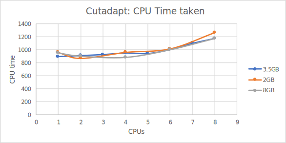

# Profiling Cutadapt

This page talks about benchmarking and profiling [Cutadapt](/tools/bioinformatics/cutadapt/cutadapt.html).

I wanted to find out how the tool's performance scaled with number of CPUs (parallelisation) and it's memory utilisation
to see if I could find balance between a tool's running time with it's approximate cost on cloud vendors.   

The process for this is fairly manual, we'll run `cutadapt` for a few different capture types, and use that information
to extrapolate how the tool functions based on new capture types.

We need to make sure we use a Python3 version of Cutadapt to make use of the multi-core functionality. Specifically we use:

- `quay.io/biocontainers/cutadapt:1.18--py37h14c3975_1 :: (sha256:9959da2953971a82e66c51cdb4936807c79fb67039e8caf4fc59af3c07c54c6e)`

We can provide the parameter `-j 0` which allows Cutadapt to determine and make use of all the cores available to the task.

## Chromosome

The inputs are a pair of compressed FastQ files (chromosome 19) which are 662MB and 721MB respectively.

We base the results between:
- Memory: 2-8GB
- CPUs: 1-8.

### Results

| Cores \ RAM | 2GB  | 3.5GB  | 8GB  |
|-------------|------|--------|------|
|   1 cores   | 957s |  893s  | 951s |
|   2 cores   | 434s |  454s  | 451s |
|   4 cores   | 240s |  237s  | 221s |
|   6 cores   | 169s |  167s  | 167s |
|   8 cores   | 158s |  147s  | 147s |

A simple log2 plot shows that if you double the cores, it approximately halves the execution time, 
however this improvement diminishes the more cores you add. We can also see that increasing the memory doesn't
have a substantial effect on the runtime.

We can analyse this in a number of interesting ways.

First, by multipyling the actual runtime by the number of cores, we get an
approximate "CPU time": 

| Cores \ RAM |  2GB  | 3.5GB |  8GB  |
|-------------|-------|-------|-------|
|   1 cores   | 957s  | 893s  | 951s  |
|   2 cores   | 868s  | 908s  | 902s  |
|   4 cores   | 960s  | 948s  | 884s  |
|   6 cores   | 1014s | 1002s | 1002s |
|   8 cores   | 1264s | 1176s | 1176s |

This demonstrates that there is an overhead from processing.

### Basic cost analysis

Although it's not strictly correct as the platform might decide to choose a more efficient analysis and
costs scale in different ways, we can get a decent approximation of the compute cost 
by using the following custom machine values (for early 2019, Australia):

| Type | [GCP](https://cloud.google.com/compute/pricing#custommachinetypepricing) |
|------|---------------------------|
| CPU  |  $ 1.24667E-05 / (cpu-s)  |
| RAM  | $ 1.66944E-06 / (gig-sec) |

We can generate the following cost table: 

| Cost | 2          | 3.5        | 8          | 
|------|------------|------------|------------| 
| 1    |  $0.01513  |  $0.01635  |  $0.02456  | 
| 2    |  $0.01227  |  $0.01397  |  $0.01727  | 
| 4    |  $0.01277  |  $0.01320  |  $0.01397  | 
| 6    |  $0.01321  |  $0.01347  |  $0.01472  | 
| 8    |  $0.01629  |  $0.01552  |  $0.01662  | 

We can more clearly see the disadvantage of adding too much RAM. Given that we're after
moderate run-times, we can lean towards 4-6 cores with 2GB RAM.