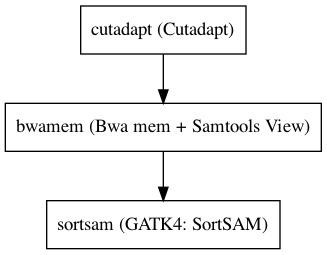

:orphan:

Align and sort reads
=================================

``BwaAligner`` · *1 contributor · 1 version*

Align sorted bam with this subworkflow consisting of BWA Mem + SamTools + Gatk4SortSam

Quickstart
-----------

    .. code-block:: python

       from janis_bioinformatics.tools.common.bwaaligner import BwaAligner

       wf = WorkflowBuilder("myworkflow")

       wf.step(
           "bwaaligner_step",
           BwaAligner(
               sample_name=None,
               reference=None,
               fastq=None,
           )
       )
       wf.output("out", source=bwaaligner_step.out)
    

*OR*

1. `Install Janis </tutorials/tutorial0.html>`_

2. Ensure Janis is configured to work with Docker or Singularity.

3. Ensure all reference files are available:

.. note:: 

   More information about these inputs are available `below <#additional-configuration-inputs>`_.

4. Generate user input files for BwaAligner:

.. code-block:: bash

   # user inputs
   janis inputs BwaAligner > inputs.yaml

**inputs.yaml**

.. code-block:: yaml

       fastq:
       - fastq_0.fastq.gz
       - fastq_1.fastq.gz
       reference: reference.fasta
       sample_name: <value>

5. Run BwaAligner with:

.. code-block:: bash

   janis run [...run options] \
       --inputs inputs.yaml \
       BwaAligner

Information
------------

URL: *No URL to the documentation was provided*

:ID: ``BwaAligner``
:URL: *No URL to the documentation was provided*
:Versions: 1.0.0
:Authors: Michael Franklin
:Citations: 
:Created: 2018-12-24
:Updated: None

Outputs
-----------

======  ==========  ===============
name    type        documentation
======  ==========  ===============
out     IndexedBam
======  ==========  ===============

Workflow
--------

Embedded Tools
***************

=======================  =================================
Cutadapt                 ``cutadapt/2.1``
Bwa mem + Samtools View  ``BwaMemSamtoolsView/0.7.17|1.9``
GATK4: SortSAM           ``Gatk4SortSam/4.1.2.0``
=======================  =================================

Additional configuration (inputs)
---------------------------------

=============================  =======================  ================================================================================================================================================================================================================================================================================================================================================================================================
name                           type                     documentation
=============================  =======================  ================================================================================================================================================================================================================================================================================================================================================================================================
sample_name                    String
reference                      FastaWithIndexes
fastq                          FastqGzPair
cutadapt_adapter               Optional<Array<String>>
cutadapt_removeMiddle3Adapter  Optional<Array<String>>
cutadapt_front                 Optional<String>         (-g)  Sequence of an adapter ligated to the 5' end (paired data: of the first read). The adapter and any preceding bases are trimmed. Partial matches at the 5' end are allowed. If a '^' character is prepended ('anchoring'), the adapter is only found if it is a prefix of the read.
cutadapt_removeMiddle5Adapter  Optional<String>         5' adapter to be removed from second read in a pair.
cutadapt_qualityCutoff         Optional<Integer>        (]3'CUTOFF, ]3'CUTOFF, -q)  Trim low-quality bases from 5' and/or 3' ends of each read before adapter removal. Applied to both reads if data is paired. If one value is given, only the 3' end is trimmed. If two comma-separated cutoffs are given, the 5' end is trimmed with the first cutoff, the 3' end with the second.
cutadapt_minimumLength         Optional<Integer>        (-m)  Discard reads shorter than LEN. Default: 0
bwamem_markShorterSplits       Optional<Boolean>        Mark shorter split hits as secondary (for Picard compatibility).
sortsam_sortOrder              Optional<String>         The --SORT_ORDER argument is an enumerated type (SortOrder), which can have one of the following values: [unsorted, queryname, coordinate, duplicate, unknown]
sortsam_createIndex            Optional<Boolean>        Whether to create a BAM index when writing a coordinate-sorted BAM file.
sortsam_validationStringency   Optional<String>         Validation stringency for all SAM files read by this program. Setting stringency to SILENT can improve performance when processing a BAM file in which variable-length data (read, qualities, tags) do not otherwise need to be decoded.The --VALIDATION_STRINGENCY argument is an enumerated type (ValidationStringency), which can have one of the following values: [STRICT, LENIENT, SILENT]
sortsam_maxRecordsInRam        Optional<Integer>        When writing SAM files that need to be sorted, this will specify the number of records stored in RAM before spilling to disk. Increasing this number reduces the number of file handles needed to sort a SAM file, and increases the amount of RAM needed.
sortsam_tmpDir                 Optional<String>         Undocumented option
=============================  =======================  ================================================================================================================================================================================================================================================================================================================================================================================================

Workflow Description Language
------------------------------

.. code-block:: text

   version development

   import "tools/cutadapt_2_1.wdl" as C
   import "tools/BwaMemSamtoolsView_0_7_17_1_9.wdl" as B
   import "tools/Gatk4SortSam_4_1_2_0.wdl" as G

   workflow BwaAligner {
     input {
       String sample_name
       File reference
       File reference_fai
       File reference_amb
       File reference_ann
       File reference_bwt
       File reference_pac
       File reference_sa
       File reference_dict
       Array[File] fastq
       Array[String]? cutadapt_adapter
       Array[String]? cutadapt_removeMiddle3Adapter
       String? cutadapt_front
       String? cutadapt_removeMiddle5Adapter
       Int? cutadapt_qualityCutoff = 15
       Int? cutadapt_minimumLength = 50
       Boolean? bwamem_markShorterSplits = true
       String? sortsam_sortOrder = "coordinate"
       Boolean? sortsam_createIndex = true
       String? sortsam_validationStringency = "SILENT"
       Int? sortsam_maxRecordsInRam = 5000000
       String? sortsam_tmpDir = "."
     }
     call C.cutadapt as cutadapt {
       input:
         outputPrefix=sample_name,
         fastq=fastq,
         adapter=cutadapt_adapter,
         front=cutadapt_front,
         qualityCutoff=select_first([cutadapt_qualityCutoff, 15]),
         minimumLength=select_first([cutadapt_minimumLength, 50]),
         removeMiddle3Adapter=cutadapt_removeMiddle3Adapter,
         removeMiddle5Adapter=cutadapt_removeMiddle5Adapter
     }
     call B.BwaMemSamtoolsView as bwamem {
       input:
         reference=reference,
         reference_fai=reference_fai,
         reference_amb=reference_amb,
         reference_ann=reference_ann,
         reference_bwt=reference_bwt,
         reference_pac=reference_pac,
         reference_sa=reference_sa,
         reference_dict=reference_dict,
         reads=cutadapt.out,
         sampleName=sample_name,
         markShorterSplits=select_first([bwamem_markShorterSplits, true])
     }
     call G.Gatk4SortSam as sortsam {
       input:
         bam=bwamem.out,
         sortOrder=select_first([sortsam_sortOrder, "coordinate"]),
         createIndex=select_first([sortsam_createIndex, true]),
         maxRecordsInRam=select_first([sortsam_maxRecordsInRam, 5000000]),
         tmpDir=select_first([sortsam_tmpDir, "."]),
         validationStringency=select_first([sortsam_validationStringency, "SILENT"])
     }
     output {
       File out = sortsam.out
       File out_bai = sortsam.out_bai
     }
   }

Common Workflow Language
-------------------------

.. code-block:: text

   #!/usr/bin/env cwl-runner
   class: Workflow
   cwlVersion: v1.2
   label: Align and sort reads
   doc: |-
     Align sorted bam with this subworkflow consisting of BWA Mem + SamTools + Gatk4SortSam

   requirements:
   - class: InlineJavascriptRequirement
   - class: StepInputExpressionRequirement

   inputs:
   - id: sample_name
     type: string
   - id: reference
     type: File
     secondaryFiles:
     - pattern: .fai
     - pattern: .amb
     - pattern: .ann
     - pattern: .bwt
     - pattern: .pac
     - pattern: .sa
     - pattern: ^.dict
   - id: fastq
     type:
       type: array
       items: File
   - id: cutadapt_adapter
     type:
     - type: array
       items: string
     - 'null'
   - id: cutadapt_removeMiddle3Adapter
     type:
     - type: array
       items: string
     - 'null'
   - id: cutadapt_front
     doc: |-
       (-g)  Sequence of an adapter ligated to the 5' end (paired data: of the first read). The adapter and any preceding bases are trimmed. Partial matches at the 5' end are allowed. If a '^' character is prepended ('anchoring'), the adapter is only found if it is a prefix of the read.
     type:
     - string
     - 'null'
   - id: cutadapt_removeMiddle5Adapter
     doc: 5' adapter to be removed from second read in a pair.
     type:
     - string
     - 'null'
   - id: cutadapt_qualityCutoff
     doc: |-
       (]3'CUTOFF, ]3'CUTOFF, -q)  Trim low-quality bases from 5' and/or 3' ends of each read before adapter removal. Applied to both reads if data is paired. If one value is given, only the 3' end is trimmed. If two comma-separated cutoffs are given, the 5' end is trimmed with the first cutoff, the 3' end with the second.
     type: int
     default: 15
   - id: cutadapt_minimumLength
     doc: '(-m)  Discard reads shorter than LEN. Default: 0'
     type: int
     default: 50
   - id: bwamem_markShorterSplits
     doc: Mark shorter split hits as secondary (for Picard compatibility).
     type: boolean
     default: true
   - id: sortsam_sortOrder
     doc: |-
       The --SORT_ORDER argument is an enumerated type (SortOrder), which can have one of the following values: [unsorted, queryname, coordinate, duplicate, unknown]
     type: string
     default: coordinate
   - id: sortsam_createIndex
     doc: Whether to create a BAM index when writing a coordinate-sorted BAM file.
     type: boolean
     default: true
   - id: sortsam_validationStringency
     doc: |-
       Validation stringency for all SAM files read by this program. Setting stringency to SILENT can improve performance when processing a BAM file in which variable-length data (read, qualities, tags) do not otherwise need to be decoded.The --VALIDATION_STRINGENCY argument is an enumerated type (ValidationStringency), which can have one of the following values: [STRICT, LENIENT, SILENT]
     type: string
     default: SILENT
   - id: sortsam_maxRecordsInRam
     doc: |-
       When writing SAM files that need to be sorted, this will specify the number of records stored in RAM before spilling to disk. Increasing this number reduces the number of file handles needed to sort a SAM file, and increases the amount of RAM needed.
     type: int
     default: 5000000
   - id: sortsam_tmpDir
     doc: Undocumented option
     type: string
     default: .

   outputs:
   - id: out
     type: File
     secondaryFiles:
     - pattern: .bai
     outputSource: sortsam/out

   steps:
   - id: cutadapt
     label: Cutadapt
     in:
     - id: outputPrefix
       source: sample_name
     - id: fastq
       source: fastq
     - id: adapter
       source: cutadapt_adapter
     - id: front
       source: cutadapt_front
     - id: qualityCutoff
       source: cutadapt_qualityCutoff
     - id: minimumLength
       source: cutadapt_minimumLength
     - id: removeMiddle3Adapter
       source: cutadapt_removeMiddle3Adapter
     - id: removeMiddle5Adapter
       source: cutadapt_removeMiddle5Adapter
     run: tools/cutadapt_2_1.cwl
     out:
     - id: out
   - id: bwamem
     label: Bwa mem + Samtools View
     in:
     - id: reference
       source: reference
     - id: reads
       source: cutadapt/out
     - id: sampleName
       source: sample_name
     - id: markShorterSplits
       source: bwamem_markShorterSplits
     run: tools/BwaMemSamtoolsView_0_7_17_1_9.cwl
     out:
     - id: out
   - id: sortsam
     label: 'GATK4: SortSAM'
     in:
     - id: bam
       source: bwamem/out
     - id: sortOrder
       source: sortsam_sortOrder
     - id: createIndex
       source: sortsam_createIndex
     - id: maxRecordsInRam
       source: sortsam_maxRecordsInRam
     - id: tmpDir
       source: sortsam_tmpDir
     - id: validationStringency
       source: sortsam_validationStringency
     run: tools/Gatk4SortSam_4_1_2_0.cwl
     out:
     - id: out
   id: BwaAligner

