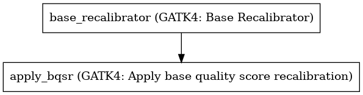

:orphan:

GATK Base Recalibration on Bam
==========================================================

``GATKBaseRecalBQSRWorkflow`` · *1 contributor · 2 versions*

No documentation was provided: `contribute one <https://github.com/PMCC-BioinformaticsCore/janis-bioinformatics>`_

Quickstart
-----------

    .. code-block:: python

       from janis_bioinformatics.tools.common.gatkbasecalbam_4_1_2 import GATKBaseRecalBQSRWorkflow_4_1_2

       wf = WorkflowBuilder("myworkflow")

       wf.step(
           "gatkbaserecalbqsrworkflow_step",
           GATKBaseRecalBQSRWorkflow_4_1_2(
               bam=None,
               reference=None,
               snps_dbsnp=None,
               snps_1000gp=None,
               known_indels=None,
               mills_indels=None,
           )
       )
       wf.output("out", source=gatkbaserecalbqsrworkflow_step.out)
    

*OR*

1. `Install Janis </tutorials/tutorial0.html>`_

2. Ensure Janis is configured to work with Docker or Singularity.

3. Ensure all reference files are available:

.. note:: 

   More information about these inputs are available `below <#additional-configuration-inputs>`_.

4. Generate user input files for GATKBaseRecalBQSRWorkflow:

.. code-block:: bash

   # user inputs
   janis inputs GATKBaseRecalBQSRWorkflow > inputs.yaml

**inputs.yaml**

.. code-block:: yaml

       bam: bam.bam
       known_indels: known_indels.vcf.gz
       mills_indels: mills_indels.vcf.gz
       reference: reference.fasta
       snps_1000gp: snps_1000gp.vcf.gz
       snps_dbsnp: snps_dbsnp.vcf.gz

5. Run GATKBaseRecalBQSRWorkflow with:

.. code-block:: bash

   janis run [...run options] \
       --inputs inputs.yaml \
       GATKBaseRecalBQSRWorkflow

Information
------------

URL: *No URL to the documentation was provided*

:ID: ``GATKBaseRecalBQSRWorkflow``
:URL: *No URL to the documentation was provided*
:Versions: 4.1.2, 4.1.3
:Authors: Jiaan Yu
:Citations: 
:Created: 2020-06-26
:Updated: 2020-06-26

Outputs
-----------

======  ==========  ===============
name    type        documentation
======  ==========  ===============
out     IndexedBam
======  ==========  ===============

Workflow
--------

Embedded Tools
***************

=============================================  =================================
GATK4: Base Recalibrator                       ``Gatk4BaseRecalibrator/4.1.2.0``
GATK4: Apply base quality score recalibration  ``Gatk4ApplyBQSR/4.1.2.0``
=============================================  =================================

Additional configuration (inputs)
---------------------------------

============  ================  ===================================================================================================================================================
name          type              documentation
============  ================  ===================================================================================================================================================
bam           IndexedBam
reference     FastaWithIndexes
snps_dbsnp    Gzipped<VCF>
snps_1000gp   Gzipped<VCF>
known_indels  Gzipped<VCF>
mills_indels  Gzipped<VCF>
intervals     Optional<bed>     This optional interval supports processing by regions. If this input resolves to null, then GATK will process the whole genome per each tool's spec
============  ================  ===================================================================================================================================================

Workflow Description Language
------------------------------

.. code-block:: text

   version development

   import "tools/Gatk4BaseRecalibrator_4_1_2_0.wdl" as G
   import "tools/Gatk4ApplyBQSR_4_1_2_0.wdl" as G2

   workflow GATKBaseRecalBQSRWorkflow {
     input {
       File bam
       File bam_bai
       File? intervals
       File reference
       File reference_fai
       File reference_amb
       File reference_ann
       File reference_bwt
       File reference_pac
       File reference_sa
       File reference_dict
       File snps_dbsnp
       File snps_dbsnp_tbi
       File snps_1000gp
       File snps_1000gp_tbi
       File known_indels
       File known_indels_tbi
       File mills_indels
       File mills_indels_tbi
     }
     call G.Gatk4BaseRecalibrator as base_recalibrator {
       input:
         bam=bam,
         bam_bai=bam_bai,
         knownSites=[snps_dbsnp, snps_1000gp, known_indels, mills_indels],
         knownSites_tbi=[snps_dbsnp_tbi, snps_1000gp_tbi, known_indels_tbi, mills_indels_tbi],
         reference=reference,
         reference_fai=reference_fai,
         reference_amb=reference_amb,
         reference_ann=reference_ann,
         reference_bwt=reference_bwt,
         reference_pac=reference_pac,
         reference_sa=reference_sa,
         reference_dict=reference_dict,
         intervals=intervals
     }
     call G2.Gatk4ApplyBQSR as apply_bqsr {
       input:
         bam=bam,
         bam_bai=bam_bai,
         reference=reference,
         reference_fai=reference_fai,
         reference_amb=reference_amb,
         reference_ann=reference_ann,
         reference_bwt=reference_bwt,
         reference_pac=reference_pac,
         reference_sa=reference_sa,
         reference_dict=reference_dict,
         recalFile=base_recalibrator.out,
         intervals=intervals
     }
     output {
       File out = apply_bqsr.out
       File out_bai = apply_bqsr.out_bai
     }
   }

Common Workflow Language
-------------------------

.. code-block:: text

   #!/usr/bin/env cwl-runner
   class: Workflow
   cwlVersion: v1.2
   label: GATK Base Recalibration on Bam
   doc: ''

   requirements:
   - class: InlineJavascriptRequirement
   - class: StepInputExpressionRequirement
   - class: MultipleInputFeatureRequirement

   inputs:
   - id: bam
     type: File
     secondaryFiles:
     - pattern: .bai
   - id: intervals
     doc: |-
       This optional interval supports processing by regions. If this input resolves to null, then GATK will process the whole genome per each tool's spec
     type:
     - File
     - 'null'
   - id: reference
     type: File
     secondaryFiles:
     - pattern: .fai
     - pattern: .amb
     - pattern: .ann
     - pattern: .bwt
     - pattern: .pac
     - pattern: .sa
     - pattern: ^.dict
   - id: snps_dbsnp
     type: File
     secondaryFiles:
     - pattern: .tbi
   - id: snps_1000gp
     type: File
     secondaryFiles:
     - pattern: .tbi
   - id: known_indels
     type: File
     secondaryFiles:
     - pattern: .tbi
   - id: mills_indels
     type: File
     secondaryFiles:
     - pattern: .tbi

   outputs:
   - id: out
     type: File
     secondaryFiles:
     - pattern: .bai
     outputSource: apply_bqsr/out

   steps:
   - id: base_recalibrator
     label: 'GATK4: Base Recalibrator'
     in:
     - id: bam
       source: bam
     - id: knownSites
       source:
       - snps_dbsnp
       - snps_1000gp
       - known_indels
       - mills_indels
     - id: reference
       source: reference
     - id: intervals
       source: intervals
     run: tools/Gatk4BaseRecalibrator_4_1_2_0.cwl
     out:
     - id: out
   - id: apply_bqsr
     label: 'GATK4: Apply base quality score recalibration'
     in:
     - id: bam
       source: bam
     - id: reference
       source: reference
     - id: recalFile
       source: base_recalibrator/out
     - id: intervals
       source: intervals
     run: tools/Gatk4ApplyBQSR_4_1_2_0.cwl
     out:
     - id: out
   id: GATKBaseRecalBQSRWorkflow

