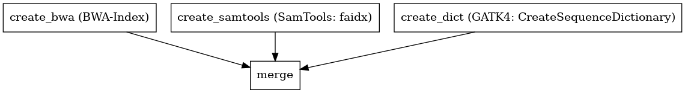

:orphan:

Index Fasta reference
==================================

``IndexFasta`` · *1 contributor · 1 version*

No documentation was provided: `contribute one <https://github.com/PMCC-BioinformaticsCore/janis-bioinformatics>`_

Quickstart
-----------

    .. code-block:: python

       from janis_bioinformatics.tools.common.indexfasta import IndexFasta

       wf = WorkflowBuilder("myworkflow")

       wf.step(
           "indexfasta_step",
           IndexFasta(
               reference=None,
           )
       )
       wf.output("out_reference", source=indexfasta_step.out_reference)
       wf.output("out_bwa", source=indexfasta_step.out_bwa)
       wf.output("out_samtools", source=indexfasta_step.out_samtools)
       wf.output("out_dict", source=indexfasta_step.out_dict)
    

*OR*

1. `Install Janis </tutorials/tutorial0.html>`_

2. Ensure Janis is configured to work with Docker or Singularity.

3. Ensure all reference files are available:

.. note:: 

   More information about these inputs are available `below <#additional-configuration-inputs>`_.

4. Generate user input files for IndexFasta:

.. code-block:: bash

   # user inputs
   janis inputs IndexFasta > inputs.yaml

**inputs.yaml**

.. code-block:: yaml

       reference: reference.fasta

5. Run IndexFasta with:

.. code-block:: bash

   janis run [...run options] \
       --inputs inputs.yaml \
       IndexFasta

Information
------------

URL: *No URL to the documentation was provided*

:ID: ``IndexFasta``
:URL: *No URL to the documentation was provided*
:Versions: 1.0.0
:Authors: Michael Franklin
:Citations: 
:Created: 2020-02-14
:Updated: 2020-11-10

Outputs
-----------

=============  ================  ===============
name           type              documentation
=============  ================  ===============
out_reference  FastaWithIndexes
out_bwa        FastaBwa
out_samtools   FastaFai
out_dict       FastDict
=============  ================  ===============

Workflow
--------

Embedded Tools
***************

===============================  =========================================
BWA-Index                        ``bwaIndex/v0.7.15``
SamTools: faidx                  ``SamToolsFaidx/1.9.0``
GATK4: CreateSequenceDictionary  ``Gatk4CreateSequenceDictionary/4.1.3.0``
                                 ``join_indexed_fastas/v0.1.0``
===============================  =========================================

Additional configuration (inputs)
---------------------------------

==============  =================  ===============
name            type               documentation
==============  =================  ===============
reference       Fasta
bwa_algorithm   Optional<String>
bwa_block_size  Optional<Integer>
==============  =================  ===============

Workflow Description Language
------------------------------

.. code-block:: text

   version development

   import "tools/bwaIndex_v0_7_15.wdl" as B
   import "tools/SamToolsFaidx_1_9_0.wdl" as S
   import "tools/Gatk4CreateSequenceDictionary_4_1_3_0.wdl" as G
   import "tools/join_indexed_fastas_v0_1_0.wdl" as J

   workflow IndexFasta {
     input {
       File reference
       String? bwa_algorithm = "bwtsw"
       Int? bwa_block_size = 50000000
     }
     call B.bwaIndex as create_bwa {
       input:
         reference=reference,
         blockSize=select_first([bwa_block_size, 50000000]),
         algorithm=select_first([bwa_algorithm, "bwtsw"])
     }
     call S.SamToolsFaidx as create_samtools {
       input:
         reference=reference
     }
     call G.Gatk4CreateSequenceDictionary as create_dict {
       input:
         reference=reference
     }
     call J.join_indexed_fastas as merge {
       input:
         ref_bwa=create_bwa.out,
         ref_bwa_amb=create_bwa.out_amb,
         ref_bwa_ann=create_bwa.out_ann,
         ref_bwa_bwt=create_bwa.out_bwt,
         ref_bwa_pac=create_bwa.out_pac,
         ref_bwa_sa=create_bwa.out_sa,
         ref_samtools=create_samtools.out,
         ref_samtools_fai=create_samtools.out_fai,
         ref_dict=create_dict.out,
         ref_dict_dict=create_dict.out_dict
     }
     output {
       File out_reference = merge.out_reference
       File out_reference_fai = merge.out_reference_fai
       File out_reference_amb = merge.out_reference_amb
       File out_reference_ann = merge.out_reference_ann
       File out_reference_bwt = merge.out_reference_bwt
       File out_reference_pac = merge.out_reference_pac
       File out_reference_sa = merge.out_reference_sa
       File out_reference_dict = merge.out_reference_dict
       File out_bwa = create_bwa.out
       File out_bwa_amb = create_bwa.out_amb
       File out_bwa_ann = create_bwa.out_ann
       File out_bwa_bwt = create_bwa.out_bwt
       File out_bwa_pac = create_bwa.out_pac
       File out_bwa_sa = create_bwa.out_sa
       File out_samtools = create_samtools.out
       File out_samtools_fai = create_samtools.out_fai
       File out_dict = create_dict.out
       File out_dict_dict = create_dict.out_dict
     }
   }

Common Workflow Language
-------------------------

.. code-block:: text

   #!/usr/bin/env cwl-runner
   class: Workflow
   cwlVersion: v1.2
   label: Index Fasta reference
   doc: ''

   requirements:
   - class: InlineJavascriptRequirement
   - class: StepInputExpressionRequirement

   inputs:
   - id: reference
     type: File
   - id: bwa_algorithm
     type: string
     default: bwtsw
   - id: bwa_block_size
     type: int
     default: 50000000

   outputs:
   - id: out_reference
     type: File
     secondaryFiles:
     - pattern: .fai
     - pattern: .amb
     - pattern: .ann
     - pattern: .bwt
     - pattern: .pac
     - pattern: .sa
     - pattern: ^.dict
     outputSource: merge/out_reference
   - id: out_bwa
     type: File
     secondaryFiles:
     - pattern: .amb
     - pattern: .ann
     - pattern: .bwt
     - pattern: .pac
     - pattern: .sa
     outputSource: create_bwa/out
   - id: out_samtools
     type: File
     secondaryFiles:
     - pattern: .fai
     outputSource: create_samtools/out
   - id: out_dict
     type: File
     secondaryFiles:
     - pattern: ^.dict
     outputSource: create_dict/out

   steps:
   - id: create_bwa
     label: BWA-Index
     in:
     - id: reference
       source: reference
     - id: blockSize
       source: bwa_block_size
     - id: algorithm
       source: bwa_algorithm
     run: tools/bwaIndex_v0_7_15.cwl
     out:
     - id: out
   - id: create_samtools
     label: 'SamTools: faidx'
     in:
     - id: reference
       source: reference
     run: tools/SamToolsFaidx_1_9_0.cwl
     out:
     - id: out
   - id: create_dict
     label: 'GATK4: CreateSequenceDictionary'
     in:
     - id: reference
       source: reference
     run: tools/Gatk4CreateSequenceDictionary_4_1_3_0.cwl
     out:
     - id: out
   - id: merge
     in:
     - id: ref_bwa
       source: create_bwa/out
     - id: ref_samtools
       source: create_samtools/out
     - id: ref_dict
       source: create_dict/out
     run: tools/join_indexed_fastas_v0_1_0.cwl
     out:
     - id: out_reference
   id: IndexFasta

