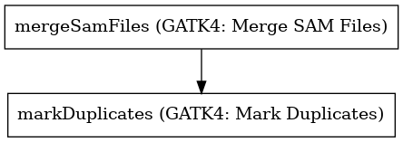

:orphan:

Merge and Mark Duplicates
============================================

``mergeAndMarkBams`` · *1 contributor · 3 versions*

No documentation was provided: `contribute one <https://github.com/PMCC-BioinformaticsCore/janis-bioinformatics>`_

Quickstart
-----------

    .. code-block:: python

       from janis_bioinformatics.tools.common.mergeandmark.mergeandmark_4_1_2 import MergeAndMarkBams_4_1_2

       wf = WorkflowBuilder("myworkflow")

       wf.step(
           "mergeandmarkbams_step",
           MergeAndMarkBams_4_1_2(
               bams=None,
           )
       )
       wf.output("out", source=mergeandmarkbams_step.out)
    

*OR*

1. `Install Janis </tutorials/tutorial0.html>`_

2. Ensure Janis is configured to work with Docker or Singularity.

3. Ensure all reference files are available:

.. note:: 

   More information about these inputs are available `below <#additional-configuration-inputs>`_.

4. Generate user input files for mergeAndMarkBams:

.. code-block:: bash

   # user inputs
   janis inputs mergeAndMarkBams > inputs.yaml

**inputs.yaml**

.. code-block:: yaml

       bams:
       - bams_0.bam
       - bams_1.bam

5. Run mergeAndMarkBams with:

.. code-block:: bash

   janis run [...run options] \
       --inputs inputs.yaml \
       mergeAndMarkBams

Information
------------

URL: *No URL to the documentation was provided*

:ID: ``mergeAndMarkBams``
:URL: *No URL to the documentation was provided*
:Versions: 4.0.12, 4.1.2, 4.1.3
:Authors: Jiaan Yu
:Citations: 
:Created: 2020-06-26
:Updated: 2020-11-06

Outputs
-----------

======  ==========  ===============
name    type        documentation
======  ==========  ===============
out     IndexedBam
======  ==========  ===============

Workflow
--------

Embedded Tools
***************

======================  ===============================
GATK4: Merge SAM Files  ``Gatk4MergeSamFiles/4.1.2.0``
GATK4: Mark Duplicates  ``Gatk4MarkDuplicates/4.1.2.0``
======================  ===============================

Additional configuration (inputs)
---------------------------------

==================================  =================  ================================================================================================================================================================================================================================================================================================================================================================================================
name                                type               documentation
==================================  =================  ================================================================================================================================================================================================================================================================================================================================================================================================
bams                                Array<IndexedBam>
createIndex                         Optional<Boolean>
maxRecordsInRam                     Optional<Integer>
sampleName                          Optional<String>
mergeSamFiles_useThreading          Optional<Boolean>  Option to create a background thread to encode, compress and write to disk the output file. The threaded version uses about 20% more CPU and decreases runtime by ~20% when writing out a compressed BAM file.
mergeSamFiles_validationStringency  Optional<String>   Validation stringency for all SAM files read by this program. Setting stringency to SILENT can improve performance when processing a BAM file in which variable-length data (read, qualities, tags) do not otherwise need to be decoded.The --VALIDATION_STRINGENCY argument is an enumerated type (ValidationStringency), which can have one of the following values: [STRICT, LENIENT, SILENT]
==================================  =================  ================================================================================================================================================================================================================================================================================================================================================================================================

Workflow Description Language
------------------------------

.. code-block:: text

   version development

   import "tools/Gatk4MergeSamFiles_4_1_2_0.wdl" as G
   import "tools/Gatk4MarkDuplicates_4_1_2_0.wdl" as G2

   workflow mergeAndMarkBams {
     input {
       Array[File] bams
       Array[File] bams_bai
       Boolean? createIndex = true
       Int? maxRecordsInRam = 5000000
       String? sampleName
       Boolean? mergeSamFiles_useThreading = true
       String? mergeSamFiles_validationStringency = "SILENT"
     }
     call G.Gatk4MergeSamFiles as mergeSamFiles {
       input:
         bams=bams,
         bams_bai=bams_bai,
         sampleName=sampleName,
         useThreading=select_first([mergeSamFiles_useThreading, true]),
         createIndex=select_first([createIndex, true]),
         maxRecordsInRam=select_first([maxRecordsInRam, 5000000]),
         validationStringency=select_first([mergeSamFiles_validationStringency, "SILENT"])
     }
     call G2.Gatk4MarkDuplicates as markDuplicates {
       input:
         bam=[mergeSamFiles.out],
         outputPrefix=sampleName,
         createIndex=select_first([createIndex, true]),
         maxRecordsInRam=select_first([maxRecordsInRam, 5000000])
     }
     output {
       File out = markDuplicates.out
       File out_bai = markDuplicates.out_bai
     }
   }

Common Workflow Language
-------------------------

.. code-block:: text

   #!/usr/bin/env cwl-runner
   class: Workflow
   cwlVersion: v1.2
   label: Merge and Mark Duplicates
   doc: ''

   requirements:
   - class: InlineJavascriptRequirement
   - class: StepInputExpressionRequirement
   - class: MultipleInputFeatureRequirement

   inputs:
   - id: bams
     type:
       type: array
       items: File
     secondaryFiles:
     - pattern: .bai
   - id: createIndex
     type: boolean
     default: true
   - id: maxRecordsInRam
     type: int
     default: 5000000
   - id: sampleName
     type:
     - string
     - 'null'
   - id: mergeSamFiles_useThreading
     doc: |-
       Option to create a background thread to encode, compress and write to disk the output file. The threaded version uses about 20% more CPU and decreases runtime by ~20% when writing out a compressed BAM file.
     type: boolean
     default: true
   - id: mergeSamFiles_validationStringency
     doc: |-
       Validation stringency for all SAM files read by this program. Setting stringency to SILENT can improve performance when processing a BAM file in which variable-length data (read, qualities, tags) do not otherwise need to be decoded.The --VALIDATION_STRINGENCY argument is an enumerated type (ValidationStringency), which can have one of the following values: [STRICT, LENIENT, SILENT]
     type: string
     default: SILENT

   outputs:
   - id: out
     type: File
     secondaryFiles:
     - pattern: .bai
     outputSource: markDuplicates/out

   steps:
   - id: mergeSamFiles
     label: 'GATK4: Merge SAM Files'
     in:
     - id: bams
       source: bams
     - id: sampleName
       source: sampleName
     - id: useThreading
       source: mergeSamFiles_useThreading
     - id: createIndex
       source: createIndex
     - id: maxRecordsInRam
       source: maxRecordsInRam
     - id: validationStringency
       source: mergeSamFiles_validationStringency
     run: tools/Gatk4MergeSamFiles_4_1_2_0.cwl
     out:
     - id: out
   - id: markDuplicates
     label: 'GATK4: Mark Duplicates'
     in:
     - id: bam
       source:
       - mergeSamFiles/out
       linkMerge: merge_nested
     - id: outputPrefix
       source: sampleName
     - id: createIndex
       source: createIndex
     - id: maxRecordsInRam
       source: maxRecordsInRam
     run: tools/Gatk4MarkDuplicates_4_1_2_0.cwl
     out:
     - id: out
     - id: metrics
   id: mergeAndMarkBams

