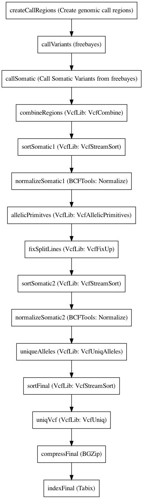

:orphan:

Freebayes somatic workflow (CRAM)
================================================================

``FreeBayesSomaticWorkflowCram`` · *1 contributor · 1 version*

This workflow uses the capabilities of freebayes to output all variants independent of the
        diploid model which then in turn allows us to create a likelihood based difference between
        the normal sample and an arbitrary amount of samples.
        This allows a joint somatic genotyping of multiple samples of the same individual.

Quickstart
-----------

    .. code-block:: python

       from janis_bioinformatics.tools.dawson.workflows.variantcalling.multisample.freebayes.freebayessomaticworkflow_cram import FreeBayesSomaticWorkflowCram

       wf = WorkflowBuilder("myworkflow")

       wf.step(
           "freebayessomaticworkflowcram_step",
           FreeBayesSomaticWorkflowCram(
               bams=None,
               reference=None,
               normalSample=None,
           )
       )
       wf.output("somaticOutVcf", source=freebayessomaticworkflowcram_step.somaticOutVcf)
    

*OR*

1. `Install Janis </tutorials/tutorial0.html>`_

2. Ensure Janis is configured to work with Docker or Singularity.

3. Ensure all reference files are available:

.. note:: 

   More information about these inputs are available `below <#additional-configuration-inputs>`_.

4. Generate user input files for FreeBayesSomaticWorkflowCram:

.. code-block:: bash

   # user inputs
   janis inputs FreeBayesSomaticWorkflowCram > inputs.yaml

**inputs.yaml**

.. code-block:: yaml

       bams:
       - bams_0.cram
       - bams_1.cram
       normalSample: <value>
       reference: reference.fasta

5. Run FreeBayesSomaticWorkflowCram with:

.. code-block:: bash

   janis run [...run options] \
       --inputs inputs.yaml \
       FreeBayesSomaticWorkflowCram

Information
------------

URL: *No URL to the documentation was provided*

:ID: ``FreeBayesSomaticWorkflowCram``
:URL: *No URL to the documentation was provided*
:Versions: 0.1.1
:Authors: Sebastian Hollizeck
:Citations: 
:Created: 2019-10-18
:Updated: 2020-12-10

Outputs
-----------

=============  =============  ===============
name           type           documentation
=============  =============  ===============
somaticOutVcf  Gzipped<File>
=============  =============  ===============

Workflow
--------

Embedded Tools
***************

====================================  ===============================
Create genomic call regions           ``CreateCallRegions/v0.1.0``
freebayes                             ``freebayes_cram/1.3.1``
Call Somatic Variants from freebayes  ``callSomaticFreeBayes/0.1.8``
VcfLib: VcfCombine                    ``vcfcombine/v1.0.1``
VcfLib: VcfStreamSort                 ``vcfstreamsort/v1.0.1``
BCFTools: Normalize                   ``bcftoolsNorm/v1.9``
VcfLib: VcfAllelicPrimitives          ``vcfallelicprimitives/v1.0.1``
VcfLib: VcfFixUp                      ``vcffixup/v1.0.1``
VcfLib: VcfUniqAlleles                ``vcfuniqalleles/v1.0.1``
VcfLib: VcfUniq                       ``vcfuniq/v1.0.1``
BGZip                                 ``bgzip/1.2.1``
Tabix                                 ``tabix/1.2.1``
====================================  ===============================

Additional configuration (inputs)
---------------------------------

================================  ==================  ================================================================================================================================================================================================================================================================================
name                              type                documentation
================================  ==================  ================================================================================================================================================================================================================================================================================
bams                              Array<CramPair>     All bams to be analysed. Samples can be split over multiple bams as well as multiple samples can be contained in one bam as long as the sample ids are set properly.
reference                         FastaFai            The reference the bams were aligned to, with a fai index.
normalSample                      String              The sample id of the normal sample, as it is specified in the bam header.
regionSize                        Optional<Integer>   the size of the regions, to parallelise the analysis over. This needs to be adjusted if there are lots of samples or very high depth sequencing in the analysis.
skipCov                           Optional<Integer>   The depth per sample, at which the variant calling process will skip a region. This is used to ignore regions with mapping issues, like the centromeres as well as heterochromatin. A good value is 3 times the maximum expected coverage.
minCov                            Optional<Integer>   Minimum coverage over all samples, to still call variants.
createCallRegions_equalize        Optional<Boolean>
callVariants_pooledDiscreteFlag   Optional<Boolean>   Assume that samples result from pooled sequencing. Model pooled samples using discrete genotypes across pools. When using this flag, set --ploidy to the number of alleles in each sample or use the --cnv-map to define per-sample ploidy.
callVariants_gtQuals              Optional<Boolean>   -= --genotype-qualities Calculate the marginal probability of genotypes and report as GQ in each sample field in the VCF output.
callVariants_strictFlag           Optional<Boolean>   Generate strict VCF format (FORMAT/GQ will be an int)
callVariants_pooledContinousFlag  Optional<Boolean>   Output all alleles which pass input filters, regardles of genotyping outcome or model.
callVariants_reportMaxGLFlag      Optional<Boolean>   --report-genotype-likelihood-max Report genotypes using the maximum-likelihood estimate provided from genotype likelihoods.
callVariants_noABPriorsFlag       Optional<Boolean>   -a --allele-balance-priors-off Disable use of aggregate probability of observation balance between alleles as a component of the priors.
callVariants_maxNumOfAlleles      Optional<Integer>   Evaluate only the best N SNP alleles, ranked by sum of supporting quality scores. (Set to 0 to use all; default: all)
callVariants_noPartObsFlag        Optional<Boolean>   Exclude observations which do not fully span the dynamically-determined detection window. (default, use all observations, dividing partial support across matching haplotypes when generating haplotypes.)
callVariants_useDupFlag           Optional<Boolean>   Include duplicate-marked alignments in the analysis. default: exclude duplicates marked as such in alignments
callVariants_minBaseQual          Optional<Integer>   -q --min-base-quality Q Exclude alleles from analysis if their supporting base quality is less than Q. default: 0
callVariants_minSupMQsum          Optional<Integer>   -Y --min-supporting-mapping-qsum Q Consider any allele in which and the sum of mapping qualities of supporting reads is at least Q. default: 0
callVariants_minSupQsum           Optional<Integer>   -R --min-supporting-allele-qsum Q Consider any allele in which the sum of qualities of supporting observations is at least Q. default: 0
callVariants_minAltFrac           Optional<Float>     -F --min-alternate-fraction N Require at least this fraction of observations supporting an alternate allele within a single individual in the in order to evaluate the position. default: 0.05
callVariants_minAltQSum           Optional<Integer>   -3 --min-alternate-qsum N Require at least this sum of quality of observations supporting an alternate allele within a single individual in order to evaluate the position. default: 0
callVariants_minAltTotal          Optional<Integer>   -G --min-alternate-total N Require at least this count of observations supporting an alternate allele within the total population in order to use the allele in analysis. default: 1
sortSomatic1_inMemoryFlag         Optional<Boolean>   load all sites and then sort in memory
normalizeSomatic1_outputType      Optional<String>    --output-type b|u|z|v: Output compressed BCF (b), uncompressed BCF (u), compressed VCF (z), uncompressed VCF (v). Use the -Ou option when piping between bcftools subcommands to speed up performance by removing unnecessary compression/decompression and VCF←→BCF conversion.
normalizeSomatic1_outputFilename  Optional<Filename>  --output: When output consists of a single stream, write it to FILE rather than to standard output, where it is written by default.
allelicPrimitves_tagParsed        Optional<String>    Tag records which are split apart of a complex allele with this flag
allelicPrimitves_keepGenoFlag     Optional<Boolean>   Maintain genotype-level annotations when decomposing.  Similar caution should be used for this as for --keep-info.
sortSomatic2_inMemoryFlag         Optional<Boolean>   load all sites and then sort in memory
normalizeSomatic2_outputType      Optional<String>    --output-type b|u|z|v: Output compressed BCF (b), uncompressed BCF (u), compressed VCF (z), uncompressed VCF (v). Use the -Ou option when piping between bcftools subcommands to speed up performance by removing unnecessary compression/decompression and VCF←→BCF conversion.
normalizeSomatic2_outputFilename  Optional<Filename>  --output: When output consists of a single stream, write it to FILE rather than to standard output, where it is written by default.
sortFinal_inMemoryFlag            Optional<Boolean>   load all sites and then sort in memory
================================  ==================  ================================================================================================================================================================================================================================================================================

Workflow Description Language
------------------------------

.. code-block:: text

   version development

   import "tools/CreateCallRegions_v0_1_0.wdl" as C
   import "tools/freebayes_cram_1_3_1.wdl" as F
   import "tools/callSomaticFreeBayes_0_1_8.wdl" as C2
   import "tools/vcfcombine_v1_0_1.wdl" as V
   import "tools/vcfstreamsort_v1_0_1.wdl" as V2
   import "tools/bcftoolsNorm_v1_9.wdl" as B
   import "tools/vcfallelicprimitives_v1_0_1.wdl" as V3
   import "tools/vcffixup_v1_0_1.wdl" as V4
   import "tools/vcfuniqalleles_v1_0_1.wdl" as V5
   import "tools/vcfuniq_v1_0_1.wdl" as V6
   import "tools/bgzip_1_2_1.wdl" as B2
   import "tools/tabix_1_2_1.wdl" as T

   workflow FreeBayesSomaticWorkflowCram {
     input {
       Array[File] bams
       Array[File] bams_crai
       File reference
       File reference_fai
       Int? regionSize = 10000000
       String normalSample
       Int? skipCov = 500
       Int? minCov = 10
       Boolean? createCallRegions_equalize = true
       Boolean? callVariants_pooledDiscreteFlag = true
       Boolean? callVariants_gtQuals = true
       Boolean? callVariants_strictFlag = true
       Boolean? callVariants_pooledContinousFlag = true
       Boolean? callVariants_reportMaxGLFlag = true
       Boolean? callVariants_noABPriorsFlag = true
       Int? callVariants_maxNumOfAlleles = 4
       Boolean? callVariants_noPartObsFlag = true
       Boolean? callVariants_useDupFlag = false
       Int? callVariants_minBaseQual = 1
       Int? callVariants_minSupMQsum = 0
       Int? callVariants_minSupQsum = 0
       Float? callVariants_minAltFrac = 0.01
       Int? callVariants_minAltQSum = 70
       Int? callVariants_minAltTotal = 2
       Boolean? sortSomatic1_inMemoryFlag = true
       String? normalizeSomatic1_outputType = "v"
       String? normalizeSomatic1_outputFilename = "normalised.vcf"
       String? allelicPrimitves_tagParsed = "DECOMPOSED"
       Boolean? allelicPrimitves_keepGenoFlag = true
       Boolean? sortSomatic2_inMemoryFlag = true
       String? normalizeSomatic2_outputType = "v"
       String? normalizeSomatic2_outputFilename = "normalised.vcf"
       Boolean? sortFinal_inMemoryFlag = true
     }
     call C.CreateCallRegions as createCallRegions {
       input:
         reference=reference,
         reference_fai=reference_fai,
         regionSize=select_first([regionSize, 10000000]),
         equalize=select_first([createCallRegions_equalize, true])
     }
     scatter (c in createCallRegions.regions) {
        call F.freebayes_cram as callVariants {
         input:
           bams=bams,
           bams_crai=bams_crai,
           reference=reference,
           reference_fai=reference_fai,
           region=c,
           strictFlag=select_first([callVariants_strictFlag, true]),
           pooledDiscreteFlag=select_first([callVariants_pooledDiscreteFlag, true]),
           pooledContinousFlag=select_first([callVariants_pooledContinousFlag, true]),
           maxNumOfAlleles=select_first([callVariants_maxNumOfAlleles, 4]),
           noPartObsFlag=select_first([callVariants_noPartObsFlag, true]),
           useDupFlag=select_first([callVariants_useDupFlag, false]),
           minBaseQual=select_first([callVariants_minBaseQual, 1]),
           minSupQsum=select_first([callVariants_minSupQsum, 0]),
           minSupMQsum=select_first([callVariants_minSupMQsum, 0]),
           minAltFrac=select_first([callVariants_minAltFrac, 0.01]),
           minAltQSum=select_first([callVariants_minAltQSum, 70]),
           minAltTotal=select_first([callVariants_minAltTotal, 2]),
           minCov=select_first([minCov, 10]),
           noABPriorsFlag=select_first([callVariants_noABPriorsFlag, true]),
           reportMaxGLFlag=select_first([callVariants_reportMaxGLFlag, true]),
           gtQuals=select_first([callVariants_gtQuals, true]),
           skipCov=(select_first([skipCov, 500]) * length(bams))
       }
     }
     scatter (c in callVariants.out) {
        call C2.callSomaticFreeBayes as callSomatic {
         input:
           vcf=c,
           normalSampleName=normalSample
       }
     }
     call V.vcfcombine as combineRegions {
       input:
         vcf=callSomatic.out
     }
     call V2.vcfstreamsort as sortSomatic1 {
       input:
         vcf=combineRegions.out,
         inMemoryFlag=select_first([sortSomatic1_inMemoryFlag, true])
     }
     call B.bcftoolsNorm as normalizeSomatic1 {
       input:
         vcf=sortSomatic1.out,
         outputFilename=select_first([normalizeSomatic1_outputFilename, "normalised.vcf"]),
         reference=reference,
         reference_fai=reference_fai,
         outputType=select_first([normalizeSomatic1_outputType, "v"])
     }
     call V3.vcfallelicprimitives as allelicPrimitves {
       input:
         vcf=normalizeSomatic1.out,
         tagParsed=select_first([allelicPrimitves_tagParsed, "DECOMPOSED"]),
         keepGenoFlag=select_first([allelicPrimitves_keepGenoFlag, true])
     }
     call V4.vcffixup as fixSplitLines {
       input:
         vcf=allelicPrimitves.out
     }
     call V2.vcfstreamsort as sortSomatic2 {
       input:
         vcf=fixSplitLines.out,
         inMemoryFlag=select_first([sortSomatic2_inMemoryFlag, true])
     }
     call B.bcftoolsNorm as normalizeSomatic2 {
       input:
         vcf=sortSomatic2.out,
         outputFilename=select_first([normalizeSomatic2_outputFilename, "normalised.vcf"]),
         reference=reference,
         reference_fai=reference_fai,
         outputType=select_first([normalizeSomatic2_outputType, "v"])
     }
     call V5.vcfuniqalleles as uniqueAlleles {
       input:
         vcf=normalizeSomatic2.out
     }
     call V2.vcfstreamsort as sortFinal {
       input:
         vcf=uniqueAlleles.out,
         inMemoryFlag=select_first([sortFinal_inMemoryFlag, true])
     }
     call V6.vcfuniq as uniqVcf {
       input:
         vcf=sortFinal.out
     }
     call B2.bgzip as compressFinal {
       input:
         file=uniqVcf.out
     }
     call T.tabix as indexFinal {
       input:
         inp=compressFinal.out
     }
     output {
       File somaticOutVcf = indexFinal.out
       File somaticOutVcf_tbi = indexFinal.out_tbi
     }
   }

Common Workflow Language
-------------------------

.. code-block:: text

   #!/usr/bin/env cwl-runner
   class: Workflow
   cwlVersion: v1.2
   label: Freebayes somatic workflow (CRAM)
   doc: |-
     This workflow uses the capabilities of freebayes to output all variants independent of the
             diploid model which then in turn allows us to create a likelihood based difference between
             the normal sample and an arbitrary amount of samples.
             This allows a joint somatic genotyping of multiple samples of the same individual.

   requirements:
   - class: InlineJavascriptRequirement
   - class: StepInputExpressionRequirement
   - class: ScatterFeatureRequirement

   inputs:
   - id: bams
     doc: |-
       All bams to be analysed. Samples can be split over multiple bams as well as multiple samples can be contained in one bam as long as the sample ids are set properly.
     type:
       type: array
       items: File
     secondaryFiles:
     - pattern: .crai
   - id: reference
     doc: The reference the bams were aligned to, with a fai index.
     type: File
     secondaryFiles:
     - pattern: .fai
   - id: regionSize
     doc: |-
       the size of the regions, to parallelise the analysis over. This needs to be adjusted if there are lots of samples or very high depth sequencing in the analysis.
     type: int
     default: 10000000
   - id: normalSample
     doc: The sample id of the normal sample, as it is specified in the bam header.
     type: string
   - id: skipCov
     doc: |-
       The depth per sample, at which the variant calling process will skip a region. This is used to ignore regions with mapping issues, like the centromeres as well as heterochromatin. A good value is 3 times the maximum expected coverage.
     type: int
     default: 500
   - id: minCov
     doc: Minimum coverage over all samples, to still call variants.
     type: int
     default: 10
   - id: createCallRegions_equalize
     type: boolean
     default: true
   - id: callVariants_pooledDiscreteFlag
     doc: |-
       Assume that samples result from pooled sequencing. Model pooled samples using discrete genotypes across pools. When using this flag, set --ploidy to the number of alleles in each sample or use the --cnv-map to define per-sample ploidy.
     type: boolean
     default: true
   - id: callVariants_gtQuals
     doc: |2-
        -= --genotype-qualities Calculate the marginal probability of genotypes and report as GQ in each sample field in the VCF output.
     type: boolean
     default: true
   - id: callVariants_strictFlag
     doc: Generate strict VCF format (FORMAT/GQ will be an int)
     type: boolean
     default: true
   - id: callVariants_pooledContinousFlag
     doc: |-
       Output all alleles which pass input filters, regardles of genotyping outcome or model.
     type: boolean
     default: true
   - id: callVariants_reportMaxGLFlag
     doc: |2-
        --report-genotype-likelihood-max Report genotypes using the maximum-likelihood estimate provided from genotype likelihoods.
     type: boolean
     default: true
   - id: callVariants_noABPriorsFlag
     doc: |2-
        -a --allele-balance-priors-off Disable use of aggregate probability of observation balance between alleles as a component of the priors.
     type: boolean
     default: true
   - id: callVariants_maxNumOfAlleles
     doc: |-
       Evaluate only the best N SNP alleles, ranked by sum of supporting quality scores. (Set to 0 to use all; default: all)
     type: int
     default: 4
   - id: callVariants_noPartObsFlag
     doc: |-
       Exclude observations which do not fully span the dynamically-determined detection window. (default, use all observations, dividing partial support across matching haplotypes when generating haplotypes.)
     type: boolean
     default: true
   - id: callVariants_useDupFlag
     doc: |-
       Include duplicate-marked alignments in the analysis. default: exclude duplicates marked as such in alignments
     type: boolean
     default: false
   - id: callVariants_minBaseQual
     doc: |2-
        -q --min-base-quality Q Exclude alleles from analysis if their supporting base quality is less than Q. default: 0
     type: int
     default: 1
   - id: callVariants_minSupMQsum
     doc: |2-
        -Y --min-supporting-mapping-qsum Q Consider any allele in which and the sum of mapping qualities of supporting reads is at least Q. default: 0
     type: int
     default: 0
   - id: callVariants_minSupQsum
     doc: |2-
        -R --min-supporting-allele-qsum Q Consider any allele in which the sum of qualities of supporting observations is at least Q. default: 0
     type: int
     default: 0
   - id: callVariants_minAltFrac
     doc: |2-
        -F --min-alternate-fraction N Require at least this fraction of observations supporting an alternate allele within a single individual in the in order to evaluate the position. default: 0.05
     type: float
     default: 0.01
   - id: callVariants_minAltQSum
     doc: |2-
        -3 --min-alternate-qsum N Require at least this sum of quality of observations supporting an alternate allele within a single individual in order to evaluate the position. default: 0
     type: int
     default: 70
   - id: callVariants_minAltTotal
     doc: |2-
        -G --min-alternate-total N Require at least this count of observations supporting an alternate allele within the total population in order to use the allele in analysis. default: 1
     type: int
     default: 2
   - id: sortSomatic1_inMemoryFlag
     doc: load all sites and then sort in memory
     type: boolean
     default: true
   - id: normalizeSomatic1_outputType
     doc: |-
       --output-type b|u|z|v: Output compressed BCF (b), uncompressed BCF (u), compressed VCF (z), uncompressed VCF (v). Use the -Ou option when piping between bcftools subcommands to speed up performance by removing unnecessary compression/decompression and VCF←→BCF conversion.
     type: string
     default: v
   - id: normalizeSomatic1_outputFilename
     doc: |-
       --output: When output consists of a single stream, write it to FILE rather than to standard output, where it is written by default.
     type:
     - string
     - 'null'
     default: normalised.vcf
   - id: allelicPrimitves_tagParsed
     doc: Tag records which are split apart of a complex allele with this flag
     type: string
     default: DECOMPOSED
   - id: allelicPrimitves_keepGenoFlag
     doc: |-
       Maintain genotype-level annotations when decomposing.  Similar caution should be used for this as for --keep-info.
     type: boolean
     default: true
   - id: sortSomatic2_inMemoryFlag
     doc: load all sites and then sort in memory
     type: boolean
     default: true
   - id: normalizeSomatic2_outputType
     doc: |-
       --output-type b|u|z|v: Output compressed BCF (b), uncompressed BCF (u), compressed VCF (z), uncompressed VCF (v). Use the -Ou option when piping between bcftools subcommands to speed up performance by removing unnecessary compression/decompression and VCF←→BCF conversion.
     type: string
     default: v
   - id: normalizeSomatic2_outputFilename
     doc: |-
       --output: When output consists of a single stream, write it to FILE rather than to standard output, where it is written by default.
     type:
     - string
     - 'null'
     default: normalised.vcf
   - id: sortFinal_inMemoryFlag
     doc: load all sites and then sort in memory
     type: boolean
     default: true

   outputs:
   - id: somaticOutVcf
     type: File
     secondaryFiles:
     - pattern: .tbi
     outputSource: indexFinal/out

   steps:
   - id: createCallRegions
     label: Create genomic call regions
     in:
     - id: reference
       source: reference
     - id: regionSize
       source: regionSize
     - id: equalize
       source: createCallRegions_equalize
     run: tools/CreateCallRegions_v0_1_0.cwl
     out:
     - id: regions
   - id: callVariants
     label: freebayes
     in:
     - id: bams
       source: bams
     - id: reference
       source: reference
     - id: region
       source: createCallRegions/regions
     - id: strictFlag
       source: callVariants_strictFlag
     - id: pooledDiscreteFlag
       source: callVariants_pooledDiscreteFlag
     - id: pooledContinousFlag
       source: callVariants_pooledContinousFlag
     - id: maxNumOfAlleles
       source: callVariants_maxNumOfAlleles
     - id: noPartObsFlag
       source: callVariants_noPartObsFlag
     - id: useDupFlag
       source: callVariants_useDupFlag
     - id: minBaseQual
       source: callVariants_minBaseQual
     - id: minSupQsum
       source: callVariants_minSupQsum
     - id: minSupMQsum
       source: callVariants_minSupMQsum
     - id: minAltFrac
       source: callVariants_minAltFrac
     - id: minAltQSum
       source: callVariants_minAltQSum
     - id: minAltTotal
       source: callVariants_minAltTotal
     - id: minCov
       source: minCov
     - id: noABPriorsFlag
       source: callVariants_noABPriorsFlag
     - id: reportMaxGLFlag
       source: callVariants_reportMaxGLFlag
     - id: gtQuals
       source: callVariants_gtQuals
     - id: _callVariants_skipCov_skipCov
       source: skipCov
     - id: _callVariants_skipCov_bams
       source: bams
     - id: skipCov
       valueFrom: |-
         $((inputs._callVariants_skipCov_skipCov * inputs._callVariants_skipCov_bams.length))
     scatter:
     - region
     run: tools/freebayes_cram_1_3_1.cwl
     out:
     - id: out
   - id: callSomatic
     label: Call Somatic Variants from freebayes
     in:
     - id: vcf
       source: callVariants/out
     - id: normalSampleName
       source: normalSample
     scatter:
     - vcf
     run: tools/callSomaticFreeBayes_0_1_8.cwl
     out:
     - id: out
   - id: combineRegions
     label: 'VcfLib: VcfCombine'
     in:
     - id: vcf
       source: callSomatic/out
     run: tools/vcfcombine_v1_0_1.cwl
     out:
     - id: out
   - id: sortSomatic1
     label: 'VcfLib: VcfStreamSort'
     in:
     - id: vcf
       source: combineRegions/out
     - id: inMemoryFlag
       source: sortSomatic1_inMemoryFlag
     run: tools/vcfstreamsort_v1_0_1.cwl
     out:
     - id: out
   - id: normalizeSomatic1
     label: 'BCFTools: Normalize'
     in:
     - id: vcf
       source: sortSomatic1/out
     - id: outputFilename
       source: normalizeSomatic1_outputFilename
     - id: reference
       source: reference
     - id: outputType
       source: normalizeSomatic1_outputType
     run: tools/bcftoolsNorm_v1_9.cwl
     out:
     - id: out
   - id: allelicPrimitves
     label: 'VcfLib: VcfAllelicPrimitives'
     in:
     - id: vcf
       source: normalizeSomatic1/out
     - id: tagParsed
       source: allelicPrimitves_tagParsed
     - id: keepGenoFlag
       source: allelicPrimitves_keepGenoFlag
     run: tools/vcfallelicprimitives_v1_0_1.cwl
     out:
     - id: out
   - id: fixSplitLines
     label: 'VcfLib: VcfFixUp'
     in:
     - id: vcf
       source: allelicPrimitves/out
     run: tools/vcffixup_v1_0_1.cwl
     out:
     - id: out
   - id: sortSomatic2
     label: 'VcfLib: VcfStreamSort'
     in:
     - id: vcf
       source: fixSplitLines/out
     - id: inMemoryFlag
       source: sortSomatic2_inMemoryFlag
     run: tools/vcfstreamsort_v1_0_1.cwl
     out:
     - id: out
   - id: normalizeSomatic2
     label: 'BCFTools: Normalize'
     in:
     - id: vcf
       source: sortSomatic2/out
     - id: outputFilename
       source: normalizeSomatic2_outputFilename
     - id: reference
       source: reference
     - id: outputType
       source: normalizeSomatic2_outputType
     run: tools/bcftoolsNorm_v1_9.cwl
     out:
     - id: out
   - id: uniqueAlleles
     label: 'VcfLib: VcfUniqAlleles'
     in:
     - id: vcf
       source: normalizeSomatic2/out
     run: tools/vcfuniqalleles_v1_0_1.cwl
     out:
     - id: out
   - id: sortFinal
     label: 'VcfLib: VcfStreamSort'
     in:
     - id: vcf
       source: uniqueAlleles/out
     - id: inMemoryFlag
       source: sortFinal_inMemoryFlag
     run: tools/vcfstreamsort_v1_0_1.cwl
     out:
     - id: out
   - id: uniqVcf
     label: 'VcfLib: VcfUniq'
     in:
     - id: vcf
       source: sortFinal/out
     run: tools/vcfuniq_v1_0_1.cwl
     out:
     - id: out
   - id: compressFinal
     label: BGZip
     in:
     - id: file
       source: uniqVcf/out
     run: tools/bgzip_1_2_1.cwl
     out:
     - id: out
   - id: indexFinal
     label: Tabix
     in:
     - id: inp
       source: compressFinal/out
     run: tools/tabix_1_2_1.cwl
     out:
     - id: out
   id: FreeBayesSomaticWorkflowCram

