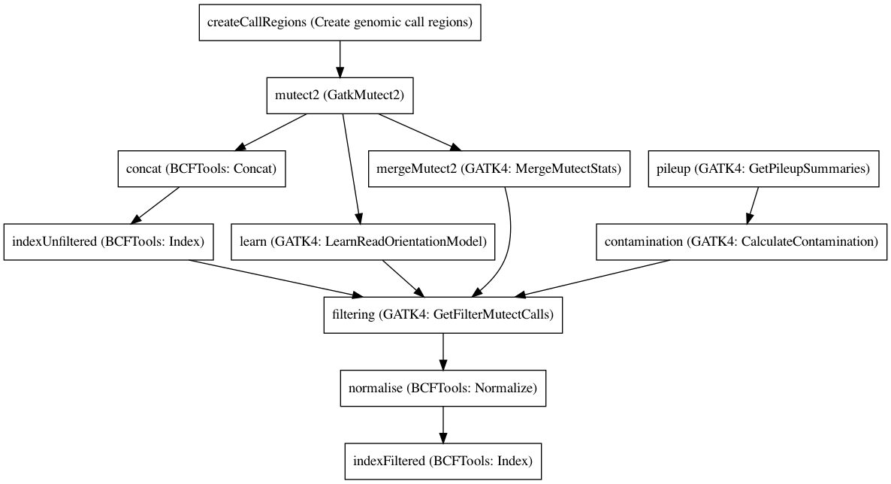

:orphan:

Mutect2 joint somatic variant calling workflow
============================================================================

``Mutect2JointSomaticWorkflow`` · *0 contributors · 1 version*

This workflow uses the capability of mutect2 to call several samples at the same time and improve recall and accuracy through a joint model.
        Most of these tools are still in a beta state and not intended for main production (as of 4.1.4.0)
        There are also som major tweaks we have to do for runtime, as the amount of data might overwhelm the tools otherwise.

Quickstart
-----------

    .. code-block:: python

       from janis_bioinformatics.tools.dawson.workflows.mutectjointsomaticworkflow import Mutect2JointSomaticWorkflow

       wf = WorkflowBuilder("myworkflow")

       wf.step(
           "mutect2jointsomaticworkflow_step",
           Mutect2JointSomaticWorkflow(
               normalBams=None,
               tumorBams=None,
               normalName=None,
               biallelicSites=None,
               reference=None,
               panelOfNormals=None,
               germlineResource=None,
           )
       )
       wf.output("out", source=mutect2jointsomaticworkflow_step.out)
    

*OR*

1. `Install Janis </tutorials/tutorial0.html>`_

2. Ensure Janis is configured to work with Docker or Singularity.

3. Ensure all reference files are available:

.. note:: 

   More information about these inputs are available `below <#additional-configuration-inputs>`_.

4. Generate user input files for Mutect2JointSomaticWorkflow:

.. code-block:: bash

   # user inputs
   janis inputs Mutect2JointSomaticWorkflow > inputs.yaml

**inputs.yaml**

.. code-block:: yaml

       biallelicSites: biallelicSites.vcf.gz
       germlineResource: germlineResource.vcf.gz
       normalBams:
       - normalBams_0.cram
       - normalBams_1.cram
       normalName: <value>
       panelOfNormals: panelOfNormals.vcf.gz
       reference: reference.fasta
       tumorBams:
       - tumorBams_0.cram
       - tumorBams_1.cram

5. Run Mutect2JointSomaticWorkflow with:

.. code-block:: bash

   janis run [...run options] \
       --inputs inputs.yaml \
       Mutect2JointSomaticWorkflow

Information
------------

URL: *No URL to the documentation was provided*

:ID: ``Mutect2JointSomaticWorkflow``
:URL: *No URL to the documentation was provided*
:Versions: 0.1
:Authors: 
:Citations: 
:Created: 2019-10-30
:Updated: 2019-10-30

Outputs
-----------

======  ====================  ===============
name    type                  documentation
======  ====================  ===============
out     CompressedIndexedVCF
======  ====================  ===============

Workflow
--------

Embedded Tools
***************

================================  ==========================================
Create genomic call regions       ``CreateCallRegions/v0.1.0``
GatkMutect2                       ``Gatk4Mutect2_cram/4.1.6.0``
BCFTools: Concat                  ``bcftoolsConcat/v1.9``
BCFTools: Index                   ``bcftoolsIndex/v1.9``
GATK4: LearnReadOrientationModel  ``Gatk4LearnReadOrientationModel/4.1.4.0``
GATK4: MergeMutectStats           ``Gatk4MergeMutectStats/4.1.4.0``
GATK4: GetPileupSummaries         ``Gatk4GetPileupSummaries_cram/4.1.6.0``
GATK4: CalculateContamination     ``Gatk4CalculateContamination/4.1.4.0``
GATK4: GetFilterMutectCalls       ``Gatk4FilterMutectCalls/4.1.3.0``
BCFTools: Normalize               ``bcftoolsNorm/v1.9``
================================  ==========================================

Additional configuration (inputs)
---------------------------------

==========================  ====================  ===============
name                        type                  documentation
==========================  ====================  ===============
normalBams                  Array<CramPair>
tumorBams                   Array<CramPair>
normalName                  String
biallelicSites              CompressedIndexedVCF
reference                   FastaWithIndexes
panelOfNormals              CompressedIndexedVCF
germlineResource            CompressedIndexedVCF
regionSize                  Optional<Integer>
createCallRegions_equalize  Optional<Boolean>
==========================  ====================  ===============

Workflow Description Language
------------------------------

.. code-block:: text

   version development

   import "tools/CreateCallRegions_v0_1_0.wdl" as C
   import "tools/Gatk4Mutect2_cram_4_1_6_0.wdl" as G
   import "tools/bcftoolsConcat_v1_9.wdl" as B
   import "tools/bcftoolsIndex_v1_9.wdl" as B2
   import "tools/Gatk4LearnReadOrientationModel_4_1_4_0.wdl" as G2
   import "tools/Gatk4MergeMutectStats_4_1_4_0.wdl" as G3
   import "tools/Gatk4GetPileupSummaries_cram_4_1_6_0.wdl" as G4
   import "tools/Gatk4CalculateContamination_4_1_4_0.wdl" as G5
   import "tools/Gatk4FilterMutectCalls_4_1_3_0.wdl" as G6
   import "tools/bcftoolsNorm_v1_9.wdl" as B3

   workflow Mutect2JointSomaticWorkflow {
     input {
       Array[File] normalBams
       Array[File] normalBams_crai
       Array[File] tumorBams
       Array[File] tumorBams_crai
       String normalName
       File biallelicSites
       File biallelicSites_tbi
       File reference
       File reference_fai
       File reference_amb
       File reference_ann
       File reference_bwt
       File reference_pac
       File reference_sa
       File reference_dict
       Int? regionSize = 10000000
       File panelOfNormals
       File panelOfNormals_tbi
       File germlineResource
       File germlineResource_tbi
       Boolean? createCallRegions_equalize = true
     }
     call C.CreateCallRegions as createCallRegions {
       input:
         reference=reference,
         reference_fai=reference_fai,
         regionSize=select_first([regionSize, 10000000]),
         equalize=select_first([createCallRegions_equalize, true])
     }
     scatter (c in createCallRegions.regions) {
        call G.Gatk4Mutect2_cram as mutect2 {
         input:
           tumorBams=tumorBams,
           tumorBams_crai=tumorBams_crai,
           normalBams=normalBams,
           normalBams_crai=normalBams_crai,
           normalSample=normalName,
           reference=reference,
           reference_fai=reference_fai,
           reference_amb=reference_amb,
           reference_ann=reference_ann,
           reference_bwt=reference_bwt,
           reference_pac=reference_pac,
           reference_sa=reference_sa,
           reference_dict=reference_dict,
           germlineResource=germlineResource,
           germlineResource_tbi=germlineResource_tbi,
           intervals=c,
           panelOfNormals=panelOfNormals,
           panelOfNormals_tbi=panelOfNormals_tbi
       }
     }
     call B.bcftoolsConcat as concat {
       input:
         vcf=mutect2.out
     }
     call B2.bcftoolsIndex as indexUnfiltered {
       input:
         vcf=concat.out
     }
     call G2.Gatk4LearnReadOrientationModel as learn {
       input:
         f1r2CountsFiles=mutect2.f1f2r_out
     }
     call G3.Gatk4MergeMutectStats as mergeMutect2 {
       input:
         statsFiles=mutect2.stats
     }
     call G4.Gatk4GetPileupSummaries_cram as pileup {
       input:
         bam=tumorBams,
         bam_crai=tumorBams_crai,
         sites=biallelicSites,
         sites_tbi=biallelicSites_tbi,
         intervals=biallelicSites,
         reference=reference,
         reference_fai=reference_fai,
         reference_amb=reference_amb,
         reference_ann=reference_ann,
         reference_bwt=reference_bwt,
         reference_pac=reference_pac,
         reference_sa=reference_sa,
         reference_dict=reference_dict
     }
     call G5.Gatk4CalculateContamination as contamination {
       input:
         pileupTable=pileup.out
     }
     call G6.Gatk4FilterMutectCalls as filtering {
       input:
         contaminationTable=contamination.contOut,
         segmentationFile=contamination.segOut,
         statsFile=mergeMutect2.out,
         readOrientationModel=learn.out,
         vcf=indexUnfiltered.out,
         vcf_tbi=indexUnfiltered.out_tbi,
         reference=reference,
         reference_fai=reference_fai,
         reference_amb=reference_amb,
         reference_ann=reference_ann,
         reference_bwt=reference_bwt,
         reference_pac=reference_pac,
         reference_sa=reference_sa,
         reference_dict=reference_dict
     }
     call B3.bcftoolsNorm as normalise {
       input:
         vcf=filtering.out,
         reference=reference,
         reference_fai=reference_fai
     }
     call B2.bcftoolsIndex as indexFiltered {
       input:
         vcf=normalise.out
     }
     output {
       File out = indexFiltered.out
       File out_tbi = indexFiltered.out_tbi
     }
   }

Common Workflow Language
-------------------------

.. code-block:: text

   #!/usr/bin/env cwl-runner
   class: Workflow
   cwlVersion: v1.0
   label: Mutect2 joint somatic variant calling workflow
   doc: |-
     This workflow uses the capability of mutect2 to call several samples at the same time and improve recall and accuracy through a joint model.
             Most of these tools are still in a beta state and not intended for main production (as of 4.1.4.0)
             There are also som major tweaks we have to do for runtime, as the amount of data might overwhelm the tools otherwise.

   requirements:
   - class: InlineJavascriptRequirement
   - class: StepInputExpressionRequirement
   - class: ScatterFeatureRequirement

   inputs:
   - id: normalBams
     type:
       type: array
       items: File
     secondaryFiles:
     - .crai
   - id: tumorBams
     type:
       type: array
       items: File
     secondaryFiles:
     - .crai
   - id: normalName
     type: string
   - id: biallelicSites
     type: File
     secondaryFiles:
     - .tbi
   - id: reference
     type: File
     secondaryFiles:
     - .fai
     - .amb
     - .ann
     - .bwt
     - .pac
     - .sa
     - ^.dict
   - id: regionSize
     type: int
     default: 10000000
   - id: panelOfNormals
     type: File
     secondaryFiles:
     - .tbi
   - id: germlineResource
     type: File
     secondaryFiles:
     - .tbi
   - id: createCallRegions_equalize
     type: boolean
     default: true

   outputs:
   - id: out
     type: File
     secondaryFiles:
     - .tbi
     outputSource: indexFiltered/out

   steps:
   - id: createCallRegions
     label: Create genomic call regions
     in:
     - id: reference
       source: reference
     - id: regionSize
       source: regionSize
     - id: equalize
       source: createCallRegions_equalize
     run: tools/CreateCallRegions_v0_1_0.cwl
     out:
     - id: regions
   - id: mutect2
     label: GatkMutect2
     in:
     - id: tumorBams
       source: tumorBams
     - id: normalBams
       source: normalBams
     - id: normalSample
       source: normalName
     - id: reference
       source: reference
     - id: germlineResource
       source: germlineResource
     - id: intervals
       source: createCallRegions/regions
     - id: panelOfNormals
       source: panelOfNormals
     scatter:
     - intervals
     run: tools/Gatk4Mutect2_cram_4_1_6_0.cwl
     out:
     - id: out
     - id: stats
     - id: f1f2r_out
     - id: bam
   - id: concat
     label: 'BCFTools: Concat'
     in:
     - id: vcf
       source: mutect2/out
     run: tools/bcftoolsConcat_v1_9.cwl
     out:
     - id: out
   - id: indexUnfiltered
     label: 'BCFTools: Index'
     in:
     - id: vcf
       source: concat/out
     run: tools/bcftoolsIndex_v1_9.cwl
     out:
     - id: out
   - id: learn
     label: 'GATK4: LearnReadOrientationModel'
     in:
     - id: f1r2CountsFiles
       source: mutect2/f1f2r_out
     run: tools/Gatk4LearnReadOrientationModel_4_1_4_0.cwl
     out:
     - id: out
   - id: mergeMutect2
     label: 'GATK4: MergeMutectStats'
     in:
     - id: statsFiles
       source: mutect2/stats
     run: tools/Gatk4MergeMutectStats_4_1_4_0.cwl
     out:
     - id: out
   - id: pileup
     label: 'GATK4: GetPileupSummaries'
     in:
     - id: bam
       source: tumorBams
     - id: sites
       source: biallelicSites
     - id: intervals
       source: biallelicSites
     - id: reference
       source: reference
     run: tools/Gatk4GetPileupSummaries_cram_4_1_6_0.cwl
     out:
     - id: out
   - id: contamination
     label: 'GATK4: CalculateContamination'
     in:
     - id: pileupTable
       source: pileup/out
     run: tools/Gatk4CalculateContamination_4_1_4_0.cwl
     out:
     - id: contOut
     - id: segOut
   - id: filtering
     label: 'GATK4: GetFilterMutectCalls'
     in:
     - id: contaminationTable
       source: contamination/contOut
     - id: segmentationFile
       source: contamination/segOut
     - id: statsFile
       source: mergeMutect2/out
     - id: readOrientationModel
       source: learn/out
     - id: vcf
       source: indexUnfiltered/out
     - id: reference
       source: reference
     run: tools/Gatk4FilterMutectCalls_4_1_3_0.cwl
     out:
     - id: out
   - id: normalise
     label: 'BCFTools: Normalize'
     in:
     - id: vcf
       source: filtering/out
     - id: reference
       source: reference
     run: tools/bcftoolsNorm_v1_9.cwl
     out:
     - id: out
   - id: indexFiltered
     label: 'BCFTools: Index'
     in:
     - id: vcf
       source: normalise/out
     run: tools/bcftoolsIndex_v1_9.cwl
     out:
     - id: out
   id: Mutect2JointSomaticWorkflow

