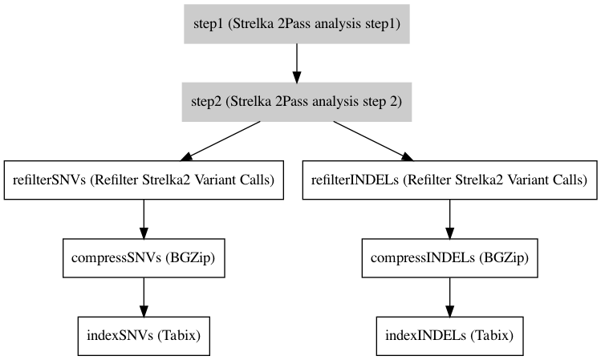

:orphan:

Strelka 2Pass analysis
=============================================

``Strelka2PassWorkflow`` · *1 contributor · 1 version*

This is the full 2pass analysis workflow to do joint somatic variant calling with strelka2.
        The idea is similar to the RNASeq 2pass analysis, when the input of the first analysis is used to guide the second analysis.

        The workflow will
         * run manta
         * run strelka with manata output
         * run strelka with strelka and manta output
         * reannotate the filter column
         * output resuults

Quickstart
-----------

    .. code-block:: python

       from janis_bioinformatics.tools.dawson.workflows.variantcalling.multisample.strelka2.strelka2passworkflow import Strelka2PassWorkflow

       wf = WorkflowBuilder("myworkflow")

       wf.step(
           "strelka2passworkflow_step",
           Strelka2PassWorkflow(
               normalBam=None,
               tumorBams=None,
               reference=None,
           )
       )
       wf.output("snvs", source=strelka2passworkflow_step.snvs)
       wf.output("indels", source=strelka2passworkflow_step.indels)
       wf.output("svs", source=strelka2passworkflow_step.svs)
    

*OR*

1. `Install Janis </tutorials/tutorial0.html>`_

2. Ensure Janis is configured to work with Docker or Singularity.

3. Ensure all reference files are available:

.. note:: 

   More information about these inputs are available `below <#additional-configuration-inputs>`_.

4. Generate user input files for Strelka2PassWorkflow:

.. code-block:: bash

   # user inputs
   janis inputs Strelka2PassWorkflow > inputs.yaml

**inputs.yaml**

.. code-block:: yaml

       normalBam: normalBam.bam
       reference: reference.fasta
       tumorBams:
       - tumorBams_0.bam
       - tumorBams_1.bam

5. Run Strelka2PassWorkflow with:

.. code-block:: bash

   janis run [...run options] \
       --inputs inputs.yaml \
       Strelka2PassWorkflow

Information
------------

URL: *No URL to the documentation was provided*

:ID: ``Strelka2PassWorkflow``
:URL: *No URL to the documentation was provided*
:Versions: 0.2
:Authors: Sebastian Hollizeck
:Citations: 
:Created: 2019-10-11
:Updated: 2020-12-10

Outputs
-----------

======  =============================  ===============
name    type                           documentation
======  =============================  ===============
snvs    Array<Gzipped<VCF>>
indels  Array<Gzipped<VCF>>
svs     Array<Optional<Gzipped<VCF>>>
======  =============================  ===============

Workflow
--------

Embedded Tools
***************

===============================  ===================================
Strelka 2Pass analysis step1     ``Strelka2PassWorkflowStep1/0.1.1``
Strelka 2Pass analysis step 2    ``Strelka2PassWorkflowStep2/0.1.1``
Refilter Strelka2 Variant Calls  ``refilterStrelka2Calls/0.1.8``
BGZip                            ``bgzip/1.2.1``
Tabix                            ``tabix/1.2.1``
===============================  ===================================

Additional configuration (inputs)
---------------------------------

=============  =======================  =====================================================================================================================================================================
name           type                     documentation
=============  =======================  =====================================================================================================================================================================
normalBam      IndexedBam               The bam of the normal sample. Strelka will assign any read in this bam to the normal sample, even if this bam contains multiple samples
tumorBams      Array<IndexedBam>        The bam of the tumour sample. Strelka will assign any read in this bam to the normal sample, even if this bam contains multiple samples
reference      FastaFai                 The fai indexed fasta reference, the bams were aligned to.
configStrelka  Optional<File>           The possibly changed ini to use for Strelka2. This can be used to skip regions with extreme depth, like in heterochromatin regions, which lead to very long runtimes.
callRegions    Optional<Gzipped<bed>>   The tabix indexed bed file of regions to restict the analysis on. If this is unset, every site in the genome will be analysed.
exome          Optional<Boolean>        Sets the flag to analyse everything in exome mode. This will adjust the parameter for a non uniform coverage profile.
sampleNames    Optional<Array<String>>  The names of the tumour samples. This will only be used to rename output files. if unset, the output will be numbered in the same order as the input files.
minAD          Optional<Integer>        Minimum read support for a variant to be considered a true variant.
=============  =======================  =====================================================================================================================================================================

Workflow Description Language
------------------------------

.. code-block:: text

   version development

   import "tools/Strelka2PassWorkflowStep1_0_1_1.wdl" as S
   import "tools/Strelka2PassWorkflowStep2_0_1_1.wdl" as S2
   import "tools/refilterStrelka2Calls_0_1_8.wdl" as R
   import "tools/bgzip_1_2_1.wdl" as B
   import "tools/tabix_1_2_1.wdl" as T

   workflow Strelka2PassWorkflow {
     input {
       File normalBam
       File normalBam_bai
       Array[File] tumorBams
       Array[File] tumorBams_bai
       File reference
       File reference_fai
       File? configStrelka
       File? callRegions
       File? callRegions_tbi
       Boolean? exome = false
       Array[String]? sampleNames
       Int? minAD = 2
     }
     scatter (t in transpose([tumorBams, tumorBams_bai])) {
        call S.Strelka2PassWorkflowStep1 as step1 {
         input:
           normalBam=normalBam,
           normalBam_bai=normalBam_bai,
           tumorBam=t[0],
           tumorBam_bai=t[1],
           reference=reference,
           reference_fai=reference_fai,
           callRegions=callRegions,
           callRegions_tbi=callRegions_tbi,
           exome=select_first([exome, false]),
           configStrelka=configStrelka
       }
     }
     scatter (t in transpose([tumorBams, tumorBams_bai])) {
        call S2.Strelka2PassWorkflowStep2 as step2 {
         input:
           normalBam=normalBam,
           normalBam_bai=normalBam_bai,
           tumorBam=t[0],
           tumorBam_bai=t[1],
           reference=reference,
           reference_fai=reference_fai,
           callRegions=callRegions,
           callRegions_tbi=callRegions_tbi,
           exome=select_first([exome, false]),
           configStrelka=configStrelka,
           indelCandidates=step1.candIndels,
           indelCandidates_tbi=step1.candIndels_tbi,
           strelkaSNVs=step1.snvs,
           strelkaSNVs_tbi=step1.snvs_tbi
       }
     }
     call R.refilterStrelka2Calls as refilterSNVs {
       input:
         inputFiles=step2.snvs,
         inputFiles_tbi=step2.snvs_tbi,
         minAD=select_first([minAD, 2]),
         sampleNames=sampleNames
     }
     scatter (r in refilterSNVs.out) {
        call B.bgzip as compressSNVs {
         input:
           file=r
       }
     }
     scatter (c in compressSNVs.out) {
        call T.tabix as indexSNVs {
         input:
           inp=c
       }
     }
     call R.refilterStrelka2Calls as refilterINDELs {
       input:
         inputFiles=step2.indels,
         inputFiles_tbi=step2.indels_tbi,
         minAD=select_first([minAD, 2]),
         sampleNames=sampleNames
     }
     scatter (r in refilterINDELs.out) {
        call B.bgzip as compressINDELs {
         input:
           file=r
       }
     }
     scatter (c in compressINDELs.out) {
        call T.tabix as indexINDELs {
         input:
           inp=c
       }
     }
     output {
       Array[File] snvs = indexSNVs.out
       Array[File] snvs_tbi = indexSNVs.out_tbi
       Array[File] indels = indexINDELs.out
       Array[File] indels_tbi = indexINDELs.out_tbi
       Array[File?] svs = step1.somaticSVs
       Array[File?] svs_tbi = step1.somaticSVs_tbi
     }
   }

Common Workflow Language
-------------------------

.. code-block:: text

   #!/usr/bin/env cwl-runner
   class: Workflow
   cwlVersion: v1.2
   label: Strelka 2Pass analysis
   doc: |-
     This is the full 2pass analysis workflow to do joint somatic variant calling with strelka2.
             The idea is similar to the RNASeq 2pass analysis, when the input of the first analysis is used to guide the second analysis.

             The workflow will
              * run manta
              * run strelka with manata output
              * run strelka with strelka and manta output
              * reannotate the filter column
              * output resuults

   requirements:
   - class: InlineJavascriptRequirement
   - class: StepInputExpressionRequirement
   - class: ScatterFeatureRequirement
   - class: SubworkflowFeatureRequirement

   inputs:
   - id: normalBam
     doc: |-
       The bam of the normal sample. Strelka will assign any read in this bam to the normal sample, even if this bam contains multiple samples
     type: File
     secondaryFiles:
     - pattern: .bai
   - id: tumorBams
     doc: |-
       The bam of the tumour sample. Strelka will assign any read in this bam to the normal sample, even if this bam contains multiple samples
     type:
       type: array
       items: File
     secondaryFiles:
     - pattern: .bai
   - id: reference
     doc: The fai indexed fasta reference, the bams were aligned to.
     type: File
     secondaryFiles:
     - pattern: .fai
   - id: configStrelka
     doc: |-
       The possibly changed ini to use for Strelka2. This can be used to skip regions with extreme depth, like in heterochromatin regions, which lead to very long runtimes.
     type:
     - File
     - 'null'
   - id: callRegions
     doc: |-
       The tabix indexed bed file of regions to restict the analysis on. If this is unset, every site in the genome will be analysed.
     type:
     - File
     - 'null'
     secondaryFiles:
     - pattern: .tbi
   - id: exome
     doc: |-
       Sets the flag to analyse everything in exome mode. This will adjust the parameter for a non uniform coverage profile.
     type: boolean
     default: false
   - id: sampleNames
     doc: |-
       The names of the tumour samples. This will only be used to rename output files. if unset, the output will be numbered in the same order as the input files.
     type:
     - type: array
       items: string
     - 'null'
   - id: minAD
     doc: Minimum read support for a variant to be considered a true variant.
     type: int
     default: 2

   outputs:
   - id: snvs
     type:
       type: array
       items: File
     outputSource: indexSNVs/out
   - id: indels
     type:
       type: array
       items: File
     outputSource: indexINDELs/out
   - id: svs
     type:
       type: array
       items:
       - File
       - 'null'
     outputSource: step1/somaticSVs

   steps:
   - id: step1
     label: Strelka 2Pass analysis step1
     in:
     - id: normalBam
       source: normalBam
     - id: tumorBam
       source: tumorBams
     - id: reference
       source: reference
     - id: callRegions
       source: callRegions
     - id: exome
       source: exome
     - id: configStrelka
       source: configStrelka
     scatter:
     - tumorBam
     run: tools/Strelka2PassWorkflowStep1_0_1_1.cwl
     out:
     - id: diploid
     - id: candIndels
     - id: indels
     - id: snvs
     - id: somaticSVs
   - id: step2
     label: Strelka 2Pass analysis step 2
     in:
     - id: normalBam
       source: normalBam
     - id: tumorBam
       source: tumorBams
     - id: reference
       source: reference
     - id: callRegions
       source: callRegions
     - id: exome
       source: exome
     - id: configStrelka
       source: configStrelka
     - id: indelCandidates
       source: step1/candIndels
     - id: strelkaSNVs
       source: step1/snvs
     scatter:
     - tumorBam
     run: tools/Strelka2PassWorkflowStep2_0_1_1.cwl
     out:
     - id: indels
     - id: snvs
   - id: refilterSNVs
     label: Refilter Strelka2 Variant Calls
     in:
     - id: inputFiles
       source: step2/snvs
     - id: minAD
       source: minAD
     - id: sampleNames
       source: sampleNames
     run: tools/refilterStrelka2Calls_0_1_8.cwl
     out:
     - id: out
   - id: compressSNVs
     label: BGZip
     in:
     - id: file
       source: refilterSNVs/out
     scatter:
     - file
     run: tools/bgzip_1_2_1.cwl
     out:
     - id: out
   - id: indexSNVs
     label: Tabix
     in:
     - id: inp
       source: compressSNVs/out
     scatter:
     - inp
     run: tools/tabix_1_2_1.cwl
     out:
     - id: out
   - id: refilterINDELs
     label: Refilter Strelka2 Variant Calls
     in:
     - id: inputFiles
       source: step2/indels
     - id: minAD
       source: minAD
     - id: sampleNames
       source: sampleNames
     run: tools/refilterStrelka2Calls_0_1_8.cwl
     out:
     - id: out
   - id: compressINDELs
     label: BGZip
     in:
     - id: file
       source: refilterINDELs/out
     scatter:
     - file
     run: tools/bgzip_1_2_1.cwl
     out:
     - id: out
   - id: indexINDELs
     label: Tabix
     in:
     - id: inp
       source: compressINDELs/out
     scatter:
     - inp
     run: tools/tabix_1_2_1.cwl
     out:
     - id: out
   id: Strelka2PassWorkflow

