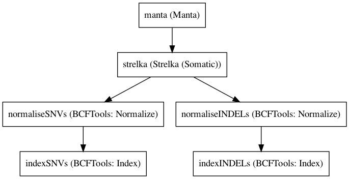

:orphan:

Strelka 2Pass analysis step1
========================================================

``Strelka2PassWorkflowStep1`` · *1 contributor · 1 version*

This is the first step for joint somatic variant calling
        based on a 2pass analysis common in RNASeq.

        It runs manta and strelka on the bams as is best practice
        for somatic variant calling with strelka2

        It also normalises and indexes the output vcfs

Quickstart
-----------

    .. code-block:: python

       from janis_bioinformatics.tools.dawson.workflows.strelka2passanalysisstep1 import Strelka2PassWorkflowStep1

       wf = WorkflowBuilder("myworkflow")

       wf.step(
           "strelka2passworkflowstep1_step",
           Strelka2PassWorkflowStep1(
               normalBam=None,
               tumorBam=None,
               reference=None,
           )
       )
       wf.output("diploid", source=strelka2passworkflowstep1_step.diploid)
       wf.output("candIndels", source=strelka2passworkflowstep1_step.candIndels)
       wf.output("indels", source=strelka2passworkflowstep1_step.indels)
       wf.output("snvs", source=strelka2passworkflowstep1_step.snvs)
       wf.output("somaticSVs", source=strelka2passworkflowstep1_step.somaticSVs)
    

*OR*

1. `Install Janis </tutorials/tutorial0.html>`_

2. Ensure Janis is configured to work with Docker or Singularity.

3. Ensure all reference files are available:

.. note:: 

   More information about these inputs are available `below <#additional-configuration-inputs>`_.

4. Generate user input files for Strelka2PassWorkflowStep1:

.. code-block:: bash

   # user inputs
   janis inputs Strelka2PassWorkflowStep1 > inputs.yaml

**inputs.yaml**

.. code-block:: yaml

       normalBam: normalBam.cram
       reference: reference.fasta
       tumorBam: tumorBam.cram

5. Run Strelka2PassWorkflowStep1 with:

.. code-block:: bash

   janis run [...run options] \
       --inputs inputs.yaml \
       Strelka2PassWorkflowStep1

Information
------------

URL: *No URL to the documentation was provided*

:ID: ``Strelka2PassWorkflowStep1``
:URL: *No URL to the documentation was provided*
:Versions: 0.1
:Authors: Sebastian Hollizeck
:Citations: 
:Created: 2019-10-11
:Updated: 2020-08-04

Outputs
-----------

==========  ==============================  ===============
name        type                            documentation
==========  ==============================  ===============
diploid     CompressedIndexedVCF
candIndels  CompressedIndexedVCF
indels      CompressedIndexedVCF
snvs        CompressedIndexedVCF
somaticSVs  Optional<CompressedIndexedVCF>
==========  ==============================  ===============

Workflow
--------

Embedded Tools
***************

===================  ===============================
Manta                ``manta_cram/1.5.0``
Strelka (Somatic)    ``strelka_somatic_cram/2.9.10``
BCFTools: Normalize  ``bcftoolsNorm/v1.9``
BCFTools: Index      ``bcftoolsIndex/v1.9``
===================  ===============================

Additional configuration (inputs)
---------------------------------

=============  ==================  ===============
name           type                documentation
=============  ==================  ===============
normalBam      CramPair
tumorBam       CramPair
reference      FastaFai
callRegions    Optional<BedTABIX>
exome          Optional<Boolean>
configStrelka  Optional<File>
=============  ==================  ===============

Workflow Description Language
------------------------------

.. code-block:: text

   version development

   import "tools/manta_cram_1_5_0.wdl" as M
   import "tools/strelka_somatic_cram_2_9_10.wdl" as S
   import "tools/bcftoolsNorm_v1_9.wdl" as B
   import "tools/bcftoolsIndex_v1_9.wdl" as B2

   workflow Strelka2PassWorkflowStep1 {
     input {
       File normalBam
       File normalBam_crai
       File tumorBam
       File tumorBam_crai
       File reference
       File reference_fai
       File? callRegions
       File? callRegions_tbi
       Boolean? exome = false
       File? configStrelka
     }
     call M.manta_cram as manta {
       input:
         bam=normalBam,
         bam_crai=normalBam_crai,
         reference=reference,
         reference_fai=reference_fai,
         tumorBam=tumorBam,
         tumorBam_crai=tumorBam_crai,
         exome=select_first([exome, false]),
         callRegions=callRegions,
         callRegions_tbi=callRegions_tbi
     }
     call S.strelka_somatic_cram as strelka {
       input:
         normalBam=normalBam,
         normalBam_crai=normalBam_crai,
         tumorBam=tumorBam,
         tumorBam_crai=tumorBam_crai,
         reference=reference,
         reference_fai=reference_fai,
         config=configStrelka,
         indelCandidates=[manta.candidateSmallIndels],
         indelCandidates_tbi=[manta.candidateSmallIndels_tbi],
         exome=select_first([exome, false]),
         callRegions=callRegions,
         callRegions_tbi=callRegions_tbi
     }
     call B.bcftoolsNorm as normaliseSNVs {
       input:
         vcf=strelka.snvs,
         reference=reference,
         reference_fai=reference_fai
     }
     call B2.bcftoolsIndex as indexSNVs {
       input:
         vcf=normaliseSNVs.out
     }
     call B.bcftoolsNorm as normaliseINDELs {
       input:
         vcf=strelka.indels,
         reference=reference,
         reference_fai=reference_fai
     }
     call B2.bcftoolsIndex as indexINDELs {
       input:
         vcf=normaliseINDELs.out
     }
     output {
       File diploid = manta.diploidSV
       File diploid_tbi = manta.diploidSV_tbi
       File candIndels = manta.candidateSmallIndels
       File candIndels_tbi = manta.candidateSmallIndels_tbi
       File indels = indexINDELs.out
       File indels_tbi = indexINDELs.out_tbi
       File snvs = indexSNVs.out
       File snvs_tbi = indexSNVs.out_tbi
       File? somaticSVs = manta.somaticSVs
       File? somaticSVs_tbi = manta.somaticSVs_tbi
     }
   }

Common Workflow Language
-------------------------

.. code-block:: text

   #!/usr/bin/env cwl-runner
   class: Workflow
   cwlVersion: v1.0
   label: Strelka 2Pass analysis step1
   doc: |-
     This is the first step for joint somatic variant calling
             based on a 2pass analysis common in RNASeq.

             It runs manta and strelka on the bams as is best practice
             for somatic variant calling with strelka2

             It also normalises and indexes the output vcfs

   requirements:
   - class: InlineJavascriptRequirement
   - class: StepInputExpressionRequirement
   - class: MultipleInputFeatureRequirement

   inputs:
   - id: normalBam
     type: File
     secondaryFiles:
     - .crai
   - id: tumorBam
     type: File
     secondaryFiles:
     - .crai
   - id: reference
     type: File
     secondaryFiles:
     - .fai
   - id: callRegions
     type:
     - File
     - 'null'
     secondaryFiles:
     - .tbi
   - id: exome
     type: boolean
     default: false
   - id: configStrelka
     type:
     - File
     - 'null'

   outputs:
   - id: diploid
     type: File
     secondaryFiles:
     - .tbi
     outputSource: manta/diploidSV
   - id: candIndels
     type: File
     secondaryFiles:
     - .tbi
     outputSource: manta/candidateSmallIndels
   - id: indels
     type: File
     secondaryFiles:
     - .tbi
     outputSource: indexINDELs/out
   - id: snvs
     type: File
     secondaryFiles:
     - .tbi
     outputSource: indexSNVs/out
   - id: somaticSVs
     type:
     - File
     - 'null'
     secondaryFiles:
     - .tbi
     outputSource: manta/somaticSVs

   steps:
   - id: manta
     label: Manta
     in:
     - id: bam
       source: normalBam
     - id: reference
       source: reference
     - id: tumorBam
       source: tumorBam
     - id: exome
       source: exome
     - id: callRegions
       source: callRegions
     run: tools/manta_cram_1_5_0.cwl
     out:
     - id: python
     - id: pickle
     - id: candidateSV
     - id: candidateSmallIndels
     - id: diploidSV
     - id: alignmentStatsSummary
     - id: svCandidateGenerationStats
     - id: svLocusGraphStats
     - id: somaticSVs
   - id: strelka
     label: Strelka (Somatic)
     in:
     - id: normalBam
       source: normalBam
     - id: tumorBam
       source: tumorBam
     - id: reference
       source: reference
     - id: config
       source: configStrelka
     - id: indelCandidates
       source:
       - manta/candidateSmallIndels
       linkMerge: merge_nested
     - id: exome
       source: exome
     - id: callRegions
       source: callRegions
     run: tools/strelka_somatic_cram_2_9_10.cwl
     out:
     - id: configPickle
     - id: script
     - id: stats
     - id: indels
     - id: snvs
   - id: normaliseSNVs
     label: 'BCFTools: Normalize'
     in:
     - id: vcf
       source: strelka/snvs
     - id: reference
       source: reference
     run: tools/bcftoolsNorm_v1_9.cwl
     out:
     - id: out
   - id: indexSNVs
     label: 'BCFTools: Index'
     in:
     - id: vcf
       source: normaliseSNVs/out
     run: tools/bcftoolsIndex_v1_9.cwl
     out:
     - id: out
   - id: normaliseINDELs
     label: 'BCFTools: Normalize'
     in:
     - id: vcf
       source: strelka/indels
     - id: reference
       source: reference
     run: tools/bcftoolsNorm_v1_9.cwl
     out:
     - id: out
   - id: indexINDELs
     label: 'BCFTools: Index'
     in:
     - id: vcf
       source: normaliseINDELs/out
     run: tools/bcftoolsIndex_v1_9.cwl
     out:
     - id: out
   id: Strelka2PassWorkflowStep1

