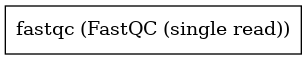

:orphan:

FastQC (Single, Scattered)
====================================================

``fastqc_single_scattered`` · *1 contributor · 1 version*

FastQC doesn't return a Directory unless it's the single variant, but Janis will make
you double scatter if you're processing an array of array of fastqs.

Note, this is bound to the LATEST version of FastQC: 'v0.11.8'
    

Quickstart
-----------

    .. code-block:: python

       from janis_bioinformatics.tools.babrahambioinformatics.fastqc.versions import FastqcSingleScattered

       wf = WorkflowBuilder("myworkflow")

       wf.step(
           "fastqc_single_scattered_step",
           FastqcSingleScattered(
               reads=None,
           )
       )
       wf.output("out", source=fastqc_single_scattered_step.out)
       wf.output("out_datafile", source=fastqc_single_scattered_step.out_datafile)
       wf.output("out_html", source=fastqc_single_scattered_step.out_html)
       wf.output("out_directory", source=fastqc_single_scattered_step.out_directory)
    

*OR*

1. `Install Janis </tutorials/tutorial0.html>`_

2. Ensure Janis is configured to work with Docker or Singularity.

3. Ensure all reference files are available:

.. note:: 

   More information about these inputs are available `below <#additional-configuration-inputs>`_.

4. Generate user input files for fastqc_single_scattered:

.. code-block:: bash

   # user inputs
   janis inputs fastqc_single_scattered > inputs.yaml

**inputs.yaml**

.. code-block:: yaml

       reads:
       - reads_0.fastq.gz
       - reads_1.fastq.gz

5. Run fastqc_single_scattered with:

.. code-block:: bash

   janis run [...run options] \
       --inputs inputs.yaml \
       fastqc_single_scattered

Information
------------

URL: *No URL to the documentation was provided*

:ID: ``fastqc_single_scattered``
:URL: *No URL to the documentation was provided*
:Versions: v0.11.8
:Authors: Michael Franklin
:Citations: 
:Created: 2020-07-30
:Updated: None

Outputs
-----------

=============  ================  ===============
name           type              documentation
=============  ================  ===============
out            Array<Zip>
out_datafile   Array<File>
out_html       Array<HtmlFile>
out_directory  Array<Directory>
=============  ================  ===============

Workflow
--------

Embedded Tools
***************

====================  =========================
FastQC (single read)  ``fastqc_single/v0.11.8``
====================  =========================

Additional configuration (inputs)
---------------------------------

============  =================  =========================================================================================================================================================================================================================================================================================================================================
name          type               documentation
============  =================  =========================================================================================================================================================================================================================================================================================================================================
reads         Array<FastqGz>
nano          Optional<Boolean>  Files come from naopore sequences and are in fast5 format. In this mode you can pass in directories to process and the program will take in all fast5 files within those directories and produce a single output file from the sequences found in all files.
nofilter      Optional<Boolean>  If running with --casava then don't remove read flagged by casava as poor quality when performing the QC analysis.
noextract     Optional<Boolean>  Do not uncompress the output file after creating it.  You should set this option if you donot wish to uncompress the output when running in non-interactive mode.
nogroup       Optional<Boolean>  Disable grouping of bases for reads >50bp. All reports will show data for every base in the read. WARNING: Using this option will cause fastqc to crash and burn if you use it on really long reads, and your plots may end up a ridiculous size. You have been warned!
format        Optional<String>   (-f) Bypasses the normal sequence file format detection and forces the program to use the specified format.  Valid formats are bam,sam,bam_mapped,sam_mapped and fastq
contaminants  Optional<File>     (-c) Specifies a non-default file which contains the list of contaminants to screen overrepresented sequences against. The file must contain sets of named contaminants in the form name[tab]sequence.  Lines prefixed with a hash will be ignored.
adapters      Optional<File>     (-a) Specifies a non-default file which contains the list of adapter sequences which will be explicity searched against the library. The file must contain sets of named adapters in the form name[tab]sequence. Lines prefixed with a hash will be ignored.
limits        Optional<File>     (-l) Specifies a non-default file which contains a set of criteria which will be used to determine the warn/error limits for the various modules.  This file can also be used to selectively  remove some modules from the output all together. The format needs to mirror the default limits.txt file found in the Configuration folder.
kmers         Optional<Integer>  (-k) Specifies the length of Kmer to look for in the Kmer content module. Specified Kmer length must be between 2 and 10. Default length is 7 if not specified.
============  =================  =========================================================================================================================================================================================================================================================================================================================================

Workflow Description Language
------------------------------

.. code-block:: text

   version development

   import "tools/fastqc_single_v0_11_8.wdl" as F

   workflow fastqc_single_scattered {
     input {
       Array[File] reads
       Boolean? nano
       Boolean? nofilter
       Boolean? noextract
       Boolean? nogroup
       String? format
       File? contaminants
       File? adapters
       File? limits
       Int? kmers
     }
     scatter (r in reads) {
        call F.fastqc_single as fastqc {
         input:
           read=r,
           nano=nano,
           nofilter=nofilter,
           noextract=noextract,
           nogroup=nogroup,
           format=format,
           contaminants=contaminants,
           adapters=adapters,
           limits=limits,
           kmers=kmers
       }
     }
     output {
       Array[File] out = fastqc.out
       Array[File] out_datafile = fastqc.out_datafile
       Array[File] out_html = fastqc.out_html
       Array[Directory] out_directory = fastqc.out_directory
     }
   }

Common Workflow Language
-------------------------

.. code-block:: text

   #!/usr/bin/env cwl-runner
   class: Workflow
   cwlVersion: v1.2
   label: FastQC (Single, Scattered)
   doc: |2-

     FastQC doesn't return a Directory unless it's the single variant, but Janis will make
     you double scatter if you're processing an array of array of fastqs.

     Note, this is bound to the LATEST version of FastQC: 'v0.11.8'
      

   requirements:
   - class: InlineJavascriptRequirement
   - class: StepInputExpressionRequirement
   - class: ScatterFeatureRequirement

   inputs:
   - id: reads
     type:
       type: array
       items: File
   - id: nano
     doc: |-
       Files come from naopore sequences and are in fast5 format. In this mode you can pass in directories to process and the program will take in all fast5 files within those directories and produce a single output file from the sequences found in all files.
     type:
     - boolean
     - 'null'
   - id: nofilter
     doc: |-
       If running with --casava then don't remove read flagged by casava as poor quality when performing the QC analysis.
     type:
     - boolean
     - 'null'
   - id: noextract
     doc: |-
       Do not uncompress the output file after creating it.  You should set this option if you donot wish to uncompress the output when running in non-interactive mode. 
     type:
     - boolean
     - 'null'
   - id: nogroup
     doc: |-
       Disable grouping of bases for reads >50bp. All reports will show data for every base in the read. WARNING: Using this option will cause fastqc to crash and burn if you use it on really long reads, and your plots may end up a ridiculous size. You have been warned! 
     type:
     - boolean
     - 'null'
   - id: format
     doc: |-
       (-f) Bypasses the normal sequence file format detection and forces the program to use the specified format.  Valid formats are bam,sam,bam_mapped,sam_mapped and fastq 
     type:
     - string
     - 'null'
   - id: contaminants
     doc: |-
       (-c) Specifies a non-default file which contains the list of contaminants to screen overrepresented sequences against. The file must contain sets of named contaminants in the form name[tab]sequence.  Lines prefixed with a hash will be ignored.
     type:
     - File
     - 'null'
   - id: adapters
     doc: |-
       (-a) Specifies a non-default file which contains the list of adapter sequences which will be explicity searched against the library. The file must contain sets of named adapters in the form name[tab]sequence. Lines prefixed with a hash will be ignored.
     type:
     - File
     - 'null'
   - id: limits
     doc: |-
       (-l) Specifies a non-default file which contains a set of criteria which will be used to determine the warn/error limits for the various modules.  This file can also be used to selectively  remove some modules from the output all together. The format needs to mirror the default limits.txt file found in the Configuration folder.
     type:
     - File
     - 'null'
   - id: kmers
     doc: |-
       (-k) Specifies the length of Kmer to look for in the Kmer content module. Specified Kmer length must be between 2 and 10. Default length is 7 if not specified. 
     type:
     - int
     - 'null'

   outputs:
   - id: out
     type:
       type: array
       items: File
     outputSource: fastqc/out
   - id: out_datafile
     type:
       type: array
       items: File
     outputSource: fastqc/out_datafile
   - id: out_html
     type:
       type: array
       items: File
     outputSource: fastqc/out_html
   - id: out_directory
     type:
       type: array
       items: Directory
     outputSource: fastqc/out_directory

   steps:
   - id: fastqc
     label: FastQC (single read)
     in:
     - id: read
       source: reads
     - id: nano
       source: nano
     - id: nofilter
       source: nofilter
     - id: noextract
       source: noextract
     - id: nogroup
       source: nogroup
     - id: format
       source: format
     - id: contaminants
       source: contaminants
     - id: adapters
       source: adapters
     - id: limits
       source: limits
     - id: kmers
       source: kmers
     scatter:
     - read
     run: tools/fastqc_single_v0_11_8.cwl
     out:
     - id: out
     - id: out_datafile
     - id: out_html
     - id: out_directory
   id: fastqc_single_scattered

