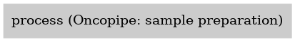

:orphan:

Oncopipe
===================

``oncopipe`` · *11 contributors · 1 version*

Clinical pipeline for detecting gene fusions in RNAseq data utilising JAFFA. The pipeline optionally calls a classifier 
for B-Cell Acute Lymphocytic Leukaemia (based on AllSorts). As well as variant calling pipeline using Picard,GATK and VEP.
            
A poster was also presented at ABACBS2018 noting the current status and future plans:

`Oncopipe ABACBS 2018 <https://atlassian.petermac.org.au/bitbucket/projects/OS/repos/oncopipe/browse/Oncopipe_ABACBS_v6.pdf>`_            
            
Original code example:

.. code-block: text

   bpipe run -r        -p name=SAMPLE_ID        -p out=OUTPUT_PATH        -p fastq=FASTQ_GZ_FILES        PATH_TO_THIS_DIR/pipeline/onco.pipe
            

Quickstart
-----------

    .. code-block:: python

       from janis_bioinformatics.tools.oshlack.oncopipe.oncopipe import OncopipeWorkflow

       wf = WorkflowBuilder("myworkflow")

       wf.step(
           "oncopipe_step",
           OncopipeWorkflow(
               name=None,
               reads=None,
               genome_dir=None,
               reference=None,
               gtf=None,
               blacklist=None,
           )
       )

    

*OR*

1. `Install Janis </tutorials/tutorial0.html>`_

2. Ensure Janis is configured to work with Docker or Singularity.

3. Ensure all reference files are available:

.. note:: 

   More information about these inputs are available `below <#additional-configuration-inputs>`_.

4. Generate user input files for oncopipe:

.. code-block:: bash

   # user inputs
   janis inputs oncopipe > inputs.yaml

**inputs.yaml**

.. code-block:: yaml

       blacklist: blacklist
       genome_dir: null
       gtf: gtf
       name: <value>
       reads:
       - - reads_0.fastq.gz
         - reads_1.fastq.gz
       - - reads_0.fastq.gz
         - reads_1.fastq.gz
       reference: reference.fasta

5. Run oncopipe with:

.. code-block:: bash

   janis run [...run options] \
       --inputs inputs.yaml \
       oncopipe

Information
------------

URL: *No URL to the documentation was provided*

:ID: ``oncopipe``
:URL: *No URL to the documentation was provided*
:Versions: v0.1.0
:Authors: Rebecca Louise Evans, Breon Schmidt, Andrew Lonsdale, Simon Sadedin, Nadia Davidson, Quarkins, Jovana Maksimovic, Alicia Oshlack, Richard Lupat, Jiaan Yu, Michael Franklin
:Citations: 
:Created: 2020-01-01
:Updated: None

Outputs
-----------

======  ======  ===============
name    type    documentation
======  ======  ===============
======  ======  ===============

Workflow
--------

Embedded Tools
***************

============================  ====================================
Oncopipe: sample preparation  ``OncopipeSamplePreparation/v0.1.0``
============================  ====================================

Additional configuration (inputs)
---------------------------------

==========  =======================  ===============
name        type                     documentation
==========  =======================  ===============
name        String                   Sample ID
reads       Array<FastqGzPair>
genome_dir  Directory
reference   Fasta
gtf         File
blacklist   File
contigs     Optional<Array<String>>
==========  =======================  ===============

Workflow Description Language
------------------------------

.. code-block:: text

   version development

   import "tools/OncopipeSamplePreparation_v0_1_0.wdl" as O

   workflow oncopipe {
     input {
       String name
       Array[Array[File]] reads
       Directory genome_dir
       File reference
       File gtf
       File blacklist
       Array[String]? contigs
     }
     scatter (r in reads) {
        call O.OncopipeSamplePreparation as process {
         input:
           name=name,
           reads=r,
           genome_dir=genome_dir,
           reference=reference,
           gtf=gtf,
           blacklist=blacklist,
           contigs=contigs
       }
     }
   }

Common Workflow Language
-------------------------

.. code-block:: text

   #!/usr/bin/env cwl-runner
   class: Workflow
   cwlVersion: v1.2
   label: Oncopipe
   doc: |2-

     Clinical pipeline for detecting gene fusions in RNAseq data utilising JAFFA. The pipeline optionally calls a classifier 
     for B-Cell Acute Lymphocytic Leukaemia (based on AllSorts). As well as variant calling pipeline using Picard,GATK and VEP.
              
     A poster was also presented at ABACBS2018 noting the current status and future plans:

     `Oncopipe ABACBS 2018 <https://atlassian.petermac.org.au/bitbucket/projects/OS/repos/oncopipe/browse/Oncopipe_ABACBS_v6.pdf>`_            
              
     Original code example:

     .. code-block: text

        bpipe run -r        -p name=SAMPLE_ID        -p out=OUTPUT_PATH        -p fastq=FASTQ_GZ_FILES        PATH_TO_THIS_DIR/pipeline/onco.pipe
              

   requirements:
   - class: InlineJavascriptRequirement
   - class: StepInputExpressionRequirement
   - class: ScatterFeatureRequirement
   - class: SubworkflowFeatureRequirement

   inputs:
   - id: name
     doc: Sample ID
     type: string
   - id: reads
     type:
       type: array
       items:
         type: array
         items: File
   - id: genome_dir
     type: Directory
   - id: reference
     type: File
   - id: gtf
     type: File
   - id: blacklist
     type: File
   - id: contigs
     type:
     - type: array
       items: string
     - 'null'

   outputs: []

   steps:
   - id: process
     label: 'Oncopipe: sample preparation'
     in:
     - id: name
       source: name
     - id: reads
       source: reads
     - id: genome_dir
       source: genome_dir
     - id: reference
       source: reference
     - id: gtf
       source: gtf
     - id: blacklist
       source: blacklist
     - id: contigs
       source: contigs
     scatter:
     - reads
     run: tools/OncopipeSamplePreparation_v0_1_0.cwl
     out:
     - id: out_arriba_bam
     - id: out_arriba_fusion
     - id: out_arriba_fusion_discarded
     - id: out_gene_counts
     - id: out_predictions
     - id: out_probabilities
     - id: out_distributions
     - id: out_waterfalls
   id: oncopipe

