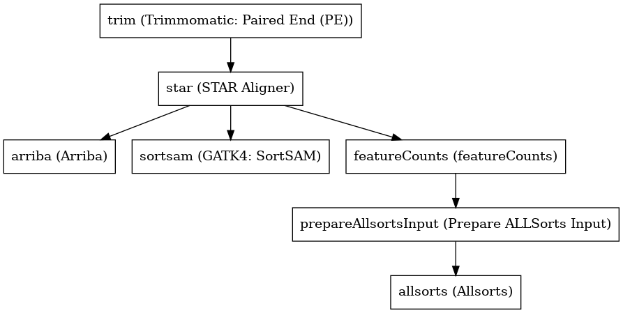

:orphan:

Oncopipe: sample preparation
========================================================

``OncopipeSamplePreparation`` · *1 contributor · 1 version*

No documentation was provided: `contribute one <https://github.com/PMCC-BioinformaticsCore/janis-bioinformatics>`_

Quickstart
-----------

    .. code-block:: python

       from janis_bioinformatics.tools.oshlack.oncopipe.oncopipe import OncopipeSamplePreparation

       wf = WorkflowBuilder("myworkflow")

       wf.step(
           "oncopipesamplepreparation_step",
           OncopipeSamplePreparation(
               name=None,
               reads=None,
               genome_dir=None,
               reference=None,
               gtf=None,
               blacklist=None,
           )
       )
       wf.output("out_arriba_bam", source=oncopipesamplepreparation_step.out_arriba_bam)
       wf.output("out_arriba_fusion", source=oncopipesamplepreparation_step.out_arriba_fusion)
       wf.output("out_arriba_fusion_discarded", source=oncopipesamplepreparation_step.out_arriba_fusion_discarded)
       wf.output("out_gene_counts", source=oncopipesamplepreparation_step.out_gene_counts)
       wf.output("out_predictions", source=oncopipesamplepreparation_step.out_predictions)
       wf.output("out_probabilities", source=oncopipesamplepreparation_step.out_probabilities)
       wf.output("out_distributions", source=oncopipesamplepreparation_step.out_distributions)
       wf.output("out_waterfalls", source=oncopipesamplepreparation_step.out_waterfalls)
    

*OR*

1. `Install Janis </tutorials/tutorial0.html>`_

2. Ensure Janis is configured to work with Docker or Singularity.

3. Ensure all reference files are available:

.. note:: 

   More information about these inputs are available `below <#additional-configuration-inputs>`_.

4. Generate user input files for OncopipeSamplePreparation:

.. code-block:: bash

   # user inputs
   janis inputs OncopipeSamplePreparation > inputs.yaml

**inputs.yaml**

.. code-block:: yaml

       blacklist: blacklist
       genome_dir: null
       gtf: gtf
       name: <value>
       reads:
       - reads_0.fastq.gz
       - reads_1.fastq.gz
       reference: reference.fasta

5. Run OncopipeSamplePreparation with:

.. code-block:: bash

   janis run [...run options] \
       --inputs inputs.yaml \
       OncopipeSamplePreparation

Information
------------

URL: *No URL to the documentation was provided*

:ID: ``OncopipeSamplePreparation``
:URL: *No URL to the documentation was provided*
:Versions: v0.1.0
:Authors: Michael Franklin
:Citations: 
:Created: 2020-09-24
:Updated: 2020-10-07

Outputs
-----------

===========================  ==========  ===============
name                         type        documentation
===========================  ==========  ===============
out_arriba_bam               IndexedBam
out_arriba_fusion            tsv
out_arriba_fusion_discarded  tsv
out_gene_counts              TextFile
out_predictions              csv
out_probabilities            csv
out_distributions            File
out_waterfalls               File
===========================  ==========  ===============

Workflow
--------

Embedded Tools
***************

============================  ===============================
Trimmomatic: Paired End (PE)  ``trimmomaticPairedEnd/0.35``
STAR Aligner                  ``star_alignReads/v2.7.1a``
Arriba                        ``Arriba/1.2.0``
GATK4: SortSAM                ``Gatk4SortSam/4.1.4.0``
featureCounts                 ``featureCounts/2.0.1``
Prepare ALLSorts Input        ``prepareALLSortsInput/v0.1.0``
Allsorts                      ``Allsorts/v0.1.0``
============================  ===============================

Additional configuration (inputs)
---------------------------------

==================================  ========================  =====================================================================================================================================================================================================================================================================================================================================================================================================================================================================================
name                                type                      documentation
==================================  ========================  =====================================================================================================================================================================================================================================================================================================================================================================================================================================================================================
name                                String                    Sample ID
reads                               FastqGzPair
genome_dir                          Directory
reference                           Fasta
gtf                                 File
blacklist                           File
contigs                             Optional<Array<String>>
trim_phred33                        Optional<Boolean>         Use phred + 33 quality score. If no quality encoding is specified, it will be determined automatically
trim_steps                          Optional<Array<String>>   ILLUMINACLIP: Cut adapter and other illumina-specific sequences from the read.
                                                              SLIDINGWINDOW: Performs a sliding window trimming approach. It starts
                                                              scanning at the 5" end and clips the read once the average quality within the window
                                                              falls below a threshold.
                                                              MAXINFO: An adaptive quality trimmer which balances read length and error rate to
                                                              maximise the value of each read
                                                              LEADING: Cut bases off the start of a read, if below a threshold quality
                                                              TRAILING: Cut bases off the end of a read, if below a threshold quality
                                                              CROP: Cut the read to a specified length by removing bases from the end
                                                              HEADCROP: Cut the specified number of bases from the start of the read
                                                              MINLEN: Drop the read if it is below a specified length
                                                              AVGQUAL: Drop the read if the average quality is below the specified level
                                                              TOPHRED33: Convert quality scores to Phred-33
                                                              TOPHRED64: Convert quality scores to Phred-64
star_limitOutSJcollapsed            Optional<Integer>         (default: 1000000) max number of collapsed junctions
star_readFilesCommand               Optional<String>          (default: -) command line to execute for each of the input file. This command should generate FASTA or FASTQ text and send it to stdout zcat - to uncompress .gz files, bzcat - to uncompress .bz2 files, etc.
star_outSAMtype                     Optional<Array<String>>   (default: SAM) ... quasi-random order used before 2.5.0 Random ... random order of alignments for each multi-mapper. Read mates (pairs) are always adjacent, all alignment for each read stay together. This option will become default in the future releases. ... standard unsorted SortedByCoordinate ... sorted by coordinate. This option will allocate extra memory for sorting which can be specified by --limitBAMsortRAM.
star_outSAMunmapped                 Optional<String>          (default: None) output of unmapped reads in the SAM format 1st word: None   ... no output Within ... output unmapped reads within the main SAM file (i.e. Aligned.out.sam) 2nd word: KeepPairs ... record unmapped mate for each alignment, and, in case of unsorted output, keep it adjacent to its mapped mate. Only affects multi-mapping reads.
star_outBAMcompression              Optional<Integer>         (default: 1) -1 to 10  BAM compression level, -1=default compression (6?), 0=no compression, 10=maximum compression
star_outFilterMultimapNmax          Optional<Integer>         (default: 10) maximum number of loci the read is allowed to map to. Alignments (all of them) will be output only if the read maps to no more loci than this value.  Otherwise no alignments will be output, and the read will be counted as "mapped to too many loci" in the Log.final.out .
star_outFilterMismatchNmax          Optional<Integer>         (default: 10) alignment will be output only if it has no more mismatches than this value.
star_chimSegmentMin                 Optional<Integer>         (default: 0) minimum length of chimeric segment length, if ==0, no chimeric output
star_chimOutType                    Optional<Array<String>>   (default: Junctions) type of chimeric output     Junctions       ... Chimeric.out.junction     SeparateSAMold  ... output old SAM into separate Chimeric.out.sam file     WithinBAM       ... output into main aligned BAM files (Aligned.*.bam)     WithinBAM HardClip  ... (default) hard-clipping in the CIGAR for supplemental chimeric alignments (defaultif no 2nd word is present)     WithinBAM SoftClip  ... soft-clipping in the CIGAR for supplemental chimeric alignments
star_chimJunctionOverhangMin        Optional<Integer>         (default: 20) minimum overhang for a chimeric junction
star_chimScoreMin                   Optional<Integer>         (default: 0) minimum total (summed) score of the chimeric segments
star_chimScoreDropMax               Optional<Integer>         (default: 20) max drop (difference) of chimeric score (the sum of scores of all chimeric segments) from the read length
star_chimScoreJunctionNonGTAG       Optional<Integer>         (default: -1) penalty for a non-GT/AG chimeric junction
star_chimScoreSeparation            Optional<Integer>         (default: 10) minimum difference (separation) between the best chimeric score and the next one
star_alignSJstitchMismatchNmax      Optional<Array<Integer>>  (default: 0 -1 0 0) maximum number of mismatches for stitching of the splice junctions (-1: no limit).     (1) non-canonical motifs, (2) GT/AG and CT/AC motif, (3) GC/AG and CT/GC motif, (4) AT/AC and GT/AT motif.
star_chimSegmentReadGapMax          Optional<Integer>         (default: 0) maximum gap in the read sequence between chimeric segments
arriba_fusion_transcript            Optional<Boolean>         When set, the column 'fusion_transcript' is populated with the sequence of the fused genes as assembled from the supporting reads. Specify the flag twice to also print the fusion transcripts to the file containing discarded fusions (-O). Default: off
arriba_peptide_sequence             Optional<Boolean>         When set, the column 'peptide_sequence' is populated with the sequence of the fused proteins as assembled from the supporting reads. Specify the flag twice to also print the peptide sequence to the file containing discarded fusions (-O). Default: off
sortsam_sortOrder                   Optional<String>          The --SORT_ORDER argument is an enumerated type (SortOrder), which can have one of the following values: [unsorted, queryname, coordinate, duplicate, unknown]
sortsam_createIndex                 Optional<Boolean>         Whether to create a BAM index when writing a coordinate-sorted BAM file.
featureCounts_attributeType         Optional<String>          Specify attribute type in GTF annotation. 'gene_id' by default. Meta-features used for read counting will be extracted from annotation using the provided value.
prepareAllsortsInput_fusion_caller  Optional<String>
==================================  ========================  =====================================================================================================================================================================================================================================================================================================================================================================================================================================================================================

Workflow Description Language
------------------------------

.. code-block:: text

   version development

   import "tools/trimmomaticPairedEnd_0_35.wdl" as T
   import "tools/star_alignReads_v2_7_1a.wdl" as S
   import "tools/Arriba_1_2_0.wdl" as A
   import "tools/Gatk4SortSam_4_1_4_0.wdl" as G
   import "tools/featureCounts_2_0_1.wdl" as F
   import "tools/prepareALLSortsInput_v0_1_0.wdl" as P
   import "tools/Allsorts_v0_1_0.wdl" as A2

   workflow OncopipeSamplePreparation {
     input {
       String name
       Array[File] reads
       Directory genome_dir
       File reference
       File gtf
       File blacklist
       Array[String]? contigs
       Boolean? trim_phred33 = true
       Array[String]? trim_steps = ["ILLUMINACLIP:/usr/local/share/trimmomatic-0.35-6/adapters/TruSeq2-PE.fa:2:30:10", "LEADING:15", "TRAILING:15", "SLIDINGWINDOW:4:15", "MINLEN:35"]
       Int? star_limitOutSJcollapsed = 3000000
       String? star_readFilesCommand = "zcat"
       Array[String]? star_outSAMtype = ["BAM", "Unsorted"]
       String? star_outSAMunmapped = "Within"
       Int? star_outBAMcompression = 0
       Int? star_outFilterMultimapNmax = 1
       Int? star_outFilterMismatchNmax = 3
       Int? star_chimSegmentMin = 10
       Array[String]? star_chimOutType = ["WithinBAM", "SoftClip"]
       Int? star_chimJunctionOverhangMin = 10
       Int? star_chimScoreMin = 1
       Int? star_chimScoreDropMax = 30
       Int? star_chimScoreJunctionNonGTAG = 0
       Int? star_chimScoreSeparation = 1
       Array[Int]? star_alignSJstitchMismatchNmax = [5, -1, 5, 5]
       Int? star_chimSegmentReadGapMax = 3
       Boolean? arriba_fusion_transcript = true
       Boolean? arriba_peptide_sequence = true
       String? sortsam_sortOrder = "coordinate"
       Boolean? sortsam_createIndex = true
       String? featureCounts_attributeType = "gene_name"
       String? prepareAllsortsInput_fusion_caller = "featureCounts"
     }
     call T.trimmomaticPairedEnd as trim {
       input:
         steps=select_first([trim_steps, ["ILLUMINACLIP:/usr/local/share/trimmomatic-0.35-6/adapters/TruSeq2-PE.fa:2:30:10", "LEADING:15", "TRAILING:15", "SLIDINGWINDOW:4:15", "MINLEN:35"]]),
         sampleName=name,
         phred33=select_first([trim_phred33, true]),
         inp=reads
     }
     call S.star_alignReads as star {
       input:
         genomeDir=genome_dir,
         readFilesIn=trim.pairedOut,
         readFilesCommand=select_first([star_readFilesCommand, "zcat"]),
         limitOutSJcollapsed=select_first([star_limitOutSJcollapsed, 3000000]),
         outSAMtype=select_first([star_outSAMtype, ["BAM", "Unsorted"]]),
         outSAMunmapped=select_first([star_outSAMunmapped, "Within"]),
         outBAMcompression=select_first([star_outBAMcompression, 0]),
         outFilterMultimapNmax=select_first([star_outFilterMultimapNmax, 1]),
         outFilterMismatchNmax=select_first([star_outFilterMismatchNmax, 3]),
         alignSJstitchMismatchNmax=select_first([star_alignSJstitchMismatchNmax, [5, -1, 5, 5]]),
         chimOutType=select_first([star_chimOutType, ["WithinBAM", "SoftClip"]]),
         chimSegmentMin=select_first([star_chimSegmentMin, 10]),
         chimScoreMin=select_first([star_chimScoreMin, 1]),
         chimScoreDropMax=select_first([star_chimScoreDropMax, 30]),
         chimScoreSeparation=select_first([star_chimScoreSeparation, 1]),
         chimScoreJunctionNonGTAG=select_first([star_chimScoreJunctionNonGTAG, 0]),
         chimJunctionOverhangMin=select_first([star_chimJunctionOverhangMin, 10]),
         chimSegmentReadGapMax=select_first([star_chimSegmentReadGapMax, 3])
     }
     call A.Arriba as arriba {
       input:
         aligned_inp=select_first([star.out_unsorted_bam]),
         gtf_file=gtf,
         reference=reference,
         blacklist=blacklist,
         contigs=contigs,
         fusion_transcript=select_first([arriba_fusion_transcript, true]),
         peptide_sequence=select_first([arriba_peptide_sequence, true])
     }
     call G.Gatk4SortSam as sortsam {
       input:
         bam=select_first([star.out_unsorted_bam]),
         sortOrder=select_first([sortsam_sortOrder, "coordinate"]),
         createIndex=select_first([sortsam_createIndex, true])
     }
     call F.featureCounts as featureCounts {
       input:
         attributeType=select_first([featureCounts_attributeType, "gene_name"]),
         bam=[select_first([star.out_unsorted_bam])],
         annotationFile=gtf
     }
     call P.prepareALLSortsInput as prepareAllsortsInput {
       input:
         inps=[featureCounts.out],
         labels=[name],
         fusion_caller=select_first([prepareAllsortsInput_fusion_caller, "featureCounts"])
     }
     call A2.Allsorts as allsorts {
       input:
         samples=prepareAllsortsInput.out
     }
     output {
       File out_arriba_bam = sortsam.out
       File out_arriba_bam_bai = sortsam.out_bai
       File out_arriba_fusion = arriba.out
       File out_arriba_fusion_discarded = arriba.out_discarded
       File out_gene_counts = featureCounts.out
       File out_predictions = allsorts.out_predictions
       File out_probabilities = allsorts.out_probabilities
       File out_distributions = allsorts.out_distributions
       File out_waterfalls = allsorts.out_waterfalls
     }
   }

Common Workflow Language
-------------------------

.. code-block:: text

   #!/usr/bin/env cwl-runner
   class: Workflow
   cwlVersion: v1.2
   label: 'Oncopipe: sample preparation'
   doc: ''

   requirements:
   - class: InlineJavascriptRequirement
   - class: StepInputExpressionRequirement
   - class: MultipleInputFeatureRequirement

   inputs:
   - id: name
     doc: Sample ID
     type: string
   - id: reads
     type:
       type: array
       items: File
   - id: genome_dir
     type: Directory
   - id: reference
     type: File
   - id: gtf
     type: File
   - id: blacklist
     type: File
   - id: contigs
     type:
     - type: array
       items: string
     - 'null'
   - id: trim_phred33
     doc: |-
       Use phred + 33 quality score. If no quality encoding is specified, it will be determined automatically
     type: boolean
     default: true
   - id: trim_steps
     doc: |
       ILLUMINACLIP: Cut adapter and other illumina-specific sequences from the read.
       SLIDINGWINDOW: Performs a sliding window trimming approach. It starts
       scanning at the 5" end and clips the read once the average quality within the window
       falls below a threshold.
       MAXINFO: An adaptive quality trimmer which balances read length and error rate to
       maximise the value of each read
       LEADING: Cut bases off the start of a read, if below a threshold quality
       TRAILING: Cut bases off the end of a read, if below a threshold quality
       CROP: Cut the read to a specified length by removing bases from the end
       HEADCROP: Cut the specified number of bases from the start of the read
       MINLEN: Drop the read if it is below a specified length
       AVGQUAL: Drop the read if the average quality is below the specified level
       TOPHRED33: Convert quality scores to Phred-33
       TOPHRED64: Convert quality scores to Phred-64
     type:
       type: array
       items: string
     default:
     - ILLUMINACLIP:/usr/local/share/trimmomatic-0.35-6/adapters/TruSeq2-PE.fa:2:30:10
     - LEADING:15
     - TRAILING:15
     - SLIDINGWINDOW:4:15
     - MINLEN:35
   - id: star_limitOutSJcollapsed
     doc: '(default: 1000000) max number of collapsed junctions'
     type: int
     default: 3000000
   - id: star_readFilesCommand
     doc: |-
       (default: -) command line to execute for each of the input file. This command should generate FASTA or FASTQ text and send it to stdout zcat - to uncompress .gz files, bzcat - to uncompress .bz2 files, etc.
     type: string
     default: zcat
   - id: star_outSAMtype
     doc: |-
       (default: SAM) ... quasi-random order used before 2.5.0 Random ... random order of alignments for each multi-mapper. Read mates (pairs) are always adjacent, all alignment for each read stay together. This option will become default in the future releases. ... standard unsorted SortedByCoordinate ... sorted by coordinate. This option will allocate extra memory for sorting which can be specified by --limitBAMsortRAM.
     type:
       type: array
       items: string
     default:
     - BAM
     - Unsorted
   - id: star_outSAMunmapped
     doc: |-
       (default: None) output of unmapped reads in the SAM format 1st word: None   ... no output Within ... output unmapped reads within the main SAM file (i.e. Aligned.out.sam) 2nd word: KeepPairs ... record unmapped mate for each alignment, and, in case of unsorted output, keep it adjacent to its mapped mate. Only affects multi-mapping reads.
     type: string
     default: Within
   - id: star_outBAMcompression
     doc: |-
       (default: 1) -1 to 10  BAM compression level, -1=default compression (6?), 0=no compression, 10=maximum compression
     type: int
     default: 0
   - id: star_outFilterMultimapNmax
     doc: |-
       (default: 10) maximum number of loci the read is allowed to map to. Alignments (all of them) will be output only if the read maps to no more loci than this value.  Otherwise no alignments will be output, and the read will be counted as "mapped to too many loci" in the Log.final.out .
     type: int
     default: 1
   - id: star_outFilterMismatchNmax
     doc: |-
       (default: 10) alignment will be output only if it has no more mismatches than this value.
     type: int
     default: 3
   - id: star_chimSegmentMin
     doc: |-
       (default: 0) minimum length of chimeric segment length, if ==0, no chimeric output
     type: int
     default: 10
   - id: star_chimOutType
     doc: |-
       (default: Junctions) type of chimeric output     Junctions       ... Chimeric.out.junction     SeparateSAMold  ... output old SAM into separate Chimeric.out.sam file     WithinBAM       ... output into main aligned BAM files (Aligned.*.bam)     WithinBAM HardClip  ... (default) hard-clipping in the CIGAR for supplemental chimeric alignments (defaultif no 2nd word is present)     WithinBAM SoftClip  ... soft-clipping in the CIGAR for supplemental chimeric alignments
     type:
       type: array
       items: string
     default:
     - WithinBAM
     - SoftClip
   - id: star_chimJunctionOverhangMin
     doc: '(default: 20) minimum overhang for a chimeric junction'
     type: int
     default: 10
   - id: star_chimScoreMin
     doc: '(default: 0) minimum total (summed) score of the chimeric segments'
     type: int
     default: 1
   - id: star_chimScoreDropMax
     doc: |-
       (default: 20) max drop (difference) of chimeric score (the sum of scores of all chimeric segments) from the read length
     type: int
     default: 30
   - id: star_chimScoreJunctionNonGTAG
     doc: '(default: -1) penalty for a non-GT/AG chimeric junction'
     type: int
     default: 0
   - id: star_chimScoreSeparation
     doc: |-
       (default: 10) minimum difference (separation) between the best chimeric score and the next one
     type: int
     default: 1
   - id: star_alignSJstitchMismatchNmax
     doc: |-
       (default: 0 -1 0 0) maximum number of mismatches for stitching of the splice junctions (-1: no limit).     (1) non-canonical motifs, (2) GT/AG and CT/AC motif, (3) GC/AG and CT/GC motif, (4) AT/AC and GT/AT motif.
     type:
       type: array
       items: int
     default:
     - 5
     - -1
     - 5
     - 5
   - id: star_chimSegmentReadGapMax
     doc: '(default: 0) maximum gap in the read sequence between chimeric segments'
     type: int
     default: 3
   - id: arriba_fusion_transcript
     doc: |-
       When set, the column 'fusion_transcript' is populated with the sequence of the fused genes as assembled from the supporting reads. Specify the flag twice to also print the fusion transcripts to the file containing discarded fusions (-O). Default: off 
     type: boolean
     default: true
   - id: arriba_peptide_sequence
     doc: |-
       When set, the column 'peptide_sequence' is populated with the sequence of the fused proteins as assembled from the supporting reads. Specify the flag twice to also print the peptide sequence to the file containing discarded fusions (-O). Default: off 
     type: boolean
     default: true
   - id: sortsam_sortOrder
     doc: |-
       The --SORT_ORDER argument is an enumerated type (SortOrder), which can have one of the following values: [unsorted, queryname, coordinate, duplicate, unknown]
     type: string
     default: coordinate
   - id: sortsam_createIndex
     doc: Whether to create a BAM index when writing a coordinate-sorted BAM file.
     type: boolean
     default: true
   - id: featureCounts_attributeType
     doc: |-
       Specify attribute type in GTF annotation. 'gene_id' by default. Meta-features used for read counting will be extracted from annotation using the provided value.
     type: string
     default: gene_name
   - id: prepareAllsortsInput_fusion_caller
     type: string
     default: featureCounts

   outputs:
   - id: out_arriba_bam
     type: File
     secondaryFiles:
     - pattern: .bai
     outputSource: sortsam/out
   - id: out_arriba_fusion
     type: File
     outputSource: arriba/out
   - id: out_arriba_fusion_discarded
     type: File
     outputSource: arriba/out_discarded
   - id: out_gene_counts
     type: File
     outputSource: featureCounts/out
   - id: out_predictions
     type: File
     outputSource: allsorts/out_predictions
   - id: out_probabilities
     type: File
     outputSource: allsorts/out_probabilities
   - id: out_distributions
     type: File
     outputSource: allsorts/out_distributions
   - id: out_waterfalls
     type: File
     outputSource: allsorts/out_waterfalls

   steps:
   - id: trim
     label: 'Trimmomatic: Paired End (PE)'
     doc: Trim reads using Trimmomatic
     in:
     - id: steps
       source: trim_steps
     - id: sampleName
       source: name
     - id: phred33
       source: trim_phred33
     - id: inp
       source: reads
     run: tools/trimmomaticPairedEnd_0_35.cwl
     out:
     - id: pairedOut
     - id: unpairedOut
   - id: star
     label: STAR Aligner
     in:
     - id: genomeDir
       source: genome_dir
     - id: readFilesIn
       source: trim/pairedOut
     - id: readFilesCommand
       source: star_readFilesCommand
     - id: limitOutSJcollapsed
       source: star_limitOutSJcollapsed
     - id: outSAMtype
       source: star_outSAMtype
     - id: outSAMunmapped
       source: star_outSAMunmapped
     - id: outBAMcompression
       source: star_outBAMcompression
     - id: outFilterMultimapNmax
       source: star_outFilterMultimapNmax
     - id: outFilterMismatchNmax
       source: star_outFilterMismatchNmax
     - id: alignSJstitchMismatchNmax
       source: star_alignSJstitchMismatchNmax
     - id: chimOutType
       source: star_chimOutType
     - id: chimSegmentMin
       source: star_chimSegmentMin
     - id: chimScoreMin
       source: star_chimScoreMin
     - id: chimScoreDropMax
       source: star_chimScoreDropMax
     - id: chimScoreSeparation
       source: star_chimScoreSeparation
     - id: chimScoreJunctionNonGTAG
       source: star_chimScoreJunctionNonGTAG
     - id: chimJunctionOverhangMin
       source: star_chimJunctionOverhangMin
     - id: chimSegmentReadGapMax
       source: star_chimSegmentReadGapMax
     run: tools/star_alignReads_v2_7_1a.cwl
     out:
     - id: out_unsorted_bam
     - id: out_sorted_bam
     - id: SJ_out_tab
     - id: Log_out
     - id: Log_progress_out
     - id: Log_final_out
   - id: arriba
     label: Arriba
     in:
     - id: _arriba_aligned_inp_staroutunsortedbam
       source: star/out_unsorted_bam
     - id: aligned_inp
       valueFrom: $(inputs._arriba_aligned_inp_staroutunsortedbam)
     - id: gtf_file
       source: gtf
     - id: reference
       source: reference
     - id: blacklist
       source: blacklist
     - id: contigs
       source: contigs
     - id: fusion_transcript
       source: arriba_fusion_transcript
     - id: peptide_sequence
       source: arriba_peptide_sequence
     run: tools/Arriba_1_2_0.cwl
     out:
     - id: out
     - id: out_discarded
   - id: sortsam
     label: 'GATK4: SortSAM'
     in:
     - id: _sortsam_bam_staroutunsortedbam
       source: star/out_unsorted_bam
     - id: bam
       valueFrom: $(inputs._sortsam_bam_staroutunsortedbam)
     - id: sortOrder
       source: sortsam_sortOrder
     - id: createIndex
       source: sortsam_createIndex
     run: tools/Gatk4SortSam_4_1_4_0.cwl
     out:
     - id: out
   - id: featureCounts
     label: featureCounts
     in:
     - id: attributeType
       source: featureCounts_attributeType
     - id: _featureCounts_bam_staroutunsortedbam
       source: star/out_unsorted_bam
     - id: bam
       valueFrom: $([inputs._featureCounts_bam_staroutunsortedbam])
     - id: annotationFile
       source: gtf
     run: tools/featureCounts_2_0_1.cwl
     out:
     - id: out
   - id: prepareAllsortsInput
     label: Prepare ALLSorts Input
     in:
     - id: inps
       source:
       - featureCounts/out
       linkMerge: merge_nested
     - id: labels
       source:
       - name
       linkMerge: merge_nested
     - id: fusion_caller
       source: prepareAllsortsInput_fusion_caller
     run: tools/prepareALLSortsInput_v0_1_0.cwl
     out:
     - id: out
   - id: allsorts
     label: Allsorts
     in:
     - id: samples
       source: prepareAllsortsInput/out
     run: tools/Allsorts_v0_1_0.cwl
     out:
     - id: out_predictions
     - id: out_probabilities
     - id: out_distributions
     - id: out_waterfalls
   id: OncopipeSamplePreparation

