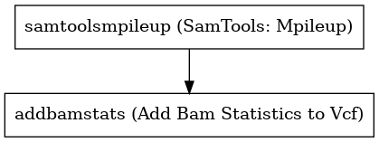

:orphan:

Annotate Bam Stats to Germline Vcf Workflow
=================================================================

``AddBamStatsGermline`` · *1 contributor · 1 version*

No documentation was provided: `contribute one <https://github.com/PMCC-BioinformaticsCore/janis-bioinformatics>`_

Quickstart
-----------

    .. code-block:: python

       from janis_bioinformatics.tools.pmac.addBamStatsGermlineWorkflow import AddBamStatsGermline_0_1_0

       wf = WorkflowBuilder("myworkflow")

       wf.step(
           "addbamstatsgermline_step",
           AddBamStatsGermline_0_1_0(
               bam=None,
               vcf=None,
               reference=None,
           )
       )
       wf.output("out", source=addbamstatsgermline_step.out)
    

*OR*

1. `Install Janis </tutorials/tutorial0.html>`_

2. Ensure Janis is configured to work with Docker or Singularity.

3. Ensure all reference files are available:

.. note:: 

   More information about these inputs are available `below <#additional-configuration-inputs>`_.

4. Generate user input files for AddBamStatsGermline:

.. code-block:: bash

   # user inputs
   janis inputs AddBamStatsGermline > inputs.yaml

**inputs.yaml**

.. code-block:: yaml

       bam: bam.bam
       reference: reference.fasta
       vcf: vcf.vcf

5. Run AddBamStatsGermline with:

.. code-block:: bash

   janis run [...run options] \
       --inputs inputs.yaml \
       AddBamStatsGermline

Information
------------

URL: *No URL to the documentation was provided*

:ID: ``AddBamStatsGermline``
:URL: *No URL to the documentation was provided*
:Versions: v0.1.0
:Authors: Jiaan Yu
:Citations: 
:Created: 2020-06-04
:Updated: 2020-08-10

Outputs
-----------

======  ======  ===============
name    type    documentation
======  ======  ===============
out     VCF
======  ======  ===============

Workflow
--------

Embedded Tools
***************

=========================  =========================
SamTools: Mpileup          ``SamToolsMpileup/1.9.0``
Add Bam Statistics to Vcf  ``addBamStats/0.0.7``
=========================  =========================

Additional configuration (inputs)
---------------------------------

============================  =================  ========================================================
name                          type               documentation
============================  =================  ========================================================
bam                           IndexedBam
vcf                           VCF
reference                     FastaWithIndexes
samtoolsmpileup_countOrphans  Optional<Boolean>  do not discard anomalous read pairs
samtoolsmpileup_noBAQ         Optional<Boolean>  disable BAQ (per-Base Alignment Quality)
samtoolsmpileup_minBQ         Optional<Integer>  Minimum base quality for a base to be considered [13]
samtoolsmpileup_maxDepth      Optional<Integer>  max per-file depth; avoids excessive memory usage [8000]
addbamstats_type              Optional<String>   must be either germline or somatic
============================  =================  ========================================================

Workflow Description Language
------------------------------

.. code-block:: text

   version development

   import "tools/SamToolsMpileup_1_9_0.wdl" as S
   import "tools/addBamStats_0_0_7.wdl" as A

   workflow AddBamStatsGermline {
     input {
       File bam
       File bam_bai
       File vcf
       File reference
       File reference_fai
       File reference_amb
       File reference_ann
       File reference_bwt
       File reference_pac
       File reference_sa
       File reference_dict
       Boolean? samtoolsmpileup_countOrphans = true
       Boolean? samtoolsmpileup_noBAQ = true
       Int? samtoolsmpileup_minBQ = 0
       Int? samtoolsmpileup_maxDepth = 10000
       String? addbamstats_type = "germline"
     }
     call S.SamToolsMpileup as samtoolsmpileup {
       input:
         countOrphans=select_first([samtoolsmpileup_countOrphans, true]),
         noBAQ=select_first([samtoolsmpileup_noBAQ, true]),
         maxDepth=select_first([samtoolsmpileup_maxDepth, 10000]),
         positions=vcf,
         minBQ=select_first([samtoolsmpileup_minBQ, 0]),
         reference=reference,
         bam=bam,
         bam_bai=bam_bai
     }
     call A.addBamStats as addbamstats {
       input:
         mpileup=samtoolsmpileup.out,
         inputVcf=vcf,
         type=select_first([addbamstats_type, "germline"])
     }
     output {
       File out = addbamstats.out
     }
   }

Common Workflow Language
-------------------------

.. code-block:: text

   #!/usr/bin/env cwl-runner
   class: Workflow
   cwlVersion: v1.2
   label: Annotate Bam Stats to Germline Vcf Workflow

   requirements:
   - class: InlineJavascriptRequirement
   - class: StepInputExpressionRequirement

   inputs:
   - id: bam
     type: File
     secondaryFiles:
     - pattern: .bai
   - id: vcf
     type: File
   - id: reference
     type: File
     secondaryFiles:
     - pattern: .fai
     - pattern: .amb
     - pattern: .ann
     - pattern: .bwt
     - pattern: .pac
     - pattern: .sa
     - pattern: ^.dict
   - id: samtoolsmpileup_countOrphans
     doc: do not discard anomalous read pairs
     type: boolean
     default: true
   - id: samtoolsmpileup_noBAQ
     doc: disable BAQ (per-Base Alignment Quality)
     type: boolean
     default: true
   - id: samtoolsmpileup_minBQ
     doc: Minimum base quality for a base to be considered [13]
     type: int
     default: 0
   - id: samtoolsmpileup_maxDepth
     doc: max per-file depth; avoids excessive memory usage [8000]
     type: int
     default: 10000
   - id: addbamstats_type
     doc: must be either germline or somatic
     type: string
     default: germline

   outputs:
   - id: out
     type: File
     outputSource: addbamstats/out

   steps:
   - id: samtoolsmpileup
     label: 'SamTools: Mpileup'
     in:
     - id: countOrphans
       source: samtoolsmpileup_countOrphans
     - id: noBAQ
       source: samtoolsmpileup_noBAQ
     - id: maxDepth
       source: samtoolsmpileup_maxDepth
     - id: positions
       source: vcf
     - id: minBQ
       source: samtoolsmpileup_minBQ
     - id: reference
       source: reference
     - id: bam
       source: bam
     run: tools/SamToolsMpileup_1_9_0.cwl
     out:
     - id: out
   - id: addbamstats
     label: Add Bam Statistics to Vcf
     in:
     - id: mpileup
       source: samtoolsmpileup/out
     - id: inputVcf
       source: vcf
     - id: type
       source: addbamstats_type
     run: tools/addBamStats_0_0_7.cwl
     out:
     - id: out
   id: AddBamStatsGermline

