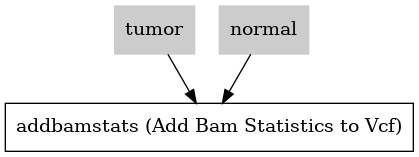

:orphan:

Annotate Bam Stats to Somatic Vcf Workflow
===============================================================

``AddBamStatsSomatic`` · *1 contributor · 1 version*

No documentation was provided: `contribute one <https://github.com/PMCC-BioinformaticsCore/janis-bioinformatics>`_

Quickstart
-----------

    .. code-block:: python

       from janis_bioinformatics.tools.pmac.addBamStatsSomaticWorkflow import AddBamStatsSomatic_0_1_0

       wf = WorkflowBuilder("myworkflow")

       wf.step(
           "addbamstatssomatic_step",
           AddBamStatsSomatic_0_1_0(
               normal_id=None,
               tumor_id=None,
               normal_bam=None,
               tumor_bam=None,
               reference=None,
               vcf=None,
           )
       )
       wf.output("out", source=addbamstatssomatic_step.out)
    

*OR*

1. `Install Janis </tutorials/tutorial0.html>`_

2. Ensure Janis is configured to work with Docker or Singularity.

3. Ensure all reference files are available:

.. note:: 

   More information about these inputs are available `below <#additional-configuration-inputs>`_.

4. Generate user input files for AddBamStatsSomatic:

.. code-block:: bash

   # user inputs
   janis inputs AddBamStatsSomatic > inputs.yaml

**inputs.yaml**

.. code-block:: yaml

       normal_bam: normal_bam.bam
       normal_id: <value>
       reference: reference.fasta
       tumor_bam: tumor_bam.bam
       tumor_id: <value>
       vcf: vcf.vcf

5. Run AddBamStatsSomatic with:

.. code-block:: bash

   janis run [...run options] \
       --inputs inputs.yaml \
       AddBamStatsSomatic

Information
------------

URL: *No URL to the documentation was provided*

:ID: ``AddBamStatsSomatic``
:URL: *No URL to the documentation was provided*
:Versions: v0.1.0
:Authors: Jiaan Yu
:Citations: 
:Created: 2020-06-04
:Updated: 2020-08-10

Outputs
-----------

======  ======  ===============
name    type    documentation
======  ======  ===============
out     VCF
======  ======  ===============

Workflow
--------

Embedded Tools
***************

=========================  =====================================
                           ``samtools_mpileup_subpipeline/None``
Add Bam Statistics to Vcf  ``addBamStats/0.0.7``
=========================  =====================================

Additional configuration (inputs)
---------------------------------

================  ================  ==================================
name              type              documentation
================  ================  ==================================
normal_id         String
tumor_id          String
normal_bam        IndexedBam
tumor_bam         IndexedBam
reference         FastaWithIndexes
vcf               VCF
addbamstats_type  Optional<String>  must be either germline or somatic
================  ================  ==================================

Workflow Description Language
------------------------------

.. code-block:: text

   version development

   import "tools/samtools_mpileup_subpipeline.wdl" as S
   import "tools/addBamStats_0_0_7.wdl" as A

   workflow AddBamStatsSomatic {
     input {
       String normal_id
       String tumor_id
       File normal_bam
       File normal_bam_bai
       File tumor_bam
       File tumor_bam_bai
       File reference
       File reference_fai
       File reference_amb
       File reference_ann
       File reference_bwt
       File reference_pac
       File reference_sa
       File reference_dict
       File vcf
       String? addbamstats_type = "somatic"
     }
     call S.samtools_mpileup_subpipeline as tumor {
       input:
         vcf=vcf,
         bam=tumor_bam,
         bam_bai=tumor_bam_bai,
         reference=reference,
         reference_fai=reference_fai,
         reference_amb=reference_amb,
         reference_ann=reference_ann,
         reference_bwt=reference_bwt,
         reference_pac=reference_pac,
         reference_sa=reference_sa,
         reference_dict=reference_dict
     }
     call S.samtools_mpileup_subpipeline as normal {
       input:
         vcf=vcf,
         bam=normal_bam,
         bam_bai=normal_bam_bai,
         reference=reference,
         reference_fai=reference_fai,
         reference_amb=reference_amb,
         reference_ann=reference_ann,
         reference_bwt=reference_bwt,
         reference_pac=reference_pac,
         reference_sa=reference_sa,
         reference_dict=reference_dict
     }
     call A.addBamStats as addbamstats {
       input:
         normalMpileup=normal.out,
         tumorMpileup=tumor.out,
         normalID=normal_id,
         tumorID=tumor_id,
         inputVcf=vcf,
         type=select_first([addbamstats_type, "somatic"])
     }
     output {
       File out = addbamstats.out
     }
   }

Common Workflow Language
-------------------------

.. code-block:: text

   #!/usr/bin/env cwl-runner
   class: Workflow
   cwlVersion: v1.2
   label: Annotate Bam Stats to Somatic Vcf Workflow

   requirements:
   - class: InlineJavascriptRequirement
   - class: StepInputExpressionRequirement
   - class: SubworkflowFeatureRequirement

   inputs:
   - id: normal_id
     type: string
   - id: tumor_id
     type: string
   - id: normal_bam
     type: File
     secondaryFiles:
     - pattern: .bai
   - id: tumor_bam
     type: File
     secondaryFiles:
     - pattern: .bai
   - id: reference
     type: File
     secondaryFiles:
     - pattern: .fai
     - pattern: .amb
     - pattern: .ann
     - pattern: .bwt
     - pattern: .pac
     - pattern: .sa
     - pattern: ^.dict
   - id: vcf
     type: File
   - id: addbamstats_type
     doc: must be either germline or somatic
     type: string
     default: somatic

   outputs:
   - id: out
     type: File
     outputSource: addbamstats/out

   steps:
   - id: tumor
     in:
     - id: vcf
       source: vcf
     - id: bam
       source: tumor_bam
     - id: reference
       source: reference
     run: tools/samtools_mpileup_subpipeline.cwl
     out:
     - id: out
   - id: normal
     in:
     - id: vcf
       source: vcf
     - id: bam
       source: normal_bam
     - id: reference
       source: reference
     run: tools/samtools_mpileup_subpipeline.cwl
     out:
     - id: out
   - id: addbamstats
     label: Add Bam Statistics to Vcf
     in:
     - id: normalMpileup
       source: normal/out
     - id: tumorMpileup
       source: tumor/out
     - id: normalID
       source: normal_id
     - id: tumorID
       source: tumor_id
     - id: inputVcf
       source: vcf
     - id: type
       source: addbamstats_type
     run: tools/addBamStats_0_0_7.cwl
     out:
     - id: out
   id: AddBamStatsSomatic

