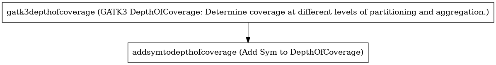

:orphan:

Annotate GATK3 DepthOfCoverage Workflow
=================================================================

``AnnotateDepthOfCoverage`` · *1 contributor · 1 version*

No documentation was provided: `contribute one <https://github.com/PMCC-BioinformaticsCore/janis-bioinformatics>`_

Quickstart
-----------

    .. code-block:: python

       from janis_bioinformatics.tools.pmac.annotateDepthOfCoverageWorkflow import AnnotateDepthOfCoverage_0_1_0

       wf = WorkflowBuilder("myworkflow")

       wf.step(
           "annotatedepthofcoverage_step",
           AnnotateDepthOfCoverage_0_1_0(
               bam=None,
               bed=None,
               reference=None,
               sample_name=None,
           )
       )
       wf.output("out", source=annotatedepthofcoverage_step.out)
       wf.output("out_sample_summary", source=annotatedepthofcoverage_step.out_sample_summary)
    

*OR*

1. `Install Janis </tutorials/tutorial0.html>`_

2. Ensure Janis is configured to work with Docker or Singularity.

3. Ensure all reference files are available:

.. note:: 

   More information about these inputs are available `below <#additional-configuration-inputs>`_.

4. Generate user input files for AnnotateDepthOfCoverage:

.. code-block:: bash

   # user inputs
   janis inputs AnnotateDepthOfCoverage > inputs.yaml

**inputs.yaml**

.. code-block:: yaml

       bam: bam.bam
       bed: bed.bed
       reference: reference.fasta
       sample_name: <value>

5. Run AnnotateDepthOfCoverage with:

.. code-block:: bash

   janis run [...run options] \
       --inputs inputs.yaml \
       AnnotateDepthOfCoverage

Information
------------

URL: *No URL to the documentation was provided*

:ID: ``AnnotateDepthOfCoverage``
:URL: *No URL to the documentation was provided*
:Versions: v0.1.0
:Authors: Jiaan Yu
:Citations: 
:Created: 2020-04-28
:Updated: 2020-10-07

Outputs
-----------

==================  ========  ===============
name                type      documentation
==================  ========  ===============
out                 TextFile
out_sample_summary  TextFile
==================  ========  ===============

Workflow
--------

Embedded Tools
***************

==============================================================================================  =================================
GATK3 DepthOfCoverage: Determine coverage at different levels of partitioning and aggregation.  ``Gatk3DepthOfCoverage/3.8-1``
Add Sym to DepthOfCoverage                                                                      ``addSymToDepthOfCoverage/0.0.7``
==============================================================================================  =================================

Additional configuration (inputs)
---------------------------------

=============================================  ========================  =====================================================================================================================
name                                           type                      documentation
=============================================  ========================  =====================================================================================================================
bam                                            IndexedBam
bed                                            bed
reference                                      FastaWithIndexes
sample_name                                    String
gatk3depthofcoverage_countType                 Optional<String>          overlapping reads from the same  fragment be handled? (COUNT_READS|COUNT_FRAGMENTS|COUNT_FRAGMENTS_REQUIRE_SAME_BASE)
gatk3depthofcoverage_summaryCoverageThreshold  Optional<Array<Integer>>  Coverage threshold (in percent) for summarizing statistics
=============================================  ========================  =====================================================================================================================

Workflow Description Language
------------------------------

.. code-block:: text

   version development

   import "tools/Gatk3DepthOfCoverage_3_8_1.wdl" as G
   import "tools/addSymToDepthOfCoverage_0_0_7.wdl" as A

   workflow AnnotateDepthOfCoverage {
     input {
       File bam
       File bam_bai
       File bed
       File reference
       File reference_fai
       File reference_amb
       File reference_ann
       File reference_bwt
       File reference_pac
       File reference_sa
       File reference_dict
       String sample_name
       String? gatk3depthofcoverage_countType = "COUNT_FRAGMENTS_REQUIRE_SAME_BASE"
       Array[Int]? gatk3depthofcoverage_summaryCoverageThreshold = [1, 50, 100, 300, 500]
     }
     call G.Gatk3DepthOfCoverage as gatk3depthofcoverage {
       input:
         bam=bam,
         bam_bai=bam_bai,
         reference=reference,
         reference_fai=reference_fai,
         reference_amb=reference_amb,
         reference_ann=reference_ann,
         reference_bwt=reference_bwt,
         reference_pac=reference_pac,
         reference_sa=reference_sa,
         reference_dict=reference_dict,
         outputPrefix=sample_name,
         intervals=bed,
         countType=select_first([gatk3depthofcoverage_countType, "COUNT_FRAGMENTS_REQUIRE_SAME_BASE"]),
         summaryCoverageThreshold=select_first([gatk3depthofcoverage_summaryCoverageThreshold, [1, 50, 100, 300, 500]])
     }
     call A.addSymToDepthOfCoverage as addsymtodepthofcoverage {
       input:
         inputFile=gatk3depthofcoverage.sampleIntervalSummary,
         outputFilename=sample_name,
         bed=bed
     }
     output {
       File out = addsymtodepthofcoverage.out
       File out_sample_summary = gatk3depthofcoverage.sampleSummary
     }
   }

Common Workflow Language
-------------------------

.. code-block:: text

   #!/usr/bin/env cwl-runner
   class: Workflow
   cwlVersion: v1.2
   label: Annotate GATK3 DepthOfCoverage Workflow

   requirements:
   - class: InlineJavascriptRequirement
   - class: StepInputExpressionRequirement

   inputs:
   - id: bam
     type: File
     secondaryFiles:
     - pattern: .bai
   - id: bed
     type: File
   - id: reference
     type: File
     secondaryFiles:
     - pattern: .fai
     - pattern: .amb
     - pattern: .ann
     - pattern: .bwt
     - pattern: .pac
     - pattern: .sa
     - pattern: ^.dict
   - id: sample_name
     type: string
   - id: gatk3depthofcoverage_countType
     doc: |-
       overlapping reads from the same  fragment be handled? (COUNT_READS|COUNT_FRAGMENTS|COUNT_FRAGMENTS_REQUIRE_SAME_BASE)
     type: string
     default: COUNT_FRAGMENTS_REQUIRE_SAME_BASE
   - id: gatk3depthofcoverage_summaryCoverageThreshold
     doc: Coverage threshold (in percent) for summarizing statistics
     type:
       type: array
       items: int
     default:
     - 1
     - 50
     - 100
     - 300
     - 500

   outputs:
   - id: out
     type: File
     outputSource: addsymtodepthofcoverage/out
   - id: out_sample_summary
     type: File
     outputSource: gatk3depthofcoverage/sampleSummary

   steps:
   - id: gatk3depthofcoverage
     label: |-
       GATK3 DepthOfCoverage: Determine coverage at different levels of partitioning and aggregation.
     in:
     - id: bam
       source: bam
     - id: reference
       source: reference
     - id: outputPrefix
       source: sample_name
     - id: intervals
       source: bed
     - id: countType
       source: gatk3depthofcoverage_countType
     - id: summaryCoverageThreshold
       source: gatk3depthofcoverage_summaryCoverageThreshold
     run: tools/Gatk3DepthOfCoverage_3_8_1.cwl
     out:
     - id: sample
     - id: sampleCumulativeCoverageCounts
     - id: sampleCumulativeCoverageProportions
     - id: sampleIntervalStatistics
     - id: sampleIntervalSummary
     - id: sampleStatistics
     - id: sampleSummary
   - id: addsymtodepthofcoverage
     label: Add Sym to DepthOfCoverage
     in:
     - id: inputFile
       source: gatk3depthofcoverage/sampleIntervalSummary
     - id: outputFilename
       source: sample_name
     - id: bed
       source: bed
     run: tools/addSymToDepthOfCoverage_0_0_7.cwl
     out:
     - id: out
   id: AnnotateDepthOfCoverage

