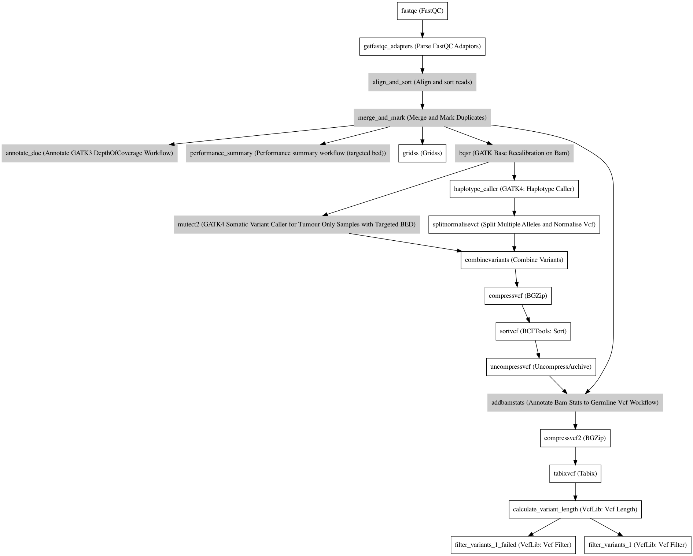

:orphan:

Molpath Tumor Only Workflow
======================================================

``MolpathTumorOnlyWorkflow`` · *1 contributor · 1 version*

No documentation was provided: `contribute one <https://github.com/PMCC-BioinformaticsCore/janis-bioinformatics>`_

Quickstart
-----------

    .. code-block:: python

       from janis_bioinformatics.tools.pmac.molpathTumorOnlyWorkflow import MolpathTumorOnly_1_0_0

       wf = WorkflowBuilder("myworkflow")

       wf.step(
           "molpathtumoronlyworkflow_step",
           MolpathTumorOnly_1_0_0(
               sample_name=None,
               fastqs=None,
               seqrun=None,
               reference=None,
               region_bed=None,
               region_bed_extended=None,
               region_bed_annotated=None,
               genecoverage_bed=None,
               genome_file=None,
               panel_name=None,
               vcfcols=None,
               snps_dbsnp=None,
               snps_1000gp=None,
               known_indels=None,
               mills_indels=None,
               mutalyzer_server=None,
               pathos_db=None,
               maxRecordsInRam=None,
               gnomad=None,
           )
       )
       wf.output("fastq_qc", source=molpathtumoronlyworkflow_step.fastq_qc)
       wf.output("markdups_bam", source=molpathtumoronlyworkflow_step.markdups_bam)
       wf.output("doc_out", source=molpathtumoronlyworkflow_step.doc_out)
       wf.output("summary", source=molpathtumoronlyworkflow_step.summary)
       wf.output("gene_summary", source=molpathtumoronlyworkflow_step.gene_summary)
       wf.output("region_summary", source=molpathtumoronlyworkflow_step.region_summary)
       wf.output("gridss_vcf", source=molpathtumoronlyworkflow_step.gridss_vcf)
       wf.output("gridss_bam", source=molpathtumoronlyworkflow_step.gridss_bam)
       wf.output("haplotypecaller_vcf", source=molpathtumoronlyworkflow_step.haplotypecaller_vcf)
       wf.output("haplotypecaller_bam", source=molpathtumoronlyworkflow_step.haplotypecaller_bam)
       wf.output("haplotypecaller_norm", source=molpathtumoronlyworkflow_step.haplotypecaller_norm)
       wf.output("mutect2_vcf", source=molpathtumoronlyworkflow_step.mutect2_vcf)
       wf.output("mutect2_bam", source=molpathtumoronlyworkflow_step.mutect2_bam)
       wf.output("mutect2_norm", source=molpathtumoronlyworkflow_step.mutect2_norm)
       wf.output("addbamstats_vcf", source=molpathtumoronlyworkflow_step.addbamstats_vcf)
    

*OR*

1. `Install Janis </tutorials/tutorial0.html>`_

2. Ensure Janis is configured to work with Docker or Singularity.

3. Ensure all reference files are available:

.. note:: 

   More information about these inputs are available `below <#additional-configuration-inputs>`_.

4. Generate user input files for MolpathTumorOnlyWorkflow:

.. code-block:: bash

   # user inputs
   janis inputs MolpathTumorOnlyWorkflow > inputs.yaml

**inputs.yaml**

.. code-block:: yaml

       fastqs:
       - - fastqs_0.fastq.gz
         - fastqs_1.fastq.gz
       - - fastqs_0.fastq.gz
         - fastqs_1.fastq.gz
       genecoverage_bed: genecoverage_bed.bed
       genome_file: genome_file.txt
       gnomad: gnomad.vcf.gz
       known_indels: known_indels.vcf.gz
       maxRecordsInRam: 0
       mills_indels: mills_indels.vcf.gz
       mutalyzer_server: <value>
       panel_name: <value>
       pathos_db: <value>
       reference: reference.fasta
       region_bed: region_bed.bed
       region_bed_annotated: region_bed_annotated.bed
       region_bed_extended: region_bed_extended.bed
       sample_name: <value>
       seqrun: <value>
       snps_1000gp: snps_1000gp.vcf.gz
       snps_dbsnp: snps_dbsnp.vcf.gz
       vcfcols: vcfcols.txt

5. Run MolpathTumorOnlyWorkflow with:

.. code-block:: bash

   janis run [...run options] \
       --inputs inputs.yaml \
       MolpathTumorOnlyWorkflow

Information
------------

URL: *No URL to the documentation was provided*

:ID: ``MolpathTumorOnlyWorkflow``
:URL: *No URL to the documentation was provided*
:Versions: v1.0.0
:Authors: Jiaan Yu
:Citations: 
:Created: 2020-06-12
:Updated: 2020-08-10

Outputs
-----------

====================  ====================  ===============
name                  type                  documentation
====================  ====================  ===============
fastq_qc              Array<Array<Zip>>
markdups_bam          IndexedBam
doc_out               TextFile
summary               csv
gene_summary          TextFile
region_summary        TextFile
gridss_vcf            VCF
gridss_bam            BAM
haplotypecaller_vcf   Gzipped<VCF>
haplotypecaller_bam   IndexedBam
haplotypecaller_norm  VCF
mutect2_vcf           Gzipped<VCF>
mutect2_bam           Optional<IndexedBam>
mutect2_norm          VCF
addbamstats_vcf       VCF
====================  ====================  ===============

Workflow
--------

Embedded Tools
***************

======================================================================  ======================================================
FastQC                                                                  ``fastqc/v0.11.5``
Parse FastQC Adaptors                                                   ``ParseFastqcAdaptors/v0.1.0``
Align and sort reads                                                    ``BwaAligner/1.0.0``
Merge and Mark Duplicates                                               ``mergeAndMarkBams/4.1.3``
Annotate GATK3 DepthOfCoverage Workflow                                 ``AnnotateDepthOfCoverage/v0.1.0``
Performance summary workflow (targeted bed)                             ``PerformanceSummaryTargeted/v0.1.0``
Gridss                                                                  ``gridss/v2.6.2``
GATK Base Recalibration on Bam                                          ``GATKBaseRecalBQSRWorkflow/4.1.3``
GATK4 Somatic Variant Caller for Tumour Only Samples with Targeted BED  ``GATK4_SomaticVariantCallerTumorOnlyTargeted/v0.1.1``
GATK4: Haplotype Caller                                                 ``Gatk4HaplotypeCaller/4.1.3.0``
Split Multiple Alleles and Normalise Vcf                                ``SplitMultiAlleleNormaliseVcf/v0.5772``
Combine Variants                                                        ``combinevariants/0.0.8``
BGZip                                                                   ``bgzip/1.9``
BCFTools: Sort                                                          ``bcftoolssort/v1.9``
UncompressArchive                                                       ``UncompressArchive/v1.0.0``
Annotate Bam Stats to Germline Vcf Workflow                             ``AddBamStatsGermline/v0.1.0``
Tabix                                                                   ``tabix/1.2.1``
VcfLib: Vcf Length                                                      ``vcflength/v1.0.1``
VcfLib: Vcf Filter                                                      ``vcffilter/v1.0.1``
======================================================================  ======================================================

Additional configuration (inputs)
---------------------------------

======================================  =======================  =============================================================================================================================================================================================================================================================================================================================================================================================================================================
name                                    type                     documentation
======================================  =======================  =============================================================================================================================================================================================================================================================================================================================================================================================================================================
sample_name                             String
fastqs                                  Array<FastqGzPair>
seqrun                                  String                   SeqRun Name (for Vcf2Tsv)
reference                               FastaWithIndexes
region_bed                              bed
region_bed_extended                     bed
region_bed_annotated                    bed
genecoverage_bed                        bed
genome_file                             TextFile
panel_name                              String
vcfcols                                 TextFile
snps_dbsnp                              Gzipped<VCF>
snps_1000gp                             Gzipped<VCF>
known_indels                            Gzipped<VCF>
mills_indels                            Gzipped<VCF>
mutalyzer_server                        String
pathos_db                               String
maxRecordsInRam                         Integer
gnomad                                  Gzipped<VCF>
black_list                              Optional<bed>
panel_of_normals                        Optional<Gzipped<VCF>>
fastqc_threads                          Optional<Integer>        (-t) Specifies the number of files which can be processed simultaneously. Each thread will be allocated 250MB of memory so you shouldn't run more threads than your available memory will cope with, and not more than 6 threads on a 32 bit machine
align_and_sort_sortsam_tmpDir           Optional<String>         Undocumented option
gridss_tmpdir                           Optional<String>
haplotype_caller_pairHmmImplementation  Optional<String>         The PairHMM implementation to use for genotype likelihood calculations. The various implementations balance a tradeoff of accuracy and runtime. The --pair-hmm-implementation argument is an enumerated type (Implementation), which can have one of the following values: EXACT;ORIGINAL;LOGLESS_CACHING;AVX_LOGLESS_CACHING;AVX_LOGLESS_CACHING_OMP;EXPERIMENTAL_FPGA_LOGLESS_CACHING;FASTEST_AVAILABLE. Implementation:  FASTEST_AVAILABLE
combinevariants_type                    Optional<String>         germline | somatic
combinevariants_columns                 Optional<Array<String>>  Columns to keep, seperated by space output vcf (unsorted)
filter_for_vcfs                         Optional<String>
filter_variants_1_invert                Optional<Boolean>        (-v) inverts the filter, e.g. grep -v
======================================  =======================  =============================================================================================================================================================================================================================================================================================================================================================================================================================================

Workflow Description Language
------------------------------

.. code-block:: text

   version development

   import "tools/fastqc_v0_11_5.wdl" as F
   import "tools/ParseFastqcAdaptors_v0_1_0.wdl" as P
   import "tools/BwaAligner_1_0_0.wdl" as B
   import "tools/mergeAndMarkBams_4_1_3.wdl" as M
   import "tools/AnnotateDepthOfCoverage_v0_1_0.wdl" as A
   import "tools/PerformanceSummaryTargeted_v0_1_0.wdl" as P2
   import "tools/gridss_v2_6_2.wdl" as G
   import "tools/GATKBaseRecalBQSRWorkflow_4_1_3.wdl" as G2
   import "tools/GATK4_SomaticVariantCallerTumorOnlyTargeted_v0_1_1.wdl" as G3
   import "tools/Gatk4HaplotypeCaller_4_1_3_0.wdl" as G4
   import "tools/SplitMultiAlleleNormaliseVcf_v0_5772.wdl" as S
   import "tools/combinevariants_0_0_8.wdl" as C
   import "tools/bgzip_1_9.wdl" as B2
   import "tools/bcftoolssort_v1_9.wdl" as B3
   import "tools/UncompressArchive_v1_0_0.wdl" as U
   import "tools/AddBamStatsGermline_v0_1_0.wdl" as A2
   import "tools/tabix_1_2_1.wdl" as T
   import "tools/vcflength_v1_0_1.wdl" as V
   import "tools/vcffilter_v1_0_1.wdl" as V2

   workflow MolpathTumorOnlyWorkflow {
     input {
       String sample_name
       Array[Array[File]] fastqs
       String seqrun
       File reference
       File reference_fai
       File reference_amb
       File reference_ann
       File reference_bwt
       File reference_pac
       File reference_sa
       File reference_dict
       File region_bed
       File region_bed_extended
       File region_bed_annotated
       File genecoverage_bed
       File genome_file
       String panel_name
       File vcfcols
       File? black_list
       File snps_dbsnp
       File snps_dbsnp_tbi
       File snps_1000gp
       File snps_1000gp_tbi
       File known_indels
       File known_indels_tbi
       File mills_indels
       File mills_indels_tbi
       String mutalyzer_server
       String pathos_db
       Int maxRecordsInRam
       File gnomad
       File gnomad_tbi
       File? panel_of_normals
       File? panel_of_normals_tbi
       Int? fastqc_threads = 4
       String? align_and_sort_sortsam_tmpDir = "."
       String? gridss_tmpdir = "."
       String? haplotype_caller_pairHmmImplementation = "LOGLESS_CACHING"
       String? combinevariants_type = "germline"
       Array[String]? combinevariants_columns = ["AD", "DP", "AF", "GT"]
       String? filter_for_vcfs = "length > 150"
       Boolean? filter_variants_1_invert = true
     }
     scatter (f in fastqs) {
        call F.fastqc as fastqc {
         input:
           reads=f,
           threads=select_first([fastqc_threads, 4])
       }
     }
     scatter (f in fastqc.datafile) {
        call P.ParseFastqcAdaptors as getfastqc_adapters {
         input:
           fastqc_datafiles=f
       }
     }
     scatter (Q in zip(fastqs, zip(getfastqc_adapters.adaptor_sequences, getfastqc_adapters.adaptor_sequences))) {
        call B.BwaAligner as align_and_sort {
         input:
           sample_name=sample_name,
           reference=reference,
           reference_fai=reference_fai,
           reference_amb=reference_amb,
           reference_ann=reference_ann,
           reference_bwt=reference_bwt,
           reference_pac=reference_pac,
           reference_sa=reference_sa,
           reference_dict=reference_dict,
           fastq=Q.left,
           cutadapt_adapter=Q.right.right,
           cutadapt_removeMiddle3Adapter=Q.right.right,
           sortsam_tmpDir=select_first([align_and_sort_sortsam_tmpDir, "."])
       }
     }
     call M.mergeAndMarkBams as merge_and_mark {
       input:
         bams=align_and_sort.out,
         bams_bai=align_and_sort.out_bai,
         maxRecordsInRam=maxRecordsInRam,
         sampleName=sample_name
     }
     call A.AnnotateDepthOfCoverage as annotate_doc {
       input:
         bam=merge_and_mark.out,
         bam_bai=merge_and_mark.out_bai,
         bed=region_bed_annotated,
         reference=reference,
         reference_fai=reference_fai,
         reference_amb=reference_amb,
         reference_ann=reference_ann,
         reference_bwt=reference_bwt,
         reference_pac=reference_pac,
         reference_sa=reference_sa,
         reference_dict=reference_dict,
         sample_name=sample_name
     }
     call P2.PerformanceSummaryTargeted as performance_summary {
       input:
         bam=merge_and_mark.out,
         bam_bai=merge_and_mark.out_bai,
         genecoverage_bed=genecoverage_bed,
         region_bed=region_bed,
         sample_name=sample_name,
         genome_file=genome_file
     }
     call G.gridss as gridss {
       input:
         bams=[merge_and_mark.out],
         bams_bai=[merge_and_mark.out_bai],
         reference=reference,
         reference_fai=reference_fai,
         reference_amb=reference_amb,
         reference_ann=reference_ann,
         reference_bwt=reference_bwt,
         reference_pac=reference_pac,
         reference_sa=reference_sa,
         reference_dict=reference_dict,
         blacklist=black_list,
         tmpdir=select_first([gridss_tmpdir, "."])
     }
     call G2.GATKBaseRecalBQSRWorkflow as bqsr {
       input:
         bam=merge_and_mark.out,
         bam_bai=merge_and_mark.out_bai,
         intervals=region_bed_extended,
         reference=reference,
         reference_fai=reference_fai,
         reference_amb=reference_amb,
         reference_ann=reference_ann,
         reference_bwt=reference_bwt,
         reference_pac=reference_pac,
         reference_sa=reference_sa,
         reference_dict=reference_dict,
         snps_dbsnp=snps_dbsnp,
         snps_dbsnp_tbi=snps_dbsnp_tbi,
         snps_1000gp=snps_1000gp,
         snps_1000gp_tbi=snps_1000gp_tbi,
         known_indels=known_indels,
         known_indels_tbi=known_indels_tbi,
         mills_indels=mills_indels,
         mills_indels_tbi=mills_indels_tbi
     }
     call G3.GATK4_SomaticVariantCallerTumorOnlyTargeted as mutect2 {
       input:
         bam=bqsr.out,
         bam_bai=bqsr.out_bai,
         intervals=region_bed_extended,
         reference=reference,
         reference_fai=reference_fai,
         reference_amb=reference_amb,
         reference_ann=reference_ann,
         reference_bwt=reference_bwt,
         reference_pac=reference_pac,
         reference_sa=reference_sa,
         reference_dict=reference_dict,
         gnomad=gnomad,
         gnomad_tbi=gnomad_tbi,
         panel_of_normals=panel_of_normals,
         panel_of_normals_tbi=panel_of_normals_tbi
     }
     call G4.Gatk4HaplotypeCaller as haplotype_caller {
       input:
         pairHmmImplementation=select_first([haplotype_caller_pairHmmImplementation, "LOGLESS_CACHING"]),
         inputRead=bqsr.out,
         inputRead_bai=bqsr.out_bai,
         reference=reference,
         reference_fai=reference_fai,
         reference_amb=reference_amb,
         reference_ann=reference_ann,
         reference_bwt=reference_bwt,
         reference_pac=reference_pac,
         reference_sa=reference_sa,
         reference_dict=reference_dict,
         dbsnp=snps_dbsnp,
         dbsnp_tbi=snps_dbsnp_tbi,
         intervals=region_bed_extended
     }
     call S.SplitMultiAlleleNormaliseVcf as splitnormalisevcf {
       input:
         compressedVcf=haplotype_caller.out,
         reference=reference,
         reference_fai=reference_fai,
         reference_amb=reference_amb,
         reference_ann=reference_ann,
         reference_bwt=reference_bwt,
         reference_pac=reference_pac,
         reference_sa=reference_sa,
         reference_dict=reference_dict
     }
     call C.combinevariants as combinevariants {
       input:
         vcfs=[splitnormalisevcf.out, mutect2.out],
         type=select_first([combinevariants_type, "germline"]),
         columns=select_first([combinevariants_columns, ["AD", "DP", "AF", "GT"]])
     }
     call B2.bgzip as compressvcf {
       input:
         file=combinevariants.out
     }
     call B3.bcftoolssort as sortvcf {
       input:
         vcf=compressvcf.out
     }
     call U.UncompressArchive as uncompressvcf {
       input:
         file=sortvcf.out
     }
     call A2.AddBamStatsGermline as addbamstats {
       input:
         bam=merge_and_mark.out,
         bam_bai=merge_and_mark.out_bai,
         vcf=uncompressvcf.out,
         reference=reference,
         reference_fai=reference_fai,
         reference_amb=reference_amb,
         reference_ann=reference_ann,
         reference_bwt=reference_bwt,
         reference_pac=reference_pac,
         reference_sa=reference_sa,
         reference_dict=reference_dict
     }
     call B2.bgzip as compressvcf2 {
       input:
         file=addbamstats.out
     }
     call T.tabix as tabixvcf {
       input:
         inp=compressvcf2.out
     }
     call V.vcflength as calculate_variant_length {
       input:
         vcf=tabixvcf.out
     }
     call V2.vcffilter as filter_variants_1_failed {
       input:
         vcf=calculate_variant_length.out,
         info_filter=select_first([filter_for_vcfs, "length > 150"])
     }
     call V2.vcffilter as filter_variants_1 {
       input:
         vcf=calculate_variant_length.out,
         info_filter=select_first([filter_for_vcfs, "length > 150"]),
         invert=select_first([filter_variants_1_invert, true])
     }
     output {
       Array[Array[File]] fastq_qc = fastqc.out
       File markdups_bam = merge_and_mark.out
       File markdups_bam_bai = merge_and_mark.out_bai
       File doc_out = annotate_doc.out
       File summary = performance_summary.out
       File gene_summary = performance_summary.geneFileOut
       File region_summary = performance_summary.regionFileOut
       File gridss_vcf = gridss.out
       File gridss_bam = gridss.assembly
       File haplotypecaller_vcf = haplotype_caller.out
       File haplotypecaller_vcf_tbi = haplotype_caller.out_tbi
       File haplotypecaller_bam = haplotype_caller.bam
       File haplotypecaller_bam_bai = haplotype_caller.bam_bai
       File haplotypecaller_norm = splitnormalisevcf.out
       File mutect2_vcf = mutect2.variants
       File mutect2_vcf_tbi = mutect2.variants_tbi
       File? mutect2_bam = mutect2.out_bam
       File? mutect2_bam_bai = mutect2.out_bam_bai
       File mutect2_norm = mutect2.out
       File addbamstats_vcf = addbamstats.out
     }
   }

Common Workflow Language
-------------------------

.. code-block:: text

   #!/usr/bin/env cwl-runner
   class: Workflow
   cwlVersion: v1.2
   label: Molpath Tumor Only Workflow

   requirements:
   - class: InlineJavascriptRequirement
   - class: StepInputExpressionRequirement
   - class: ScatterFeatureRequirement
   - class: SubworkflowFeatureRequirement
   - class: MultipleInputFeatureRequirement

   inputs:
   - id: sample_name
     type: string
   - id: fastqs
     type:
       type: array
       items:
         type: array
         items: File
   - id: seqrun
     doc: SeqRun Name (for Vcf2Tsv)
     type: string
   - id: reference
     type: File
     secondaryFiles:
     - pattern: .fai
     - pattern: .amb
     - pattern: .ann
     - pattern: .bwt
     - pattern: .pac
     - pattern: .sa
     - pattern: ^.dict
   - id: region_bed
     type: File
   - id: region_bed_extended
     type: File
   - id: region_bed_annotated
     type: File
   - id: genecoverage_bed
     type: File
   - id: genome_file
     type: File
   - id: panel_name
     type: string
   - id: vcfcols
     type: File
   - id: black_list
     type:
     - File
     - 'null'
   - id: snps_dbsnp
     type: File
     secondaryFiles:
     - pattern: .tbi
   - id: snps_1000gp
     type: File
     secondaryFiles:
     - pattern: .tbi
   - id: known_indels
     type: File
     secondaryFiles:
     - pattern: .tbi
   - id: mills_indels
     type: File
     secondaryFiles:
     - pattern: .tbi
   - id: mutalyzer_server
     type: string
   - id: pathos_db
     type: string
   - id: maxRecordsInRam
     type: int
   - id: gnomad
     type: File
     secondaryFiles:
     - pattern: .tbi
   - id: panel_of_normals
     type:
     - File
     - 'null'
     secondaryFiles:
     - pattern: .tbi
   - id: fastqc_threads
     doc: |-
       (-t) Specifies the number of files which can be processed simultaneously. Each thread will be allocated 250MB of memory so you shouldn't run more threads than your available memory will cope with, and not more than 6 threads on a 32 bit machine
     type: int
     default: 4
   - id: align_and_sort_sortsam_tmpDir
     doc: Undocumented option
     type: string
     default: .
   - id: gridss_tmpdir
     type: string
     default: .
   - id: haplotype_caller_pairHmmImplementation
     doc: |-
       The PairHMM implementation to use for genotype likelihood calculations. The various implementations balance a tradeoff of accuracy and runtime. The --pair-hmm-implementation argument is an enumerated type (Implementation), which can have one of the following values: EXACT;ORIGINAL;LOGLESS_CACHING;AVX_LOGLESS_CACHING;AVX_LOGLESS_CACHING_OMP;EXPERIMENTAL_FPGA_LOGLESS_CACHING;FASTEST_AVAILABLE. Implementation:  FASTEST_AVAILABLE
     type: string
     default: LOGLESS_CACHING
   - id: combinevariants_type
     doc: germline | somatic
     type: string
     default: germline
   - id: combinevariants_columns
     doc: Columns to keep, seperated by space output vcf (unsorted)
     type:
       type: array
       items: string
     default:
     - AD
     - DP
     - AF
     - GT
   - id: filter_for_vcfs
     type: string
     default: length > 150
   - id: filter_variants_1_invert
     doc: (-v) inverts the filter, e.g. grep -v
     type: boolean
     default: true

   outputs:
   - id: fastq_qc
     type:
       type: array
       items:
         type: array
         items: File
     outputSource: fastqc/out
   - id: markdups_bam
     type: File
     secondaryFiles:
     - pattern: .bai
     outputSource: merge_and_mark/out
   - id: doc_out
     type: File
     outputSource: annotate_doc/out
   - id: summary
     type: File
     outputSource: performance_summary/out
   - id: gene_summary
     type: File
     outputSource: performance_summary/geneFileOut
   - id: region_summary
     type: File
     outputSource: performance_summary/regionFileOut
   - id: gridss_vcf
     type: File
     outputSource: gridss/out
   - id: gridss_bam
     type: File
     outputSource: gridss/assembly
   - id: haplotypecaller_vcf
     type: File
     secondaryFiles:
     - pattern: .tbi
     outputSource: haplotype_caller/out
   - id: haplotypecaller_bam
     type: File
     secondaryFiles:
     - pattern: .bai
     outputSource: haplotype_caller/bam
   - id: haplotypecaller_norm
     type: File
     outputSource: splitnormalisevcf/out
   - id: mutect2_vcf
     type: File
     secondaryFiles:
     - pattern: .tbi
     outputSource: mutect2/variants
   - id: mutect2_bam
     type:
     - File
     - 'null'
     secondaryFiles:
     - pattern: .bai
     outputSource: mutect2/out_bam
   - id: mutect2_norm
     type: File
     outputSource: mutect2/out
   - id: addbamstats_vcf
     type: File
     outputSource: addbamstats/out

   steps:
   - id: fastqc
     label: FastQC
     in:
     - id: reads
       source: fastqs
     - id: threads
       source: fastqc_threads
     scatter:
     - reads
     run: tools/fastqc_v0_11_5.cwl
     out:
     - id: out
     - id: datafile
   - id: getfastqc_adapters
     label: Parse FastQC Adaptors
     in:
     - id: fastqc_datafiles
       source: fastqc/datafile
     scatter:
     - fastqc_datafiles
     run: tools/ParseFastqcAdaptors_v0_1_0.cwl
     out:
     - id: adaptor_sequences
   - id: align_and_sort
     label: Align and sort reads
     in:
     - id: sample_name
       source: sample_name
     - id: reference
       source: reference
     - id: fastq
       source: fastqs
     - id: cutadapt_adapter
       source: getfastqc_adapters/adaptor_sequences
     - id: cutadapt_removeMiddle3Adapter
       source: getfastqc_adapters/adaptor_sequences
     - id: sortsam_tmpDir
       source: align_and_sort_sortsam_tmpDir
     scatter:
     - fastq
     - cutadapt_adapter
     - cutadapt_removeMiddle3Adapter
     scatterMethod: dotproduct
     run: tools/BwaAligner_1_0_0.cwl
     out:
     - id: out
   - id: merge_and_mark
     label: Merge and Mark Duplicates
     in:
     - id: bams
       source: align_and_sort/out
     - id: maxRecordsInRam
       source: maxRecordsInRam
     - id: sampleName
       source: sample_name
     run: tools/mergeAndMarkBams_4_1_3.cwl
     out:
     - id: out
   - id: annotate_doc
     label: Annotate GATK3 DepthOfCoverage Workflow
     in:
     - id: bam
       source: merge_and_mark/out
     - id: bed
       source: region_bed_annotated
     - id: reference
       source: reference
     - id: sample_name
       source: sample_name
     run: tools/AnnotateDepthOfCoverage_v0_1_0.cwl
     out:
     - id: out
     - id: out_sample_summary
   - id: performance_summary
     label: Performance summary workflow (targeted bed)
     in:
     - id: bam
       source: merge_and_mark/out
     - id: genecoverage_bed
       source: genecoverage_bed
     - id: region_bed
       source: region_bed
     - id: sample_name
       source: sample_name
     - id: genome_file
       source: genome_file
     run: tools/PerformanceSummaryTargeted_v0_1_0.cwl
     out:
     - id: out
     - id: geneFileOut
     - id: regionFileOut
   - id: gridss
     label: Gridss
     in:
     - id: bams
       source:
       - merge_and_mark/out
       linkMerge: merge_nested
     - id: reference
       source: reference
     - id: blacklist
       source: black_list
     - id: tmpdir
       source: gridss_tmpdir
     run: tools/gridss_v2_6_2.cwl
     out:
     - id: out
     - id: assembly
   - id: bqsr
     label: GATK Base Recalibration on Bam
     in:
     - id: bam
       source: merge_and_mark/out
     - id: intervals
       source: region_bed_extended
     - id: reference
       source: reference
     - id: snps_dbsnp
       source: snps_dbsnp
     - id: snps_1000gp
       source: snps_1000gp
     - id: known_indels
       source: known_indels
     - id: mills_indels
       source: mills_indels
     run: tools/GATKBaseRecalBQSRWorkflow_4_1_3.cwl
     out:
     - id: out
   - id: mutect2
     label: GATK4 Somatic Variant Caller for Tumour Only Samples with Targeted BED
     in:
     - id: bam
       source: bqsr/out
     - id: intervals
       source: region_bed_extended
     - id: reference
       source: reference
     - id: gnomad
       source: gnomad
     - id: panel_of_normals
       source: panel_of_normals
     run: tools/GATK4_SomaticVariantCallerTumorOnlyTargeted_v0_1_1.cwl
     out:
     - id: variants
     - id: out_bam
     - id: out
   - id: haplotype_caller
     label: 'GATK4: Haplotype Caller'
     in:
     - id: pairHmmImplementation
       source: haplotype_caller_pairHmmImplementation
     - id: inputRead
       source: bqsr/out
     - id: reference
       source: reference
     - id: dbsnp
       source: snps_dbsnp
     - id: intervals
       source: region_bed_extended
     run: tools/Gatk4HaplotypeCaller_4_1_3_0.cwl
     out:
     - id: out
     - id: bam
   - id: splitnormalisevcf
     label: Split Multiple Alleles and Normalise Vcf
     in:
     - id: compressedVcf
       source: haplotype_caller/out
     - id: reference
       source: reference
     run: tools/SplitMultiAlleleNormaliseVcf_v0_5772.cwl
     out:
     - id: out
   - id: combinevariants
     label: Combine Variants
     in:
     - id: vcfs
       source:
       - splitnormalisevcf/out
       - mutect2/out
     - id: type
       source: combinevariants_type
     - id: columns
       source: combinevariants_columns
     run: tools/combinevariants_0_0_8.cwl
     out:
     - id: out
   - id: compressvcf
     label: BGZip
     in:
     - id: file
       source: combinevariants/out
     run: tools/bgzip_1_9.cwl
     out:
     - id: out
   - id: sortvcf
     label: 'BCFTools: Sort'
     in:
     - id: vcf
       source: compressvcf/out
     run: tools/bcftoolssort_v1_9.cwl
     out:
     - id: out
   - id: uncompressvcf
     label: UncompressArchive
     in:
     - id: file
       source: sortvcf/out
     run: tools/UncompressArchive_v1_0_0.cwl
     out:
     - id: out
   - id: addbamstats
     label: Annotate Bam Stats to Germline Vcf Workflow
     in:
     - id: bam
       source: merge_and_mark/out
     - id: vcf
       source: uncompressvcf/out
     - id: reference
       source: reference
     run: tools/AddBamStatsGermline_v0_1_0.cwl
     out:
     - id: out
   - id: compressvcf2
     label: BGZip
     in:
     - id: file
       source: addbamstats/out
     run: tools/bgzip_1_9.cwl
     out:
     - id: out
   - id: tabixvcf
     label: Tabix
     in:
     - id: inp
       source: compressvcf2/out
     run: tools/tabix_1_2_1.cwl
     out:
     - id: out
   - id: calculate_variant_length
     label: 'VcfLib: Vcf Length'
     doc: Add the length column for the output of AddBamStats
     in:
     - id: vcf
       source: tabixvcf/out
     run: tools/vcflength_v1_0_1.cwl
     out:
     - id: out
   - id: filter_variants_1_failed
     label: 'VcfLib: Vcf Filter'
     in:
     - id: vcf
       source: calculate_variant_length/out
     - id: info_filter
       source: filter_for_vcfs
     run: tools/vcffilter_v1_0_1.cwl
     out:
     - id: out
   - id: filter_variants_1
     label: 'VcfLib: Vcf Filter'
     in:
     - id: vcf
       source: calculate_variant_length/out
     - id: info_filter
       source: filter_for_vcfs
     - id: invert
       source: filter_variants_1_invert
     run: tools/vcffilter_v1_0_1.cwl
     out:
     - id: out
   id: MolpathTumorOnlyWorkflow

