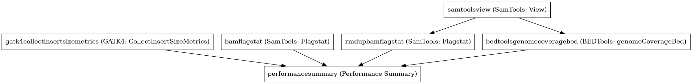

:orphan:

Performance summary workflow (whole genome)
======================================================================

``PerformanceSummaryGenome`` · *1 contributor · 1 version*

No documentation was provided: `contribute one <https://github.com/PMCC-BioinformaticsCore/janis-bioinformatics>`_

Quickstart
-----------

    .. code-block:: python

       from janis_bioinformatics.tools.pmac.performanceSummaryGenomeWorkflow import PerformanceSummaryGenome_0_1_0

       wf = WorkflowBuilder("myworkflow")

       wf.step(
           "performancesummarygenome_step",
           PerformanceSummaryGenome_0_1_0(
               bam=None,
               sample_name=None,
               genome_file=None,
           )
       )
       wf.output("performanceSummaryOut", source=performancesummarygenome_step.performanceSummaryOut)
    

*OR*

1. `Install Janis </tutorials/tutorial0.html>`_

2. Ensure Janis is configured to work with Docker or Singularity.

3. Ensure all reference files are available:

.. note:: 

   More information about these inputs are available `below <#additional-configuration-inputs>`_.

4. Generate user input files for PerformanceSummaryGenome:

.. code-block:: bash

   # user inputs
   janis inputs PerformanceSummaryGenome > inputs.yaml

**inputs.yaml**

.. code-block:: yaml

       bam: bam.bam
       genome_file: genome_file.txt
       sample_name: <value>

5. Run PerformanceSummaryGenome with:

.. code-block:: bash

   janis run [...run options] \
       --inputs inputs.yaml \
       PerformanceSummaryGenome

Information
------------

URL: *No URL to the documentation was provided*

:ID: ``PerformanceSummaryGenome``
:URL: *No URL to the documentation was provided*
:Versions: v0.1.0
:Authors: Jiaan Yu
:Citations: 
:Created: 2020-04-28
:Updated: 2020-06-12

Outputs
-----------

=====================  ======  ===============
name                   type    documentation
=====================  ======  ===============
performanceSummaryOut  csv
=====================  ======  ===============

Workflow
--------

Embedded Tools
***************

===============================  =========================================
GATK4: CollectInsertSizeMetrics  ``Gatk4CollectInsertSizeMetrics/4.1.3.0``
SamTools: Flagstat               ``SamToolsFlagstat/1.9.0``
SamTools: View                   ``SamToolsView/1.9.0``
BEDTools: genomeCoverageBed      ``bedtoolsgenomeCoverageBed/v2.29.2``
Performance Summary              ``performanceSummary/0.0.7``
===============================  =========================================

Additional configuration (inputs)
---------------------------------

=============================================  =================  ==============================================================================================================================================================================================================
name                                           type               documentation
=============================================  =================  ==============================================================================================================================================================================================================
bam                                            IndexedBam
sample_name                                    String
genome_file                                    TextFile
samtoolsview_doNotOutputAlignmentsWithBitsSet  Optional<String>   Do not output alignments with any bits set in INT present in the FLAG field. INT can be specified in hex by beginning with `0x' (i.e. /^0x[0-9A-F]+/) or in octal by beginning with `0' (i.e. /^0[0-7]+/) [0].
performancesummary_genome                      Optional<Boolean>  calculate statistics for whole genome data.--target_flagstat must not be speicified
=============================================  =================  ==============================================================================================================================================================================================================

Workflow Description Language
------------------------------

.. code-block:: text

   version development

   import "tools/Gatk4CollectInsertSizeMetrics_4_1_3_0.wdl" as G
   import "tools/SamToolsFlagstat_1_9_0.wdl" as S
   import "tools/SamToolsView_1_9_0.wdl" as S2
   import "tools/bedtoolsgenomeCoverageBed_v2_29_2.wdl" as B
   import "tools/performanceSummary_0_0_7.wdl" as P

   workflow PerformanceSummaryGenome {
     input {
       File bam
       File bam_bai
       String sample_name
       File genome_file
       String? samtoolsview_doNotOutputAlignmentsWithBitsSet = "0x400"
       Boolean? performancesummary_genome = true
     }
     call G.Gatk4CollectInsertSizeMetrics as gatk4collectinsertsizemetrics {
       input:
         bam=bam,
         bam_bai=bam_bai
     }
     call S.SamToolsFlagstat as bamflagstat {
       input:
         bam=bam
     }
     call S2.SamToolsView as samtoolsview {
       input:
         doNotOutputAlignmentsWithBitsSet=select_first([samtoolsview_doNotOutputAlignmentsWithBitsSet, "0x400"]),
         sam=bam
     }
     call S.SamToolsFlagstat as rmdupbamflagstat {
       input:
         bam=samtoolsview.out
     }
     call B.bedtoolsgenomeCoverageBed as bedtoolsgenomecoveragebed {
       input:
         inputBam=samtoolsview.out,
         genome=genome_file
     }
     call P.performanceSummary as performancesummary {
       input:
         flagstat=bamflagstat.out,
         collectInsertSizeMetrics=gatk4collectinsertsizemetrics.out,
         coverage=bedtoolsgenomecoveragebed.out,
         outputPrefix=sample_name,
         rmdupFlagstat=rmdupbamflagstat.out,
         genome=select_first([performancesummary_genome, true])
     }
     output {
       File performanceSummaryOut = performancesummary.out
     }
   }

Common Workflow Language
-------------------------

.. code-block:: text

   #!/usr/bin/env cwl-runner
   class: Workflow
   cwlVersion: v1.2
   label: Performance summary workflow (whole genome)

   requirements:
   - class: InlineJavascriptRequirement
   - class: StepInputExpressionRequirement

   inputs:
   - id: bam
     type: File
     secondaryFiles:
     - pattern: .bai
   - id: sample_name
     type: string
   - id: genome_file
     type: File
   - id: samtoolsview_doNotOutputAlignmentsWithBitsSet
     doc: |-
       Do not output alignments with any bits set in INT present in the FLAG field. INT can be specified in hex by beginning with `0x' (i.e. /^0x[0-9A-F]+/) or in octal by beginning with `0' (i.e. /^0[0-7]+/) [0].
     type: string
     default: '0x400'
   - id: performancesummary_genome
     doc: |-
       calculate statistics for whole genome data.--target_flagstat must not be speicified
     type: boolean
     default: true

   outputs:
   - id: performanceSummaryOut
     type: File
     outputSource: performancesummary/out

   steps:
   - id: gatk4collectinsertsizemetrics
     label: 'GATK4: CollectInsertSizeMetrics'
     in:
     - id: bam
       source: bam
     run: tools/Gatk4CollectInsertSizeMetrics_4_1_3_0.cwl
     out:
     - id: out
     - id: outHistogram
   - id: bamflagstat
     label: 'SamTools: Flagstat'
     in:
     - id: bam
       source: bam
     run: tools/SamToolsFlagstat_1_9_0.cwl
     out:
     - id: out
   - id: samtoolsview
     label: 'SamTools: View'
     in:
     - id: doNotOutputAlignmentsWithBitsSet
       source: samtoolsview_doNotOutputAlignmentsWithBitsSet
     - id: sam
       source: bam
     run: tools/SamToolsView_1_9_0.cwl
     out:
     - id: out
   - id: rmdupbamflagstat
     label: 'SamTools: Flagstat'
     in:
     - id: bam
       source: samtoolsview/out
     run: tools/SamToolsFlagstat_1_9_0.cwl
     out:
     - id: out
   - id: bedtoolsgenomecoveragebed
     label: 'BEDTools: genomeCoverageBed'
     in:
     - id: inputBam
       source: samtoolsview/out
     - id: genome
       source: genome_file
     run: tools/bedtoolsgenomeCoverageBed_v2_29_2.cwl
     out:
     - id: out
   - id: performancesummary
     label: Performance Summary
     in:
     - id: flagstat
       source: bamflagstat/out
     - id: collectInsertSizeMetrics
       source: gatk4collectinsertsizemetrics/out
     - id: coverage
       source: bedtoolsgenomecoveragebed/out
     - id: outputPrefix
       source: sample_name
     - id: rmdupFlagstat
       source: rmdupbamflagstat/out
     - id: genome
       source: performancesummary_genome
     run: tools/performanceSummary_0_0_7.cwl
     out:
     - id: out
   id: PerformanceSummaryGenome

