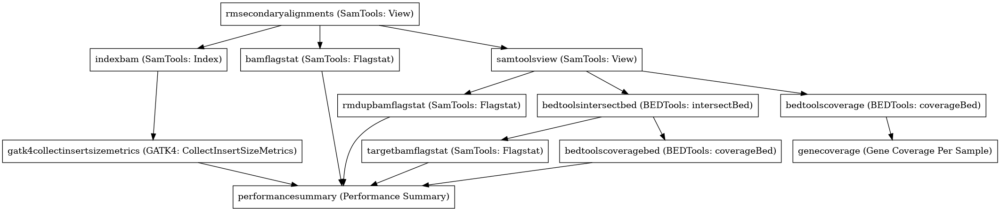

:orphan:

Performance summary workflow (targeted bed)
========================================================================

``PerformanceSummaryTargeted`` · *1 contributor · 1 version*

No documentation was provided: `contribute one <https://github.com/PMCC-BioinformaticsCore/janis-bioinformatics>`_

Quickstart
-----------

    .. code-block:: python

       from janis_bioinformatics.tools.pmac.performanceSummaryTargetedWorkflow import PerformanceSummaryTargeted_0_1_0

       wf = WorkflowBuilder("myworkflow")

       wf.step(
           "performancesummarytargeted_step",
           PerformanceSummaryTargeted_0_1_0(
               bam=None,
               genecoverage_bed=None,
               region_bed=None,
               sample_name=None,
               genome_file=None,
           )
       )
       wf.output("out", source=performancesummarytargeted_step.out)
       wf.output("geneFileOut", source=performancesummarytargeted_step.geneFileOut)
       wf.output("regionFileOut", source=performancesummarytargeted_step.regionFileOut)
    

*OR*

1. `Install Janis </tutorials/tutorial0.html>`_

2. Ensure Janis is configured to work with Docker or Singularity.

3. Ensure all reference files are available:

.. note:: 

   More information about these inputs are available `below <#additional-configuration-inputs>`_.

4. Generate user input files for PerformanceSummaryTargeted:

.. code-block:: bash

   # user inputs
   janis inputs PerformanceSummaryTargeted > inputs.yaml

**inputs.yaml**

.. code-block:: yaml

       bam: bam.bam
       genecoverage_bed: genecoverage_bed.bed
       genome_file: genome_file.txt
       region_bed: region_bed.bed
       sample_name: <value>

5. Run PerformanceSummaryTargeted with:

.. code-block:: bash

   janis run [...run options] \
       --inputs inputs.yaml \
       PerformanceSummaryTargeted

Information
------------

URL: *No URL to the documentation was provided*

:ID: ``PerformanceSummaryTargeted``
:URL: *No URL to the documentation was provided*
:Versions: v0.1.0
:Authors: Jiaan Yu
:Citations: 
:Created: 2020-04-28
:Updated: 2020-10-05

Outputs
-----------

=============  ========  ===============
name           type      documentation
=============  ========  ===============
out            csv
geneFileOut    TextFile
regionFileOut  TextFile
=============  ========  ===============

Workflow
--------

Embedded Tools
***************

===============================  =========================================
SamTools: View                   ``SamToolsView/1.9.0``
SamTools: Index                  ``SamToolsIndex/1.9.0``
GATK4: CollectInsertSizeMetrics  ``Gatk4CollectInsertSizeMetrics/4.1.2.0``
SamTools: Flagstat               ``SamToolsFlagstat/1.9.0``
BEDTools: intersectBed           ``bedtoolsintersectBed/v2.29.2``
BEDTools: coverageBed            ``bedtoolsCoverageBed/v2.29.2``
Performance Summary              ``performanceSummary/0.0.7``
Gene Coverage Per Sample         ``geneCoveragePerSample/0.0.8``
===============================  =========================================

Additional configuration (inputs)
---------------------------------

======================================================  =================  ==========================================================================================================================================================================================================================
name                                                    type               documentation
======================================================  =================  ==========================================================================================================================================================================================================================
bam                                                     IndexedBam
genecoverage_bed                                        bed
region_bed                                              bed
sample_name                                             String
genome_file                                             TextFile
rmsecondaryalignments_doNotOutputAlignmentsWithBitsSet  Optional<String>   Do not output alignments with any bits set in INT present in the FLAG field. INT can be specified in hex by beginning with `0x' (i.e. /^0x[0-9A-F]+/) or in octal by beginning with `0' (i.e. /^0[0-7]+/) [0].
samtoolsview_doNotOutputAlignmentsWithBitsSet           Optional<String>   Do not output alignments with any bits set in INT present in the FLAG field. INT can be specified in hex by beginning with `0x' (i.e. /^0x[0-9A-F]+/) or in octal by beginning with `0' (i.e. /^0[0-7]+/) [0].
bedtoolsintersectbed_sorted                             Optional<Boolean>  Use the 'chromsweep' algorithm for sorted (-k1,1 -k2,2n) input.
bedtoolscoveragebed_sorted                              Optional<Boolean>  Use the 'chromsweep' algorithm for sorted (-k1,1 -k2,2n) input.
bedtoolscoveragebed_histogram                           Optional<Boolean>  Report a histogram of coverage for each feature in A as well as a summary histogram for _all_ features in A. Output (tab delimited) after each feature in A: 1) depth 2) # bases at depth 3) size of A 4) % of A at depth.
bedtoolscoverage_sorted                                 Optional<Boolean>  Use the 'chromsweep' algorithm for sorted (-k1,1 -k2,2n) input.
bedtoolscoverage_histogram                              Optional<Boolean>  Report a histogram of coverage for each feature in A as well as a summary histogram for _all_ features in A. Output (tab delimited) after each feature in A: 1) depth 2) # bases at depth 3) size of A 4) % of A at depth.
======================================================  =================  ==========================================================================================================================================================================================================================

Workflow Description Language
------------------------------

.. code-block:: text

   version development

   import "tools/SamToolsView_1_9_0.wdl" as S
   import "tools/SamToolsIndex_1_9_0.wdl" as S2
   import "tools/Gatk4CollectInsertSizeMetrics_4_1_2_0.wdl" as G
   import "tools/SamToolsFlagstat_1_9_0.wdl" as S3
   import "tools/bedtoolsintersectBed_v2_29_2.wdl" as B
   import "tools/bedtoolsCoverageBed_v2_29_2.wdl" as B2
   import "tools/performanceSummary_0_0_7.wdl" as P
   import "tools/geneCoveragePerSample_0_0_8.wdl" as G2

   workflow PerformanceSummaryTargeted {
     input {
       File bam
       File bam_bai
       File genecoverage_bed
       File region_bed
       String sample_name
       File genome_file
       String? rmsecondaryalignments_doNotOutputAlignmentsWithBitsSet = "0x100"
       String? samtoolsview_doNotOutputAlignmentsWithBitsSet = "0x400"
       Boolean? bedtoolsintersectbed_sorted = true
       Boolean? bedtoolscoveragebed_sorted = true
       Boolean? bedtoolscoveragebed_histogram = true
       Boolean? bedtoolscoverage_sorted = true
       Boolean? bedtoolscoverage_histogram = true
     }
     call S.SamToolsView as rmsecondaryalignments {
       input:
         doNotOutputAlignmentsWithBitsSet=select_first([rmsecondaryalignments_doNotOutputAlignmentsWithBitsSet, "0x100"]),
         sam=bam
     }
     call S2.SamToolsIndex as indexbam {
       input:
         bam=rmsecondaryalignments.out
     }
     call G.Gatk4CollectInsertSizeMetrics as gatk4collectinsertsizemetrics {
       input:
         bam=indexbam.out,
         bam_bai=indexbam.out_bai
     }
     call S3.SamToolsFlagstat as bamflagstat {
       input:
         bam=rmsecondaryalignments.out
     }
     call S.SamToolsView as samtoolsview {
       input:
         doNotOutputAlignmentsWithBitsSet=select_first([samtoolsview_doNotOutputAlignmentsWithBitsSet, "0x400"]),
         sam=rmsecondaryalignments.out
     }
     call S3.SamToolsFlagstat as rmdupbamflagstat {
       input:
         bam=samtoolsview.out
     }
     call B.bedtoolsintersectBed as bedtoolsintersectbed {
       input:
         genome=genome_file,
         sorted=select_first([bedtoolsintersectbed_sorted, true]),
         inputABam=samtoolsview.out,
         inputBBed=[region_bed]
     }
     call S3.SamToolsFlagstat as targetbamflagstat {
       input:
         bam=bedtoolsintersectbed.out
     }
     call B2.bedtoolsCoverageBed as bedtoolscoveragebed {
       input:
         genome=genome_file,
         sorted=select_first([bedtoolscoveragebed_sorted, true]),
         inputABed=region_bed,
         inputBBam=bedtoolsintersectbed.out,
         histogram=select_first([bedtoolscoveragebed_histogram, true])
     }
     call P.performanceSummary as performancesummary {
       input:
         flagstat=bamflagstat.out,
         collectInsertSizeMetrics=gatk4collectinsertsizemetrics.out,
         coverage=bedtoolscoveragebed.out,
         outputPrefix=sample_name,
         targetFlagstat=targetbamflagstat.out,
         rmdupFlagstat=rmdupbamflagstat.out
     }
     call B2.bedtoolsCoverageBed as bedtoolscoverage {
       input:
         genome=genome_file,
         sorted=select_first([bedtoolscoverage_sorted, true]),
         inputABed=genecoverage_bed,
         inputBBam=samtoolsview.out,
         histogram=select_first([bedtoolscoverage_histogram, true])
     }
     call G2.geneCoveragePerSample as genecoverage {
       input:
         sampleName=sample_name,
         bedtoolsOutputPath=bedtoolscoverage.out
     }
     output {
       File out = performancesummary.out
       File geneFileOut = genecoverage.geneFileOut
       File regionFileOut = genecoverage.regionFileOut
     }
   }

Common Workflow Language
-------------------------

.. code-block:: text

   #!/usr/bin/env cwl-runner
   class: Workflow
   cwlVersion: v1.2
   label: Performance summary workflow (targeted bed)

   requirements:
   - class: InlineJavascriptRequirement
   - class: StepInputExpressionRequirement
   - class: MultipleInputFeatureRequirement

   inputs:
   - id: bam
     type: File
     secondaryFiles:
     - pattern: .bai
   - id: genecoverage_bed
     type: File
   - id: region_bed
     type: File
   - id: sample_name
     type: string
   - id: genome_file
     type: File
   - id: rmsecondaryalignments_doNotOutputAlignmentsWithBitsSet
     doc: |-
       Do not output alignments with any bits set in INT present in the FLAG field. INT can be specified in hex by beginning with `0x' (i.e. /^0x[0-9A-F]+/) or in octal by beginning with `0' (i.e. /^0[0-7]+/) [0].
     type: string
     default: '0x100'
   - id: samtoolsview_doNotOutputAlignmentsWithBitsSet
     doc: |-
       Do not output alignments with any bits set in INT present in the FLAG field. INT can be specified in hex by beginning with `0x' (i.e. /^0x[0-9A-F]+/) or in octal by beginning with `0' (i.e. /^0[0-7]+/) [0].
     type: string
     default: '0x400'
   - id: bedtoolsintersectbed_sorted
     doc: Use the 'chromsweep' algorithm for sorted (-k1,1 -k2,2n) input.
     type: boolean
     default: true
   - id: bedtoolscoveragebed_sorted
     doc: Use the 'chromsweep' algorithm for sorted (-k1,1 -k2,2n) input.
     type: boolean
     default: true
   - id: bedtoolscoveragebed_histogram
     doc: |-
       Report a histogram of coverage for each feature in A as well as a summary histogram for _all_ features in A. Output (tab delimited) after each feature in A: 1) depth 2) # bases at depth 3) size of A 4) % of A at depth.
     type: boolean
     default: true
   - id: bedtoolscoverage_sorted
     doc: Use the 'chromsweep' algorithm for sorted (-k1,1 -k2,2n) input.
     type: boolean
     default: true
   - id: bedtoolscoverage_histogram
     doc: |-
       Report a histogram of coverage for each feature in A as well as a summary histogram for _all_ features in A. Output (tab delimited) after each feature in A: 1) depth 2) # bases at depth 3) size of A 4) % of A at depth.
     type: boolean
     default: true

   outputs:
   - id: out
     type: File
     outputSource: performancesummary/out
   - id: geneFileOut
     type: File
     outputSource: genecoverage/geneFileOut
   - id: regionFileOut
     type: File
     outputSource: genecoverage/regionFileOut

   steps:
   - id: rmsecondaryalignments
     label: 'SamTools: View'
     in:
     - id: doNotOutputAlignmentsWithBitsSet
       source: rmsecondaryalignments_doNotOutputAlignmentsWithBitsSet
     - id: sam
       source: bam
     run: tools/SamToolsView_1_9_0.cwl
     out:
     - id: out
   - id: indexbam
     label: 'SamTools: Index'
     in:
     - id: bam
       source: rmsecondaryalignments/out
     run: tools/SamToolsIndex_1_9_0.cwl
     out:
     - id: out
   - id: gatk4collectinsertsizemetrics
     label: 'GATK4: CollectInsertSizeMetrics'
     in:
     - id: bam
       source: indexbam/out
     run: tools/Gatk4CollectInsertSizeMetrics_4_1_2_0.cwl
     out:
     - id: out
     - id: outHistogram
   - id: bamflagstat
     label: 'SamTools: Flagstat'
     in:
     - id: bam
       source: rmsecondaryalignments/out
     run: tools/SamToolsFlagstat_1_9_0.cwl
     out:
     - id: out
   - id: samtoolsview
     label: 'SamTools: View'
     in:
     - id: doNotOutputAlignmentsWithBitsSet
       source: samtoolsview_doNotOutputAlignmentsWithBitsSet
     - id: sam
       source: rmsecondaryalignments/out
     run: tools/SamToolsView_1_9_0.cwl
     out:
     - id: out
   - id: rmdupbamflagstat
     label: 'SamTools: Flagstat'
     in:
     - id: bam
       source: samtoolsview/out
     run: tools/SamToolsFlagstat_1_9_0.cwl
     out:
     - id: out
   - id: bedtoolsintersectbed
     label: 'BEDTools: intersectBed'
     in:
     - id: genome
       source: genome_file
     - id: sorted
       source: bedtoolsintersectbed_sorted
     - id: inputABam
       source: samtoolsview/out
     - id: inputBBed
       source:
       - region_bed
       linkMerge: merge_nested
     run: tools/bedtoolsintersectBed_v2_29_2.cwl
     out:
     - id: out
   - id: targetbamflagstat
     label: 'SamTools: Flagstat'
     in:
     - id: bam
       source: bedtoolsintersectbed/out
     run: tools/SamToolsFlagstat_1_9_0.cwl
     out:
     - id: out
   - id: bedtoolscoveragebed
     label: 'BEDTools: coverageBed'
     in:
     - id: genome
       source: genome_file
     - id: sorted
       source: bedtoolscoveragebed_sorted
     - id: inputABed
       source: region_bed
     - id: inputBBam
       source: bedtoolsintersectbed/out
     - id: histogram
       source: bedtoolscoveragebed_histogram
     run: tools/bedtoolsCoverageBed_v2_29_2.cwl
     out:
     - id: out
   - id: performancesummary
     label: Performance Summary
     in:
     - id: flagstat
       source: bamflagstat/out
     - id: collectInsertSizeMetrics
       source: gatk4collectinsertsizemetrics/out
     - id: coverage
       source: bedtoolscoveragebed/out
     - id: outputPrefix
       source: sample_name
     - id: targetFlagstat
       source: targetbamflagstat/out
     - id: rmdupFlagstat
       source: rmdupbamflagstat/out
     run: tools/performanceSummary_0_0_7.cwl
     out:
     - id: out
   - id: bedtoolscoverage
     label: 'BEDTools: coverageBed'
     in:
     - id: genome
       source: genome_file
     - id: sorted
       source: bedtoolscoverage_sorted
     - id: inputABed
       source: genecoverage_bed
     - id: inputBBam
       source: samtoolsview/out
     - id: histogram
       source: bedtoolscoverage_histogram
     run: tools/bedtoolsCoverageBed_v2_29_2.cwl
     out:
     - id: out
   - id: genecoverage
     label: Gene Coverage Per Sample
     in:
     - id: sampleName
       source: sample_name
     - id: bedtoolsOutputPath
       source: bedtoolscoverage/out
     run: tools/geneCoveragePerSample_0_0_8.cwl
     out:
     - id: geneFileOut
     - id: regionFileOut
   id: PerformanceSummaryTargeted

