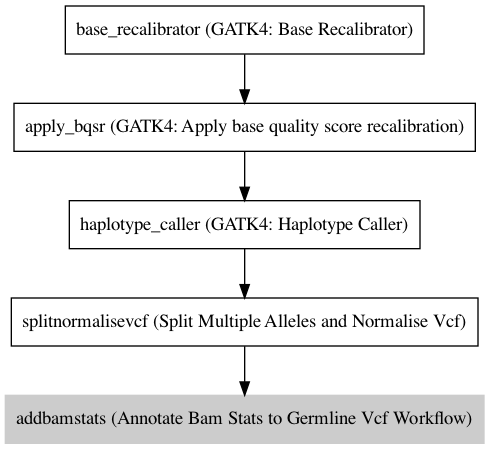

:orphan:

GATK4 Germline Variant Caller
===========================================================

``GATK4_GermlineVariantCaller`` · *2 contributors · 2 versions*

This is a VariantCaller based on the GATK Best Practice pipelines. It uses the GATK4 toolkit, specifically 4.0.12.0.

        It has the following steps:

        1. BaseRecalibrator
        2. ApplyBQSR
        3. HaplotypeCaller
        4. SplitMultiAlleleNormaliseVcf
        5. AddBamStatsGermline

Quickstart
-----------

    .. code-block:: python

       from janis_bioinformatics.tools.variantcallers.gatk.gatkgermline_variants_4_0_12 import GatkGermlineVariantCaller_4_0_12

       wf = WorkflowBuilder("myworkflow")

       wf.step(
           "gatk4_germlinevariantcaller_step",
           GatkGermlineVariantCaller_4_0_12(
               bam=None,
               reference=None,
               snps_dbsnp=None,
               snps_1000gp=None,
               known_indels=None,
               mills_indels=None,
           )
       )
       wf.output("variants", source=gatk4_germlinevariantcaller_step.variants)
       wf.output("out_bam", source=gatk4_germlinevariantcaller_step.out_bam)
       wf.output("out", source=gatk4_germlinevariantcaller_step.out)
    

*OR*

1. `Install Janis </tutorials/tutorial0.html>`_

2. Ensure Janis is configured to work with Docker or Singularity.

3. Ensure all reference files are available:

.. note:: 

   More information about these inputs are available `below <#additional-configuration-inputs>`_.

4. Generate user input files for GATK4_GermlineVariantCaller:

.. code-block:: bash

   # user inputs
   janis inputs GATK4_GermlineVariantCaller > inputs.yaml

**inputs.yaml**

.. code-block:: yaml

       bam: bam.bam
       known_indels: known_indels.vcf.gz
       mills_indels: mills_indels.vcf.gz
       reference: reference.fasta
       snps_1000gp: snps_1000gp.vcf.gz
       snps_dbsnp: snps_dbsnp.vcf.gz

5. Run GATK4_GermlineVariantCaller with:

.. code-block:: bash

   janis run [...run options] \
       --inputs inputs.yaml \
       GATK4_GermlineVariantCaller

Information
------------

URL: *No URL to the documentation was provided*

:ID: ``GATK4_GermlineVariantCaller``
:URL: *No URL to the documentation was provided*
:Versions: 4.0.12.0, 4.1.3.0
:Authors: Michael Franklin, Jiaan Yu
:Citations: 
:Created: 2019-02-01
:Updated: None

Outputs
-----------

========  ============  ===============
name      type          documentation
========  ============  ===============
variants  Gzipped<VCF>
out_bam   IndexedBam
out       VCF
========  ============  ===============

Workflow
--------

Embedded Tools
***************

=============================================  ========================================
GATK4: Base Recalibrator                       ``Gatk4BaseRecalibrator/4.0.12.0``
GATK4: Apply base quality score recalibration  ``Gatk4ApplyBQSR/4.0.12.0``
GATK4: Haplotype Caller                        ``Gatk4HaplotypeCaller/4.0.12.0``
Split Multiple Alleles and Normalise Vcf       ``SplitMultiAlleleNormaliseVcf/v0.5772``
Annotate Bam Stats to Germline Vcf Workflow    ``AddBamStatsGermline/v0.1.0``
=============================================  ========================================

Additional configuration (inputs)
---------------------------------

======================================  ================  =============================================================================================================================================================================================================================================================================================================================================================================================================================================
name                                    type              documentation
======================================  ================  =============================================================================================================================================================================================================================================================================================================================================================================================================================================
bam                                     IndexedBam
reference                               FastaWithIndexes
snps_dbsnp                              Gzipped<VCF>
snps_1000gp                             Gzipped<VCF>
known_indels                            Gzipped<VCF>
mills_indels                            Gzipped<VCF>
intervals                               Optional<bed>     This optional interval supports processing by regions. If this input resolves to null, then GATK will process the whole genome per each tool's spec
haplotype_caller_pairHmmImplementation  Optional<String>  The PairHMM implementation to use for genotype likelihood calculations. The various implementations balance a tradeoff of accuracy and runtime. The --pair-hmm-implementation argument is an enumerated type (Implementation), which can have one of the following values: EXACT;ORIGINAL;LOGLESS_CACHING;AVX_LOGLESS_CACHING;AVX_LOGLESS_CACHING_OMP;EXPERIMENTAL_FPGA_LOGLESS_CACHING;FASTEST_AVAILABLE. Implementation:  FASTEST_AVAILABLE
======================================  ================  =============================================================================================================================================================================================================================================================================================================================================================================================================================================

Workflow Description Language
------------------------------

.. code-block:: text

   version development

   import "tools/Gatk4BaseRecalibrator_4_0_12_0.wdl" as G
   import "tools/Gatk4ApplyBQSR_4_0_12_0.wdl" as G2
   import "tools/Gatk4HaplotypeCaller_4_0_12_0.wdl" as G3
   import "tools/SplitMultiAlleleNormaliseVcf_v0_5772.wdl" as S
   import "tools/AddBamStatsGermline_v0_1_0.wdl" as A

   workflow GATK4_GermlineVariantCaller {
     input {
       File bam
       File bam_bai
       File? intervals
       File reference
       File reference_fai
       File reference_amb
       File reference_ann
       File reference_bwt
       File reference_pac
       File reference_sa
       File reference_dict
       File snps_dbsnp
       File snps_dbsnp_tbi
       File snps_1000gp
       File snps_1000gp_tbi
       File known_indels
       File known_indels_tbi
       File mills_indels
       File mills_indels_tbi
       String? haplotype_caller_pairHmmImplementation = "LOGLESS_CACHING"
     }
     call G.Gatk4BaseRecalibrator as base_recalibrator {
       input:
         bam=bam,
         bam_bai=bam_bai,
         knownSites=[snps_dbsnp, snps_1000gp, known_indels, mills_indels],
         knownSites_tbi=[snps_dbsnp_tbi, snps_1000gp_tbi, known_indels_tbi, mills_indels_tbi],
         reference=reference,
         reference_fai=reference_fai,
         reference_amb=reference_amb,
         reference_ann=reference_ann,
         reference_bwt=reference_bwt,
         reference_pac=reference_pac,
         reference_sa=reference_sa,
         reference_dict=reference_dict,
         intervals=intervals
     }
     call G2.Gatk4ApplyBQSR as apply_bqsr {
       input:
         bam=bam,
         bam_bai=bam_bai,
         reference=reference,
         reference_fai=reference_fai,
         reference_amb=reference_amb,
         reference_ann=reference_ann,
         reference_bwt=reference_bwt,
         reference_pac=reference_pac,
         reference_sa=reference_sa,
         reference_dict=reference_dict,
         recalFile=base_recalibrator.out,
         intervals=intervals
     }
     call G3.Gatk4HaplotypeCaller as haplotype_caller {
       input:
         pairHmmImplementation=select_first([haplotype_caller_pairHmmImplementation, "LOGLESS_CACHING"]),
         inputRead=apply_bqsr.out,
         inputRead_bai=apply_bqsr.out_bai,
         reference=reference,
         reference_fai=reference_fai,
         reference_amb=reference_amb,
         reference_ann=reference_ann,
         reference_bwt=reference_bwt,
         reference_pac=reference_pac,
         reference_sa=reference_sa,
         reference_dict=reference_dict,
         dbsnp=snps_dbsnp,
         dbsnp_tbi=snps_dbsnp_tbi,
         intervals=intervals
     }
     call S.SplitMultiAlleleNormaliseVcf as splitnormalisevcf {
       input:
         compressedVcf=haplotype_caller.out,
         reference=reference,
         reference_fai=reference_fai,
         reference_amb=reference_amb,
         reference_ann=reference_ann,
         reference_bwt=reference_bwt,
         reference_pac=reference_pac,
         reference_sa=reference_sa,
         reference_dict=reference_dict
     }
     call A.AddBamStatsGermline as addbamstats {
       input:
         bam=bam,
         bam_bai=bam_bai,
         vcf=splitnormalisevcf.out,
         reference=reference,
         reference_fai=reference_fai,
         reference_amb=reference_amb,
         reference_ann=reference_ann,
         reference_bwt=reference_bwt,
         reference_pac=reference_pac,
         reference_sa=reference_sa,
         reference_dict=reference_dict
     }
     output {
       File variants = haplotype_caller.out
       File variants_tbi = haplotype_caller.out_tbi
       File out_bam = haplotype_caller.bam
       File out_bam_bai = haplotype_caller.bam_bai
       File out = addbamstats.out
     }
   }

Common Workflow Language
-------------------------

.. code-block:: text

   #!/usr/bin/env cwl-runner
   class: Workflow
   cwlVersion: v1.2
   label: GATK4 Germline Variant Caller
   doc: |-
     This is a VariantCaller based on the GATK Best Practice pipelines. It uses the GATK4 toolkit, specifically 4.0.12.0.

             It has the following steps:

             1. BaseRecalibrator
             2. ApplyBQSR
             3. HaplotypeCaller
             4. SplitMultiAlleleNormaliseVcf
             5. AddBamStatsGermline

   requirements:
   - class: InlineJavascriptRequirement
   - class: StepInputExpressionRequirement
   - class: SubworkflowFeatureRequirement
   - class: MultipleInputFeatureRequirement

   inputs:
   - id: bam
     type: File
     secondaryFiles:
     - pattern: .bai
   - id: intervals
     doc: |-
       This optional interval supports processing by regions. If this input resolves to null, then GATK will process the whole genome per each tool's spec
     type:
     - File
     - 'null'
   - id: reference
     type: File
     secondaryFiles:
     - pattern: .fai
     - pattern: .amb
     - pattern: .ann
     - pattern: .bwt
     - pattern: .pac
     - pattern: .sa
     - pattern: ^.dict
   - id: snps_dbsnp
     type: File
     secondaryFiles:
     - pattern: .tbi
   - id: snps_1000gp
     type: File
     secondaryFiles:
     - pattern: .tbi
   - id: known_indels
     type: File
     secondaryFiles:
     - pattern: .tbi
   - id: mills_indels
     type: File
     secondaryFiles:
     - pattern: .tbi
   - id: haplotype_caller_pairHmmImplementation
     doc: |-
       The PairHMM implementation to use for genotype likelihood calculations. The various implementations balance a tradeoff of accuracy and runtime. The --pair-hmm-implementation argument is an enumerated type (Implementation), which can have one of the following values: EXACT;ORIGINAL;LOGLESS_CACHING;AVX_LOGLESS_CACHING;AVX_LOGLESS_CACHING_OMP;EXPERIMENTAL_FPGA_LOGLESS_CACHING;FASTEST_AVAILABLE. Implementation:  FASTEST_AVAILABLE
     type: string
     default: LOGLESS_CACHING

   outputs:
   - id: variants
     type: File
     secondaryFiles:
     - pattern: .tbi
     outputSource: haplotype_caller/out
   - id: out_bam
     type: File
     secondaryFiles:
     - pattern: .bai
     outputSource: haplotype_caller/bam
   - id: out
     type: File
     outputSource: addbamstats/out

   steps:
   - id: base_recalibrator
     label: 'GATK4: Base Recalibrator'
     in:
     - id: bam
       source: bam
     - id: knownSites
       source:
       - snps_dbsnp
       - snps_1000gp
       - known_indels
       - mills_indels
     - id: reference
       source: reference
     - id: intervals
       source: intervals
     run: tools/Gatk4BaseRecalibrator_4_0_12_0.cwl
     out:
     - id: out
   - id: apply_bqsr
     label: 'GATK4: Apply base quality score recalibration'
     in:
     - id: bam
       source: bam
     - id: reference
       source: reference
     - id: recalFile
       source: base_recalibrator/out
     - id: intervals
       source: intervals
     run: tools/Gatk4ApplyBQSR_4_0_12_0.cwl
     out:
     - id: out
   - id: haplotype_caller
     label: 'GATK4: Haplotype Caller'
     in:
     - id: pairHmmImplementation
       source: haplotype_caller_pairHmmImplementation
     - id: inputRead
       source: apply_bqsr/out
     - id: reference
       source: reference
     - id: dbsnp
       source: snps_dbsnp
     - id: intervals
       source: intervals
     run: tools/Gatk4HaplotypeCaller_4_0_12_0.cwl
     out:
     - id: out
     - id: bam
   - id: splitnormalisevcf
     label: Split Multiple Alleles and Normalise Vcf
     in:
     - id: compressedVcf
       source: haplotype_caller/out
     - id: reference
       source: reference
     run: tools/SplitMultiAlleleNormaliseVcf_v0_5772.cwl
     out:
     - id: out
   - id: addbamstats
     label: Annotate Bam Stats to Germline Vcf Workflow
     in:
     - id: bam
       source: bam
     - id: vcf
       source: splitnormalisevcf/out
     - id: reference
       source: reference
     run: tools/AddBamStatsGermline_v0_1_0.cwl
     out:
     - id: out
   id: GATK4_GermlineVariantCaller

