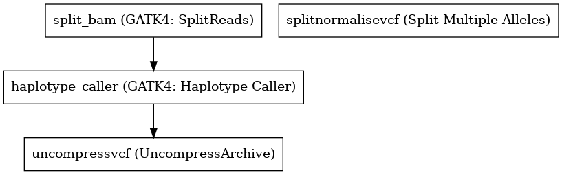

:orphan:

GATK4 Germline Variant Caller
===========================================================

``GATK4_GermlineVariantCaller`` · *2 contributors · 2 versions*

This is a VariantCaller based on the GATK Best Practice pipelines. It uses the GATK4 toolkit, specifically 4.1.3.

        It has the following steps:

        1. Split Bam based on intervals (bed)
        2. HaplotypeCaller
        3. SplitMultiAllele

Quickstart
-----------

    .. code-block:: python

       from janis_bioinformatics.tools.variantcallers.gatk.gatkgermline_variants_4_1_3 import GatkGermlineVariantCaller_4_1_3

       wf = WorkflowBuilder("myworkflow")

       wf.step(
           "gatk4_germlinevariantcaller_step",
           GatkGermlineVariantCaller_4_1_3(
               bam=None,
               reference=None,
               snps_dbsnp=None,
           )
       )
       wf.output("variants", source=gatk4_germlinevariantcaller_step.variants)
       wf.output("out_bam", source=gatk4_germlinevariantcaller_step.out_bam)
       wf.output("out", source=gatk4_germlinevariantcaller_step.out)
    

*OR*

1. `Install Janis </tutorials/tutorial0.html>`_

2. Ensure Janis is configured to work with Docker or Singularity.

3. Ensure all reference files are available:

.. note:: 

   More information about these inputs are available `below <#additional-configuration-inputs>`_.

4. Generate user input files for GATK4_GermlineVariantCaller:

.. code-block:: bash

   # user inputs
   janis inputs GATK4_GermlineVariantCaller > inputs.yaml

**inputs.yaml**

.. code-block:: yaml

       bam: bam.bam
       reference: reference.fasta
       snps_dbsnp: snps_dbsnp.vcf.gz

5. Run GATK4_GermlineVariantCaller with:

.. code-block:: bash

   janis run [...run options] \
       --inputs inputs.yaml \
       GATK4_GermlineVariantCaller

Information
------------

URL: *No URL to the documentation was provided*

:ID: ``GATK4_GermlineVariantCaller``
:URL: *No URL to the documentation was provided*
:Versions: 4.0.12.0, 4.1.3.0
:Authors: Michael Franklin, Jiaan
:Citations: 
:Created: 2019-09-01
:Updated: 2019-09-13

Outputs
-----------

========  ============  ===============
name      type          documentation
========  ============  ===============
variants  Gzipped<VCF>
out_bam   IndexedBam
out       VCF
========  ============  ===============

Workflow
--------

Embedded Tools
***************

=======================  ================================
GATK4: SplitReads        ``Gatk4SplitReads/4.1.3.0``
GATK4: Haplotype Caller  ``Gatk4HaplotypeCaller/4.1.3.0``
UncompressArchive        ``UncompressArchive/v1.0.0``
Split Multiple Alleles   ``SplitMultiAllele/v0.5772``
=======================  ================================

Additional configuration (inputs)
---------------------------------

======================================  ================  =============================================================================================================================================================================================================================================================================================================================================================================================================================================
name                                    type              documentation
======================================  ================  =============================================================================================================================================================================================================================================================================================================================================================================================================================================
bam                                     IndexedBam
reference                               FastaWithIndexes
snps_dbsnp                              Gzipped<VCF>
intervals                               Optional<bed>     This optional interval supports processing by regions. If this input resolves to null, then GATK will process the whole genome per each tool's spec
haplotype_caller_pairHmmImplementation  Optional<String>  The PairHMM implementation to use for genotype likelihood calculations. The various implementations balance a tradeoff of accuracy and runtime. The --pair-hmm-implementation argument is an enumerated type (Implementation), which can have one of the following values: EXACT;ORIGINAL;LOGLESS_CACHING;AVX_LOGLESS_CACHING;AVX_LOGLESS_CACHING_OMP;EXPERIMENTAL_FPGA_LOGLESS_CACHING;FASTEST_AVAILABLE. Implementation:  FASTEST_AVAILABLE
======================================  ================  =============================================================================================================================================================================================================================================================================================================================================================================================================================================

Workflow Description Language
------------------------------

.. code-block:: text

   version development

   import "tools/Gatk4SplitReads_4_1_3_0.wdl" as G
   import "tools/Gatk4HaplotypeCaller_4_1_3_0.wdl" as G2
   import "tools/UncompressArchive_v1_0_0.wdl" as U
   import "tools/SplitMultiAllele_v0_5772.wdl" as S

   workflow GATK4_GermlineVariantCaller {
     input {
       File bam
       File bam_bai
       File? intervals
       File reference
       File reference_fai
       File reference_amb
       File reference_ann
       File reference_bwt
       File reference_pac
       File reference_sa
       File reference_dict
       File snps_dbsnp
       File snps_dbsnp_tbi
       String? haplotype_caller_pairHmmImplementation = "LOGLESS_CACHING"
     }
     call G.Gatk4SplitReads as split_bam {
       input:
         bam=bam,
         bam_bai=bam_bai,
         intervals=intervals
     }
     call G2.Gatk4HaplotypeCaller as haplotype_caller {
       input:
         pairHmmImplementation=select_first([haplotype_caller_pairHmmImplementation, "LOGLESS_CACHING"]),
         inputRead=split_bam.out,
         inputRead_bai=split_bam.out_bai,
         reference=reference,
         reference_fai=reference_fai,
         reference_amb=reference_amb,
         reference_ann=reference_ann,
         reference_bwt=reference_bwt,
         reference_pac=reference_pac,
         reference_sa=reference_sa,
         reference_dict=reference_dict,
         dbsnp=snps_dbsnp,
         dbsnp_tbi=snps_dbsnp_tbi,
         intervals=intervals
     }
     call U.UncompressArchive as uncompressvcf {
       input:
         file=haplotype_caller.out
     }
     call S.SplitMultiAllele as splitnormalisevcf {
       input:
         vcf=uncompressvcf.out,
         reference=reference,
         reference_fai=reference_fai,
         reference_amb=reference_amb,
         reference_ann=reference_ann,
         reference_bwt=reference_bwt,
         reference_pac=reference_pac,
         reference_sa=reference_sa,
         reference_dict=reference_dict
     }
     output {
       File variants = haplotype_caller.out
       File variants_tbi = haplotype_caller.out_tbi
       File out_bam = haplotype_caller.bam
       File out_bam_bai = haplotype_caller.bam_bai
       File out = splitnormalisevcf.out
     }
   }

Common Workflow Language
-------------------------

.. code-block:: text

   #!/usr/bin/env cwl-runner
   class: Workflow
   cwlVersion: v1.2
   label: GATK4 Germline Variant Caller
   doc: |-
     This is a VariantCaller based on the GATK Best Practice pipelines. It uses the GATK4 toolkit, specifically 4.1.3.

             It has the following steps:

             1. Split Bam based on intervals (bed)
             2. HaplotypeCaller
             3. SplitMultiAllele

   requirements:
   - class: InlineJavascriptRequirement
   - class: StepInputExpressionRequirement

   inputs:
   - id: bam
     type: File
     secondaryFiles:
     - pattern: .bai
   - id: intervals
     doc: |-
       This optional interval supports processing by regions. If this input resolves to null, then GATK will process the whole genome per each tool's spec
     type:
     - File
     - 'null'
   - id: reference
     type: File
     secondaryFiles:
     - pattern: .fai
     - pattern: .amb
     - pattern: .ann
     - pattern: .bwt
     - pattern: .pac
     - pattern: .sa
     - pattern: ^.dict
   - id: snps_dbsnp
     type: File
     secondaryFiles:
     - pattern: .tbi
   - id: haplotype_caller_pairHmmImplementation
     doc: |-
       The PairHMM implementation to use for genotype likelihood calculations. The various implementations balance a tradeoff of accuracy and runtime. The --pair-hmm-implementation argument is an enumerated type (Implementation), which can have one of the following values: EXACT;ORIGINAL;LOGLESS_CACHING;AVX_LOGLESS_CACHING;AVX_LOGLESS_CACHING_OMP;EXPERIMENTAL_FPGA_LOGLESS_CACHING;FASTEST_AVAILABLE. Implementation:  FASTEST_AVAILABLE
     type: string
     default: LOGLESS_CACHING

   outputs:
   - id: variants
     type: File
     secondaryFiles:
     - pattern: .tbi
     outputSource: haplotype_caller/out
   - id: out_bam
     type: File
     secondaryFiles:
     - pattern: .bai
     outputSource: haplotype_caller/bam
   - id: out
     type: File
     outputSource: splitnormalisevcf/out

   steps:
   - id: split_bam
     label: 'GATK4: SplitReads'
     in:
     - id: bam
       source: bam
     - id: intervals
       source: intervals
     run: tools/Gatk4SplitReads_4_1_3_0.cwl
     out:
     - id: out
   - id: haplotype_caller
     label: 'GATK4: Haplotype Caller'
     in:
     - id: pairHmmImplementation
       source: haplotype_caller_pairHmmImplementation
     - id: inputRead
       source: split_bam/out
     - id: reference
       source: reference
     - id: dbsnp
       source: snps_dbsnp
     - id: intervals
       source: intervals
     run: tools/Gatk4HaplotypeCaller_4_1_3_0.cwl
     out:
     - id: out
     - id: bam
   - id: uncompressvcf
     label: UncompressArchive
     in:
     - id: file
       source: haplotype_caller/out
     run: tools/UncompressArchive_v1_0_0.cwl
     out:
     - id: out
   - id: splitnormalisevcf
     label: Split Multiple Alleles
     in:
     - id: vcf
     - id: reference
       source: reference
     run: tools/SplitMultiAllele_v0_5772.cwl
     out:
     - id: out
   id: GATK4_GermlineVariantCaller

