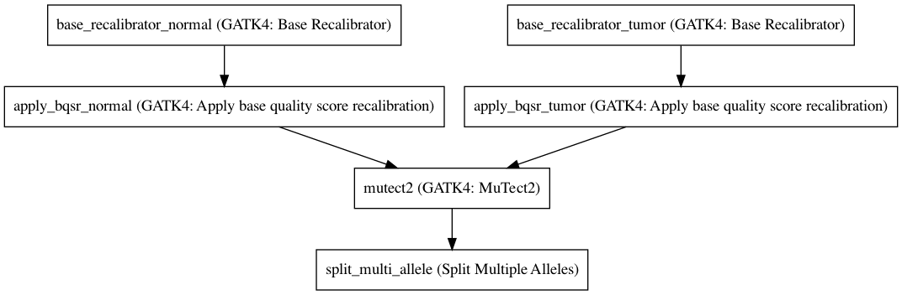

:orphan:

GATK4 Somatic Variant Caller
=========================================================

``GATK4_SomaticVariantCaller`` · *1 contributor · 2 versions*

This is a VariantCaller based on the GATK Best Practice pipelines. It uses the GATK4 toolkit, specifically 4.0.12.0.

        It has the following steps:

        1. Base Recalibrator x 2
        3. Mutect2
        4. SplitMultiAllele

Quickstart
-----------

    .. code-block:: python

       from janis_bioinformatics.tools.variantcallers.gatk.gatksomatic_variants_4_0_12 import GatkSomaticVariantCaller_4_0_12

       wf = WorkflowBuilder("myworkflow")

       wf.step(
           "gatk4_somaticvariantcaller_step",
           GatkSomaticVariantCaller_4_0_12(
               normal_bam=None,
               tumor_bam=None,
               normal_name=None,
               tumor_name=None,
               reference=None,
               snps_dbsnp=None,
               snps_1000gp=None,
               known_indels=None,
               mills_indels=None,
           )
       )
       wf.output("out", source=gatk4_somaticvariantcaller_step.out)
    

*OR*

1. `Install Janis </tutorials/tutorial0.html>`_

2. Ensure Janis is configured to work with Docker or Singularity.

3. Ensure all reference files are available:

.. note:: 

   More information about these inputs are available `below <#additional-configuration-inputs>`_.

4. Generate user input files for GATK4_SomaticVariantCaller:

.. code-block:: bash

   # user inputs
   janis inputs GATK4_SomaticVariantCaller > inputs.yaml

**inputs.yaml**

.. code-block:: yaml

       known_indels: known_indels.vcf.gz
       mills_indels: mills_indels.vcf.gz
       normal_bam: normal_bam.bam
       normal_name: <value>
       reference: reference.fasta
       snps_1000gp: snps_1000gp.vcf.gz
       snps_dbsnp: snps_dbsnp.vcf.gz
       tumor_bam: tumor_bam.bam
       tumor_name: <value>

5. Run GATK4_SomaticVariantCaller with:

.. code-block:: bash

   janis run [...run options] \
       --inputs inputs.yaml \
       GATK4_SomaticVariantCaller

Information
------------

URL: *No URL to the documentation was provided*

:ID: ``GATK4_SomaticVariantCaller``
:URL: *No URL to the documentation was provided*
:Versions: 4.0.12.0, 4.1.3.0
:Authors: Michael Franklin
:Citations: 
:Created: 2019-02-01
:Updated: 2019-09-13

Outputs
-----------

======  ======  ===============
name    type    documentation
======  ======  ===============
out     VCF
======  ======  ===============

Workflow
--------

Embedded Tools
***************

=============================================  ==================================
GATK4: Base Recalibrator                       ``Gatk4BaseRecalibrator/4.0.12.0``
GATK4: Apply base quality score recalibration  ``Gatk4ApplyBQSR/4.0.12.0``
GATK4: MuTect2                                 ``Gatk4Mutect2/4.0.12.0``
Split Multiple Alleles                         ``SplitMultiAllele/v0.5772``
=============================================  ==================================

Additional configuration (inputs)
---------------------------------

============  ================  ===================================================================================================================================================
name          type              documentation
============  ================  ===================================================================================================================================================
normal_bam    IndexedBam
tumor_bam     IndexedBam
normal_name   String
tumor_name    String
reference     FastaWithIndexes
snps_dbsnp    Gzipped<VCF>
snps_1000gp   Gzipped<VCF>
known_indels  Gzipped<VCF>
mills_indels  Gzipped<VCF>
intervals     Optional<bed>     This optional interval supports processing by regions. If this input resolves to null, then GATK will process the whole genome per each tool's spec
============  ================  ===================================================================================================================================================

Workflow Description Language
------------------------------

.. code-block:: text

   version development

   import "tools/Gatk4BaseRecalibrator_4_0_12_0.wdl" as G
   import "tools/Gatk4ApplyBQSR_4_0_12_0.wdl" as G2
   import "tools/Gatk4Mutect2_4_0_12_0.wdl" as G3
   import "tools/SplitMultiAllele_v0_5772.wdl" as S

   workflow GATK4_SomaticVariantCaller {
     input {
       File normal_bam
       File normal_bam_bai
       File tumor_bam
       File tumor_bam_bai
       String normal_name
       String tumor_name
       File? intervals
       File reference
       File reference_fai
       File reference_amb
       File reference_ann
       File reference_bwt
       File reference_pac
       File reference_sa
       File reference_dict
       File snps_dbsnp
       File snps_dbsnp_tbi
       File snps_1000gp
       File snps_1000gp_tbi
       File known_indels
       File known_indels_tbi
       File mills_indels
       File mills_indels_tbi
     }
     call G.Gatk4BaseRecalibrator as base_recalibrator_normal {
       input:
         bam=normal_bam,
         bam_bai=normal_bam_bai,
         knownSites=[snps_dbsnp, snps_1000gp, known_indels, mills_indels],
         knownSites_tbi=[snps_dbsnp_tbi, snps_1000gp_tbi, known_indels_tbi, mills_indels_tbi],
         reference=reference,
         reference_fai=reference_fai,
         reference_amb=reference_amb,
         reference_ann=reference_ann,
         reference_bwt=reference_bwt,
         reference_pac=reference_pac,
         reference_sa=reference_sa,
         reference_dict=reference_dict,
         intervals=intervals
     }
     call G.Gatk4BaseRecalibrator as base_recalibrator_tumor {
       input:
         bam=tumor_bam,
         bam_bai=tumor_bam_bai,
         knownSites=[snps_dbsnp, snps_1000gp, known_indels, mills_indels],
         knownSites_tbi=[snps_dbsnp_tbi, snps_1000gp_tbi, known_indels_tbi, mills_indels_tbi],
         reference=reference,
         reference_fai=reference_fai,
         reference_amb=reference_amb,
         reference_ann=reference_ann,
         reference_bwt=reference_bwt,
         reference_pac=reference_pac,
         reference_sa=reference_sa,
         reference_dict=reference_dict,
         intervals=intervals
     }
     call G2.Gatk4ApplyBQSR as apply_bqsr_normal {
       input:
         bam=normal_bam,
         bam_bai=normal_bam_bai,
         reference=reference,
         reference_fai=reference_fai,
         reference_amb=reference_amb,
         reference_ann=reference_ann,
         reference_bwt=reference_bwt,
         reference_pac=reference_pac,
         reference_sa=reference_sa,
         reference_dict=reference_dict,
         recalFile=base_recalibrator_normal.out,
         intervals=intervals
     }
     call G2.Gatk4ApplyBQSR as apply_bqsr_tumor {
       input:
         bam=tumor_bam,
         bam_bai=tumor_bam_bai,
         reference=reference,
         reference_fai=reference_fai,
         reference_amb=reference_amb,
         reference_ann=reference_ann,
         reference_bwt=reference_bwt,
         reference_pac=reference_pac,
         reference_sa=reference_sa,
         reference_dict=reference_dict,
         recalFile=base_recalibrator_tumor.out,
         intervals=intervals
     }
     call G3.Gatk4Mutect2 as mutect2 {
       input:
         tumor=apply_bqsr_tumor.out,
         tumor_bai=apply_bqsr_tumor.out_bai,
         tumorName=tumor_name,
         normal=apply_bqsr_normal.out,
         normal_bai=apply_bqsr_normal.out_bai,
         normalName=normal_name,
         intervals=intervals,
         reference=reference,
         reference_fai=reference_fai,
         reference_amb=reference_amb,
         reference_ann=reference_ann,
         reference_bwt=reference_bwt,
         reference_pac=reference_pac,
         reference_sa=reference_sa,
         reference_dict=reference_dict
     }
     call S.SplitMultiAllele as split_multi_allele {
       input:
         vcf=mutect2.out,
         reference=reference,
         reference_fai=reference_fai,
         reference_amb=reference_amb,
         reference_ann=reference_ann,
         reference_bwt=reference_bwt,
         reference_pac=reference_pac,
         reference_sa=reference_sa,
         reference_dict=reference_dict
     }
     output {
       File out = split_multi_allele.out
     }
   }

Common Workflow Language
-------------------------

.. code-block:: text

   #!/usr/bin/env cwl-runner
   class: Workflow
   cwlVersion: v1.2
   label: GATK4 Somatic Variant Caller
   doc: |-
     This is a VariantCaller based on the GATK Best Practice pipelines. It uses the GATK4 toolkit, specifically 4.0.12.0.

             It has the following steps:

             1. Base Recalibrator x 2
             3. Mutect2
             4. SplitMultiAllele

   requirements:
   - class: InlineJavascriptRequirement
   - class: StepInputExpressionRequirement

   inputs:
   - id: normal_bam
     type: File
     secondaryFiles:
     - pattern: .bai
   - id: tumor_bam
     type: File
     secondaryFiles:
     - pattern: .bai
   - id: normal_name
     type: string
   - id: tumor_name
     type: string
   - id: intervals
     doc: |-
       This optional interval supports processing by regions. If this input resolves to null, then GATK will process the whole genome per each tool's spec
     type:
     - File
     - 'null'
   - id: reference
     type: File
     secondaryFiles:
     - pattern: .fai
     - pattern: .amb
     - pattern: .ann
     - pattern: .bwt
     - pattern: .pac
     - pattern: .sa
     - pattern: ^.dict
   - id: snps_dbsnp
     type: File
     secondaryFiles:
     - pattern: .tbi
   - id: snps_1000gp
     type: File
     secondaryFiles:
     - pattern: .tbi
   - id: known_indels
     type: File
     secondaryFiles:
     - pattern: .tbi
   - id: mills_indels
     type: File
     secondaryFiles:
     - pattern: .tbi

   outputs:
   - id: out
     type: File
     outputSource: split_multi_allele/out

   steps:
   - id: base_recalibrator_normal
     label: 'GATK4: Base Recalibrator'
     in:
     - id: bam
       source: normal_bam
     - id: knownSites
       source:
       - snps_dbsnp
       - snps_1000gp
       - known_indels
       - mills_indels
     - id: reference
       source: reference
     - id: intervals
       source: intervals
     run: tools/Gatk4BaseRecalibrator_4_0_12_0.cwl
     out:
     - id: out
   - id: base_recalibrator_tumor
     label: 'GATK4: Base Recalibrator'
     in:
     - id: bam
       source: tumor_bam
     - id: knownSites
       source:
       - snps_dbsnp
       - snps_1000gp
       - known_indels
       - mills_indels
     - id: reference
       source: reference
     - id: intervals
       source: intervals
     run: tools/Gatk4BaseRecalibrator_4_0_12_0.cwl
     out:
     - id: out
   - id: apply_bqsr_normal
     label: 'GATK4: Apply base quality score recalibration'
     in:
     - id: bam
       source: normal_bam
     - id: reference
       source: reference
     - id: recalFile
       source: base_recalibrator_normal/out
     - id: intervals
       source: intervals
     run: tools/Gatk4ApplyBQSR_4_0_12_0.cwl
     out:
     - id: out
   - id: apply_bqsr_tumor
     label: 'GATK4: Apply base quality score recalibration'
     in:
     - id: bam
       source: tumor_bam
     - id: reference
       source: reference
     - id: recalFile
       source: base_recalibrator_tumor/out
     - id: intervals
       source: intervals
     run: tools/Gatk4ApplyBQSR_4_0_12_0.cwl
     out:
     - id: out
   - id: mutect2
     label: 'GATK4: MuTect2'
     in:
     - id: tumor
       source: apply_bqsr_tumor/out
     - id: tumorName
       source: tumor_name
     - id: normal
       source: apply_bqsr_normal/out
     - id: normalName
       source: normal_name
     - id: intervals
       source: intervals
     - id: reference
       source: reference
     run: tools/Gatk4Mutect2_4_0_12_0.cwl
     out:
     - id: out
   - id: split_multi_allele
     label: Split Multiple Alleles
     in:
     - id: vcf
       source: mutect2/out
     - id: reference
       source: reference
     run: tools/SplitMultiAllele_v0_5772.cwl
     out:
     - id: out
   id: GATK4_SomaticVariantCaller

