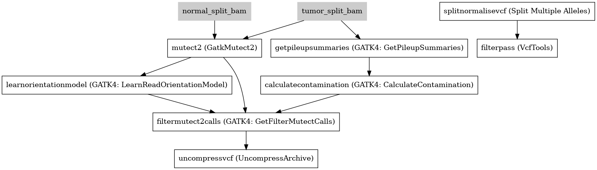

:orphan:

GATK4 Somatic Variant Caller
=========================================================

``GATK4_SomaticVariantCaller`` · *2 contributors · 2 versions*

This is a VariantCaller based on the GATK Best Practice pipelines. It uses the GATK4 toolkit, specifically 4.0.12.0. Takes GATK Base Recalibrated Bam as input

        It has the following steps:

        1. Mutect2
        2. LearnOrientationModel
        3. GetPileUpSummaries
        4. CalculateContamination
        5. FilterMutectCalls
        6. Split and normliase vcf
        7. Filter PASS variants

Quickstart
-----------

    .. code-block:: python

       from janis_bioinformatics.tools.variantcallers.gatk.gatksomatic_variants_4_1_3 import GatkSomaticVariantCaller_4_1_3

       wf = WorkflowBuilder("myworkflow")

       wf.step(
           "gatk4_somaticvariantcaller_step",
           GatkSomaticVariantCaller_4_1_3(
               normal_bam=None,
               tumor_bam=None,
               reference=None,
               gnomad=None,
           )
       )
       wf.output("variants", source=gatk4_somaticvariantcaller_step.variants)
       wf.output("out_bam", source=gatk4_somaticvariantcaller_step.out_bam)
       wf.output("out", source=gatk4_somaticvariantcaller_step.out)
    

*OR*

1. `Install Janis </tutorials/tutorial0.html>`_

2. Ensure Janis is configured to work with Docker or Singularity.

3. Ensure all reference files are available:

.. note:: 

   More information about these inputs are available `below <#additional-configuration-inputs>`_.

4. Generate user input files for GATK4_SomaticVariantCaller:

.. code-block:: bash

   # user inputs
   janis inputs GATK4_SomaticVariantCaller > inputs.yaml

**inputs.yaml**

.. code-block:: yaml

       gnomad: gnomad.vcf.gz
       normal_bam: normal_bam.bam
       reference: reference.fasta
       tumor_bam: tumor_bam.bam

5. Run GATK4_SomaticVariantCaller with:

.. code-block:: bash

   janis run [...run options] \
       --inputs inputs.yaml \
       GATK4_SomaticVariantCaller

Information
------------

URL: *No URL to the documentation was provided*

:ID: ``GATK4_SomaticVariantCaller``
:URL: *No URL to the documentation was provided*
:Versions: 4.0.12.0, 4.1.3.0
:Authors: Michael Franklin, Jiaan Yu
:Citations: 
:Created: 2019-02-01
:Updated: 2020-06-15

Outputs
-----------

========  ====================  ===============
name      type                  documentation
========  ====================  ===============
variants  Gzipped<VCF>
out_bam   Optional<IndexedBam>
out       VCF
========  ====================  ===============

Workflow
--------

Embedded Tools
***************

================================  ==========================================
                                  ``split_bam_subpipeline/None``
GatkMutect2                       ``Gatk4Mutect2/4.1.3.0``
GATK4: LearnReadOrientationModel  ``Gatk4LearnReadOrientationModel/4.1.8.1``
GATK4: GetPileupSummaries         ``Gatk4GetPileupSummaries/4.1.8.1``
GATK4: CalculateContamination     ``Gatk4CalculateContamination/4.1.8.1``
GATK4: GetFilterMutectCalls       ``Gatk4FilterMutectCalls/4.1.8.1``
UncompressArchive                 ``UncompressArchive/v1.0.0``
Split Multiple Alleles            ``SplitMultiAllele/v0.5772``
VcfTools                          ``VcfTools/0.1.16``
================================  ==========================================

Additional configuration (inputs)
---------------------------------

=============================  ======================  =================================================================================================================================================================================================================================================================
name                           type                    documentation
=============================  ======================  =================================================================================================================================================================================================================================================================
normal_bam                     IndexedBam
tumor_bam                      IndexedBam
reference                      FastaWithIndexes
gnomad                         Gzipped<VCF>
normal_name                    Optional<String>
intervals                      Optional<bed>           This optional intervals file supports processing by regions. If this file resolves to null, then GATK will process the whole genome per each tool's spec
panel_of_normals               Optional<Gzipped<VCF>>
filterpass_removeFileteredAll  Optional<Boolean>       Removes all sites with a FILTER flag other than PASS.
filterpass_recode              Optional<Boolean>
filterpass_recodeINFOAll       Optional<Boolean>       These options can be used with the above recode options to define an INFO key name to keep in the output  file.  This  option can be used multiple times to keep more of the INFO fields. The second option is used to keep all INFO values in the original file.
=============================  ======================  =================================================================================================================================================================================================================================================================

Workflow Description Language
------------------------------

.. code-block:: text

   version development

   import "tools/split_bam_subpipeline.wdl" as S
   import "tools/Gatk4Mutect2_4_1_3_0.wdl" as G
   import "tools/Gatk4LearnReadOrientationModel_4_1_8_1.wdl" as G2
   import "tools/Gatk4GetPileupSummaries_4_1_8_1.wdl" as G3
   import "tools/Gatk4CalculateContamination_4_1_8_1.wdl" as G4
   import "tools/Gatk4FilterMutectCalls_4_1_8_1.wdl" as G5
   import "tools/UncompressArchive_v1_0_0.wdl" as U
   import "tools/SplitMultiAllele_v0_5772.wdl" as S2
   import "tools/VcfTools_0_1_16.wdl" as V

   workflow GATK4_SomaticVariantCaller {
     input {
       File normal_bam
       File normal_bam_bai
       File tumor_bam
       File tumor_bam_bai
       String? normal_name
       File? intervals
       File reference
       File reference_fai
       File reference_amb
       File reference_ann
       File reference_bwt
       File reference_pac
       File reference_sa
       File reference_dict
       File gnomad
       File gnomad_tbi
       File? panel_of_normals
       File? panel_of_normals_tbi
       Boolean? filterpass_removeFileteredAll = true
       Boolean? filterpass_recode = true
       Boolean? filterpass_recodeINFOAll = true
     }
     call S.split_bam_subpipeline as normal_split_bam {
       input:
         bam=normal_bam,
         bam_bai=normal_bam_bai,
         intervals=intervals
     }
     call S.split_bam_subpipeline as tumor_split_bam {
       input:
         bam=tumor_bam,
         bam_bai=tumor_bam_bai,
         intervals=intervals
     }
     call G.Gatk4Mutect2 as mutect2 {
       input:
         tumorBams=[tumor_split_bam.out],
         tumorBams_bai=[tumor_split_bam.out_bai],
         normalBams=[normal_split_bam.out],
         normalBams_bai=[normal_split_bam.out_bai],
         normalSample=normal_name,
         outputPrefix=normal_name,
         reference=reference,
         reference_fai=reference_fai,
         reference_amb=reference_amb,
         reference_ann=reference_ann,
         reference_bwt=reference_bwt,
         reference_pac=reference_pac,
         reference_sa=reference_sa,
         reference_dict=reference_dict,
         germlineResource=gnomad,
         germlineResource_tbi=gnomad_tbi,
         intervals=intervals,
         panelOfNormals=panel_of_normals,
         panelOfNormals_tbi=panel_of_normals_tbi
     }
     call G2.Gatk4LearnReadOrientationModel as learnorientationmodel {
       input:
         f1r2CountsFiles=[mutect2.f1f2r_out]
     }
     call G3.Gatk4GetPileupSummaries as getpileupsummaries {
       input:
         bam=[tumor_split_bam.out],
         bam_bai=[tumor_split_bam.out_bai],
         sites=gnomad,
         sites_tbi=gnomad_tbi,
         intervals=intervals
     }
     call G4.Gatk4CalculateContamination as calculatecontamination {
       input:
         pileupTable=getpileupsummaries.out
     }
     call G5.Gatk4FilterMutectCalls as filtermutect2calls {
       input:
         contaminationTable=calculatecontamination.contOut,
         segmentationFile=calculatecontamination.segOut,
         statsFile=mutect2.stats,
         readOrientationModel=learnorientationmodel.out,
         vcf=mutect2.out,
         vcf_tbi=mutect2.out_tbi,
         reference=reference,
         reference_fai=reference_fai,
         reference_amb=reference_amb,
         reference_ann=reference_ann,
         reference_bwt=reference_bwt,
         reference_pac=reference_pac,
         reference_sa=reference_sa,
         reference_dict=reference_dict
     }
     call U.UncompressArchive as uncompressvcf {
       input:
         file=filtermutect2calls.out
     }
     call S2.SplitMultiAllele as splitnormalisevcf {
       input:
         vcf=uncompressvcf.out,
         reference=reference,
         reference_fai=reference_fai,
         reference_amb=reference_amb,
         reference_ann=reference_ann,
         reference_bwt=reference_bwt,
         reference_pac=reference_pac,
         reference_sa=reference_sa,
         reference_dict=reference_dict
     }
     call V.VcfTools as filterpass {
       input:
         vcf=splitnormalisevcf.out,
         removeFileteredAll=select_first([filterpass_removeFileteredAll, true]),
         recode=select_first([filterpass_recode, true]),
         recodeINFOAll=select_first([filterpass_recodeINFOAll, true])
     }
     output {
       File variants = filtermutect2calls.out
       File variants_tbi = filtermutect2calls.out_tbi
       File? out_bam = mutect2.bam
       File? out_bam_bai = mutect2.bam_bai
       File out = filterpass.out
     }
   }

Common Workflow Language
-------------------------

.. code-block:: text

   #!/usr/bin/env cwl-runner
   class: Workflow
   cwlVersion: v1.2
   label: GATK4 Somatic Variant Caller
   doc: |-
     This is a VariantCaller based on the GATK Best Practice pipelines. It uses the GATK4 toolkit, specifically 4.0.12.0. Takes GATK Base Recalibrated Bam as input

             It has the following steps:

             1. Mutect2
             2. LearnOrientationModel
             3. GetPileUpSummaries
             4. CalculateContamination
             5. FilterMutectCalls
             6. Split and normliase vcf
             7. Filter PASS variants

   requirements:
   - class: InlineJavascriptRequirement
   - class: StepInputExpressionRequirement
   - class: SubworkflowFeatureRequirement
   - class: MultipleInputFeatureRequirement

   inputs:
   - id: normal_bam
     type: File
     secondaryFiles:
     - pattern: .bai
   - id: tumor_bam
     type: File
     secondaryFiles:
     - pattern: .bai
   - id: normal_name
     type:
     - string
     - 'null'
   - id: intervals
     doc: |-
       This optional intervals file supports processing by regions. If this file resolves to null, then GATK will process the whole genome per each tool's spec
     type:
     - File
     - 'null'
   - id: reference
     type: File
     secondaryFiles:
     - pattern: .fai
     - pattern: .amb
     - pattern: .ann
     - pattern: .bwt
     - pattern: .pac
     - pattern: .sa
     - pattern: ^.dict
   - id: gnomad
     type: File
     secondaryFiles:
     - pattern: .tbi
   - id: panel_of_normals
     type:
     - File
     - 'null'
     secondaryFiles:
     - pattern: .tbi
   - id: filterpass_removeFileteredAll
     doc: Removes all sites with a FILTER flag other than PASS.
     type: boolean
     default: true
   - id: filterpass_recode
     doc: ''
     type: boolean
     default: true
   - id: filterpass_recodeINFOAll
     doc: |-
       These options can be used with the above recode options to define an INFO key name to keep in the output  file.  This  option can be used multiple times to keep more of the INFO fields. The second option is used to keep all INFO values in the original file.
     type: boolean
     default: true

   outputs:
   - id: variants
     type: File
     secondaryFiles:
     - pattern: .tbi
     outputSource: filtermutect2calls/out
   - id: out_bam
     type:
     - File
     - 'null'
     secondaryFiles:
     - pattern: .bai
     outputSource: mutect2/bam
   - id: out
     type: File
     outputSource: filterpass/out

   steps:
   - id: normal_split_bam
     in:
     - id: bam
       source: normal_bam
     - id: intervals
       source: intervals
     run: tools/split_bam_subpipeline.cwl
     out:
     - id: out
   - id: tumor_split_bam
     in:
     - id: bam
       source: tumor_bam
     - id: intervals
       source: intervals
     run: tools/split_bam_subpipeline.cwl
     out:
     - id: out
   - id: mutect2
     label: GatkMutect2
     in:
     - id: tumorBams
       source:
       - tumor_split_bam/out
       linkMerge: merge_nested
     - id: normalBams
       source:
       - normal_split_bam/out
       linkMerge: merge_nested
     - id: normalSample
       source: normal_name
     - id: outputPrefix
       source: normal_name
     - id: reference
       source: reference
     - id: germlineResource
       source: gnomad
     - id: intervals
       source: intervals
     - id: panelOfNormals
       source: panel_of_normals
     run: tools/Gatk4Mutect2_4_1_3_0.cwl
     out:
     - id: out
     - id: stats
     - id: f1f2r_out
     - id: bam
   - id: learnorientationmodel
     label: 'GATK4: LearnReadOrientationModel'
     in:
     - id: f1r2CountsFiles
       source:
       - mutect2/f1f2r_out
       linkMerge: merge_nested
     run: tools/Gatk4LearnReadOrientationModel_4_1_8_1.cwl
     out:
     - id: out
   - id: getpileupsummaries
     label: 'GATK4: GetPileupSummaries'
     in:
     - id: bam
       source:
       - tumor_split_bam/out
       linkMerge: merge_nested
     - id: sites
       source: gnomad
     - id: intervals
       source: intervals
     run: tools/Gatk4GetPileupSummaries_4_1_8_1.cwl
     out:
     - id: out
   - id: calculatecontamination
     label: 'GATK4: CalculateContamination'
     in:
     - id: pileupTable
       source: getpileupsummaries/out
     run: tools/Gatk4CalculateContamination_4_1_8_1.cwl
     out:
     - id: contOut
     - id: segOut
   - id: filtermutect2calls
     label: 'GATK4: GetFilterMutectCalls'
     in:
     - id: contaminationTable
       source: calculatecontamination/contOut
     - id: segmentationFile
       source: calculatecontamination/segOut
     - id: statsFile
       source: mutect2/stats
     - id: readOrientationModel
       source: learnorientationmodel/out
     - id: vcf
       source: mutect2/out
     - id: reference
       source: reference
     run: tools/Gatk4FilterMutectCalls_4_1_8_1.cwl
     out:
     - id: out
   - id: uncompressvcf
     label: UncompressArchive
     in:
     - id: file
       source: filtermutect2calls/out
     run: tools/UncompressArchive_v1_0_0.cwl
     out:
     - id: out
   - id: splitnormalisevcf
     label: Split Multiple Alleles
     in:
     - id: vcf
       source: uncompressvcf/out
     - id: reference
       source: reference
     run: tools/SplitMultiAllele_v0_5772.cwl
     out:
     - id: out
   - id: filterpass
     label: VcfTools
     in:
     - id: vcf
       source: splitnormalisevcf/out
     - id: removeFileteredAll
       source: filterpass_removeFileteredAll
     - id: recode
       source: filterpass_recode
     - id: recodeINFOAll
       source: filterpass_recodeINFOAll
     run: tools/VcfTools_0_1_16.cwl
     out:
     - id: out
   id: GATK4_SomaticVariantCaller

