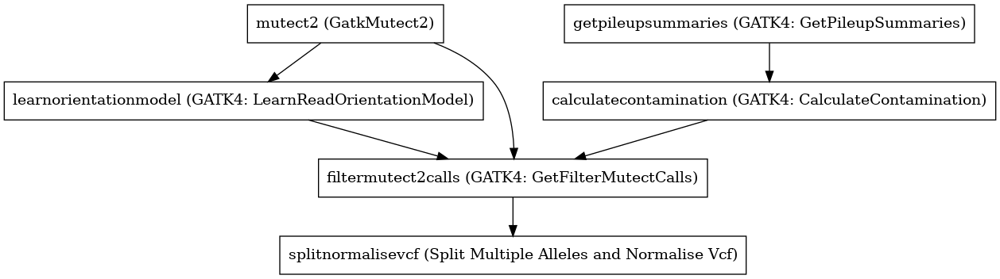

:orphan:

GATK4 Somatic Variant Caller for Tumour Only Samples with Targeted BED
====================================================================================================================

``GATK4_SomaticVariantCallerTumorOnlyTargeted`` · *2 contributors · 1 version*

This is a VariantCaller based on the GATK Best Practice pipelines. It uses the GATK4 toolkit, specifically 4.1.2.

        It has the following steps:

        1. Mutect2 (output: vcf, bam, f1r2.tar.gz)
        2. LearnOrientationModel
        3. GetPileupSummaries
        4. CalculateContamination
        5. FilterMutect2Calls
        6. SplitNormaliseVcf

Quickstart
-----------

    .. code-block:: python

       from janis_bioinformatics.tools.variantcallers.gatk.gatksomatic_variants_single import GatkSomaticVariantCallerTumorOnlyTargeted

       wf = WorkflowBuilder("myworkflow")

       wf.step(
           "gatk4_somaticvariantcallertumoronlytargeted_step",
           GatkSomaticVariantCallerTumorOnlyTargeted(
               bam=None,
               reference=None,
               gnomad=None,
           )
       )
       wf.output("variants", source=gatk4_somaticvariantcallertumoronlytargeted_step.variants)
       wf.output("out_bam", source=gatk4_somaticvariantcallertumoronlytargeted_step.out_bam)
       wf.output("out", source=gatk4_somaticvariantcallertumoronlytargeted_step.out)
    

*OR*

1. `Install Janis </tutorials/tutorial0.html>`_

2. Ensure Janis is configured to work with Docker or Singularity.

3. Ensure all reference files are available:

.. note:: 

   More information about these inputs are available `below <#additional-configuration-inputs>`_.

4. Generate user input files for GATK4_SomaticVariantCallerTumorOnlyTargeted:

.. code-block:: bash

   # user inputs
   janis inputs GATK4_SomaticVariantCallerTumorOnlyTargeted > inputs.yaml

**inputs.yaml**

.. code-block:: yaml

       bam: bam.bam
       gnomad: gnomad.vcf.gz
       reference: reference.fasta

5. Run GATK4_SomaticVariantCallerTumorOnlyTargeted with:

.. code-block:: bash

   janis run [...run options] \
       --inputs inputs.yaml \
       GATK4_SomaticVariantCallerTumorOnlyTargeted

Information
------------

URL: *No URL to the documentation was provided*

:ID: ``GATK4_SomaticVariantCallerTumorOnlyTargeted``
:URL: *No URL to the documentation was provided*
:Versions: v0.1.1
:Authors: Michael Franklin, Jiaan Yu
:Citations: 
:Created: 2020-06-04
:Updated: 2020-06-04

Outputs
-----------

========  ====================  ===============
name      type                  documentation
========  ====================  ===============
variants  Gzipped<VCF>
out_bam   Optional<IndexedBam>
out       VCF
========  ====================  ===============

Workflow
--------

Embedded Tools
***************

========================================  ==========================================
GatkMutect2                               ``Gatk4Mutect2/4.1.2.0``
GATK4: LearnReadOrientationModel          ``Gatk4LearnReadOrientationModel/4.1.2.0``
GATK4: GetPileupSummaries                 ``Gatk4GetPileupSummaries/4.1.2.0``
GATK4: CalculateContamination             ``Gatk4CalculateContamination/4.1.2.0``
GATK4: GetFilterMutectCalls               ``Gatk4FilterMutectCalls/4.1.2.0``
Split Multiple Alleles and Normalise Vcf  ``SplitMultiAlleleNormaliseVcf/v0.5772``
========================================  ==========================================

Additional configuration (inputs)
---------------------------------

================  ======================  ===================================================================================================================================================
name              type                    documentation
================  ======================  ===================================================================================================================================================
bam               IndexedBam
reference         FastaWithIndexes
gnomad            Gzipped<VCF>
intervals         Optional<bed>           This optional interval supports processing by regions. If this input resolves to null, then GATK will process the whole genome per each tool's spec
panel_of_normals  Optional<Gzipped<VCF>>
================  ======================  ===================================================================================================================================================

Workflow Description Language
------------------------------

.. code-block:: text

   version development

   import "tools/Gatk4Mutect2_4_1_2_0.wdl" as G
   import "tools/Gatk4LearnReadOrientationModel_4_1_2_0.wdl" as G2
   import "tools/Gatk4GetPileupSummaries_4_1_2_0.wdl" as G3
   import "tools/Gatk4CalculateContamination_4_1_2_0.wdl" as G4
   import "tools/Gatk4FilterMutectCalls_4_1_2_0.wdl" as G5
   import "tools/SplitMultiAlleleNormaliseVcf_v0_5772.wdl" as S

   workflow GATK4_SomaticVariantCallerTumorOnlyTargeted {
     input {
       File bam
       File bam_bai
       File? intervals
       File reference
       File reference_fai
       File reference_amb
       File reference_ann
       File reference_bwt
       File reference_pac
       File reference_sa
       File reference_dict
       File gnomad
       File gnomad_tbi
       File? panel_of_normals
       File? panel_of_normals_tbi
     }
     call G.Gatk4Mutect2 as mutect2 {
       input:
         tumorBams=[bam],
         tumorBams_bai=[bam_bai],
         reference=reference,
         reference_fai=reference_fai,
         reference_amb=reference_amb,
         reference_ann=reference_ann,
         reference_bwt=reference_bwt,
         reference_pac=reference_pac,
         reference_sa=reference_sa,
         reference_dict=reference_dict,
         germlineResource=gnomad,
         germlineResource_tbi=gnomad_tbi,
         intervals=intervals,
         panelOfNormals=panel_of_normals,
         panelOfNormals_tbi=panel_of_normals_tbi
     }
     call G2.Gatk4LearnReadOrientationModel as learnorientationmodel {
       input:
         f1r2CountsFiles=[mutect2.f1f2r_out]
     }
     call G3.Gatk4GetPileupSummaries as getpileupsummaries {
       input:
         bam=[bam],
         bam_bai=[bam_bai],
         sites=gnomad,
         sites_tbi=gnomad_tbi,
         intervals=intervals
     }
     call G4.Gatk4CalculateContamination as calculatecontamination {
       input:
         pileupTable=getpileupsummaries.out
     }
     call G5.Gatk4FilterMutectCalls as filtermutect2calls {
       input:
         contaminationTable=calculatecontamination.contOut,
         segmentationFile=calculatecontamination.segOut,
         statsFile=mutect2.stats,
         readOrientationModel=learnorientationmodel.out,
         vcf=mutect2.out,
         vcf_tbi=mutect2.out_tbi,
         reference=reference,
         reference_fai=reference_fai,
         reference_amb=reference_amb,
         reference_ann=reference_ann,
         reference_bwt=reference_bwt,
         reference_pac=reference_pac,
         reference_sa=reference_sa,
         reference_dict=reference_dict
     }
     call S.SplitMultiAlleleNormaliseVcf as splitnormalisevcf {
       input:
         compressedTabixVcf=filtermutect2calls.out,
         compressedTabixVcf_tbi=filtermutect2calls.out_tbi,
         reference=reference,
         reference_fai=reference_fai,
         reference_amb=reference_amb,
         reference_ann=reference_ann,
         reference_bwt=reference_bwt,
         reference_pac=reference_pac,
         reference_sa=reference_sa,
         reference_dict=reference_dict
     }
     output {
       File variants = mutect2.out
       File variants_tbi = mutect2.out_tbi
       File? out_bam = mutect2.bam
       File? out_bam_bai = mutect2.bam_bai
       File out = splitnormalisevcf.out
     }
   }

Common Workflow Language
-------------------------

.. code-block:: text

   #!/usr/bin/env cwl-runner
   class: Workflow
   cwlVersion: v1.2
   label: GATK4 Somatic Variant Caller for Tumour Only Samples with Targeted BED
   doc: |-
     This is a VariantCaller based on the GATK Best Practice pipelines. It uses the GATK4 toolkit, specifically 4.1.2.

             It has the following steps:

             1. Mutect2 (output: vcf, bam, f1r2.tar.gz)
             2. LearnOrientationModel
             3. GetPileupSummaries
             4. CalculateContamination
             5. FilterMutect2Calls
             6. SplitNormaliseVcf

   requirements:
   - class: InlineJavascriptRequirement
   - class: StepInputExpressionRequirement
   - class: MultipleInputFeatureRequirement

   inputs:
   - id: bam
     type: File
     secondaryFiles:
     - pattern: .bai
   - id: intervals
     doc: |-
       This optional interval supports processing by regions. If this input resolves to null, then GATK will process the whole genome per each tool's spec
     type:
     - File
     - 'null'
   - id: reference
     type: File
     secondaryFiles:
     - pattern: .fai
     - pattern: .amb
     - pattern: .ann
     - pattern: .bwt
     - pattern: .pac
     - pattern: .sa
     - pattern: ^.dict
   - id: gnomad
     type: File
     secondaryFiles:
     - pattern: .tbi
   - id: panel_of_normals
     type:
     - File
     - 'null'
     secondaryFiles:
     - pattern: .tbi

   outputs:
   - id: variants
     type: File
     secondaryFiles:
     - pattern: .tbi
     outputSource: mutect2/out
   - id: out_bam
     type:
     - File
     - 'null'
     secondaryFiles:
     - pattern: .bai
     outputSource: mutect2/bam
   - id: out
     type: File
     outputSource: splitnormalisevcf/out

   steps:
   - id: mutect2
     label: GatkMutect2
     in:
     - id: tumorBams
       source:
       - bam
       linkMerge: merge_nested
     - id: reference
       source: reference
     - id: germlineResource
       source: gnomad
     - id: intervals
       source: intervals
     - id: panelOfNormals
       source: panel_of_normals
     run: tools/Gatk4Mutect2_4_1_2_0.cwl
     out:
     - id: out
     - id: stats
     - id: f1f2r_out
     - id: bam
   - id: learnorientationmodel
     label: 'GATK4: LearnReadOrientationModel'
     in:
     - id: f1r2CountsFiles
       source:
       - mutect2/f1f2r_out
       linkMerge: merge_nested
     run: tools/Gatk4LearnReadOrientationModel_4_1_2_0.cwl
     out:
     - id: out
   - id: getpileupsummaries
     label: 'GATK4: GetPileupSummaries'
     in:
     - id: bam
       source:
       - bam
       linkMerge: merge_nested
     - id: sites
       source: gnomad
     - id: intervals
       source: intervals
     run: tools/Gatk4GetPileupSummaries_4_1_2_0.cwl
     out:
     - id: out
   - id: calculatecontamination
     label: 'GATK4: CalculateContamination'
     in:
     - id: pileupTable
       source: getpileupsummaries/out
     run: tools/Gatk4CalculateContamination_4_1_2_0.cwl
     out:
     - id: contOut
     - id: segOut
   - id: filtermutect2calls
     label: 'GATK4: GetFilterMutectCalls'
     in:
     - id: contaminationTable
       source: calculatecontamination/contOut
     - id: segmentationFile
       source: calculatecontamination/segOut
     - id: statsFile
       source: mutect2/stats
     - id: readOrientationModel
       source: learnorientationmodel/out
     - id: vcf
       source: mutect2/out
     - id: reference
       source: reference
     run: tools/Gatk4FilterMutectCalls_4_1_2_0.cwl
     out:
     - id: out
   - id: splitnormalisevcf
     label: Split Multiple Alleles and Normalise Vcf
     in:
     - id: compressedTabixVcf
       source: filtermutect2calls/out
     - id: reference
       source: reference
     run: tools/SplitMultiAlleleNormaliseVcf_v0_5772.cwl
     out:
     - id: out
   id: GATK4_SomaticVariantCallerTumorOnlyTargeted

