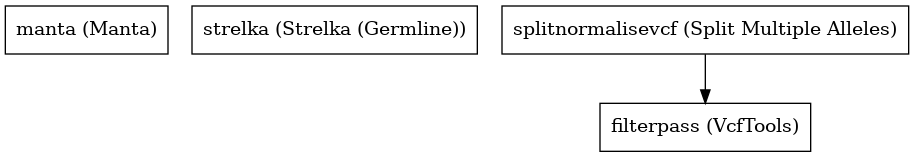

:orphan:

Strelka Germline Variant Caller
==============================================================

``strelkaGermlineVariantCaller`` · *2 contributors · 1 version*

No documentation was provided: `contribute one <https://github.com/PMCC-BioinformaticsCore/janis-bioinformatics>`_

Quickstart
-----------

    .. code-block:: python

       from janis_bioinformatics.tools.variantcallers.illuminagermline_strelka import IlluminaGermlineVariantCaller

       wf = WorkflowBuilder("myworkflow")

       wf.step(
           "strelkagermlinevariantcaller_step",
           IlluminaGermlineVariantCaller(
               bam=None,
               reference=None,
           )
       )
       wf.output("sv", source=strelkagermlinevariantcaller_step.sv)
       wf.output("variants", source=strelkagermlinevariantcaller_step.variants)
       wf.output("out", source=strelkagermlinevariantcaller_step.out)
    

*OR*

1. `Install Janis </tutorials/tutorial0.html>`_

2. Ensure Janis is configured to work with Docker or Singularity.

3. Ensure all reference files are available:

.. note:: 

   More information about these inputs are available `below <#additional-configuration-inputs>`_.

4. Generate user input files for strelkaGermlineVariantCaller:

.. code-block:: bash

   # user inputs
   janis inputs strelkaGermlineVariantCaller > inputs.yaml

**inputs.yaml**

.. code-block:: yaml

       bam: bam.bam
       reference: reference.fasta

5. Run strelkaGermlineVariantCaller with:

.. code-block:: bash

   janis run [...run options] \
       --inputs inputs.yaml \
       strelkaGermlineVariantCaller

Information
------------

URL: *No URL to the documentation was provided*

:ID: ``strelkaGermlineVariantCaller``
:URL: *No URL to the documentation was provided*
:Versions: v0.1.1
:Authors: Jiaan Yu, Michael Franklin
:Citations: 
:Created: 2019-03-28
:Updated: 2020-07-14

Outputs
-----------

========  ============  ===============
name      type          documentation
========  ============  ===============
sv        Gzipped<VCF>
variants  Gzipped<VCF>
out       VCF
========  ============  ===============

Workflow
--------

Embedded Tools
***************

======================  ============================
Manta                   ``manta/1.5.0``
Strelka (Germline)      ``strelka_germline/2.9.10``
UncompressArchive       ``UncompressArchive/v1.0.0``
Split Multiple Alleles  ``SplitMultiAllele/v0.5772``
VcfTools                ``VcfTools/0.1.16``
======================  ============================

Additional configuration (inputs)
---------------------------------

=============================  ======================  =================================================================================================================================================================================================================================================================
name                           type                    documentation
=============================  ======================  =================================================================================================================================================================================================================================================================
bam                            IndexedBam
reference                      FastaWithIndexes
intervals                      Optional<Gzipped<bed>>
is_exome                       Optional<Boolean>
filterpass_removeFileteredAll  Optional<Boolean>       Removes all sites with a FILTER flag other than PASS.
filterpass_recode              Optional<Boolean>
filterpass_recodeINFOAll       Optional<Boolean>       These options can be used with the above recode options to define an INFO key name to keep in the output  file.  This  option can be used multiple times to keep more of the INFO fields. The second option is used to keep all INFO values in the original file.
=============================  ======================  =================================================================================================================================================================================================================================================================

Workflow Description Language
------------------------------

.. code-block:: text

   version development

   import "tools/manta_1_5_0.wdl" as M
   import "tools/strelka_germline_2_9_10.wdl" as S
   import "tools/UncompressArchive_v1_0_0.wdl" as U
   import "tools/SplitMultiAllele_v0_5772.wdl" as S2
   import "tools/VcfTools_0_1_16.wdl" as V

   workflow strelkaGermlineVariantCaller {
     input {
       File bam
       File bam_bai
       File reference
       File reference_fai
       File reference_amb
       File reference_ann
       File reference_bwt
       File reference_pac
       File reference_sa
       File reference_dict
       File? intervals
       File? intervals_tbi
       Boolean? is_exome
       Boolean? filterpass_removeFileteredAll = true
       Boolean? filterpass_recode = true
       Boolean? filterpass_recodeINFOAll = true
     }
     call M.manta as manta {
       input:
         bam=bam,
         bam_bai=bam_bai,
         reference=reference,
         reference_fai=reference_fai,
         exome=is_exome,
         callRegions=intervals,
         callRegions_tbi=intervals_tbi
     }
     call S.strelka_germline as strelka {
       input:
         bam=bam,
         bam_bai=bam_bai,
         reference=reference,
         reference_fai=reference_fai,
         reference_amb=reference_amb,
         reference_ann=reference_ann,
         reference_bwt=reference_bwt,
         reference_pac=reference_pac,
         reference_sa=reference_sa,
         reference_dict=reference_dict,
         indelCandidates=manta.candidateSmallIndels,
         indelCandidates_tbi=manta.candidateSmallIndels_tbi,
         exome=is_exome,
         callRegions=intervals,
         callRegions_tbi=intervals_tbi
     }
     call U.UncompressArchive as uncompressvcf {
       input:
         file=strelka.variants
     }
     call S2.SplitMultiAllele as splitnormalisevcf {
       input:
         vcf=uncompressvcf.out,
         reference=reference,
         reference_fai=reference_fai,
         reference_amb=reference_amb,
         reference_ann=reference_ann,
         reference_bwt=reference_bwt,
         reference_pac=reference_pac,
         reference_sa=reference_sa,
         reference_dict=reference_dict
     }
     call V.VcfTools as filterpass {
       input:
         vcf=splitnormalisevcf.out,
         removeFileteredAll=select_first([filterpass_removeFileteredAll, true]),
         recode=select_first([filterpass_recode, true]),
         recodeINFOAll=select_first([filterpass_recodeINFOAll, true])
     }
     output {
       File sv = manta.diploidSV
       File sv_tbi = manta.diploidSV_tbi
       File variants = strelka.variants
       File variants_tbi = strelka.variants_tbi
       File out = filterpass.out
     }
   }

Common Workflow Language
-------------------------

.. code-block:: text

   #!/usr/bin/env cwl-runner
   class: Workflow
   cwlVersion: v1.2
   label: Strelka Germline Variant Caller
   doc: ''

   requirements:
   - class: InlineJavascriptRequirement
   - class: StepInputExpressionRequirement

   inputs:
   - id: bam
     type: File
     secondaryFiles:
     - pattern: .bai
   - id: reference
     type: File
     secondaryFiles:
     - pattern: .fai
     - pattern: .amb
     - pattern: .ann
     - pattern: .bwt
     - pattern: .pac
     - pattern: .sa
     - pattern: ^.dict
   - id: intervals
     type:
     - File
     - 'null'
     secondaryFiles:
     - pattern: .tbi
   - id: is_exome
     type:
     - boolean
     - 'null'
   - id: filterpass_removeFileteredAll
     doc: Removes all sites with a FILTER flag other than PASS.
     type: boolean
     default: true
   - id: filterpass_recode
     doc: ''
     type: boolean
     default: true
   - id: filterpass_recodeINFOAll
     doc: |-
       These options can be used with the above recode options to define an INFO key name to keep in the output  file.  This  option can be used multiple times to keep more of the INFO fields. The second option is used to keep all INFO values in the original file.
     type: boolean
     default: true

   outputs:
   - id: sv
     type: File
     secondaryFiles:
     - pattern: .tbi
     outputSource: manta/diploidSV
   - id: variants
     type: File
     secondaryFiles:
     - pattern: .tbi
     outputSource: strelka/variants
   - id: out
     type: File
     outputSource: filterpass/out

   steps:
   - id: manta
     label: Manta
     in:
     - id: bam
       source: bam
     - id: reference
       source: reference
     - id: exome
       source: is_exome
     - id: callRegions
       source: intervals
     run: tools/manta_1_5_0.cwl
     out:
     - id: python
     - id: pickle
     - id: candidateSV
     - id: candidateSmallIndels
     - id: diploidSV
     - id: alignmentStatsSummary
     - id: svCandidateGenerationStats
     - id: svLocusGraphStats
     - id: somaticSVs
   - id: strelka
     label: Strelka (Germline)
     in:
     - id: bam
       source: bam
     - id: reference
       source: reference
     - id: indelCandidates
       source: manta/candidateSmallIndels
     - id: exome
       source: is_exome
     - id: callRegions
       source: intervals
     run: tools/strelka_germline_2_9_10.cwl
     out:
     - id: configPickle
     - id: script
     - id: stats
     - id: variants
     - id: genome
   - id: uncompressvcf
     label: UncompressArchive
     in:
     - id: file
       source: strelka/variants
     run: tools/UncompressArchive_v1_0_0.cwl
     out:
     - id: out
   - id: splitnormalisevcf
     label: Split Multiple Alleles
     in:
     - id: vcf
       source: uncompressvcf/out
     - id: reference
       source: reference
     run: tools/SplitMultiAllele_v0_5772.cwl
     out:
     - id: out
   - id: filterpass
     label: VcfTools
     in:
     - id: vcf
       source: splitnormalisevcf/out
     - id: removeFileteredAll
       source: filterpass_removeFileteredAll
     - id: recode
       source: filterpass_recode
     - id: recodeINFOAll
       source: filterpass_recodeINFOAll
     run: tools/VcfTools_0_1_16.cwl
     out:
     - id: out
   id: strelkaGermlineVariantCaller

