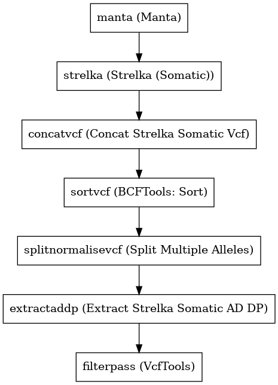

:orphan:

Strelka Somatic Variant Caller
============================================================

``strelkaSomaticVariantCaller`` · *2 contributors · 1 version*

No documentation was provided: `contribute one <https://github.com/PMCC-BioinformaticsCore/janis-bioinformatics>`_

Quickstart
-----------

    .. code-block:: python

       from janis_bioinformatics.tools.variantcallers.illuminasomatic_strelka import IlluminaSomaticVariantCaller

       wf = WorkflowBuilder("myworkflow")

       wf.step(
           "strelkasomaticvariantcaller_step",
           IlluminaSomaticVariantCaller(
               normal_bam=None,
               tumor_bam=None,
               reference=None,
           )
       )
       wf.output("sv", source=strelkasomaticvariantcaller_step.sv)
       wf.output("variants", source=strelkasomaticvariantcaller_step.variants)
       wf.output("out", source=strelkasomaticvariantcaller_step.out)
    

*OR*

1. `Install Janis </tutorials/tutorial0.html>`_

2. Ensure Janis is configured to work with Docker or Singularity.

3. Ensure all reference files are available:

.. note:: 

   More information about these inputs are available `below <#additional-configuration-inputs>`_.

4. Generate user input files for strelkaSomaticVariantCaller:

.. code-block:: bash

   # user inputs
   janis inputs strelkaSomaticVariantCaller > inputs.yaml

**inputs.yaml**

.. code-block:: yaml

       normal_bam: normal_bam.bam
       reference: reference.fasta
       tumor_bam: tumor_bam.bam

5. Run strelkaSomaticVariantCaller with:

.. code-block:: bash

   janis run [...run options] \
       --inputs inputs.yaml \
       strelkaSomaticVariantCaller

Information
------------

URL: *No URL to the documentation was provided*

:ID: ``strelkaSomaticVariantCaller``
:URL: *No URL to the documentation was provided*
:Versions: v0.1.1
:Authors: Jiaan Yu, Michael Franklin
:Citations: 
:Created: 2020-06-12
:Updated: 2020-08-25

Outputs
-----------

========  ============  ===============
name      type          documentation
========  ============  ===============
sv        Gzipped<VCF>
variants  Gzipped<VCF>
out       VCF
========  ============  ===============

Workflow
--------

Embedded Tools
***************

=============================  ===================================
Manta                          ``manta/1.5.0``
Strelka (Somatic)              ``strelka_somatic/2.9.10``
Concat Strelka Somatic Vcf     ``ConcatStrelkaSomaticVcf/0.1.16``
BCFTools: Sort                 ``bcftoolssort/v1.9``
Split Multiple Alleles         ``SplitMultiAllele/v0.5772``
Extract Strelka Somatic AD DP  ``extractStrelkaSomaticADDP/0.1.1``
VcfTools                       ``VcfTools/0.1.16``
=============================  ===================================

Additional configuration (inputs)
---------------------------------

=============================  ======================  =================================================================================================================================================================================================================================================================
name                           type                    documentation
=============================  ======================  =================================================================================================================================================================================================================================================================
normal_bam                     IndexedBam
tumor_bam                      IndexedBam
reference                      FastaWithIndexes
intervals                      Optional<Gzipped<bed>>
is_exome                       Optional<Boolean>
filterpass_removeFileteredAll  Optional<Boolean>       Removes all sites with a FILTER flag other than PASS.
filterpass_recode              Optional<Boolean>
filterpass_recodeINFOAll       Optional<Boolean>       These options can be used with the above recode options to define an INFO key name to keep in the output  file.  This  option can be used multiple times to keep more of the INFO fields. The second option is used to keep all INFO values in the original file.
=============================  ======================  =================================================================================================================================================================================================================================================================

Workflow Description Language
------------------------------

.. code-block:: text

   version development

   import "tools/manta_1_5_0.wdl" as M
   import "tools/strelka_somatic_2_9_10.wdl" as S
   import "tools/ConcatStrelkaSomaticVcf_0_1_16.wdl" as C
   import "tools/bcftoolssort_v1_9.wdl" as B
   import "tools/SplitMultiAllele_v0_5772.wdl" as S2
   import "tools/extractStrelkaSomaticADDP_0_1_1.wdl" as E
   import "tools/VcfTools_0_1_16.wdl" as V

   workflow strelkaSomaticVariantCaller {
     input {
       File normal_bam
       File normal_bam_bai
       File tumor_bam
       File tumor_bam_bai
       File reference
       File reference_fai
       File reference_amb
       File reference_ann
       File reference_bwt
       File reference_pac
       File reference_sa
       File reference_dict
       File? intervals
       File? intervals_tbi
       Boolean? is_exome
       Boolean? filterpass_removeFileteredAll = true
       Boolean? filterpass_recode = true
       Boolean? filterpass_recodeINFOAll = true
     }
     call M.manta as manta {
       input:
         bam=normal_bam,
         bam_bai=normal_bam_bai,
         reference=reference,
         reference_fai=reference_fai,
         tumorBam=tumor_bam,
         tumorBam_bai=tumor_bam_bai,
         exome=is_exome,
         callRegions=intervals,
         callRegions_tbi=intervals_tbi
     }
     call S.strelka_somatic as strelka {
       input:
         normalBam=normal_bam,
         normalBam_bai=normal_bam_bai,
         tumorBam=tumor_bam,
         tumorBam_bai=tumor_bam_bai,
         reference=reference,
         reference_fai=reference_fai,
         indelCandidates=[manta.candidateSmallIndels],
         indelCandidates_tbi=[manta.candidateSmallIndels_tbi],
         exome=is_exome,
         callRegions=intervals,
         callRegions_tbi=intervals_tbi
     }
     call C.ConcatStrelkaSomaticVcf as concatvcf {
       input:
         headerVcfs=[strelka.snvs, strelka.indels],
         headerVcfs_tbi=[strelka.snvs_tbi, strelka.indels_tbi],
         contentVcfs=[strelka.snvs, strelka.indels],
         contentVcfs_tbi=[strelka.snvs_tbi, strelka.indels_tbi]
     }
     call B.bcftoolssort as sortvcf {
       input:
         vcf=concatvcf.out
     }
     call S2.SplitMultiAllele as splitnormalisevcf {
       input:
         vcf=sortvcf.out,
         reference=reference,
         reference_fai=reference_fai,
         reference_amb=reference_amb,
         reference_ann=reference_ann,
         reference_bwt=reference_bwt,
         reference_pac=reference_pac,
         reference_sa=reference_sa,
         reference_dict=reference_dict
     }
     call E.extractStrelkaSomaticADDP as extractaddp {
       input:
         vcf=splitnormalisevcf.out
     }
     call V.VcfTools as filterpass {
       input:
         vcf=extractaddp.out,
         removeFileteredAll=select_first([filterpass_removeFileteredAll, true]),
         recode=select_first([filterpass_recode, true]),
         recodeINFOAll=select_first([filterpass_recodeINFOAll, true])
     }
     output {
       File sv = manta.diploidSV
       File sv_tbi = manta.diploidSV_tbi
       File variants = sortvcf.out
       File out = filterpass.out
     }
   }

Common Workflow Language
-------------------------

.. code-block:: text

   #!/usr/bin/env cwl-runner
   class: Workflow
   cwlVersion: v1.2
   label: Strelka Somatic Variant Caller
   doc: ''

   requirements:
   - class: InlineJavascriptRequirement
   - class: StepInputExpressionRequirement
   - class: MultipleInputFeatureRequirement

   inputs:
   - id: normal_bam
     type: File
     secondaryFiles:
     - pattern: .bai
   - id: tumor_bam
     type: File
     secondaryFiles:
     - pattern: .bai
   - id: reference
     type: File
     secondaryFiles:
     - pattern: .fai
     - pattern: .amb
     - pattern: .ann
     - pattern: .bwt
     - pattern: .pac
     - pattern: .sa
     - pattern: ^.dict
   - id: intervals
     type:
     - File
     - 'null'
     secondaryFiles:
     - pattern: .tbi
   - id: is_exome
     type:
     - boolean
     - 'null'
   - id: filterpass_removeFileteredAll
     doc: Removes all sites with a FILTER flag other than PASS.
     type: boolean
     default: true
   - id: filterpass_recode
     doc: ''
     type: boolean
     default: true
   - id: filterpass_recodeINFOAll
     doc: |-
       These options can be used with the above recode options to define an INFO key name to keep in the output  file.  This  option can be used multiple times to keep more of the INFO fields. The second option is used to keep all INFO values in the original file.
     type: boolean
     default: true

   outputs:
   - id: sv
     type: File
     secondaryFiles:
     - pattern: .tbi
     outputSource: manta/diploidSV
   - id: variants
     type: File
     outputSource: sortvcf/out
   - id: out
     type: File
     outputSource: filterpass/out

   steps:
   - id: manta
     label: Manta
     in:
     - id: bam
       source: normal_bam
     - id: reference
       source: reference
     - id: tumorBam
       source: tumor_bam
     - id: exome
       source: is_exome
     - id: callRegions
       source: intervals
     run: tools/manta_1_5_0.cwl
     out:
     - id: python
     - id: pickle
     - id: candidateSV
     - id: candidateSmallIndels
     - id: diploidSV
     - id: alignmentStatsSummary
     - id: svCandidateGenerationStats
     - id: svLocusGraphStats
     - id: somaticSVs
   - id: strelka
     label: Strelka (Somatic)
     in:
     - id: normalBam
       source: normal_bam
     - id: tumorBam
       source: tumor_bam
     - id: reference
       source: reference
     - id: indelCandidates
       source:
       - manta/candidateSmallIndels
       linkMerge: merge_nested
     - id: exome
       source: is_exome
     - id: callRegions
       source: intervals
     run: tools/strelka_somatic_2_9_10.cwl
     out:
     - id: configPickle
     - id: script
     - id: stats
     - id: indels
     - id: snvs
   - id: concatvcf
     label: Concat Strelka Somatic Vcf
     in:
     - id: headerVcfs
       source:
       - strelka/snvs
       - strelka/indels
     - id: contentVcfs
       source:
       - strelka/snvs
       - strelka/indels
     run: tools/ConcatStrelkaSomaticVcf_0_1_16.cwl
     out:
     - id: out
   - id: sortvcf
     label: 'BCFTools: Sort'
     in:
     - id: vcf
       source: concatvcf/out
     run: tools/bcftoolssort_v1_9.cwl
     out:
     - id: out
   - id: splitnormalisevcf
     label: Split Multiple Alleles
     in:
     - id: vcf
       source: sortvcf/out
     - id: reference
       source: reference
     run: tools/SplitMultiAllele_v0_5772.cwl
     out:
     - id: out
   - id: extractaddp
     label: Extract Strelka Somatic AD DP
     in:
     - id: vcf
       source: splitnormalisevcf/out
     run: tools/extractStrelkaSomaticADDP_0_1_1.cwl
     out:
     - id: out
   - id: filterpass
     label: VcfTools
     in:
     - id: vcf
       source: extractaddp/out
     - id: removeFileteredAll
       source: filterpass_removeFileteredAll
     - id: recode
       source: filterpass_recode
     - id: recodeINFOAll
       source: filterpass_recodeINFOAll
     run: tools/VcfTools_0_1_16.cwl
     out:
     - id: out
   id: strelkaSomaticVariantCaller

