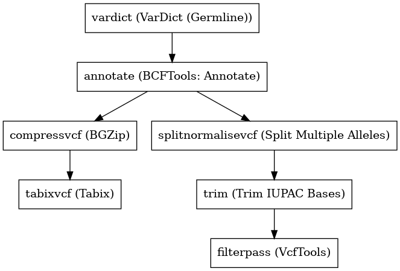

:orphan:

Vardict Germline Variant Caller
==============================================================

``vardictGermlineVariantCaller`` · *2 contributors · 1 version*

No documentation was provided: `contribute one <https://github.com/PMCC-BioinformaticsCore/janis-bioinformatics>`_

Quickstart
-----------

    .. code-block:: python

       from janis_bioinformatics.tools.variantcallers.vardictgermline_variants import VardictGermlineVariantCaller

       wf = WorkflowBuilder("myworkflow")

       wf.step(
           "vardictgermlinevariantcaller_step",
           VardictGermlineVariantCaller(
               bam=None,
               intervals=None,
               sample_name=None,
               header_lines=None,
               reference=None,
           )
       )
       wf.output("variants", source=vardictgermlinevariantcaller_step.variants)
       wf.output("out", source=vardictgermlinevariantcaller_step.out)
    

*OR*

1. `Install Janis </tutorials/tutorial0.html>`_

2. Ensure Janis is configured to work with Docker or Singularity.

3. Ensure all reference files are available:

.. note:: 

   More information about these inputs are available `below <#additional-configuration-inputs>`_.

4. Generate user input files for vardictGermlineVariantCaller:

.. code-block:: bash

   # user inputs
   janis inputs vardictGermlineVariantCaller > inputs.yaml

**inputs.yaml**

.. code-block:: yaml

       bam: bam.bam
       header_lines: header_lines
       intervals: intervals.bed
       reference: reference.fasta
       sample_name: <value>

5. Run vardictGermlineVariantCaller with:

.. code-block:: bash

   janis run [...run options] \
       --inputs inputs.yaml \
       vardictGermlineVariantCaller

Information
------------

URL: *No URL to the documentation was provided*

:ID: ``vardictGermlineVariantCaller``
:URL: *No URL to the documentation was provided*
:Versions: v0.1.1
:Authors: Michael Franklin, Jiaan Yu
:Citations: 
:Created: 2019-03-28
:Updated: 2020-07-14

Outputs
-----------

========  =============  ===============
name      type           documentation
========  =============  ===============
variants  Gzipped<File>
out       VCF
========  =============  ===============

Workflow
--------

Embedded Tools
***************

======================  ============================
VarDict (Germline)      ``vardict_germline/1.6.0``
BCFTools: Annotate      ``bcftoolsAnnotate/v1.5``
BGZip                   ``bgzip/1.2.1``
Tabix                   ``tabix/1.2.1``
Split Multiple Alleles  ``SplitMultiAllele/v0.5772``
Trim IUPAC Bases        ``trimIUPAC/0.0.5``
VcfTools                ``VcfTools/0.1.16``
======================  ============================

Additional configuration (inputs)
---------------------------------

=============================  =================  =================================================================================================================================================================================================================================================================
name                           type               documentation
=============================  =================  =================================================================================================================================================================================================================================================================
bam                            IndexedBam
intervals                      bed
sample_name                    String
header_lines                   File
reference                      FastaWithIndexes
allele_freq_threshold          Optional<Float>
vardict_chromNamesAreNumbers   Optional<Boolean>  Indicate the chromosome names are just numbers, such as 1, 2, not chr1, chr2
vardict_vcfFormat              Optional<Boolean>  VCF format output
vardict_chromColumn            Optional<Integer>  The column for chromosome
vardict_regStartCol            Optional<Integer>  The column for region start, e.g. gene start
vardict_geneEndCol             Optional<Integer>  The column for region end, e.g. gene end
compressvcf_stdout             Optional<Boolean>  c: Write to standard output, keep original files unchanged.
filterpass_removeFileteredAll  Optional<Boolean>  Removes all sites with a FILTER flag other than PASS.
filterpass_recode              Optional<Boolean>
filterpass_recodeINFOAll       Optional<Boolean>  These options can be used with the above recode options to define an INFO key name to keep in the output  file.  This  option can be used multiple times to keep more of the INFO fields. The second option is used to keep all INFO values in the original file.
=============================  =================  =================================================================================================================================================================================================================================================================

Workflow Description Language
------------------------------

.. code-block:: text

   version development

   import "tools/vardict_germline_1_6_0.wdl" as V
   import "tools/bcftoolsAnnotate_v1_5.wdl" as B
   import "tools/bgzip_1_2_1.wdl" as B2
   import "tools/tabix_1_2_1.wdl" as T
   import "tools/SplitMultiAllele_v0_5772.wdl" as S
   import "tools/trimIUPAC_0_0_5.wdl" as T2
   import "tools/VcfTools_0_1_16.wdl" as V2

   workflow vardictGermlineVariantCaller {
     input {
       File bam
       File bam_bai
       File intervals
       String sample_name
       Float? allele_freq_threshold = 0.5
       File header_lines
       File reference
       File reference_fai
       File reference_amb
       File reference_ann
       File reference_bwt
       File reference_pac
       File reference_sa
       File reference_dict
       Boolean? vardict_chromNamesAreNumbers = true
       Boolean? vardict_vcfFormat = true
       Int? vardict_chromColumn = 1
       Int? vardict_regStartCol = 2
       Int? vardict_geneEndCol = 3
       Boolean? compressvcf_stdout = true
       Boolean? filterpass_removeFileteredAll = true
       Boolean? filterpass_recode = true
       Boolean? filterpass_recodeINFOAll = true
     }
     call V.vardict_germline as vardict {
       input:
         intervals=intervals,
         bam=bam,
         bam_bai=bam_bai,
         reference=reference,
         reference_fai=reference_fai,
         chromNamesAreNumbers=select_first([vardict_chromNamesAreNumbers, true]),
         chromColumn=select_first([vardict_chromColumn, 1]),
         geneEndCol=select_first([vardict_geneEndCol, 3]),
         alleleFreqThreshold=select_first([allele_freq_threshold, 0.5]),
         sampleName=sample_name,
         regStartCol=select_first([vardict_regStartCol, 2]),
         vcfFormat=select_first([vardict_vcfFormat, true]),
         var2vcfSampleName=sample_name,
         var2vcfAlleleFreqThreshold=select_first([allele_freq_threshold, 0.5])
     }
     call B.bcftoolsAnnotate as annotate {
       input:
         vcf=vardict.out,
         headerLines=header_lines
     }
     call B2.bgzip as compressvcf {
       input:
         file=annotate.out,
         stdout=select_first([compressvcf_stdout, true])
     }
     call T.tabix as tabixvcf {
       input:
         inp=compressvcf.out
     }
     call S.SplitMultiAllele as splitnormalisevcf {
       input:
         vcf=annotate.out,
         reference=reference,
         reference_fai=reference_fai,
         reference_amb=reference_amb,
         reference_ann=reference_ann,
         reference_bwt=reference_bwt,
         reference_pac=reference_pac,
         reference_sa=reference_sa,
         reference_dict=reference_dict
     }
     call T2.trimIUPAC as trim {
       input:
         vcf=splitnormalisevcf.out
     }
     call V2.VcfTools as filterpass {
       input:
         vcf=trim.out,
         removeFileteredAll=select_first([filterpass_removeFileteredAll, true]),
         recode=select_first([filterpass_recode, true]),
         recodeINFOAll=select_first([filterpass_recodeINFOAll, true])
     }
     output {
       File variants = tabixvcf.out
       File variants_tbi = tabixvcf.out_tbi
       File out = filterpass.out
     }
   }

Common Workflow Language
-------------------------

.. code-block:: text

   #!/usr/bin/env cwl-runner
   class: Workflow
   cwlVersion: v1.2
   label: Vardict Germline Variant Caller
   doc: ''

   requirements:
   - class: InlineJavascriptRequirement
   - class: StepInputExpressionRequirement

   inputs:
   - id: bam
     type: File
     secondaryFiles:
     - pattern: .bai
   - id: intervals
     type: File
   - id: sample_name
     type: string
   - id: allele_freq_threshold
     type: float
     default: 0.5
   - id: header_lines
     type: File
   - id: reference
     type: File
     secondaryFiles:
     - pattern: .fai
     - pattern: .amb
     - pattern: .ann
     - pattern: .bwt
     - pattern: .pac
     - pattern: .sa
     - pattern: ^.dict
   - id: vardict_chromNamesAreNumbers
     doc: Indicate the chromosome names are just numbers, such as 1, 2, not chr1, chr2
     type: boolean
     default: true
   - id: vardict_vcfFormat
     doc: VCF format output
     type: boolean
     default: true
   - id: vardict_chromColumn
     doc: The column for chromosome
     type: int
     default: 1
   - id: vardict_regStartCol
     doc: The column for region start, e.g. gene start
     type: int
     default: 2
   - id: vardict_geneEndCol
     doc: The column for region end, e.g. gene end
     type: int
     default: 3
   - id: compressvcf_stdout
     doc: 'c: Write to standard output, keep original files unchanged.'
     type: boolean
     default: true
   - id: filterpass_removeFileteredAll
     doc: Removes all sites with a FILTER flag other than PASS.
     type: boolean
     default: true
   - id: filterpass_recode
     doc: ''
     type: boolean
     default: true
   - id: filterpass_recodeINFOAll
     doc: |-
       These options can be used with the above recode options to define an INFO key name to keep in the output  file.  This  option can be used multiple times to keep more of the INFO fields. The second option is used to keep all INFO values in the original file.
     type: boolean
     default: true

   outputs:
   - id: variants
     type: File
     secondaryFiles:
     - pattern: .tbi
     outputSource: tabixvcf/out
   - id: out
     type: File
     outputSource: filterpass/out

   steps:
   - id: vardict
     label: VarDict (Germline)
     in:
     - id: intervals
       source: intervals
     - id: bam
       source: bam
     - id: reference
       source: reference
     - id: chromNamesAreNumbers
       source: vardict_chromNamesAreNumbers
     - id: chromColumn
       source: vardict_chromColumn
     - id: geneEndCol
       source: vardict_geneEndCol
     - id: alleleFreqThreshold
       source: allele_freq_threshold
     - id: sampleName
       source: sample_name
     - id: regStartCol
       source: vardict_regStartCol
     - id: vcfFormat
       source: vardict_vcfFormat
     - id: var2vcfSampleName
       source: sample_name
     - id: var2vcfAlleleFreqThreshold
       source: allele_freq_threshold
     run: tools/vardict_germline_1_6_0.cwl
     out:
     - id: out
   - id: annotate
     label: 'BCFTools: Annotate'
     in:
     - id: vcf
       source: vardict/out
     - id: headerLines
       source: header_lines
     run: tools/bcftoolsAnnotate_v1_5.cwl
     out:
     - id: out
   - id: compressvcf
     label: BGZip
     in:
     - id: file
       source: annotate/out
     - id: stdout
       source: compressvcf_stdout
     run: tools/bgzip_1_2_1.cwl
     out:
     - id: out
   - id: tabixvcf
     label: Tabix
     in:
     - id: inp
       source: compressvcf/out
     run: tools/tabix_1_2_1.cwl
     out:
     - id: out
   - id: splitnormalisevcf
     label: Split Multiple Alleles
     in:
     - id: vcf
       source: annotate/out
     - id: reference
       source: reference
     run: tools/SplitMultiAllele_v0_5772.cwl
     out:
     - id: out
   - id: trim
     label: Trim IUPAC Bases
     in:
     - id: vcf
       source: splitnormalisevcf/out
     run: tools/trimIUPAC_0_0_5.cwl
     out:
     - id: out
   - id: filterpass
     label: VcfTools
     in:
     - id: vcf
       source: trim/out
     - id: removeFileteredAll
       source: filterpass_removeFileteredAll
     - id: recode
       source: filterpass_recode
     - id: recodeINFOAll
       source: filterpass_recodeINFOAll
     run: tools/VcfTools_0_1_16.cwl
     out:
     - id: out
   id: vardictGermlineVariantCaller

