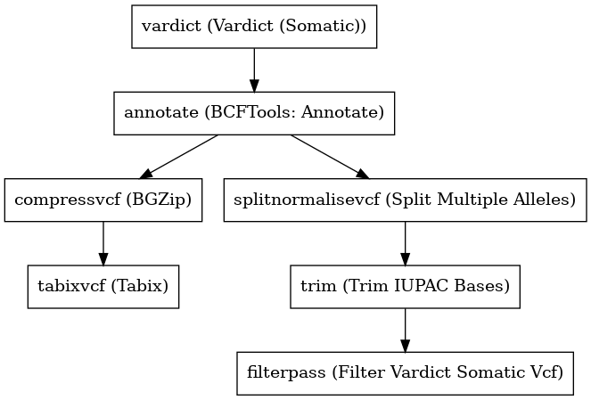

:orphan:

Vardict Somatic Variant Caller
============================================================

``vardictSomaticVariantCaller`` · *2 contributors · 1 version*

No documentation was provided: `contribute one <https://github.com/PMCC-BioinformaticsCore/janis-bioinformatics>`_

Quickstart
-----------

    .. code-block:: python

       from janis_bioinformatics.tools.variantcallers.vardictsomatic_variants import VardictSomaticVariantCaller

       wf = WorkflowBuilder("myworkflow")

       wf.step(
           "vardictsomaticvariantcaller_step",
           VardictSomaticVariantCaller(
               normal_bam=None,
               tumor_bam=None,
               normal_name=None,
               tumor_name=None,
               intervals=None,
               header_lines=None,
               reference=None,
           )
       )
       wf.output("variants", source=vardictsomaticvariantcaller_step.variants)
       wf.output("out", source=vardictsomaticvariantcaller_step.out)
    

*OR*

1. `Install Janis </tutorials/tutorial0.html>`_

2. Ensure Janis is configured to work with Docker or Singularity.

3. Ensure all reference files are available:

.. note:: 

   More information about these inputs are available `below <#additional-configuration-inputs>`_.

4. Generate user input files for vardictSomaticVariantCaller:

.. code-block:: bash

   # user inputs
   janis inputs vardictSomaticVariantCaller > inputs.yaml

**inputs.yaml**

.. code-block:: yaml

       header_lines: header_lines
       intervals: intervals.bed
       normal_bam: normal_bam.bam
       normal_name: <value>
       reference: reference.fasta
       tumor_bam: tumor_bam.bam
       tumor_name: <value>

5. Run vardictSomaticVariantCaller with:

.. code-block:: bash

   janis run [...run options] \
       --inputs inputs.yaml \
       vardictSomaticVariantCaller

Information
------------

URL: *No URL to the documentation was provided*

:ID: ``vardictSomaticVariantCaller``
:URL: *No URL to the documentation was provided*
:Versions: v0.1.0
:Authors: Michael Franklin, Jiaan Yu
:Citations: 
:Created: 2019-06-12
:Updated: 2020-07-14

Outputs
-----------

========  =============  ===============
name      type           documentation
========  =============  ===============
variants  Gzipped<File>
out       VCF
========  =============  ===============

Workflow
--------

Embedded Tools
***************

==========================  ================================
Vardict (Somatic)           ``vardict_somatic/1.6.0``
BCFTools: Annotate          ``bcftoolsAnnotate/v1.5``
BGZip                       ``bgzip/1.2.1``
Tabix                       ``tabix/1.2.1``
Split Multiple Alleles      ``SplitMultiAllele/v0.5772``
Trim IUPAC Bases            ``trimIUPAC/0.0.5``
Filter Vardict Somatic Vcf  ``FilterVardictSomaticVcf/v1.9``
==========================  ================================

Additional configuration (inputs)
---------------------------------

============================  =================  ============================================================================
name                          type               documentation
============================  =================  ============================================================================
normal_bam                    IndexedBam
tumor_bam                     IndexedBam
normal_name                   String
tumor_name                    String
intervals                     bed
header_lines                  File
reference                     FastaWithIndexes
allele_freq_threshold         Optional<Float>
vardict_chromNamesAreNumbers  Optional<Boolean>  Indicate the chromosome names are just numbers, such as 1, 2, not chr1, chr2
vardict_vcfFormat             Optional<Boolean>  VCF format output
vardict_chromColumn           Optional<Integer>  The column for chromosome
vardict_regStartCol           Optional<Integer>  The column for region start, e.g. gene start
vardict_geneEndCol            Optional<Integer>  The column for region end, e.g. gene end
compressvcf_stdout            Optional<Boolean>  c: Write to standard output, keep original files unchanged.
============================  =================  ============================================================================

Workflow Description Language
------------------------------

.. code-block:: text

   version development

   import "tools/vardict_somatic_1_6_0.wdl" as V
   import "tools/bcftoolsAnnotate_v1_5.wdl" as B
   import "tools/bgzip_1_2_1.wdl" as B2
   import "tools/tabix_1_2_1.wdl" as T
   import "tools/SplitMultiAllele_v0_5772.wdl" as S
   import "tools/trimIUPAC_0_0_5.wdl" as T2
   import "tools/FilterVardictSomaticVcf_v1_9.wdl" as F

   workflow vardictSomaticVariantCaller {
     input {
       File normal_bam
       File normal_bam_bai
       File tumor_bam
       File tumor_bam_bai
       String normal_name
       String tumor_name
       File intervals
       Float? allele_freq_threshold = 0.05
       File header_lines
       File reference
       File reference_fai
       File reference_amb
       File reference_ann
       File reference_bwt
       File reference_pac
       File reference_sa
       File reference_dict
       Boolean? vardict_chromNamesAreNumbers = true
       Boolean? vardict_vcfFormat = true
       Int? vardict_chromColumn = 1
       Int? vardict_regStartCol = 2
       Int? vardict_geneEndCol = 3
       Boolean? compressvcf_stdout = true
     }
     call V.vardict_somatic as vardict {
       input:
         tumorBam=tumor_bam,
         tumorBam_bai=tumor_bam_bai,
         normalBam=normal_bam,
         normalBam_bai=normal_bam_bai,
         intervals=intervals,
         reference=reference,
         reference_fai=reference_fai,
         tumorName=tumor_name,
         normalName=normal_name,
         alleleFreqThreshold=select_first([allele_freq_threshold, 0.05]),
         chromNamesAreNumbers=select_first([vardict_chromNamesAreNumbers, true]),
         chromColumn=select_first([vardict_chromColumn, 1]),
         geneEndCol=select_first([vardict_geneEndCol, 3]),
         regStartCol=select_first([vardict_regStartCol, 2]),
         vcfFormat=select_first([vardict_vcfFormat, true])
     }
     call B.bcftoolsAnnotate as annotate {
       input:
         vcf=vardict.out,
         headerLines=header_lines
     }
     call B2.bgzip as compressvcf {
       input:
         file=annotate.out,
         stdout=select_first([compressvcf_stdout, true])
     }
     call T.tabix as tabixvcf {
       input:
         inp=compressvcf.out
     }
     call S.SplitMultiAllele as splitnormalisevcf {
       input:
         vcf=annotate.out,
         reference=reference,
         reference_fai=reference_fai,
         reference_amb=reference_amb,
         reference_ann=reference_ann,
         reference_bwt=reference_bwt,
         reference_pac=reference_pac,
         reference_sa=reference_sa,
         reference_dict=reference_dict
     }
     call T2.trimIUPAC as trim {
       input:
         vcf=splitnormalisevcf.out
     }
     call F.FilterVardictSomaticVcf as filterpass {
       input:
         vcf=trim.out
     }
     output {
       File variants = tabixvcf.out
       File variants_tbi = tabixvcf.out_tbi
       File out = filterpass.out
     }
   }

Common Workflow Language
-------------------------

.. code-block:: text

   #!/usr/bin/env cwl-runner
   class: Workflow
   cwlVersion: v1.2
   label: Vardict Somatic Variant Caller
   doc: ''

   requirements:
   - class: InlineJavascriptRequirement
   - class: StepInputExpressionRequirement

   inputs:
   - id: normal_bam
     type: File
     secondaryFiles:
     - pattern: .bai
   - id: tumor_bam
     type: File
     secondaryFiles:
     - pattern: .bai
   - id: normal_name
     type: string
   - id: tumor_name
     type: string
   - id: intervals
     type: File
   - id: allele_freq_threshold
     type: float
     default: 0.05
   - id: header_lines
     type: File
   - id: reference
     type: File
     secondaryFiles:
     - pattern: .fai
     - pattern: .amb
     - pattern: .ann
     - pattern: .bwt
     - pattern: .pac
     - pattern: .sa
     - pattern: ^.dict
   - id: vardict_chromNamesAreNumbers
     doc: Indicate the chromosome names are just numbers, such as 1, 2, not chr1, chr2
     type: boolean
     default: true
   - id: vardict_vcfFormat
     doc: VCF format output
     type: boolean
     default: true
   - id: vardict_chromColumn
     doc: The column for chromosome
     type: int
     default: 1
   - id: vardict_regStartCol
     doc: The column for region start, e.g. gene start
     type: int
     default: 2
   - id: vardict_geneEndCol
     doc: The column for region end, e.g. gene end
     type: int
     default: 3
   - id: compressvcf_stdout
     doc: 'c: Write to standard output, keep original files unchanged.'
     type: boolean
     default: true

   outputs:
   - id: variants
     type: File
     secondaryFiles:
     - pattern: .tbi
     outputSource: tabixvcf/out
   - id: out
     type: File
     outputSource: filterpass/out

   steps:
   - id: vardict
     label: Vardict (Somatic)
     in:
     - id: tumorBam
       source: tumor_bam
     - id: normalBam
       source: normal_bam
     - id: intervals
       source: intervals
     - id: reference
       source: reference
     - id: tumorName
       source: tumor_name
     - id: normalName
       source: normal_name
     - id: alleleFreqThreshold
       source: allele_freq_threshold
     - id: chromNamesAreNumbers
       source: vardict_chromNamesAreNumbers
     - id: chromColumn
       source: vardict_chromColumn
     - id: geneEndCol
       source: vardict_geneEndCol
     - id: regStartCol
       source: vardict_regStartCol
     - id: vcfFormat
       source: vardict_vcfFormat
     run: tools/vardict_somatic_1_6_0.cwl
     out:
     - id: out
   - id: annotate
     label: 'BCFTools: Annotate'
     in:
     - id: vcf
       source: vardict/out
     - id: headerLines
       source: header_lines
     run: tools/bcftoolsAnnotate_v1_5.cwl
     out:
     - id: out
   - id: compressvcf
     label: BGZip
     in:
     - id: file
       source: annotate/out
     - id: stdout
       source: compressvcf_stdout
     run: tools/bgzip_1_2_1.cwl
     out:
     - id: out
   - id: tabixvcf
     label: Tabix
     in:
     - id: inp
       source: compressvcf/out
     run: tools/tabix_1_2_1.cwl
     out:
     - id: out
   - id: splitnormalisevcf
     label: Split Multiple Alleles
     in:
     - id: vcf
       source: annotate/out
     - id: reference
       source: reference
     run: tools/SplitMultiAllele_v0_5772.cwl
     out:
     - id: out
   - id: trim
     label: Trim IUPAC Bases
     in:
     - id: vcf
       source: splitnormalisevcf/out
     run: tools/trimIUPAC_0_0_5.cwl
     out:
     - id: out
   - id: filterpass
     label: Filter Vardict Somatic Vcf
     in:
     - id: vcf
       source: trim/out
     run: tools/FilterVardictSomaticVcf_v1_9.cwl
     out:
     - id: out
   id: vardictSomaticVariantCaller

