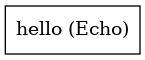

:orphan:

Hello, World!
=====================

``hello`` · *1 contributor · 1 version*

This is the 'Hello, world' equivalent workflow that uses the Echo unix
tool to log "Hello, World!" to the console, and collects the result.

This is designed to be the first example that you can run with janis, ie:
    
``janis run hello``

Quickstart
-----------

    .. code-block:: python

       from janis_unix.tools.hello import HelloWorkflow

       wf = WorkflowBuilder("myworkflow")

       wf.step(
           "hello_step",
           HelloWorkflow(

           )
       )
       wf.output("out", source=hello_step.out)
    

*OR*

1. `Install Janis </tutorials/tutorial0.html>`_

2. Ensure Janis is configured to work with Docker or Singularity.

3. Ensure all reference files are available:

.. note:: 

   More information about these inputs are available `below <#additional-configuration-inputs>`_.

4. Generate user input files for hello:

.. code-block:: bash

   # user inputs
   janis inputs hello > inputs.yaml

**inputs.yaml**

.. code-block:: yaml

       {}

5. Run hello with:

.. code-block:: bash

   janis run [...run options] \
       --inputs inputs.yaml \
       hello

Information
------------

URL: *No URL to the documentation was provided*

:ID: ``hello``
:URL: *No URL to the documentation was provided*
:Versions: v1.0.0
:Authors: Michael Franklin
:Citations: 
:Created: None
:Updated: 2019-08-12

Outputs
-----------

======  ======  ===============
name    type    documentation
======  ======  ===============
out     File
======  ======  ===============

Workflow
--------

Embedded Tools
***************

====  ===============
Echo  ``echo/v1.0.0``
====  ===============

Additional configuration (inputs)
---------------------------------

======  ================  ===============
name    type              documentation
======  ================  ===============
inp     Optional<String>
======  ================  ===============

Workflow Description Language
------------------------------

.. code-block:: text

   version development

   import "tools/echo_v1_0_0.wdl" as E

   workflow hello {
     input {
       String? inp = "Hello, world!"
     }
     call E.echo as hello {
       input:
         inp=select_first([inp, "Hello, world!"])
     }
     output {
       File out = hello.out
     }
   }

Common Workflow Language
-------------------------

.. code-block:: text

   #!/usr/bin/env cwl-runner
   class: Workflow
   cwlVersion: v1.2
   label: Hello, World!
   doc: |
     This is the 'Hello, world' equivalent workflow that uses the Echo unix
     tool to log "Hello, World!" to the console, and collects the result.

     This is designed to be the first example that you can run with janis, ie:
      
     ``janis run hello``

   requirements:
   - class: InlineJavascriptRequirement
   - class: StepInputExpressionRequirement

   inputs:
   - id: inp
     type: string
     default: Hello, world!

   outputs:
   - id: out
     type: File
     outputSource: hello/out

   steps:
   - id: hello
     label: Echo
     in:
     - id: inp
       source: inp
     run: tools/echo_v1_0_0.cwl
     out:
     - id: out
   id: hello

