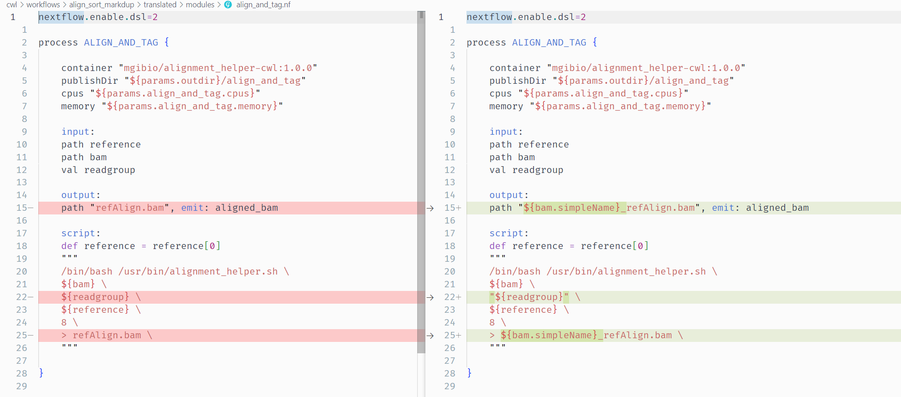

# Tutorial 2: CWL Workflow -> Nextflow

<br>

## Sections

- [Introduction](#introduction)
- [Running Janis Translate](#running-janis-translate)
- [Translation Output](#translation-output)
- [Running the Translated Workflow](#running-the-translated-workflow)
- [Manual Adjustments](#manual-adjustments)
- [Errors](#error-1-process-order)
    - [Error 1: Process order](#error-1-process-order)
    - [Error 2: Unquoted strings](#error-2-unquoted-strings)
    - [Error 3: Filename clashes](#error-3-filename-clashes)
- [Completed Workflow](#completed-workflow)
- [Conclusion](#conclusion)

<br>

## Introduction

This section demonstrates translation of a CWL Workflow to Nextflow using `janis translate`. 

The workflow used in this tutorial is taken from the [McDonnell Genome Institute](https://www.genome.wustl.edu/) (MGI) [analysis-workflows](https://github.com/genome/analysis-workflows) repository. 

This resource stores publically available analysis pipelines for genomics data. <br>
It is a fantastic piece of research software, and the authors thank MGI for their contribution to open-source research software. 

The workflow using in this tutorial - [align_sort_markdup.cwl](https://github.com/genome/analysis-workflows/blob/master/definitions/subworkflows/align_sort_markdup.cwl) - accepts multiple unaligned readsets as input and produces a single polished alignment bam file. 

***Main Inputs*** 

- Unaligned reads stored across multiple BAM files
- Reference genome index

***Main Outputs***

- Single BAM file storing alignment for all readsets

***Steps***

- Read alignment (run in parallel across all readsets) - `bwa mem`
- Merging alignment BAM files to single file - `samtools merge`
- Sorting merged BAM by coordinate - `sambamba sort`
- Tagging duplicate reads in alignment - `picard MarkDuplicates` 
- Indexing final BAM - `samtools index`

<br>

**Software**

Before continuing, ensure you have the following software installed:
- [Nextflow](https://nf-co.re/usage/installation)
- [Singularity](https://docs.sylabs.io/guides/3.0/user-guide/installation.html) or [Docker](https://docs.docker.com/engine/install/)
- [Janis](https://janis.readthedocs.io/en/latest/index.html)

<br>

**IDE**

Any IDE or a CLI text editor (VIM, nano) are sufficient for this material. 

We recommend Visual Studio Code (VS Code) as it is lightweight and has rich support for extensions to add functionality. 

<br>

**Obtaining Janis**

In this tutorial we will use a singularity container to run `janis translate`. 

Containers are great because they remove the need for package managers, and guarantee that the software can run on any machine. 

Run the following command to pull the janis image:
```
singularity pull janis.sif docker://pppjanistranslate/janis-translate:0.13.0
```

Check your image by running the following command:
```
singularity exec ~/janis.sif janis translate
```

If the image is working, you should see the janis translate helptext.

<br>

**Downloading Source Files and Sample Data**

For this tutorial we will fetch all necessary data from zenodo using wget.  

This archive contains the source CWL file, sample data, and finished translations as a reference.

Run the following commands to download & decompress the zenodo archive:
```
wget https://zenodo.org/record/8275567/files/tutorial2.tar.gz
tar -xvf tutorial2.tar.gz
```

After you have decompressed the tar archive, change into the new directory: 

```
cd tutorial2
```

Inside this folder we have the following structure: 
```
tutorial2
├── data
│   ├── 2895499223.bam
│   ├── 2895499237.bam
│   ├── chr17_test.dict
│   ├── chr17_test.fa
│   ├── chr17_test.fa.amb
│   ├── chr17_test.fa.ann
│   ├── chr17_test.fa.bwt
│   ├── chr17_test.fa.fai
│   ├── chr17_test.fa.pac
│   └── chr17_test.fa.sa
├── final
│   ├── main.nf
│   ├── modules
│   │   ├── align_and_tag.nf
│   │   ├── index_bam.nf
│   │   ├── mark_duplicates_and_sort.nf
│   │   ├── merge_bams_samtools.nf
│   │   └── name_sort.nf
│   ├── nextflow.config
│   ├── subworkflows
│   │   └── align.nf
│   └── templates
│       └── markduplicates_helper.sh
└── source
    ├── align_sort_markdup.cwl
    ├── subworkflows
    │   └── align.cwl
    └── tools
        ├── align_and_tag.cwl
        ├── index_bam.cwl
        ├── mark_duplicates_and_sort.cwl
        ├── merge_bams_samtools.cwl
        └── name_sort.cwl
``` 

We will translate the `source/align_sort_markdup.cwl` workflow into nextflow using janis, then will test out our translation using the files inside the indexed bam file in the `data/` folder. 

<br>

## Running Janis Translate

To translate a tool / workflow,  we use `janis translate`.

```
janis translate --from <src> --to <dest> <filepath>
```

The `--from` argument specifies the workflow language of the source file(s), and `--to` specifies the destination we want to translate to. 

In our case, this will be `--from cwl --to nextflow`.

The `<filepath>` argument is the source file we will translate. 

In this tutorial, the filepath will be `source/align_sort_markdup.cwl`

<br>

To translate our cwl tool, run the following command:
```
singularity exec ~/janis.sif janis translate --from cwl --to nextflow source/align_sort_markdup.cwl
```

You will see a folder called `translated/` appear, with various nextflow files and directories inside.  

<br>

## Translation Output

The output translation will contain multiple files and directories.<br>
You will see a folder called `translated/` appear - inside this folder, we should see the following structure:

```
translated
├── main.nf                             # main workflow (align_sort_markdup)
├── modules                             # folder containing nextflow processes
│   ├── align_and_tag.nf
│   ├── index_bam.nf
│   ├── mark_duplicates_and_sort.nf
│   ├── merge_bams_samtools.nf
│   └── name_sort.nf
├── nextflow.config                     # config file to supply input information
├── subworkflows                        # folder containing nextflow subworkflows
│   └── align.nf    
└── templates                           # folder containing any scripts used by processes
    └── markduplicates_helper.sh
```

Now that we have performed translation using `janis translate`, we need to check the translated workflow for correctness.  

From here, we will do a test-run of the workflow using sample data, and make manual adjustments to the translated workflow where needed.

<br>

## Running the Translated Workflow

**Inspect main.nf**

The main workflow translation appears as `main.nf` in the `translated/` folder. <br>

This filename is just a convention, and we use it to provide clarity about the main entry point of the workflow. <br>
In our case `main.nf` is equivalent to the main CWL Workflow file we translated: `align_sort_markdup.cwl`. 

<br>

> NOTE: <br>
> Before continuing, feel free to have a look at the other nextflow files which have been generated during translation:<br>
> Each CWL Subworkflow appears as a nextflow `workflow` in the `subworkflows/` directory.<br>
> Each CWL CommandLineTool appears as a nextflow `process` in the `modules/` directory. 

<br>

In `main.nf` we see the nextflow workflows / processes called by the main workflow:

```
include { ALIGN } from './subworkflows/align'
include { INDEX_BAM } from './modules/index_bam'
include { MARK_DUPLICATES_AND_SORT } from './modules/mark_duplicates_and_sort'
include { MERGE_BAMS_SAMTOOLS as MERGE } from './modules/merge_bams_samtools'
include { NAME_SORT } from './modules/name_sort'
```

We also see that some nextflow `Channels` and a single `variable` have been set up. <br>
These are used to supply data according to nextflow's adoption of the *dataflow* programming model.
```
// data which will be passed as channels
ch_bams        = Channel.fromPath( params.bams ).toList()
ch_readgroups  = Channel.of( params.readgroups ).toList()

// data which will be passed as variables
reference  = params.reference.collect{ file(it) }
```

Focusing on the channel declarations, we want to note a few things:

- `ch_bams` is analygous to the *'bams'* input in `align_sort_markdup.cwl`. <br>
It declares a queue channel which expects the data supplied via `params.bams` are `path` types. <br>
It then groups the bams together as a sole emission using `.toList()`. <br>
We will need to set up `params.bams` to supply this data.

- `ch_readgroups` is analygous to the *'readgroups'* input in `align_sort_markdup.cwl`. <br>
It is the same as `ch_bams`, except it requires `val` types rather than `path` types. <br>
We will need to set up `params.readgroups` to supply this data.

We also see a new variable called `reference` being created. 

This `reference` var is analygous to the *'reference'* input in `align_sort_markdup.cwl`. 
It collects the *'reference'* primary & secondary files together in a list. 

We will need to set up `params.reference` to supply this data. 

<br>

> Note: Why does `reference` appear as a variable, rather than a `Channel`? <br><br>
> In Nextflow, we find it is best to create Channels for data that ***moves*** through the pipeline. <br>
> The `ch_bams` channel is created because we want to consume / transform the input bams during the pipeline. <br> <br>
> On the other hand, the `reference` genome variable is not something we really want to consume or transform.  <br>
> It's more like static helper data which can be used by processes, but it doesn't ***move*** through our pipeline, and definitely shouldn't be consumed or transformed in any way. 

<br>

> Note: `.toList()` <br><br>
> Nextflow queue channels work differently to lists. <br>
> Instead of supplying all items together, queue channels emit each item separately. <br> 
> This results in a separate task being spawned for each item in the queue when the channel is used. <br>
> As the CWL workflow input specifies that `bams` is a list, we use `.toList()` to group all items as a sole emission. <br>
> This mimics a CWL array which is the datatype of the `bams` inputs. <br><br>
> As it turns out, the CWL workflow ends up running the `align` step in parallel across the `bams` & `readgroups` inputs. <br><br>
> Parallelisation in nextflow happens by default. <br>
> To facilitate this, the `.flatten()` method is called on  `ch_bams` and `ch_readgroups` when used in the `ALIGN` task. <br>
> This emits items in `ch_bams` and `ch_readgroups` individually, spawning a new `ALIGN` task for each pair. <br><br>
> We're kinda doing redundant work by calling `.toList()`, then `.flatten()` when `ch_bams` and `ch_readgroups` are used.<br>
> `janis translate` isn't smart enough yet to detect this yet, but may do so in future. 

<br>

Continuing down `main.nf`, we see the main `workflow {}` has 5 tasks. 

Each task has been supplied values according to the source workflow.
Comments display the name of the process/workflow input which is being fed a particular value. 

```
workflow {

    ALIGN(
        ch_bams.flatten(),       // bam
        reference,               // reference
        ch_readgroups.flatten()  // readgroup
    )

    INDEX_BAM(
        MARK_DUPLICATES_AND_SORT.out.sorted_bam.map{ tuple -> tuple[0] }  // bam
    )

    MARK_DUPLICATES_AND_SORT(
        params.mark_duplicates_and_sort.script,  // script
        NAME_SORT.out.name_sorted_bam,           // bam
        params.NULL_VALUE,                       // input_sort_order
        params.final_name                        // output_name
    )

    MERGE(
        ALIGN.out.tagged_bam.toList(),  // bams
        params.final_name               // name
    )

    NAME_SORT(
        MERGE.out.merged_bam  // bam
    )

}
```

Before `main.nf` can be run, we will need to supply values for the `params` variables. 
This is done in `nextflow.config`. 

<br>

**Inspect nextflow.config**

To test the translated workflow, we will first set up workflow inputs in `nextflow.config`. 

Before running a workflow, nextflow will attempt to open `nextflow.config` and read in config information and global *param* variables from this file. 
We use this file to tell nextflow how to run and to supply workflow inputs.

Inside the `translated/` folder you will see that `nextflow.config` is already provided. 

Janis translate creates this file to provide clarity about the necessary workflow inputs, and to set some other config variables. 

Open `nextflow.config` and have a look at the contents. It should look similar to the following: 

```
nextflow.enable.dsl = 2
singularity.enabled = true
singularity.autoMounts = true
singularity.cacheDir = "$HOME/.singularity/cache"

params {
    
    // Placeholder for null values.
    // Do not alter unless you know what you are doing.
    NULL_VALUE = 'NULL'

    // WORKFLOW OUTPUT DIRECTORY
    outdir  = './outputs'

    // INPUTS (MANDATORY)
    bams        = []          // (MANDATORY array)             eg. [file1, ...]
    reference   = []          // (MANDATORY fastawithindexes)  eg. [fasta, amb, ann, bwt, dict, fai, pac, sa]
    readgroups  = NULL_VALUE  // (MANDATORY array)             eg. [string1, ...]

    // INPUTS (OPTIONAL)
    final_name  = "final.bam" 

    // PROCESS: ALIGN_AND_TAG
    align_and_tag.cpus    = 8     
    align_and_tag.memory  = 20000 

    // PROCESS: INDEX_BAM
    index_bam.memory  = 4000 

    // PROCESS: MARK_DUPLICATES_AND_SORT
    mark_duplicates_and_sort.script  = "/home2/training/align_sort_markdup/templates/markduplicates_helper.sh" 
    mark_duplicates_and_sort.cpus    = 8                                                                       
    mark_duplicates_and_sort.memory  = 40000                                                                   

    // PROCESS: MERGE_BAMS_SAMTOOLS
    merge_bams_samtools.cpus    = 4    
    merge_bams_samtools.memory  = 8000 

    // PROCESS: NAME_SORT
    name_sort.cpus    = 8     
    name_sort.memory  = 26000 

}

```

<br>

> NOTE: `NULL_VALUE = 'NULL'`<br><br>
> Nextflow doesn't like `null` values to be passed to process inputs. <br>
> This is a challenge for translation as other languages allow `optional` inputs. <br>
> To get around this, Janis Translate sets the `params.NULL_VALUE` variable as a `null` placeholder for `val` type inputs. <br>
> You will see this being used in nextflow processes to do optionality checking.

<br>

The auto-generated `nextflow.config` splits up workflow inputs using some headings. 

```
// INPUTS (MANDATORY)
```
Workflow inputs which are required to run the workflow. We must provide a value for these. 

```
// INPUTS (OPTIONAL)
```
Workflow inputs which are not required to run the workflow. These are optional. 

```
// PROCESS: ALIGN_AND_TAG
```
Inputs which are specific to a particular process. These are usually static values rather than files.  
May be *mandatory* or *optional*. 

<br>

**Setting up Workflow Inputs**

Janis Translate will enter values for workflow inputs where possible. 
Others need to be manually supplied as they are specific to the input data you wish to use. 

In our case, we need to supply values for those under the `// INPUTS (MANDATORY)` heading. 
Specifically, we need to provide sample data for the `bams`, `reference`, and `readgroups` inputs. 

Copy and paste the following text, to override the params under the `// INPUTS (MANDATORY)` heading:

```
// INPUTS (MANDATORY)
bams        = [
    "../data/2895499223.bam",
    "../data/2895499237.bam",
]
reference   = [
    "../data/chr17_test.fa",
    "../data/chr17_test.fa.amb",
    "../data/chr17_test.fa.ann",
    "../data/chr17_test.fa.bwt",
    "../data/chr17_test.fa.fai",
    "../data/chr17_test.dict",
    "../data/chr17_test.fa.pac",
    "../data/chr17_test.fa.sa",
] 
readgroups  = [
    '@RG\tID:2895499223\tPU:H7HY2CCXX.3.ATCACGGT\tSM:H_NJ-HCC1395-HCC1395\tLB:H_NJ-HCC1395-HCC1395-lg24-lib1\tPL:Illumina\tCN:WUGSC',
    '@RG\tID:2895499237\tPU:H7HY2CCXX.4.ATCACGGT\tSM:H_NJ-HCC1395-HCC1395\tLB:H_NJ-HCC1395-HCC1395-lg24-lib1\tPL:Illumina\tCN:WUGSC'
]
```

<br>

**Run the Workflow**

Ensure you are in the `translated/` working directory, where `nextflow.config` and `main.nf` reside. 

If not, use the following to change directory. 
```
cd translated
```

To run the workflow using our sample data, we can now write the following command: 
```
nextflow run main.nf
```

While the workflow runs, you will encounter this error:

```
Access to 'MARK_DUPLICATES_AND_SORT.out' is undefined since the process 'MARK_DUPLICATES_AND_SORT' has not been invoked before accessing the output attribute
```

This is somewhat expected. Janis translate doesn't produce perfect translations - just the best it can do. 

This is the first of ***3*** errors we will encounter and fix while making this workflow runnable. 


<br>

## Manual Adjustments

Translations performed by `janis translate` often require manual changes due to the difficulty of translating between languages with non-overlapping feature sets. 

In this section we will fix ***3 errors*** to bring the translation to a finished state. 

<br>

> NOTE <br>
> If having trouble during this section, the finished workflow is available in the `tutorial2/final` folder for reference.

<br>

## Error 1: Process Order

**Error message**

The first issue we need to address is caused by tasks being in the wrong order. 

```
Access to 'MARK_DUPLICATES_AND_SORT.out' is undefined since the process 'MARK_DUPLICATES_AND_SORT' has not been invoked before accessing the output attribute
```

This nextflow error message is quite informative, and tells us that a task is trying to access the output of `MARK_DUPLICATES_AND_SORT` before it has run. 

The offending task is `INDEX_BAM` as it uses `MARK_DUPLICATES_AND_SORT.out.sorted_bam.map{ tuple -> tuple[0] }` as an input value to the process. 

<br>

> NOTE<br>
> Why does this happen? <br>
> <br>
> Internally, CWL stores a list of tasks to execute alphabetically. <br>
> It then works out the required order of operations at runtime. <br><br>
> This is different to nextflow, where the order of tasks in the nextflow file ***is*** their execution order. <br>
> <br> 
> Since `janis translate` currently uses `cwltool` to load cwl documents, janis is passed the alphabetical list of tasks from CWL. This may or may not be the correct order when translated to nextflow! 

<br>

**Troubleshooting**

It seems that a nextflow process is trying to run before a prior process has finished. 

This is most likely due to the processes in our `main.nf` workflow being in the wrong order. 

Let's look at the source CWL `align_sort_markdup.cwl` workflow to view the correct order of steps:

```
steps:
    align:
        ...
    merge:
        ...
    name_sort:
        ...
    mark_duplicates_and_sort:
        ...
    index_bam:
        ...

```

This differs from our translated `main.nf` which has the following order:

```
workflow {

    ALIGN(
        ...
    )

    INDEX_BAM(
        ...
    )

    MARK_DUPLICATES_AND_SORT(
        ...
    )

    MERGE(
        ...
    )

    NAME_SORT(
        ...
    )

}
```

<br>

**Solution**

We will need to rearrange the process calls in `main.nf` so they mirror the order seen in the source CWL. 

> <span style="color:orange;">TASK ⚡</span><br>
>
> Rerranging process calls
>
> - Cut-and-paste the process calls to be in the correct order in the main workflow.
>
> <details>
>     <summary>Show Correct Order</summary>
>
>     1. ALIGN
>     2. MERGE
>     3. NAME_SORT
>     4. MARK_DUPLICATES_AND_SORT
>     5. INDEX_BAM
>
> </details>
> <details>
>     <summary>Show Changes (main.nf)</summary>
>
>     workflow {
>     
>         ALIGN(
>             ch_bams.flatten(),       // ch_bam
>             reference,               // ch_reference
>             ch_readgroups.flatten()  // ch_readgroup
>         )
>     
>         MERGE(
>             ALIGN.out.tagged_bam.toList(),  // bams
>             params.final_name               // name
>         )
>         
>         NAME_SORT(
>             MERGE.out.merged_bam  // bam
>         )
>     
>         MARK_DUPLICATES_AND_SORT(
>             params.mark_duplicates_and_sort.script,  // script
>             NAME_SORT.out.name_sorted_bam,           // bam
>             params.NULL_VALUE,                       // input_sort_order
>             params.final_name                        // output_name
>         )
>     
>         INDEX_BAM(
>             MARK_DUPLICATES_AND_SORT.out.sorted_bam.map{ tuple -> tuple[0] }  // bam
>         )
>     
>     }
>
> </details>

<br>

After you are done, rerun the workflow by using the same command as before.

```
nextflow run main.nf
```

<br>

## Error 2: Unquoted Strings

**Error message**

The second error is due to the `readgroup` input of the `ALIGN_AND_TAG` process being used without enclosing quotes. 

```
Caused by:
Process `ALIGN:ALIGN_AND_TAG (1)` terminated with an error exit status (1)

Command executed:
/bin/bash /usr/bin/alignment_helper.sh     2895499223.bam     @RG INCLID:2895499223RY_PU:H7HY2CCXX.3.ATCACGGTITY=ISM:H_NJ-HCC1395-HCC1395ILB:H_NJ-HCC1395-HCC1395-lg24-lib1LEVEL=5PL:IlluminaSCN:WUGSC     chr17_test.fa          8     > refAlign.bam
```

The issue can be seen in the command above. 

We see `/bin/bash /usr/bin/alignment_helper.sh   2895499223.bam` which is expected. <br>
This is then followed by what looks like 2 string arguments: `@RG` and `INCLID...`.<br>
This is causing the problem.

<br>

**Troubleshooting**

The `Command executed` section in nextflow error messages is particularly useful. <br> 
This message is printed to the shell, but can also be seen by navigating to the process working directory & viewing `.command.sh`. 

Let's look at the nextflow `ALIGN_AND_TAG` process so we can match up which process input is causing the error. <br>
Indiviual arguments have been marked with their (position) to aid our investigation. 

```
process ALIGN_AND_TAG {
    
    container "mgibio/alignment_helper-cwl:1.0.0"
    publishDir "${params.outdir}/align_and_tag"
    cpus "${params.align_and_tag.cpus}"
    memory "${params.align_and_tag.memory}"

    input:
    path reference
    path bam
    val readgroup

    output:
    path "refAlign.bam", emit: aligned_bam

    script:
    def reference = reference[0]
    """
    (1) /bin/bash (2) /usr/bin/alignment_helper.sh \
    (3) ${bam} \
    (4) ${readgroup} \
    (5) ${reference} \
    (6) 8 \
    (7) > (8) refAlign.bam  
    """

}
```

Here is the command executed with the same numbering:

```
(1) /bin/bash (2) /usr/bin/alignment_helper.sh  (3) 2895499223.bam     (4) @RG (5) ID:2895499223	PU:H7HY2CCXX.3.ATCACGGT	SM:H_NJ-HCC1395-HCC1395	LB:H_NJ-HCC1395-HCC1395-lg24-lib1	PL:Illumina	CN:WUGSC   (6) chr17_test.fa        (7) 8  (8) >  (9) refAlign.bam 
```

Matching up the two, we can see that arguments `(1-3)` match their expected values. <br>
Argument `(4)` starts out right, as we expect the `readgroup` input. 

Looking in the `script:` section of the nextflow process, we expect the `${reference}` input to appear as argument `(5)`, but in the actual command it appears as argument `(6)` `chr17_test.fa`.

The issue seems to be that the `readgroup` input has been split into 2 strings, instead of 1 single string. <br>
By tracing back through the workflow, we can track that `params.readgroups` supplies the value for `readgroup` in this nextflow process:

```
modules/align_and_tag.nf:  readgroup
subworkflows/align.nf:     ch_readgroup
main.nf:                   ch_readgroups.flatten()
main.nf:                   ch_readgroups  = Channel.of( params.readgroups ).toList()
```

Looking at `nextflow.config` we see that this particular readgroup value is supplied as follows:

```
@RG\tID:2895499223\tPU:H7HY2CCXX.3.ATCACGGT\tSM:H_NJ-HCC1395-HCC1395\tLB:H_NJ-HCC1395-HCC1395-lg24-lib1\tPL:Illumina\tCN:WUGSC
```

The `@RG` being split from the rest of the readgroup value, and the text which follows is incorrect in the command.  

The issue here is that this value in `params.readgroups` contains spaces and tabs (`\t`). <br>
When used in a nextflow process, string arugments should be enclosed  using `""`. 

<br>

**Solution**

Back in the `modules/align_and_tag.nf` file, let's properly enclose the `readgroup` input in quotes. 

> <span style="color:orange;">TASK ⚡</span><br>
>
> Enclosing `readgroup` in quotes
>
> - In the `ALIGN_AND_TAG` process script enclose the `${readgroup}` reference in quotes.
>
> <details>
>     <summary>Show Changes (align_and_tag.nf)</summary>
>       
>     process ALIGN_AND_TAG {
>           ...
>             
>           script:
>           def reference = reference[0]
>           """
>           /bin/bash /usr/bin/alignment_helper.sh \
>           ${bam} \
>           "${readgroup}" \                            <- quotes added
>           ${reference} \
>           8 \
>           > refAlign.bam 
>           """
>
>     }
>     ...
>
> </details>

<br>

After you are have made the change, re-run the workflow by using the same command as before:

```
nextflow run main.nf
```

<br>

## Error 3: Filename Clashes

**Error Message**

The final error is flagged by the nextflow workflow engine. 

Upon re-running the workflow, you will encounter the following message:
```
Process `MERGE` input file name collision -- There are multiple input files for each of the following file names: refAlign.bam
```

This informs us that more than 1 file with the name `refAlign.bam` have been inputs to `MERGE` process. 

Nextflow does not allow this behaviour. <br>

Other workflow engines use temporary names for files so that name clashes are impossible. <br> 
Nextflow requires us to be more specific with our filenames so we can track which file is which. 

This is not a hard-and-fast rule of workflow engines, but nextflow enforces using unique names to encourage best-practises. 

<br>

**Troubleshooting**

To track the cause, let's look at the data which feeds the `MERGE` process. 

`main.nf`
```
MERGE(
    ALIGN.out.tagged_bam.toList(),  // bams
    params.final_name               // name
)
```

We can see the translated nextflow workflow is collecting the `tagged_bam` output of all `ALIGN` tasks as a list using `.toList()`. <br>
This value feeds the `bams` input of the `MERGE` process. 

The issue is that 2+ files in this list must have the same filename: "refAlign.bam".<br>
We need to see how files end up being placed into `ALIGN.out.tagged_bam` to track where the error is occuring. 

Looking in the `ALIGN` subworkflow in `subworkflows/align.nf`, we see the offending `tagged_bam` output emit. <br>
This gets its data from the `aligned_bam` output of the `ALIGN_AND_TAG` process in `modules/align_and_tag.nf`. 

The source of the issue must be that the `aligned_bam` output is producing the same filename each time the task is run. 

Opening `modules/align_and_tag.nf` we can see how the `align_bam` output is created & collected:
```
    output:
    path "refAlign.bam", emit: aligned_bam          <-

    script:
    def reference = reference[0]
    """
    /bin/bash /usr/bin/alignment_helper.sh \
    ${bam} \
    "${readgroup}" \
    ${reference} \
    8 \
    > refAlign.bam                                  <-
    """
```

From looking at the `output` and `script` section of this process, we can see that the `aligned_bam` output will always have the same filename. 

In the script, we generate a file called `refAlign.bam` by redirecting `stdout` to this file. <br>
In the output, `refAlign.bam` is collected as the output. 

This would be fine if our workflow was supplied only a single BAM input file, but we want our workflow to run when we have many BAMs. 

<br>

**Solution**

To fix this issue, we need to give the output files unique names.  

This can be accomplished using a combination of the `path bam` process input, and the `.simpleName` operator.

As our input BAM files will all have unique names, we can use their name as a base for our output alignemnts. 
If we were to use their filename directly, we would get their file extension too, which we don't want!

Luckily the `.simpleName` nextflow operator will return the basename of a file without directory path or extensions. 

For example, imagine we have a process input `path reads`.<br>
Suppose it gets fed the value `"data/SRR1234.fq"` at runtime.<br>
Calling `${reads.simpleName}` in the process script would yield `"SRR1234"`.

Note that directory path and the extension have been trimmed out!

> <span style="color:orange;">TASK ⚡</span><br>
>
> Unique output names for the `ALIGN_AND_TAG` process
>
> - In the script section, use `.simpleName` to generate an output filename based on the `path bam` process input. <br>
>   Add "_refAlign.bam" onto the end of this filename for clarity.
> - Alter the output collection expression for the `aligned_bam` output to collect this file.
> <details>
>     <summary>Show Changes (align_and_tag.nf)</summary>
>
>     process ALIGN_AND_TAG {
>                 
>         container "mgibio/alignment_helper-cwl:1.0.0"
>         publishDir "${params.outdir}/align_and_tag"
>         cpus "${params.align_and_tag.cpus}"
>         memory "${params.align_and_tag.memory}"
>     
>         input:
>         path reference
>         path bam
>         val readgroup
>     
>         output:
>         path "${bam.simpleName}_refAlign.bam", emit: aligned_bam    <-
>     
>         script:
>         def reference = reference[0]
>         """
>         /bin/bash /usr/bin/alignment_helper.sh \
>         ${bam} \
>         "${readgroup}" \
>         ${reference} \
>         8 \
>         > ${bam.simpleName}_refAlign.bam                            <-
>         """
>     
>     }
>
> </details>

<br>

After you are have made these changes, re-run the workflow by using the same command as before:
```
nextflow run main.nf
```

With any luck, this will fix the remaining issues and the workflow will now run to completion. 

<br>

## Completed Workflow

Once completed, we can check the `outputs/` folder to view our results. <br>
If everything went well, the `outputs/` folder should have the following structure:
```
outputs
├── align_and_tag
│   ├── 2895499223_refAlign.bam
│   └── 2895499237_refAlign.bam
├── index_bam
│   ├── final.bam
│   └── final.bam.bai
├── mark_duplicates_and_sort
│   ├── final.bam
│   ├── final.bam.bai
│   └── final.mark_dups_metrics.txt
├── merge_bams_samtools
│   └── final.bam.merged.bam
└── name_sort
    └── final.NameSorted.bam
```

<br>

## Conclusion

In this section we explored how to translate the `align_sort_markdup` CWL Workflow to Nextflow using `janis translate`. 

If having trouble, the finished workflow is also available in the `tutorial2/final` folder for reference.

In addition, the following diffs shows the changes we made to files during manual adjustment of the workflow. 

`main.nf`


`align_and_tag.nf`



<br>