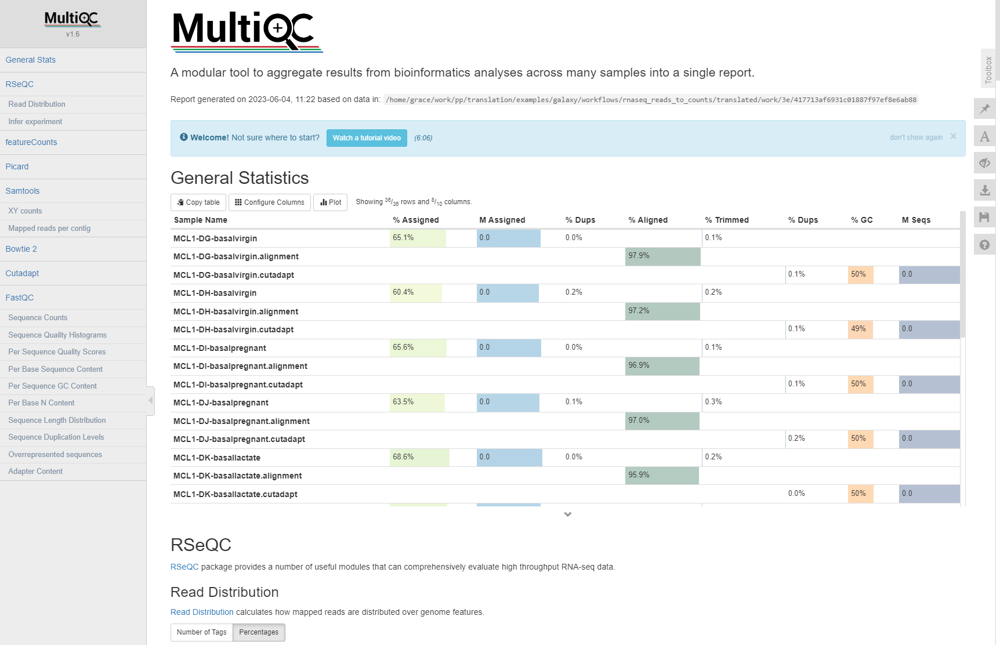

# Tutorial 5: Galaxy Workflow -> Nextflow

<br>

## Sections

- [Introduction](#introduction)
- [Running Janis Translate](#running-janis-translate)
- [Task 1: Swapping Containers](#task-1-swapping-containers)
- [Task 2: Removing COLLECTION_COLUMN_JOIN process](#task-2-removing-collection_column_join-process)
- [Task 3: Setting up Inputs](#task-3-setting-up-inputs)
- [Task 4: Fixing RSEQC Input](#task-4-fixing-rseqc-input)
- [Task 5: FASTQC outdir](#task-5-fastqc-outdir)
- [Task 6: CUTADAPT output collection](#task-6-cutadapt-output-collection)
- [Task 7: HISAT2 index ](#task-7-hisat2-index)
- [Task 8: FEATURECOUNTS command](#task-8-featurecounts-command)
- [Task 9: PICARD_MARK_DUPLICATES command](#task-9-picard_mark_duplicates-command)
- [Task 10: MULTIQC input filename collision](#task-10-multiqc-input-filename-collision)
- [Task 11: MULTIQC script](#task-11-multiqc-script-final-task)
- [Conclusion](#conclusion)

<br>

## Introduction

This tutorial demonstrates translation of a challenging Galaxy workflow to Nextflow using `janis translate`. 

The workflow we will translate in this section accepts raw RNA-seq reads as input, and produces gene counts for further analysis (eg. differential expression).

Many of the Galaxy Tool Wrappers used in this workflow are challenging. They may:

- Contain complex execution logic
- Perform multiple commands
- Use inbuilt Galaxy data for reference genomes, indexes, and annotation information.

In these situations, the translated files produced by `janis translate` will need manual invertention to run. 

<br>

The workflow used in this section is taken from the [Galaxy Training Network (GTN)](https://training.galaxyproject.org/training-material/) resource which provides tutorials on how to use Galaxy for bioinformatic analysis. 

The GTN has over 100 tutorials demonstrating how to use the Galaxy platform to analyse data, and is definitely worth having a look! 

The specific workflow we use today is from the [RNA-Seq reads to counts](https://training.galaxyproject.org/training-material/topics/transcriptomics/tutorials/rna-seq-reads-to-counts/tutorial.html) page, which provides detailed instruction on how to turn raw RNA-seq reads into gene counts.

<br>

**Software**

Before continuing, ensure you have the following software installed:
- [Nextflow](https://nf-co.re/usage/installation)
- [Singularity](https://docs.sylabs.io/guides/3.0/user-guide/installation.html) or [Docker](https://docs.docker.com/engine/install/)
- [Janis](https://janis.readthedocs.io/en/latest/index.html)

<br>

**IDE**

Any IDE or a CLI text editor (VIM, nano) are sufficient for this material. 

We recommend Visual Studio Code (VS Code) as it is lightweight and has rich support for extensions to add functionality. 

<br>

**Obtaining Janis**

In this tutorial we will use a singularity container to run `janis translate`. 

Containers are great because they remove the need for package managers, and guarantee that the software can run on any machine. 

Run the following command to pull the janis image:
```
singularity pull janis.sif docker://pppjanistranslate/janis-translate:0.13.0
```

Check your image by running the following command:
```
singularity exec ~/janis.sif janis translate
```

If the image is working, you should see the janis translate helptext.

<br>

**Downloading Source Files and Sample Data**

For this tutorial we will fetch all necessary data from zenodo using wget.  

This archive contains the source galaxy workflow to translate, sample data, and the finished translations as a reference.

Run the following commands to download & decompress the zenodo archive:
```
wget https://zenodo.org/record/8275567/files/tutorial5.tar.gz
tar -xvf tutorial5.tar.gz
```

After you have decompressed the tar archive, change into the new directory: 

```
cd tutorial5
```

Inside this folder we have the following structure: 

```
tutorial5
├── data                                    # test data
|   └── ...
├── final                                   # finished translations
|   └── ...
└── source                                  
    └── rna-seq-reads-to-counts.ga          # source Galaxy workflow
```

<br>

> NOTE<br>
> *(for your information)*
>
> Galaxy workflows can be obtained from a number of places:
> - URL links
> - Published workflows on a galaxy server
> - Your personal workflows on a galaxy server
>
> **URL Links**
>
> Galaxy workflows are just `.ga` files, so we can access them via simple download links on the internet. 
>
> The workflow we will translate today is included as `tutorial5/source/rna-seq-reads-to-counts.ga`, but can also be accessed using [this link](https://training.galaxyproject.org/training-material/topics/transcriptomics/tutorials/rna-seq-reads-to-counts/workflows/rna-seq-reads-to-counts.ga).
>
> The [Galaxy Training Network (GTN)](https://training.galaxyproject.org/training-material/)  provides workflows for their training tutorials. These are useful because the topics covered are common analyses users wish to perform. 
> 
> 
> 
> **Published workflows**
>
> Galaxy servers each have [published workflows](https://usegalaxy.org.au/workflows/list_published) where you can search for a community workflow which suits your needs. To access these, click 'Shared Data -> Workflows' on the top bar of a Galaxy server. For any workflow, you can use the dropdown to select 'save as file' to download the `.ga` file. 
> 
> 
> 
> **Your workflows**
> 
> Additionally, you can create your own workflow using the [Galaxy Workflow Editor](https://usegalaxy.org.au/workflows/list) then download your creation. 
> 
> 

<br>


## Running Janis Translate

**CLI syntax**

To translate a tool / workflow,  we use `janis translate`.

```
janis translate --from <src> --to <dest> <filepath>
```

The `--from` argument specifies the workflow language of the source file(s), and `--to` specifies the destination we want to translate to. 

In our case, this will be `--from galaxy --to nextflow`.

The `<filepath>` argument is the source file we will translate. 

In this tutorial, the filepath will be `source/rna-seq-reads-to-counts.ga`

<br>

**Translating the workflow**

To translate the Galaxy workflow for this tutorial, run the following command:
```
singularity exec ~/janis.sif janis translate --from galaxy --to nextflow source/rna-seq-reads-to-counts.ga
```

This may take up to 5 minutes for our workflow. 

You will see a folder called `translated/` appear, with various nextflow files and directories inside.  

<br>

> NOTE
>
> Why does this take some time? 
> 
> The `.ga` files themselves only contain metadata, rather than tools and environment configuration needed for translation. 
>
> During translation Janis uses the Galaxy Toolshed API to look up and download wrappers specified in the workflow.
>
> Janis also makes requests to quay.io to find the most suitable container image for each Galaxy Tool Wrapper using the requirements listed in the wrapper. 
> 

<br>

**Translation Output**

The output translation will contain multiple files and directories.<br>
You will see a folder called `translated/` appear - inside this folder, we should see the following structure:

```
translated
├── main.nf                             # main workflow (rna-seq-reads-to-counts)
├── modules                             # folder containing nextflow processes
│   ├── collection_column_join.nf
│   ├── cutadapt.nf
│   ├── fastqc.nf
│   ├── featurecounts.nf
│   ├── hisat2.nf
│   ├── multiqc.nf
│   ├── picard_mark_duplicates.nf
│   ├── rseqc_gene_body_coverage.nf
│   ├── rseqc_infer_experiment.nf
│   ├── rseqc_read_distribution.nf
│   └── samtools_idxstats.nf
├── nextflow.config                     # config file to supply input information
├── source                              # folder containing galaxy tool wrappers used to translate tools
├── subworkflows                        # folder containing nextflow subworkflows
└── templates                           # folder containing any scripts used by processes
    ├── collection_column_join_script
    └── multiqc_config
```

<br>

The main workflow translation appears as `main.nf` in the `rnaseq_reads_to_counts/` folder. <br>

<br>

> NOTE: <br>
> Before continuing, feel free to have a look at the other nextflow files which have been generated during translation.<br>
> Each Galaxy tool appears as a nextflow process in the `translated/modules/` directory. <br>
> Each script used by nextflow processes appear in the `translated/templates/` directory.<br>
> Each Galaxy Tool Wrapper used during translation appears in the `translated/source/` directory. 

<br>

In `main.nf` we see imports for nextflow processes called by the main workflow:

```
include { FASTQC as FASTQC1 } from './modules/fastqc'
include { CUTADAPT } from './modules/cutadapt'
include { FASTQC as FASTQC2 } from './modules/fastqc'
include { HISAT2 } from './modules/hisat2'
include { FEATURECOUNTS } from './modules/featurecounts'
include { PICARD_MARK_DUPLICATES } from './modules/picard_mark_duplicates'
include { SAMTOOLS_IDXSTATS } from './modules/samtools_idxstats'
include { RSEQC_GENE_BODY_COVERAGE } from './modules/rseqc_gene_body_coverage'
include { RSEQC_INFER_EXPERIMENT } from './modules/rseqc_infer_experiment'
include { RSEQC_READ_DISTRIBUTION } from './modules/rseqc_read_distribution'
include { COLLECTION_COLUMN_JOIN } from './modules/collection_column_join'
include { MULTIQC } from './modules/multiqc'
```

We also see that some nextflow `Channels` and other variables have been set up. 

Channels are used to supply data according to nextflow's adoption of the *dataflow* programming model.
The other variable definitions ensure that file input parameters are being treated as *files* by nextflow, so that they are staged properly in the process working directory. 
```
// data which will be passed as channels
ch_in_input_fastqs_collection  = Channel.fromPath( params.in_input_fastqs_collection ).toList()

// data which will be passed as variables
collection_column_join_script  = file( params.collection_column_join_script )
fastqc1_contaminants           = file( params.fastqc1_contaminants )
fastqc1_limits                 = file( params.fastqc1_limits )
fastqc2_contaminants           = file( params.fastqc2_contaminants )
fastqc2_limits                 = file( params.fastqc2_limits )
in_input_reference_gene_bed    = file( params.in_input_reference_gene_bed )
multiqc_config                 = file( params.multiqc_config )
```

<br>

Now that we have looked at the imports and dataflow, we can look at the main `workflow` section. 

The main workflow is captured in the `workflow {}` section and has 12 tasks. 
Each task has been supplied values according to the source workflow. 
Comments display the name of the process input which is being fed a particular value. 

To get a sense of how the processes relate to each other in the workflow execution, compare the main `workflow {}` section with the following visualisation of our Galaxy workflow (using the Galaxy workflow editor).

main.nf
```
workflow {

    FASTQC1(
        ch_in_input_fastqs_collection.flatten(),  // input_file
        fastqc1_contaminants,                     // contaminants
        fastqc1_limits,                           // limits
        false,                                    // extract
        false,                                    // quiet
        params.fastqc1_format_string,             // format_string
        params.fastqc1_outdir                     // outdir
    )

    CUTADAPT(
        ch_in_input_fastqs_collection.flatten()  // library_input_1
    )

    FASTQC2(
        CUTADAPT.out.out12,            // input_file
        fastqc2_contaminants,          // contaminants
        fastqc2_limits,                // limits
        false,                         // extract
        false,                         // quiet
        params.fastqc2_format_string,  // format_string
        params.fastqc2_outdir          // outdir
    )

    HISAT2(
        CUTADAPT.out.out12,       // library_input_1
        params.hisat2_index_path  // index_path
    )

    FEATURECOUNTS(
        HISAT2.out.output_alignments  // alignment
    )

    PICARD_MARK_DUPLICATES(
        HISAT2.out.output_alignments  // input_file
    )

    SAMTOOLS_IDXSTATS(
        HISAT2.out.output_alignments,        // input_bam
        params.samtools_idxstats_addthreads  // addthreads
    )

    RSEQC_GENE_BODY_COVERAGE(
        HISAT2.out.output_alignments,                 // batch_mode_input
        in_input_reference_gene_bed,                  // refgene
        params.rseqc_gene_body_coverage_safename_bam  // safename_bam
    )

    RSEQC_INFER_EXPERIMENT(
        HISAT2.out.output_alignments,  // input_bam
        in_input_reference_gene_bed    // refgene
    )

    RSEQC_READ_DISTRIBUTION(
        HISAT2.out.output_alignments,  // input_bam
        in_input_reference_gene_bed    // refgene
    )

    COLLECTION_COLUMN_JOIN(
        FEATURECOUNTS.out.output_short.toList(),  // input_tabular
        collection_column_join_script             // collection_column_join_script
    )

    MULTIQC(
        multiqc_config,                               // multiqc_config
        FASTQC2.out.out_text_file,                    // unknown1
        CUTADAPT.out.out_report,                      // unknown2
        RSEQC_INFER_EXPERIMENT.out.outputTextfile,    // unknown3
        PICARD_MARK_DUPLICATES.out.out_metrics_file,  // unknown4
        SAMTOOLS_IDXSTATS.out.outputTabular,          // unknown5
        RSEQC_GENE_BODY_COVERAGE.out.outputtxt,       // unknown6
        RSEQC_READ_DISTRIBUTION.out.outputTextfile,   // unknown7
        FEATURECOUNTS.out.output_summary,             // unknown8
        HISAT2.out.out_summary_file                   // unknown9
    )

}
```

Galaxy Workflow


Now that we have performed translation using `janis translate`, we need to check the translated workflow for correctness.   

The tasks to follow in this tutorial will bring our translation to a runnable state. 

<br>

## Task 1: Swapping Containers

The first thing to do is change the container requirement for some tools. 

Galaxy uses `conda` to handle tool requirements. 
For best-practises pipelines, we want to use container images instead of conda, and want a single image.

For Galaxy Tool Wrappers which only have a single requirement, there is no issue.  `janis translate` will fetch a container for that single requirement by looking up registries on `quay.io`. 

For those which have 2+ requirements, things get complicated. 

For the `hisat2` Galaxy Tool Wrapper, the following are listed:

- hisat2==2.2.1
- samtools==1.12
- seqtk==1.3

By default, `janis translate` will pick a container image for the main requirement in these situations. 

If you look at the translated `translated/modules/hisat2.nf` process for hisat2, you will see the following: 

```
process HISAT2 {
    
    container "quay.io/biocontainers/hisat2:2.2.1--hdbdd923_6"
    ...

}
```
We see that `janis translate` has fetched a container image for the main `hisat2==2.2.1` requirement. Unfortunately, this will not have all the software required to run the process. 

To solve this issue, janis-translate has a new experimental feature: `--build-galaxy-tool-images`.
This feature allows janis-translate to build a new container image on the fly which has all software requirements in a single image, which is then passed as the container requirement for the translated nextflow process. 

As this feature requires docker, and because new containers can take anywhere from 2-15 minutes to build, we won't use this feature.  Instead, we have pre-built images for the relevant tools using janis-translate, and placed them on a `quay.io` repository. 

We have prepared pre-built containers which contain all software requirements for the 2 affected tools. 

> <span style="color:orange;">TASK ⚡</span><br>
>
> Swapping container directives
>
> - Change the HISAT2 process container directive <br>
From: `quay.io/biocontainers/hisat2:2.2.1--h87f3376_5` <br>
> To: `quay.io/grace_hall1/hisat2:2.2.1`
>
>
> - Change the FEATURECOUNTS process container directive <br>
From: `quay.io/biocontainers/coreutils:8.31--h14c3975_0` <br>
> To: `quay.io/grace_hall1/featurecounts:2.0.1`
>
> <details>
>     <summary>Show Changes (hisat2.nf)</summary>
>
>     process HISAT2 {
>        
>         container "quay.io/grace_hall1/hisat2:2.2.1"            <-
>         publishDir "${params.outdir}/hisat2"
>            
>         ...
>     }
>
> </details>
> <details>
>     <summary>Show Changes (featurecounts.nf)</summary>
>
>     process FEATURECOUNTS {
>        
>         container "quay.io/grace_hall1/featurecounts:2.0.1"     <-
>         publishDir "${params.outdir}/hisat2"
>        
>         ...
>     }
>
> </details>

<br>

## Task 2: Removing COLLECTION_COLUMN_JOIN process

One of the tasks in this workflow is not needed for our analysis, as relates to the way Galaxy handles collections of files. 

For this workshop, we will ignore the `COLLECTION_COLUMN_JOIN` task.

Once we have removed the collection join, we will need to pass all results produced for each sample to `MULTIQC`. 

> <span style="color:orange;">TASK ⚡</span><br>
>
> Removing the `COLLECTION_COLUMN_JOIN` process call
>
> - Cut or comment out the `COLLECTION_COLUMN_JOIN` process call in `main.nf`.
> - For each input to the `MULTIQC` process call except `multiqc_config`, add the `.toList()` operator.
>
> <details>
>     <summary>Show Changes (main.nf)</summary>
>
>     workflow {
>          ...
>             
>          // Commented out
>          // COLLECTION_COLUMN_JOIN(                          <-
>          //     FEATURECOUNTS.out.output_short.toList(),     <- 
>          //     collection_column_join_script                <- 
>          // )                                                <-
>                 
>          MULTIQC(
>                 multiqc_config,                                                      
>                 FASTQC2.out.out_text_file.toList(),                    <-
>                 CUTADAPT.out.out_report.toList(),                      <-
>                 RSEQC_INFER_EXPERIMENT.out.outputTextfile.toList(),    <-
>                 PICARD_MARK_DUPLICATES.out.out_metrics_file.toList(),  <-
>                 SAMTOOLS_IDXSTATS.out.outputTabular.toList(),          <-
>                 RSEQC_GENE_BODY_COVERAGE.out.outputtxt.toList(),       <-
>                 RSEQC_READ_DISTRIBUTION.out.outputTextfile.toList(),   <-
>                 FEATURECOUNTS.out.output_summary.toList(),             <-
>                 HISAT2.out.out_summary_file.toList()                   <-
>          )
>     }
>
> </details>

<br>

## Task 3: Setting up Inputs

Now that we have covered `main.nf`, let's set up inputs to run our translated Nextflow workflow.  

To do this we will supply sample data using the global `params` variable in `nextflow.config`.

<br>

**Inspect nextflow.config**

To test the translated workflow, we will first set up workflow inputs in `nextflow.config`. 

Inside the `translated/` folder you will see that `nextflow.config` is already provided.  Janis translate creates this file to provide clarity about the necessary workflow inputs, and to set some other config variables. 

Open `nextflow.config` and have a look at the contents. It should look similar to the following: 

```
nextflow.enable.dsl = 2
singularity.enabled = true
singularity.autoMounts = true
singularity.cacheDir = "$HOME/.singularity/cache"

params {
    
    // Placeholder for null values.
    // Do not alter unless you know what you are doing.
    NULL_VALUE = 'NULL'

    // WORKFLOW OUTPUT DIRECTORY
    outdir  = './outputs'

    // INPUTS (MANDATORY)
    collection_column_join_script          = NULL_VALUE  // (MANDATORY generic file)  
    in_input_fastqs_collection             = []          // (MANDATORY array)         eg. [file1, ...]
    in_input_reference_gene_bed            = NULL_VALUE  // (MANDATORY generic file)  
    multiqc_config                         = NULL_VALUE  // (MANDATORY generic file)  
    fastqc1_format_string                  = NULL_VALUE  // (MANDATORY string)        
    fastqc1_outdir                         = NULL_VALUE  // (MANDATORY string)        
    fastqc2_format_string                  = NULL_VALUE  // (MANDATORY string)        
    fastqc2_outdir                         = NULL_VALUE  // (MANDATORY string)        
    hisat2_index_path                      = NULL_VALUE  // (MANDATORY string)        
    rseqc_gene_body_coverage_safename_bam  = NULL_VALUE  // (MANDATORY string)        
    samtools_idxstats_addthreads           = NULL_VALUE  // (MANDATORY string)        

    // INPUTS (OPTIONAL)
    fastqc1_contaminants  = NULL_VALUE  // (optional tabular)   
    fastqc1_limits        = NULL_VALUE  // (optional textfile)  
    fastqc2_contaminants  = NULL_VALUE  // (optional tabular)   
    fastqc2_limits        = NULL_VALUE  // (optional textfile)  

}

```

<br>

**Setting up Workflow Inputs**

The auto-generated `nextflow.config` splits up workflow inputs using some headings.

```
# Workflow inputs which are mandatory
// INPUTS (MANDATORY)

# Workflow inputs which are optional
// INPUTS (OPTIONAL)
```

We will need to supply values for those under the `// INPUTS (MANDATORY)` heading. 

Here is an explanation of the role of these inputs:

```
collection_column_join_script      # path to script needed by COLLECTION_COLUMN_JOIN
in_input_fastqs_collection         # .fastq format input reads (.gz ok)
in_input_reference_gene_bed        # .bed format gene annotations
multiqc_config                     # path to script needed by MULTIQC
fastqc1_format_string              # string to supply the input format -f to FASTQC1
fastqc1_outdir                     # string to supply the outputs folder for FASTQC1
fastqc2_format_string              # string to supply the input format -f to FASTQC2
fastqc2_outdir                     # string to supply the outputs folder for FASTQC2
hisat2_index_path                  # path to hisat2 index for HISAT2
rseqc_gene_body_coverage_safename  # ?
samtools_idxstats_addthreads       # value for the -@ threads argument for SAMTOOLS_IDXSTATS
```

<br>

To set up the inputs correctly, overwrite the `nextflow.config` file with the following contents:

```
nextflow.enable.dsl = 2
singularity.enabled = true
singularity.autoMounts = true
singularity.cacheDir = "$HOME/.singularity/cache"

params {
    
    // Placeholder for null values.
    // Do not alter unless you know what you are doing.
    NULL_VALUE = 'NULL'

    // WORKFLOW OUTPUT DIRECTORY
    outdir  = './outputs'

    // INPUTS (MANDATORY)
    in_input_fastqs_collection             = "../data/*.fastq.gz"
    in_input_reference_gene_bed            = "../data/ucsc/mm10_RefSeq.bed"  
    multiqc_config                         = "templates/multiqc_config"
    fastqc1_format_string                  = "fastq"
    fastqc1_outdir                         = "outdir"
    fastqc2_format_string                  = "fastq"
    fastqc2_outdir                         = "outdir"     
    hisat2_index_path                      = "../data/hisat2_index/*.ht2"       
    rseqc_gene_body_coverage_safename_bam  = NULL_VALUE    
    samtools_idxstats_addthreads           = "2"       

    // INPUTS (OPTIONAL)
    fastqc1_contaminants  = NULL_VALUE   
    fastqc1_limits        = NULL_VALUE
    fastqc2_contaminants  = NULL_VALUE   
    fastqc2_limits        = NULL_VALUE

}
```

This supplies the sample data provided in the `data/` folder as input. 

As we have removed the `COLLECTION_COLUMN_JOIN_SCRIPT` process, the `collection_column_join_script` param has also been removed. 

<br>

## Task 4: Fixing RSEQC Input

**Diagnosing the issue**

Before continuing, lets look at the param marked `?` in the explanation of inputs. <br>
Specifically, the `rseqc_gene_body_coverage_safename` param. 

This param seems a bit strange. <br>
If you are familiar with `rseqc`, you will know there is no `safename` argument for the software. So what does this param do?

Open `modules/rseqc_gene_body_coverage.nf` to look at its process definition. It should look similar to the following: 
```
process RSEQC_GENE_BODY_COVERAGE {
    
    container "quay.io/biocontainers/rseqc:2.6.4--py27hf8a1672_2"
    publishDir "${params.outdir}/rseqc_gene_body_coverage"

    input:
    path batch_mode_input
    path refgene
    val safename_bam

    output:
    path "output.geneBodyCoverage.curves.pdf", emit: outputcurvespdf
    path "output.geneBodyCoverage.txt", emit: outputtxt

    script:
    """
    geneBody_coverage.py \
    ${batch_mode_input} \
    -r ${refgene} \
    -i ${safename_bam}
    """

}
```

It's clear that `janis translate` has gotten a bit confused here.

From looking at `main.nf`, we see that the output of HISAT2 is being fed to the `batch_mode_input` process input of RSEQC_GENE_BODY_COVERAGE. 
The input bam files are therefore arriving as `batch_mode_input` rather than `safename_bam`. 

In the `script:` section of RSEQC_GENE_BODY_COVERAGE we see what is going on.

The `safename_bam` input is being fed to `-i`, but this should instead be `batch_mode_input`. 
`safename_bam` appears to have the same role as `batch_mode_input` and looks like a temporary variable the source Galaxy Tool Wrapper used. 

This means we don't need the `safename_bam` input to our process, and can also remove the associated param in `nextflow.config`.

<br>

>NOTE - Why does this happen?<br>
>
>Galaxy often uses temporary variables to configure / sanitise values.<br>
>It's common for Galaxy tools to reassign an input to a temporary value, then pass that temp value to the actual software command. <br>
>
>Here the Galaxy tool has created a temporary variable (safename_bam) then passes that to the software rather than the original input. 

<br>

**Solution**

Let's fix up the `safename_bam` process input in RSEQC_GENE_BODY_COVERAGE, and update the output collection patterns.

> <span style="color:orange;">TASK ⚡</span><br>
> 
> Fixing RSEQC_GENE_BODY_COVERAGE<br>
> 
> - Remove the `safename` process input from RSEQC_GENE_BODY_COVERAGE. <br>
> - Swap `safename` for `batch_mode_input` in the script, and remove the original reference to `batch_mode_input`.
> - Supply `-o ${batch_mode_input.simpleName}` after the `-i` argument in the script section to set an output filename based on the input file.
> - Modify the output collection patterns, which are now dynamic based on the value for `batch_mode_input`.
>
> <details>
>     <summary>Show Changes (rseqc_gene_body_coverage.nf)</summary>
>     
>     process RSEQC_GENE_BODY_COVERAGE {
>         
>         container "quay.io/biocontainers/rseqc:2.6.4--py27hf8a1672_2"
>         publishDir "${params.outdir}/rseqc_gene_body_coverage"
>     
>         input:
>         path batch_mode_input
>         path refgene                                           <-
>     
>         output:
>         path "${batch_mode_input.simpleName}.geneBodyCoverage.curves.pdf", emit: outputcurvespdf  <-
>         path "${batch_mode_input.simpleName}.geneBodyCoverage.txt", emit: outputtxt               <-
>     
>         script:
>         """
>         geneBody_coverage.py \
>         -r ${refgene} \
>         -i ${batch_mode_input} \                               <-
>         -o ${batch_mode_input.simpleName}                      <-
>         """
>     
>     }
>
> </details>
<br>

Now that we have fixed the process, let's remove the param in `nextflow.config` and the data being fed in `main.nf`.

> <span style="color:orange;">TASK ⚡</span><br>
>
> Removing associated param & dataflow<br>
>
> - Remove the `rseqc_gene_body_coverage_safename` param in `nextflow.config`.
> - Remove the value being passed to `safename` in `main.nf`.
>
> <details>
>     <summary>Show Changes (nextflow.config)</summary>
>
>     params {
>         ...
>            
>         hisat2_index_path                      = "../data/hisat2_index/*.ht2"       
>         // rseqc_gene_body_coverage_safename_bam  = NULL_VALUE                  <- removed or commented
>         samtools_idxstats_addthreads           = "2"       
>        
>         ...
>     }
>
> </details>
> <details>
>     <summary>Show Changes (main.nf)</summary>
>
>     workflow {
>         ...
>            
>         RSEQC_GENE_BODY_COVERAGE(
>             HISAT2.out.output_alignments,             // batch_mode_input
>             in_input_reference_gene_bed,              // refgene
>             // params.rseqc_gene_body_coverage_safename  // safename        <- removed or commented
>         )
>        
>         ...
>     }
>
> </details>

<br>

**Running the Workflow**

Now that we have set up our sample data and made a few changes to the workflow, lets run it to see where we stand. 

Ensure you are in the `translated/` working directory, where `nextflow.config` and `main.nf` reside. 

If not, use the following to change directory. 
```
cd translated
```

To run the workflow using our sample data, we can now write the following command: 
```
nextflow run main.nf
```

While the workflow runs, you will encounter one of the following errors:

```
Caused by:
  Process `FASTQC1 (9)` terminated with an error exit status (2)

Command executed:
  fastqc               --outdir outdir     -f fastq     MCL1-LC-luminalpregnant.fastq.gz

Command error:
  Specified output directory 'outdir' does not exist
```

```
ERROR ~ Error executing process > 'CUTADAPT (3)'

Caused by:
  Process `CUTADAPT (3)` terminated with an error exit status (255)

Command executed:

  cutadapt     MCL1-DI-basalpregnant.fastq.gz
```

Your error message could be either of the above, as the dataflow paradigm adopted by nextflow doesn't guarantee the order which processes are executed. 

Errors are somewhat expected when translating Galaxy workflows. Janis translate doesn't produce perfect translations - just the best it can do.  In the remainer of this workshop we will fix up 7 errors we encounter along the way. During the process we will discuss some differences between Galaxy and Nextflow, and will get some practise with Nextflow debugging.

We have split each error into parts: the ***Error message***, ***Diagnosing the error***, and the ***solution***. 

If your error message is different to the one being discussed, do not worry. You can still follow the order listed below to create the runnable workflow. 

<br>

## Task 5: FASTQC outdir

This issue caused by the FASTQC process translation. 

**Error message**
```
Caused by:
  Process `FASTQC1 (9)` terminated with an error exit status (2)

Command executed:
  fastqc               --outdir outdir     -f fastq     MCL1-LC-luminalpregnant.fastq.gz

Command error:
  Specified output directory 'outdir' does not exist
```

<br>

**Diagnosing the error**

This message tells us that FastQC was trying to place files in `outdir/` folder of the process working directory, but no such folder existed. 

Nextflow task errors can be broken down accordingly:
```
Error executing process > 'FASTQC1 (9)'     # Main error heading
Caused by:                                  # Task which experienced the error
Command executed:                           # Final shell command which was executed
Command exit status:                        # Exit code for the executed command
Command output:                             # Stdout for the executed command
Command error:                              # Stderr for the executed command
Work dir:                                   # The process working directory
```

By re-reading the error message provided by Nextflow, we see that FASTQC1 experienced an error. 
```
Process `FASTQC1 (9)` terminated with an error exit status (2)
```

We can also see the exact shell command which was executed (yours may have a different fastq): 
```
fastqc --outdir outdir -f fastq MCL1-LC-luminalpregnant.fastq.gz
```

Finally we see that the FastQC software threw the error, rather than Nextflow:
```
Command error:
Specified output directory 'outdir' does not exist
```

From the above, we can understand that the folder we specify using `--outdir` must exist before FastQC runs. 

<br>

**Solution**

Let's update the FASTQC process definition in `modules/fastqc.nf` so this directory is created before fastqc runs. Since we pass the name of this directory as the `outdir` process input, we will use a reference.

> <span style="color:orange;">TASK ⚡</span><br>
>
> Creating FASTQC output directory
>
> - Add `mkdir ${outdir}` to the script section of the FASTQC process. <br>
> - Make sure it appears before the main `fastqc` command. <br>
> - As it is a separate statement, make sure you ***don't*** add `\` after this statement.
>
> <details>
>     <summary>Show Changes (fastqc.nf)</summary>
>        
>     process FASTQC {
>         ...
>            
>         script:
>         def contaminants = contaminants.simpleName != params.NULL_VALUE ? "--contaminants ${contaminants}" : ""
>         def limits = limits.simpleName != params.NULL_VALUE ? "--limits ${limits}" : ""
>         def extract = extract ? "--extract" : ""
>         def quiet = quiet ? "--quiet" : ""
>         """
>         mkdir ${outdir}         <-
>         fastqc \
>         ${contaminants} \
>         ${limits} \
>         --outdir ${outdir} \
>         -f ${format_string} \
>         ${extract} \
>         ${quiet} \
>         ${input_file}
>         """
>            
>     }
>
> </details>
<br>

While we are here, let's also adjust the output collection patterns. 

As we are supplying `--outdir ${outdir}` to the fastqc command, output files will be in a folder determined by the `val outdir` process input. 
Fastqc also adds `_fastqc.ext` to each output file, where `ext` is the file extension.<br>

> <span style="color:orange;">TASK ⚡</span><br>
>
> Modifying output collection patterns 
>
> - Adjust the output collection pattern of the FASTQC `out_html_file` and `out_text_file` outputs. <br>
> - Collect each `.html` and `.zip` in the folder supplied via the `val outdir` process input. 
> <details>
>     <summary>Show Changes (fastqc.nf)</summary>
>
>     process FASTQC {
>         ...
>                  
>         output:
>         path "${outdir}/*_fastqc.html", emit: out_html_file     <-
>         path "${outdir}/*_fastqc.zip", emit: out_text_file      <-
>            
>         ...
>     }
>
> </details>

<br>

After you have made the above changes, re-run the workflow using the same command as before:
```
nextflow run main.nf
```

The pipeline should continue past the FASTQC tasks this time. 

If it doesn't, you may need to change the container directive to the following: <br>
`quay.io/biocontainers/fastqc:0.12.1--hdfd78af_0`

<br>

>Note<br>
>Nextflow supports ***wildcards*** wherever paths are used. <br>
>In the solution above, `${outdir}/*_fastqc.html` will collect any file which ends in _fastqc.html with `out1`, as `*` matches any text. 

<br>

## Task 6: CUTADAPT output collection

The next error you will experience is due to output collection in the CUTADAPT process. 

**Error message**

```
Error executing process > 'CUTADAPT (11)'

Caused by:
  Missing output file(s) `out1*` expected by process `CUTADAPT (11)`

Command executed:
  cutadapt     MCL1-LE-luminallactate.fastq.gz
```

<br>

**Diagnosing the Error**

The error message above informs us that Nextflow had a problem collecting the outputs of a CUTADAPT task. Cutadapt seems to have run without issue, but Nextflow expected a file starting with *"out1"* to be present in the process working directory to collect as an output. 

Looking at the `Command output:` section of the error message, you will also see what looks like the contents of a `.fastq` file.  As the `Command output:` component of Nextflow error messages shows us `stdout` during execution, we can gather that the cutadapt output is being sent to stdout, rather than being sent to a file. 

Open `modules/cutadapt.nf` to look at the process definition. <br>
You should see something similar to the following:
```
process CUTADAPT {
    
    container "quay.io/biocontainers/cutadapt:1.16--py35_2"
    publishDir "${params.outdir}/cutadapt"

    input:
    path library_input_1

    output:
    path "out1*", emit: out12
    path "report.txt", emit: out_report

    script:
    """
    cutadapt \
    ${library_input_1} 
    """

}
```

We can see that `cutadapt` is being called using `library_input_1` as input reads. After `cutadapt` has run, the `out12` output is trying to collect a file starting with "out1", and the `out_report` output is trying to collect "report.txt". 

If you are familiar with cutadapt, you will also see that we are not supplying any adapter sequence to remove from reads. 

<br>

**Solution**

Let's update the `input:` section to add an adapters input, the `script:` section to format the command correctly, and the `output:` section to collect our outputs. 

To begin, we will address supplying an adapter sequence to the CUTADAPT process. 

> <span style="color:orange;">TASK ⚡</span><br>
>
> Adding CUTADAPT process input for adapters
>
> - Add a new `val` process input called `adapter` to the CUTADAPT process.
> - Add a new `cutadapt_adapter` param in `nextflow.config` with the value "AGATCGGAAGAGCACACGTCTGAACTCCAGTCAC".
> - Supply the new `params.cutadapt_adapter` as a value to the CUTADAPT process call in the main workflow.<br>
> - Make sure you add a comma after `ch_in_input_fastqs_collection.flatten()`!
> <details>
>     <summary>Show Changes (cutadapt.nf)</summary>
>
>     CUTADAPT {
>         ...
>           
>         input:
>         path library_input_1
>         val adapter                     <-
>           
>         ...
>     }
>
> </details>
> <details>
>     <summary>Show Changes (nextflow.config)</summary>
>
>     params {
>         ...
>            
>         samtools_idxstats_addthreads       = "2"   
>         cutadapt_adapter                   = "AGATCGGAAGAGCACACGTCTGAACTCCAGTCAC"     <-
>            
>         ...
>     }
>
> </details>
> <details>
>     <summary>Show Changes (main.nf)</summary>
>           
>     workflow {
>         ...
>            
>         CUTADAPT(
>             ch_in_input_fastqs_collection.flatten(),  // library_input_1    <-
>             params.cutadapt_adapter                                         <-
>         )
>            
>         ...
>     }
>
> </details>


<br>

Next, we will formulate the script section of CUTADAPT so that the correct command gets executed. <br>
The correct format to run cutadapt is as follows:
```
cutadapt -a AACCGGTT -o out.fastq in.fastq > report.txt
```
When used in this manner, the output fastq is sent to `-o`, and the summary report is sent to `stdout` (collected as "report.txt" above).

> <span style="color:orange;">TASK ⚡</span><br>
>
> Modifying CUTADAPT script 
>
> - Add the `-a` argument to the process script section. 
> - Supply a reference to the new `adapters` process input as its value.
> - Add the `-o` argument to the process script section. 
> - Supply a filename as its value based on the basename of our input reads (`library_input_1`) using `.simpleName`.
> - Send `stdout` to a file using a `>` redirect. 
> - Supply a filename based on the basename of our input reads as above. 
>
> <details>
>     <summary>Show Changes (cutadapt.nf)</summary>
>
>     process CUTADAPT {
>         ...
>            
>         script:
>         """
>         cutadapt \
>         -a ${adapter} \                                             <-
>         -o ${library_input_1.simpleName}.cutadapt.fastq.gz \        <-
>         ${library_input_1} \    
>         > ${library_input_1.simpleName}.cutadapt.txt                <-
>         """
>        
>     }
>
> </details>

<br>

Now that we have fixed the script section of CUTADAPT, we will change the collection pattern for our outputs. 

> <span style="color:orange;">TASK ⚡</span><br>
>
>Modifying CUTADAPT output collection 
>
> - For the `out12` output, collect the same filename you supplied in the script section with `o-`.
> - For the `out_report` output, collect the same filename you supplied in the script section as stdout redirect. 
>
> <details>
>     <summary>Show Changes (cutadapt.nf)</summary>
>
>     process CUTADAPT {
>         ...
>        
>         output:
>         path "${library_input_1.simpleName}.cutadapt.fastq.gz", emit: out12     <-
>         path "${library_input_1.simpleName}.cutadapt.txt", emit: out_report     <-
>            
>         ...
>     }
>
> </details>

<br>

After making the changes above, re-run the Nextflow workflow:
```
nextflow run main.nf
```

Nextflow may now hang on the HISAT2 tasks, or may exit with an error message. 

<br>

>NOTE <br>
>Why were these `cutadapt` arguments missed? <br><br>
>The default setting for `janis translate` is to translate tools according to their usage in the workflow. <br>
>This is because Galaxy Tool Wrappers are complex and often have many inputs - most of which aren't relevant to the workflow being translated. <br><br>
>To get the extended tool translation don't supply `--mode skeleton` when running janis translate.

<br>

## Task 7: HISAT2 index 

The next error is due to the index not being supplied correctly to the HISAT2 process.

**Error message**

```
Error executing process > 'HISAT2 (1)'

Caused by:
  Process `HISAT2 (1)` terminated with an error exit status (2)

Command executed:
  hisat2     -U MCL1-LD-luminalpregnant.cutadapt.fastq.gz     -x ../data/hisat2_index/*.ht2

Command error:
  (ERR): "../data/hisat2_index/*.ht2" does not exist
  Exiting now ...

Work dir:
  janis-translate-examples/rnaseq_reads_to_counts/work/1b/542e03429accaf016afc55379ad951
```

<br>

**Diagnosing the Error**

The error message above tells us that hisat2 threw an error as it could not find the index to use during read alignment. 

Nextflow may also simply hang at this stage, with no tasks being executed. 

<br>

> NOTE:
> 
> Nextflow supplies progress updates to stdout during runtime. You may see something similar to the following:
> ```
> [08/610eb5] process > FASTQC1 (6)              [100%] 12 of 12 ✔
> [8c/a02ebc] process > CUTADAPT (8)             [100%] 12 of 12 ✔
> [bc/216294] process > FASTQC2 (12)             [100%] 12 of 12 ✔
> [73/7797ea] process > HISAT2 (12)              [  0%] 0 of 12
> [-        ] process > FEATURECOUNTS            -
> [-        ] process > PICARD_MARK_DUPLICATES   -
> [-        ] process > SAMTOOLS_IDXSTATS        -
> [-        ] process > RSEQC_GENE_BODY_COVERAGE -
> [-        ] process > RSEQC_INFER_EXPERIMENT   -
> [-        ] process > RSEQC_READ_DISTRIBUTION  -
> [-        ] process > MULTIQC    
> ```
> If you would like to look at one of the tasks being executed, that information is inside the square brackets on the left. 
>
> For example, to view the current running HISAT2 task, we would navigate to `work/73/7797ea...`.
>
> Once inside, we can look at `.command.err` to view the stderr of this process to check for errors. 

<br>

For those similar with hisat2, you will know that we need to supply the basename of the index rather than the full path. 

Let's look at the process working directory to check how the index files present. <br>
Open the process working directory provided as the `Work dir:` section of your error. <br>
Alternatively you can execute the following command, substituting `<work_dir>` for the path nextflow provided:
```
ls -lah <work_dir>
```

You will see the following files:
```
.command.begin
.command.err
.command.log
.command.out
.command.run
.command.sh
.exitcode
MCL1-LD-luminalpregnant.cutadapt.fastq.gz
```

From looking at the contents of the working directory, you will notice that the hisat2 index is missing. 

You may remember we provided a filepath to the index using the `hisat2_index_path` param in `nextflow.config`, and this param is provided as an input value for the HISAT2 task in `main.nf` process, so why doesn't it appear? 

This demonstrates an important aspect of how Nextflow treats different datatypes. 

For `val` process inputs, nextflow is expecting a simple value such as a *string* or *integer*. <br>
It holds this as a variable which can be used within the process. 

For `path` process inputs, nextflow knows that the input is a file or directory, so *stages* it into the process working directory for use. 

Looking at our HISAT2 process definition, we can see that the `index_path` input is a `val` input. <br>
We haven't told nextflow to treat it as a file, so the file isn't localised into the process working directory. 

<br>

**Solution**

To fix this issue, we will change the process input type for `index_path` to a `path` type. 

We will also add a `Channel` declaration to `main.nf` so that nextflow provides the index correctly to the `index_path` input. 

Finally, we will update the `script:` section to specify the index basename to hisat2, rather than the full path. 

<br>

To start, let's update `main.nf` with our Channel declaration. 

Hisat2 indexes are split into multiple chunks, so we will using `.toList()` to ensure they are moved together in the workflow. 

> <span style="color:orange;">TASK ⚡</span><br>
>
> Adding a Channel declaration 
>
> - Add a new Channel declaration at the top of `main.nf` under the `ch_in_input_fastqs_collection` channel.
> - This channel should be called `ch_hisat2_index` and should use `params.hisat2_index_path` to supply the files.
> - Additionally, append `.toList()` so that nextflow groups each chunk of the index together. 
>
> <details>
>     <summary>Show Changes (main.nf)</summary>
> 
>     // data which will be passed as channels
>     ch_in_input_fastqs_collection  = Channel.fromPath( params.in_input_fastqs_collection ).toList()
>     ch_hisat2_index                = Channel.fromPath( params.hisat2_index_path ).toList()            <-
>
> </details>

<br>

Now that we have created a channel for the hisat2 index, we will need to replace the current value supplied to the HISAT2 task. 

> <span style="color:orange;">TASK ⚡</span><br>
>
> Replacing HISAT2 process call value
>
> - Replace the value supplied for `index_path` in the HISAT2 task call of `main.nf`.
> - Its new value should be `ch_hisat2_index` as this is the channel we just created to feed the index.
>
> <details>
>     <summary>Show Changes (main.nf)</summary>
>
>     workflow {
>         ...
>        
>         HISAT2(
>             CUTADAPT.out.out12,        // library_input_1
>             ch_hisat2_index,           // index_path            <-
>         )
>         
>         ...
>     }
>
> </details>

<br>

Next, update the `index_path` input of HISAT2 to a `path` type, and update the `script:` section of HISAT2 so that we supply the basename of the index to HISAT2. 

> <span style="color:orange;">TASK ⚡</span><br>
>
> Modifying HISAT2 inputs and script
>
> - Update the type of the `index_path` HISAT2 process input from `val` to `path`.
> - Update the script section of HISAT2 to correctly supply the `-x` argument.
> - The value should be the basename of ***the first item*** in the `index_path` input.
>
> The hisat2 index consists of multiple files in a list. As each chunk starts with the same basename, use the first chunk basename with the `-x` argument.
> 
> <details>
>     <summary>Show Changes (hisat2.nf)</summary>
>
>     process HISAT2 {
>         
>         container "quay.io/grace_hall1/hisat2:2.2.1"
>         publishDir "${params.outdir}/hisat2"
>     
>         input:
>         path library_input_1
>         path index_path
>     
>         output:
>         path "summary.txt", emit: out_summary_file
>         path "unknown_collection_pattern", emit: output_alignments
>     
>         script:
>         """
>         hisat2 \
>         -U ${library_input_1} \
>         -x ${index_path[0].simpleName} \                                      <-
>         """
>     
>     }
>
> </details>
<br>

Finally, let's add some extra arguments to the script section, and add samtools commands to prepare the output for subsequent tasks. We'll also update the output collection patterns to collect our files. 

> <span style="color:orange;">TASK ⚡</span><br>
>
> Updating script & output collection for samtools
>
> - Supply `--summary-file ${library_input_1.simpleName}.summary.txt` to hisat2 to specify a dynamic output summary textfile name.
> - Supply `-S out.sam` to hisat2 to specify the name of the temporary SAM output file. 
> - Add samtools commands at the bottom of the script section to convert the output SAM to BAM, then sort and index the file.
> - You will need to add `samtools sort`, `samtools view`, and `samtools index` commands. 
> - Modify the output collection pattern for `output_alignments` to collect the files produced by your samtool commands. <br>
>   Make sure its name is dynamic based on the input files.
>
> <details>
>     <summary>Show Changes (hisat2.nf)</summary>
>
>     process HISAT2 {
>         
>         container "quay.io/grace_hall1/hisat2:2.2.1"
>         publishDir "${params.outdir}/hisat2"
>     
>         input:
>         path library_input_1
>         path index_path
>     
>         output:
>         path "${library_input_1.simpleName}.summary.txt", emit: out_summary_file  <-                         
>         path "${library_input_1.simpleName}.bam", emit: output_alignments         <-
>     
>         script:
>         """
>         hisat2 \
>         -U ${library_input_1} \
>         -x ${index_path[0].simpleName} \
>         --summary-file ${library_input_1.simpleName}.summary.txt \    <-
>         -S out.sam                                                    <-
>     
>         samtools view out.sam -o out.bam                              <-
>         samtools sort out.bam -o sorted.bam                           <-
>         samtools index sorted.bam -o sorted.bam.bai                   <-
>         mv sorted.bam ${library_input_1.simpleName}.bam               <-
>         mv sorted.bam.bai ${library_input_1.simpleName}.bam.bai       <-
>         """
>     
>     }
>
> </details>

<br>

After making these changes, re-run the workflow:
```
nextflow run main.nf
```

<br>

## Task 8: FEATURECOUNTS command

The next error is due to incorrect formatting in the FEATURECOUNTS process script. 

**Error message**

```
Error executing process > 'FEATURECOUNTS (1)'

Caused by:
  Process `FEATURECOUNTS (1)` terminated with an error exit status (255)

Command executed:
  featureCounts     alignments.bam
```

<br>

**Diagnosing the Error**

By looking at the `Command error:` section of your nextflow error, you will see that the featureCounts helptext has been printed. 

This indicates that the error was triggered by featureCounts, and that the reason was our command wasn't formulated correctly. 

Nextflow will truncate the `Command output:` and `Command error:` sections of its error messages as these could be very long depending on the tool and the error encountered. 

To view the full `stderr` stream of an executed process, we can navigate to the process working directory and view the `.command.err` file. 

<br>

Open `.command.err` for the FEATURECOUNTS process which caused the error using the path nextflow provides in the `Work dir:` section of its error message. 

At the top of `.command.err` you will see that featureCounts tells us the correct way to format a command:<br>
```
Usage: featureCounts [options] -a <annotation_file> -o <output_file> input_file1 [input_file2] ... 
```

Below this, we see its extended options including descriptions of each. 

For our use of featureCounts we will use the inbuilt `mm10` bed file for genomic feature annotations, and will provide an output filename to collect. 

From reading the helptext, we can deduce that the correct way structure our command is as follows:
```
featureCounts -a <annotations> -F "SAF" -o <outfile> <infile>
```

The `-F "SAF"` part of the command is to tell featureCounts that the annotations file is in SAF format. The inbuilt featureCounts annotation files are all in SAF format, so we will need to include this as we are using the inbuilt annotations. 

<br>

**Solution**

To fix this issue we will restructure the FEATURECOUNTS `script:` section, and will change the output collection patterns. 

First, we will modify the FEATURECOUNTS script section. 

> <span style="color:orange;">TASK ⚡</span><br>
>
> Modifying FEATURECOUNTS script 
>
> - Add the `-a` argument to your command in the script section. 
> - Its value should be `/usr/local/annotation/mm10_RefSeq_exon.txt` as this is where the required mm10 annotations file exists inside the container image we are using. 
> - Add the `-F` argument to your command and supply its value as `"SAF"` 
> - Add the `-o` argument to your command and supply a `.txt` filename as its value based on the basename of the `alignment` process input. 
>
> <details>
>     <summary>Show Changes (featurecounts.nf)</summary>
>
>     process FEATURECOUNTS {
>         ...
>     
>         script:
>         """
>         featureCounts \
>         -a /usr/local/annotation/mm10_RefSeq_exon.txt \         <-
>         -F "SAF" \                                              <-
>         -o ${alignment.simpleName}.txt \                        <-
>         ${alignment} 
>         """
>     
>     }
>
> </details>

<br>

Now that the script has the correct structure, let's modify the output collection patterns to capture the files we need. 

> <span style="color:orange;">TASK ⚡</span><br>
>
> Modifying FEATURECOUNTS output collection
>
> - Modify the `output_short` and `output_summary` outputs so they capture the target files.
> - The `output_short` output should capture whatever you supplied to the `-o` argument.
> - The `output_summary` output should capture whatever you supplied to the `-o` argument, with `.summary` appended on the end.
>
> <details>
>     <summary>Show Changes (featurecounts.nf)</summary>
>
>     process FEATURECOUNTS {
>         ...
>     
>         output:
>         path "${alignment.simpleName}.txt", emit: output_short              <-
>         path "${alignment.simpleName}.txt.summary", emit: output_summary    <-
>     
>         ...
>     }
>
> </details>

<br>

After those changes have been made, re-run the workflow. 

This time we will add `-resume` so that previous tasks before FEATURECOUNTS aren't executed again. 
```
nextflow run main.nf -resume
```

<br>

## Task 9: PICARD_MARK_DUPLICATES command

This error is due to incorrect formatting in the PICARD_MARK_DUPLICATES process script. 

**Error message**

```
Error executing process > 'PICARD_MARK_DUPLICATES (2)'

Caused by:
  Process `PICARD_MARK_DUPLICATES (2)` terminated with an error exit status (1)

Command executed:
  picard MarkDuplicates     INPUT=alignment.bam
```

<br>

**Diagnosing the Error**

This error is identical to the FEATURECOUNTS error. 

You will see that the helptext is printed in the `Command error:` section of your nextflow error, again indicating that the command was not correct. 

By viewing `.command.err` in the process working directory for the errored task, we see the following at the top of the file:
```
ERROR: Option 'OUTPUT' is required.
```

Further down, we see the following:
```
Usage example:

java -jar picard.jar MarkDuplicates \
I=input.bam \
O=marked_duplicates.bam \
M=marked_dup_metrics.txt
```

This indicates that we need to add the `OUTPUT=` and `METRICS_FILE=` arguments to our command. We can also use the shorthand notation for our arguments if desired as seen in the usage example (`I=`, `O=`, `M=`). <br>
For this tutorial we will stick to the longform notation. 

<br>

**Solution**

To fix this issue, we will supply the `OUTPUT=` and `METRICS_FILE=` arguments to our command, and will adjust the output collection patterns to collect these files.

First, we will add these extra arguments to the PICARD_MARK_DUPLICATES script section.

> <span style="color:orange;">TASK ⚡</span><br>
>
> Adding arguments to PICARD_MARK_DUPLICATES script
>
> - Add the `OUTPUT=` argument to the script section of PICARD_MARK_DUPLICATES. <br>
>   Its value should be a filename derived using the basename of the `input_file` process input, and should have the `.bam` extension.
> - Add the `METRICS_FILE=` argument to the script section of PICARD_MARK_DUPLICATES. <br>
>   Its value should be a filename derived using the basename of the `input_file` process input, and should have the `.txt` extension.
>
> <details>
>     <summary>Show Changes (picard_mark_duplicates.nf)</summary>
>
>     process PICARD_MARK_DUPLICATES {
>         ...
>     
>         script:
>         """
>         picard MarkDuplicates \
>         INPUT=${input_file} \
>         OUTPUT=${input_file.simpleName}.markdup.bam \       <-
>         METRICS_FILE=${input_file.simpleName}.metrics.txt   <-
>         """
>     
>     }
>
> </details>

<br>

Now that we have added the required arguments, let's modify the output collection patterns. 

> <span style="color:orange;">TASK ⚡</span><br>
>
> Adding arguments to PICARD_MARK_DUPLICATES script 
>
> - Modify the `outFile2` output collection pattern to collect the file you specified using the `OUTPUT=` argument. 
> - Modify the `out_metrics_file` output collection pattern to collect the file you specified using the `METRICS_FILE=` argument. 
>
> <details>
>     <summary>Show Changes (picard_mark_duplicates.nf)</summary>
>
>     process PICARD_MARK_DUPLICATES {
>         ...
>     
>         output: 
>         path "${input_file.simpleName}.markdup.bam", emit: outFile2             <-
>         path "${input_file.simpleName}.metrics.txt", emit: out_metrics_file     <-
>         
>         ...
>     
>     }
>
> </details>

<br>

After making these changes, re-run the workflow.
```
nextflow run main.nf -resume
```
<br>

## Task 10: MULTIQC input filename collision

This error is due to multiple input files possessing the same filename. 

**Error message**

```
Error executing process > 'MULTIQC'

Caused by:
  Process `MULTIQC` input file name collision -- There are multiple input files for each of the following file names: alignment.txt.summary, alignment.metrics.txt, outputTextfile.txt, outputTabular.tabular, summary.txt, output.geneBodyCoverage.txt
```

<br>

**Diagnosing the error**

The cause of this error is related to how we create & capture output files in previous tasks. 
From the error message above, nextflow is telling us that multiple input files had the same filename. 

Nextflow doesn't allow this behaviour, which is probably a good thing. <br>
Nextflow is forcing us ensure each `path` input provided to a process has a unique name. <br>
This is ensuring we use good practises when writing our code, so that unexpected *silent* errors don't occur. 

If avoidable, we should never use hard-coded filenames for output files. 
Instead, we should generate output filenames based on input filenames.
Each output filename will be a variant of the input filename, enabling us to track each sample when running a batch workflow (like the one used in this tutorial).

<br>

**Solution**

To fix this issue, we will check the outputs of previous tasks to ensure they are based on the input filename. <br>
For any that are hard-coded, we will modify them to be generated based on an input to that process. 

> <span style="color:orange;">TASK ⚡</span><br>
>
> Finding processes with hardcoded output filenames
>
> - Make a list of the processes which are using hard-coded output filenames. 
> - Do this by looking at each process definition in the `modules/` folder. 
> - Ignore `collection_column_join.nf` as this process is unused. 
> - Ignore `multiqc.nf` as this process collates the results of other tasks, so a hard-coded filename is ok for this tutorial. 
>
> <details>
>     <summary>Show List</summary>
>
>     - RSEQC_INFER_EXPERIMENT
>     - RSEQC_READ_DISTRIBUTION
>     - SAMTOOLS_IDXSTATS
>
> </details>

<br>

>NOTE:
>
>For a production workflow we would create a new param eg. `batch_name` and pass this to MULTIQC via a new `val` input.<br>
>We would then supply this input in the MULTIQC script to create a unique name for the multiqc report.<br>
>In the essence of brevity, we are leaving this of the tutorial as it is already long. 

<br>

For each of the processes in your list, we will modify the script section and output file collection to ensure unique output filenames. 

> <span style="color:orange;">TASK ⚡</span><br>
>
> Modifying affected processes
>
> - Modify the processes in your list so that output filenames are based on input filenames and are unique. <br>
> - You can use `.simpleName` when referencing an input file to get the basename without its extension. 
>
> <details>
>     <summary>Show Changes (rseqc_infer_experiment.nf)</summary>
>
>     process RSEQC_INFER_EXPERIMENT {
>         
>         container "quay.io/biocontainers/rseqc:2.6.4--py27hf8a1672_2"
>         publishDir "${params.outdir}/rseqc_infer_experiment"
>     
>         input:
>         path input_bam
>         path refgene
>     
>         output:
>         path "${input_bam.simpleName}.infer_experiment.txt", emit: outputTextfile  <-
>     
>         script:
>         """
>         infer_experiment.py \
>         -i ${input_bam} \
>         -r ${refgene} \
>         > ${input_bam.simpleName}.infer_experiment.txt                             <-
>         """
>     
>     }
>
> </details>
> <details>
>     <summary>Show Changes (rseqc_read_distribution.nf)</summary>
>
>     process RSEQC_READ_DISTRIBUTION {
>                 
>         container "quay.io/biocontainers/rseqc:2.6.4--py27hf8a1672_2"
>         publishDir "${params.outdir}/rseqc_read_distribution"
>     
>         input:
>         path input_bam
>         path refgene
>     
>         output:
>         path "${input_bam.simpleName}.read_distribution.txt", emit: outputTextfile <-
>     
>         script:
>         """
>         read_distribution.py \
>         -i ${input_bam} \
>         -r ${refgene} \
>         > ${input_bam.simpleName}.read_distribution.txt                            <-
>         """
>     
>     }
>
> </details>
> <details>
>     <summary>Show Changes (samtools_idxstats.nf)</summary>
>
>     process SAMTOOLS_IDXSTATS {
>                 
>         container "quay.io/biocontainers/samtools:1.9--h10a08f8_12"
>         publishDir "${params.outdir}/samtools_idxstats"
>     
>         input:
>         path input_bam
>         val addthreads
>     
>         output:
>         path "${input_bam.simpleName}.idxstats.tabular", emit: outputTabular   <-
>     
>         script:
>         """
>         samtools idxstats \
>         -@ ${addthreads} \
>         ${input_bam} \
>         > ${input_bam.simpleName}.idxstats.tabular                             <-
>         """
>     
>     }
>
> </details>

<br>

After these changes have been made, re-run the workflow.

As the filenames will be different this run, don't add `-resume`.  
```
nextflow run main.nf
```

<br>

## Task 11: MULTIQC script (final task)

The last error we need to fix is the MULTIQC script. 

**Error message**

```
Error executing process > 'MULTIQC'

Caused by:
  Process `MULTIQC` terminated with an error exit status (2)

Command executed:
  multiqc multiqc_WDir     --config multiqc_config

Command error:
  Usage: multiqc [OPTIONS] <analysis directory>
  
  Error: Invalid value for "analysis_dir": Path "multiqc_WDir" does not exist.
```

<br>

**Diagnosing the error**

This error is due to our MULTIQC script command. 

Galaxy expects a folder called `multiqc_WDir` to be present, and for our input files to be staged in that directory. 
Additionally, Galaxy supplies a config file using the `--config` argument when it runs multiqc to do special formatting of the output report. 

By looking at our MULTIQC process script, we can see these two arguments being supplied: <br>
```
script:
"""
multiqc multiqc_WDir \
--config ${multiqc_config} \
"""
```

For our nextflow workflow, our input files will be staged into the process working directory, rather than `multiqc_WDir`. 

We also don't need the `--config` argument as this is unnecessary. 

<br>

**Solution**

To fix this issue, we will modify the script section of MULTIQC. 

> <span style="color:orange;">TASK ⚡</span><br>
>
> Modifying MULTIQC script 
>
> - In the script section, change `multiqc_WDir` to `.`
> - In the script section, remove the `--config` argument and its value.
>
> <details>
>     <summary>Show Changes (multiqc.nf)</summary>
>
>     process MULTIQC {
>         ...
>     
>         script:
>         """
>         multiqc .           <- modified line
>                             <- removed line
>         """
>     
>     }
>
> </details>

<br>

We will also update the output collection patterns to be multiqc defaults.

> <span style="color:orange;">TASK ⚡</span><br>
>
> Modifying MULTIQC output collection patterns 
>
> - Modify the `out_html_report` output collection pattern to `"multiqc_report.html"` (default).
> - Modify the `out_stats` output collection pattern to `"multiqc_data/multiqc_*.txt"`. <br>
>   This will collect each text file from the default MultiQC output directory.
>
> <details>
>     <summary>Show Changes (multiqc.nf)</summary>
>
>     process MULTIQC {
>         ...
>     
>         output:
>         path "multiqc_report.html", emit: out_html_report       <-
>         path "multiqc_data/multiqc_*.txt", emit: out_stats      <-
>     
>         ...
>     }
>
> </details>

<br>

After making these changes, re-run the workflow using the `-resume` argument. 
```
nextflow run main.nf -resume
```

Your workflow should now run to completion.

<br>

## Completed Workflow

All going well, your workflow should now run to completion. <br>

If you have any issues, the final adjusted workflow can be seen in the `final/` folder inside `tutorial5/`.  

To view the outputs, check the `outputs/` folder. It will contain the results of each process. 

This folder was specified to each process as a `publishDir` directive using the `outdir` param set in `nextflow.config`. 

The final result is located at `outputs/multiqc/multiqc_report.html`. <br>
Reveal this file on your PC and open it with an internet browser. 

If all went well, you should see a MultiQC report with metrics for each sample we processed. 

<br>




...


## Conclusion

Thank you for your time! 

We hope `janis translate` can assist you in your work. 

If you have any bugs or issues you need help with, please raise an issue in the [janis-core github repository](https://github.com/PMCC-BioinformaticsCore/janis-core). 

We look at each issue raised and aim to resolve these if possible. 

<br>
