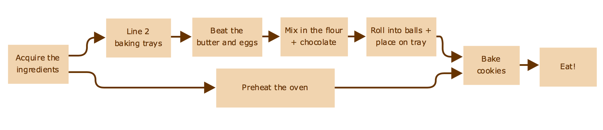

Pipeline concepts
**********************

*This page is under construction*

Introduction
============

In this guide, we'll gently introduce *Workflows* and the terminology around it.
More specifically, we'll discuss Pipelines in the realm of computational analysis.

Workflows
=========

Before writing pipelines, it's useful to have some background knowledge of what a Workflow is. Simply put:

    *A workflow is a series of steps that are joined to each other.*

A diagram is great way to get an intuitive understanding of what a workflow is, for example to bake
`Chocolate chip cookies <https://www.taste.com.au/recipes/chocolate-chip-cookies-2/1bfaa0e6-13b4-489d-bbd8-1cc5caf1fa32 />`_,
we can refer to the following workflow:

There are 8 steps to baking (and eating) a chocolate chip cookie, each step represented by a box. The arrows represent
the dependencies between the steps (what must be completed before the step can be started). For example, to beat
the butter and the eggs, we must have acquired the ingredients. Or to place the rolled cookie balls onto the tray,
 we must have lined the 2 baking trays and mixed in the flour and chocolate.

We easily see how *dependencies* are represented in a workflow, and given enough resources, some of these tasks
could be completed at the same time. For example, we can preheat the oven while we're preparing the cookie dough.

We'll come back to this example a few times over the course of this introduction.

Computational Pipelines
=======================

Computational analysis involves performing a number of processing tasks to transform some input data into a processed output.
By stringing a number of these processing tasks together in a specific order, you get a pipeline.

Now, we can write simple shell script to perform a number of tasks, and this might be the way to go for simple on-off workflows.
However, by spending some time to construct a pipeline, we can take advantage of some powerful computing concepts.

1. Simultaneous Job processing

    In our cookie example, we expect some of the tasks to be asynchronous (they can be performed at the same time). This is
    especially useful for long running tasks such as preheating the oven. If we were to script a simple (synchronous) shell
    script, we would have to wait for the oven to preheat to continue our baking, however a workflow engine can recognise
    these dependencies and run a number of these jobs at once.

2. Portability

    Additionally, shell scripts tend to be written in an explicit and non-portable way. For example you may exactly
    reference the location of the program you want to run which means you'd likely need to rewrite the script.

3. Fault tolerance and rerunning

    If one of the programs does not return correctly, your shell script may not correctly recognise this and continue,
    potentially costing your hours or days of computational time. And then when you re-run, you'll have to rerun the
    entire script, or modify your script to run only the failed components.

    In a workflow engine, it will automatically detect non-zero exit codes (errors), and will terminate execution of
    the program. Additionally, some engines are clever enough to recognise that you've entered inputs that's it's seen
    before, and can automatically start from the fail point.

By using Janis, we bring another set of powerful analysis tools to the table, including tests for each tool,
support for transpiling to multiple commonly supported languages and type checking on all connections between tools.

Workflow terminology
====================

Let's start to break down some of the terminology we've used to represent workflows.

Inputs and Outputs
==================

We'll split the inputs / outputs in two ways:

1. Step based:
    - The inputs to a *step* is the data that specific tool needs to process.
    - The outputs to a *step* is what the *tool* produces.

2. Workflow based:

    - The inputs to a *workflow* is what we (the user) must provide to run the tools.
    - The outputs to a *workflow* is the result of processing from multiple *tools*.

To relate this back to baking cookies:

- The step 'cook' requires prepared cookie dough as an input and will produce baked cookies.
- The workflow 'Bake chocolate cookies' accepts a number of ingredients such as butter and flour as inputs.

Steps
-----

A step is an *action* that must be performed on a set of inputs, to get the desired output.

Nesting
~~~~~~~
A step can be one tool, or we can treat a set of actions as one tool. You will recognise that a set of actions is
in fact a workflow, so hence we can treat a workflow as one step (through the concept of nested workflows).

This nesting helps us to contain a set of logically related steps.

For example, when reading a book you must occasionally *turn the page*. We treat this as one action, however you can
break the action of turning the page of a book into many smaller actions such as gripping the page, moving your hand and
letting go of the page. However it would be cumbersome to think about performing each of these separate actions for every
page in the book!

Reproducibility
---------------

Portability
-----------
